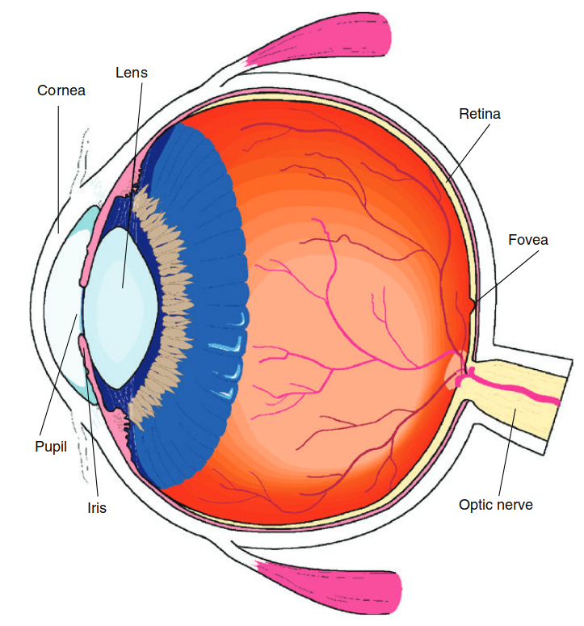
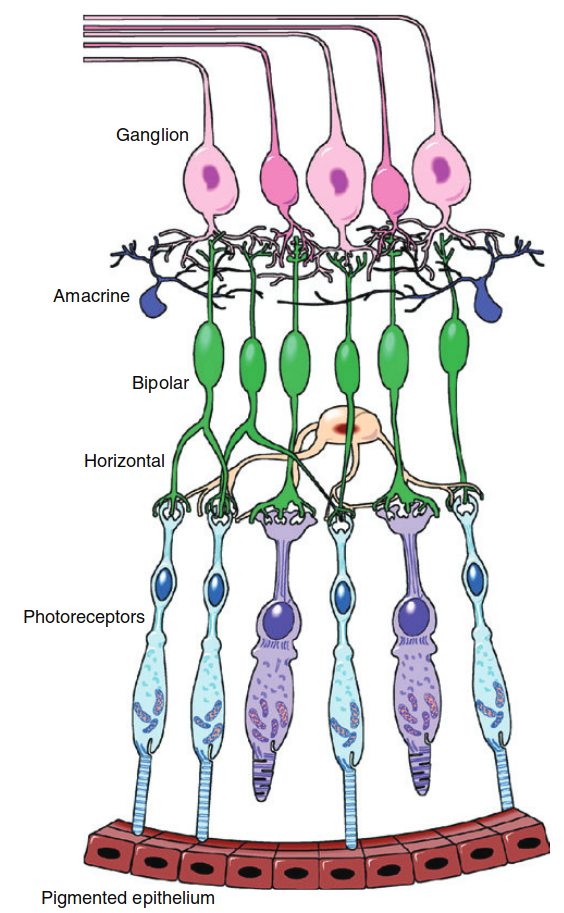
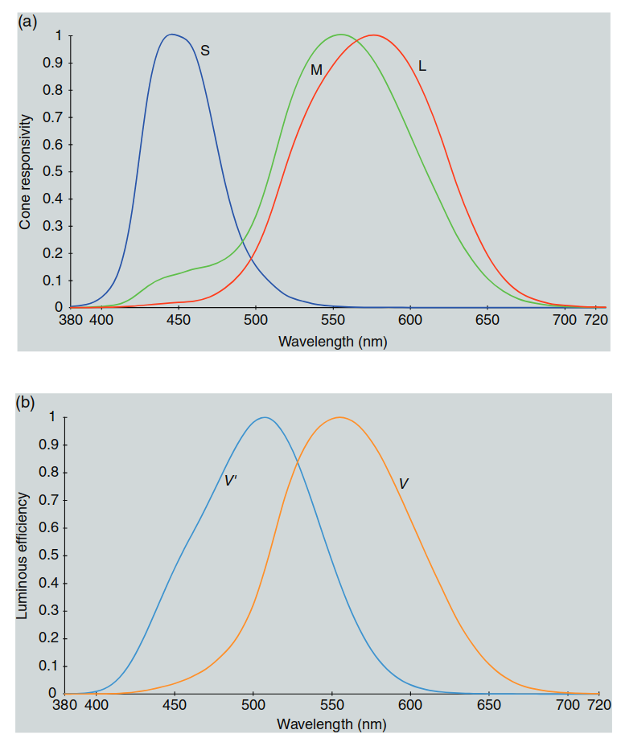
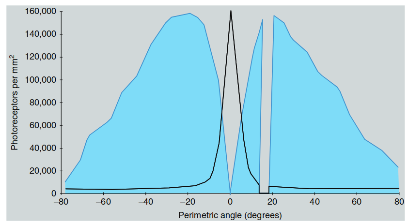
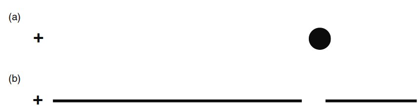
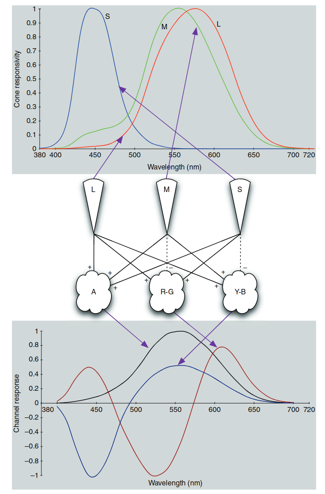
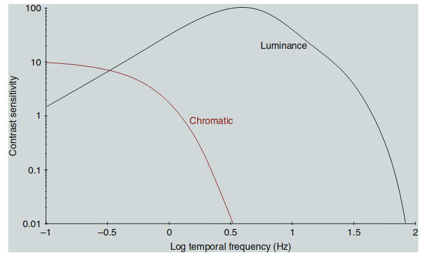

## 人眼彩色视觉

### 引子（译者注）：为什么颜色如此复杂？

颜色不仅仅是物体表面的属性，它还深刻依赖于我们**视觉系统的构造**和大脑的处理方式。我们每天看到的颜色都是视觉系统与环境相互作用的结果。那么，关于颜色视觉你是否想过这些问题？  

- 为什么在不同的光源下，物体的颜色看起来却能保持一致？  
- 为什么一些人无法分辨红色和绿色？这是怎样的生理缺陷导致的？  
- 成像系统（如相机和显示器）如何模拟人眼的颜色感知？为什么有时我们在屏幕上看到的颜色与真实世界不同？  
- 颜色是如何从光谱信号转化为我们大脑中的“感知”？

本章将带领你探索这些问题的答案，深入理解**人眼的颜色视觉系统**，以及如何将这些知识应用于**图像科学**和**成像系统**中。你将学到：

- **颜色感知的生理基础**：包括视锥细胞、视杆细胞及对立颜色机制。
- **色觉缺陷及其对视觉的影响**：了解不同类型的色盲及其生理机制。
- **空间和时间特性在颜色感知中的作用**：探索视觉系统如何在不同场景中适应变化。
- **认知机制的影响**：如记忆颜色和光源折扣在不同观察条件下如何维持颜色一致性。
- **颜色建模的基础**：理解人眼的视觉特性如何应用于颜色外观模型，用于**图像重现**、**色彩管理**和**成像系统设计**。

通过学习本章，你不仅会深入理解人眼的颜色感知机制，还将看到这些知识如何与**现代图像科学和成像系统**紧密结合，为真实感色彩重现和色彩校准提供理论支持。

---

### 1 色貌模型的目标与基础

**色貌模型（Color Appearance Models）**旨在扩展**基本色度学（basic colorimetry）**，能够在多种观察条件下，准确描述我们对颜色的感知。为了更好地理解这些模型的构建、实现和应用，我们需要掌握一些**颜色科学（color science）**的基础知识，这些内容在本书的前几章中会详细介绍。

由于色貌模型反映了人类视觉体验的多个维度，任何用于预测这些感知体验的系统，都必须基于一定程度的**人类视觉系统的结构和功能**。本书中所涉及的色貌模型大多以**视觉功能**为基础，并且在某些情况下，将视觉系统视作一个**黑箱模型（black box model）**进行经验建模。如果我们对视觉系统的基本结构、生理机制和性能有足够了解，就能更容易理解各种色貌模型的数学构建和预测原理。因此，本书的第一部分从介绍**人类视觉系统**开始。

---

### 视觉科学的复杂性与推荐阅读

由于一章的篇幅有限，这里对视觉系统的讨论将重点介绍那些与色貌模型相关的重要内容。**视觉科学**是一个极为庞大、复杂且有趣的领域，建议读者通过参考文献，深入了解各种角度下的视觉理论与研究。以下是一些特别值得参考的经典和权威文献：

- **Lennie and D’Zmura (1988)**：关于颜色视觉机制的综述论文  
- **Kaiser and Boynton (1996)**：《人类颜色视觉（Human Color Vision）》  
- **Wandell (1995)**：《视觉的基础（Foundations of Vision）》  
- **Palmer (1999)**：综合性视觉研究的论著  
- **Backhaus et al. (1998)** 和 **Gegenfurtner and Sharpe (1999)**：编辑的颜色视觉研究文集  

此外，还有一些有趣且较新的著作：
- **Chalupa and Werner (2004)**：关于视觉系统的详尽论述  
- **Dowling (2012)**：对经典《视网膜（The Retina）》的修订版  
- **Livingstone (2002)**：探讨艺术与生物学视觉关系的书籍  
- **Mausfeld and Heyer (2003)**：关于感知的专著  
- **Schwab (2012)**：关于视觉演化的讨论  
- **Valberg (2005)**：对整个视觉系统的修订版，重点讨论颜色相关内容  

关于感知与知觉的通识性教材，如**Wolfe et al. (2012)**，也是学习人类视觉系统基本原理的优秀资源。此外，**Johnsen (2012)** 提供了关于自然界中视觉系统和其他光学现象的独特视角。这些参考资料中涵盖的内容，将在本书中简要概述，并在具体模型中详细展开。

### 1.1 眼的光学结构

我们的视觉感知由**眼睛的解剖结构**启动并受到其强烈影响。图1.1展示了人眼光学结构的示意图，并标注了关键部位。**人眼**可以看作是一个**相机**：**角膜（cornea）**和**晶状体（lens）**共同作用，类似于相机的镜头，将外部世界的图像聚焦在**视网膜（retina）**上，就像相机中的CCD图像传感器。正是这些结构影响了我们对颜色的感知。

---

#### 1.1.1 角膜（The Cornea）
**角膜**是眼睛前部的透明外层，光线通过它进入眼球。它是眼睛最重要的成像结构之一，因为角膜在空气和角膜表面之间的折射率变化最大，对光线的聚焦起到了至关重要的作用。

- **无血管性**：角膜没有血管，其所需的营养来自边缘的血管和周围的液体。  
- **屈光误差**：如近视（myopia）、远视（hyperopia）或散光（astigmatism），通常与角膜形状或其与视网膜的位置关系的变化有关。  
- **矫正方式**：这些屈光误差有时可以通过**激光手术**矫正，手术通过重塑角膜的形状，使其能够正确聚焦光线。

---

  

  图 1.1：人眼的光学结构示意图，标注了角膜、晶状体、视网膜及其他关键结构。角膜和晶状体共同作用，将外部世界的图像聚焦在视网膜上，类似于相机中的镜头和传感器。

#### 1.1.2 晶状体（The Lens）

**晶状体**负责实现**调节（accommodation）**功能。它是一种由多层组成的**柔性结构**，其折射率随着位置不同而变化，中心的折射率比边缘更高。这种自然形成的**梯度折射率光学元件**有助于减少简单光学系统中常见的像差。

- **晶状体的形状控制**：晶状体的形状由**睫状肌（ciliary muscles）**控制。  
  - 当我们看近处物体时，晶状体会变得更厚，增加其光学能力，使近物对焦清晰。  
  - 当我们看远处物体时，晶状体会变薄，降低光学能力，从而使远处物体清晰成像。

---

**晶状体老化的影响**

随着年龄的增长，晶状体的内部结构会发生变化，逐渐失去其灵活性。  
- **老花眼（presbyopia）**：大约在45到50岁时，晶状体完全失去灵活性，导致无法清晰对焦近处物体。此时，大多数人需要使用**老花镜或双焦眼镜**来帮助阅读。
- **光学密度的增加**：晶状体硬化的同时，其光学密度也会增加，逐渐吸收和散射更多的**短波长能量**（蓝光和紫光）。  
  - 随着晶状体变黄，我们的视觉系统通过**色彩适应机制（chromatic adaptation）**，通常不容易察觉到这种变化。然而，观察者之间的视觉差异会因为这种变化而变得显著。

---

**老化对颜色感知的影响**

随着晶状体吸收更多蓝光而保留红光，年长者在观察物体时，特别是观察**紫色物体**或接近**单色刺激**（如广色域显示器中的主色）时，倾向于感知颜色更加偏红。  
- **观察者差异**：这些视觉差异在**色彩匹配**或对**同色异谱（metamerism）**现象进行对比时尤为明显。  
- **重要研究**：关于晶状体老化特征及其对视觉表现的影响，详细内容可参阅：
  - **Pokorny et al. (1987)**  
  - **Werner and Schefrin (1993)**  
  - **Schefrin and Werner (1993)**  
  - **国际照明委员会（CIE, 2006）**关于生理色彩匹配函数的报告

---

**总结**

晶状体不仅在我们调节焦距的过程中起重要作用，还随着年龄的变化影响我们对颜色的感知。特别是蓝光的吸收和晶状体发黄，使得不同年龄段的观察者在**色彩匹配**和**色彩再现**中的表现存在显著差异。这在**数字成像和色彩管理**领域中，需要特别考虑。

#### 1.1.3 房水与玻璃体（The Humors）

**房水（aqueous humor）**充满在**角膜**和**晶状体**之间的空隙，主要成分是水。**玻璃体（vitreous humor）**位于**晶状体**和**视网膜**之间，它也是一种液体，但具有更高的黏度，类似于明胶。  

- **眼球内的压力**：这两种液体维持在略高于大气压的状态，确保眼球保持其形状和尺寸，以避免因视网膜图像的晃动而产生负面影响。  
- **眼球的柔韧性**：眼球的柔韧性增加了其抗冲击能力。当结构在受到冲击时能够变形让步，比保持刚性更不容易损坏。
- **折射能力**：由于房水和玻璃体的折射率与水相近，而角膜和晶状体的折射率仅略高，因此角膜的后表面和整个晶状体的光学能力较弱。角膜的主要折射作用发生在**角膜前表面**。

---

#### 1.1.4 虹膜（The Iris）

**虹膜（iris）**是控制**瞳孔（pupil）**大小的括约肌。它含有色素，决定了每个人独特的眼睛颜色，具体由**黑色素（melanin）**的浓度和分布决定。瞳孔是虹膜中央的孔洞，光线通过此孔进入眼球，并决定投射到视网膜上的光照水平。

- **光线与瞳孔变化**：瞳孔大小主要取决于**环境光线的强度**，但也会受到非视觉因素（如兴奋）影响。  
  - 例如，当你逗弄一只猫时，它的瞳孔会因为兴奋而放大。  
- **瞳孔直径变化**：在实际场景中，瞳孔直径通常在**3到7毫米**之间变化，这会导致瞳孔面积变化约五倍，从而显著影响视网膜上的光照水平。  
- **视觉敏感性的限制**：尽管瞳孔面积变化会改变视网膜上的光强，但边缘光线对视觉反应的刺激效果不如中央光线（这被称为**斯蒂尔斯-克劳福德效应（Stiles–Crawford effect）**）。因此，仅通过瞳孔大小的变化不足以解释人类视觉系统在光照水平变化达**10个数量级**时，仍能保持良好视觉性能的能力。

#### 1.1.5 视网膜（The Retina）

**视网膜**是眼睛将外界光学图像投射并转换为神经信号的关键部位。它是一层薄如纸张的细胞层，位于眼球后部，包含了视觉系统的**感光细胞**和初步的信号处理、传递网络。这些细胞是神经元，属于**中枢神经系统**的一部分，因此可以被视为大脑的一部分。

- **光感受器**：视网膜上的**视杆细胞（rods）**和**视锥细胞（cones）**，将光学图像中的信息转换为化学和电信号，并将这些信号传递给视觉系统的后续部分。信号经过视网膜内的细胞网络处理后，通过**视神经（optic nerve）**传递到大脑。

---

#### 1.1.6 色素上皮层（Pigmented Epithelium）

在视网膜的背面是一层**色素上皮层**，它是深色的色素层，可以吸收那些未被光感受器吸收的光。这一层的主要功能是避免光线散射回视网膜，从而提高感知图像的清晰度和对比度。

- **夜行性动物的反射膜（tapetum）**：夜行性动物牺牲了部分图像质量，换取了高效的光反射能力。它们的眼睛后部有一个高度反射的结构（即反射膜），能将未被吸收的光反射回视网膜，让光感受器获得第二次吸收光能的机会。因此，当鹿或其他夜行性动物面对汽车大灯时，它们的眼睛会发出**荧光**。这种反射功能类似于高效的**逆反射器（retro-reflector）**，将来自汽车大灯的光线通过动物的眼睛反射回汽车。

---

#### 1.1.7 中央凹（The Fovea）

**中央凹（fovea）**是视网膜上最重要的结构区域之一，是我们获得**最佳空间分辨率和色彩感知**的地方。  
- 当我们凝视某个物体时，头部和眼睛会转动，使该物体的图像落在中央凹上。例如，当你阅读时，眼睛会不断移动，以使每个单词的图像落在中央凹上。

- **空间敏锐度的衰减**：中央凹以外的区域空间分辨率急剧下降。你可以通过一个简单的实验体会这一点：专注于这一句末尾的句号，并尝试阅读几行上方的文字，你会发现这几乎是不可能做到的。

- **视觉角度的覆盖范围**：中央凹覆盖的区域大约相当于**2°的视角**。为了帮助理解这一概念，一般的经验法则是，将大拇指甲置于手臂伸直的位置时，其宽度大约对应1°的视角。  
  - 另一个有趣的例子是，月亮和太阳在天空中的视角几乎都是**0.5°**。这一巧合使得地球上既能发生**日全食**，也能发生**月全食**。

#### 1.1.8 黄斑（The Macula）

**黄斑（macula）**是保护**中央凹（fovea）**的一层**黄色滤光层**，用于防止短波长光能对视网膜这一关键区域的强烈刺激。  
- **减轻色差（chromatic aberration）**：黄斑还可能有助于减少由短波长光引起的像差问题，因为短波长光往往无法在视网膜上准确聚焦。
- **黄斑色素的个体差异**：与晶状体不同，黄斑的黄色滤光层不会随着年龄而加深。然而，不同观察者之间的黄斑色素**光学密度**差异明显，有时甚至左右眼之间也会有所不同。
  
晶状体和黄斑的黄色滤光层是造成**正常色觉人群之间视觉差异**的主要原因之一。我们通过这些黄色滤光层观察世界，每个人的色彩感知都因此略有不同。

---

**视神经（The Optic Nerve）**

**视神经（optic nerve）**是由**视网膜神经节细胞（ganglion cells）**的轴突组成，它是视网膜中的最后一级神经处理层。视神经将视觉信息从视网膜传递到更高层次的视觉系统。

- **信号压缩**：视神经包含大约**100万根神经纤维**，而这些纤维需要传递来自**1.3亿个光感受器**生成的信息。这意味着在信号传递到更高层次的视觉处理系统之前，已经进行了大幅度的**信号压缩**，大脑中从未存在一对一的“像素映射”来处理视觉刺激。
- **盲点（blind spot）**：由于视神经占据了部分视网膜的位置，导致眼球中存在一个无法感受视觉刺激的小区域，即**盲点**。尽管如此，我们通常不会察觉到盲点的存在，因为大脑会利用其他信息进行填补和补偿。

---

**视觉结构对颜色外观的影响**

上述眼部结构共同塑造了视觉系统所能获取的信息，从而最终影响**色貌感知（color appearance）**：

- **瞳孔**：调节视网膜上的光照水平，对颜色外观有显著影响。
- **晶状体和黄斑的黄色滤光**：这些滤光层调整了视觉系统的光谱响应，并引入了观察者之间的感知差异。
- **视网膜的空间结构**：视网膜的空间布置帮助定义了不同**视觉场**的范围和特性，这些特性在色貌感知中至关重要。
- **神经网络**：视网膜中的神经网络表明，视觉感知（尤其是色貌感知）并非简单的点对点图像处理，而是复杂的信号处理过程。

这些关键特性将在后续章节中进一步讨论，涵盖视网膜、视觉生理学和视觉性能的具体细节。

> **译者注：**  
> 眼睛的这些结构与**成像系统**有相似之处。例如，视神经的信号压缩类似于数码相机中的**数据压缩**，而黄斑和晶状体的滤光效果类似于相机的**光学滤镜**，减少蓝紫光的干扰以提升图像质量。然而，眼睛的复杂神经网络超越了简单的成像设备，使我们能够适应不同光线和环境中的色彩变化。这种适应性和感知差异，在**色彩管理**和**显示设备校准**中也需要特别考虑。

### 1.2 视网膜（The Retina）

图1.2展示了视网膜的**横截面示意图**。视网膜由多层**神经细胞**组成，最基础的是**感光细胞（photoreceptors）**，即**视杆细胞（rods）**和**视锥细胞（cones）**。通过分析这些感光细胞与**双极细胞（bipolar cells）**的连接，再到**神经节细胞（ganglion cells）**，进而形成**视神经（optic nerve）**的信号传递链，我们可以构建出一个**垂直信号处理链**。然而，即使在这个简单的信号路径中，来自多个感光细胞的信号已经被**比较和整合**。

---

**视网膜的信号传递路径**

- **多层连接**：多个感光细胞的信号输入到许多双极细胞，而多个双极细胞的信号又汇集到神经节细胞中，形成了复杂的信号路径。这种信号传递不仅限于垂直链，还涉及横向连接：
  - **水平细胞（horizontal cells）**：横向连接感光细胞与双极细胞。
  - **无长突细胞（amacrine cells）**：横向连接双极细胞与神经节细胞。

这些横向连接增强了视网膜的处理能力，但具体每种细胞的处理机制尚未完全理解，超出了本章讨论的范围。尽管如此，我们需要认识到，神经节细胞传递到大脑的信号并非感光细胞信号的简单点对点映射，而是经过复杂组合的结果。

---

**视网膜的复杂处理**

视网膜的每一个**神经突触（synapse）**都可以执行类似于**数学运算**的功能，如**加法、减法、乘法和除法**，并且还可能执行**信号放大、增益控制**及**非线性处理**。因此，视网膜内的神经网络就像一个**高效的图像计算机**，能够将**1.3亿个感光细胞**的信息压缩成**约100万个神经节细胞**的信号，而不会丢失有意义的视觉信息。

有趣的是，**光线在抵达感光细胞之前，需要穿过视网膜的全部神经层**。由于这些神经细胞高度透明且固定不动，因此不会影响视觉表现。这一排列方式还能确保感光细胞获得充足的营养，并将代谢废物排出眼球后部。

---

  

  图 1.2：人眼视网膜神经细胞“连线”的示意图。该图展示了感光细胞、双极细胞和神经节细胞之间的垂直连接，以及水平细胞和无长突细胞的横向连接。

---

#### 1.2.1 视杆细胞与视锥细胞（Rods and Cones）

图 1.3 展示了视杆细胞和视锥细胞的结构示意图。  

- **视杆细胞**在**低亮度**（暗视觉）条件下工作，如在夜晚的弱光环境中。

- **视锥细胞**则在**高亮度**（明视觉）条件下工作，例如白天的阳光下。  

- 当亮度处于中等水平时，两者共同工作，形成**中间视觉**（mesopic vision），例如黄昏时的景象。

  

  图 1.3：典型的视杆细胞与视锥细胞示意图

---

#### 1.2.2 光谱敏感度与色彩感知

图 1.4(a) 展示了三种类型的锥细胞（L、M、S锥细胞）的光谱响应。  

- **视杆细胞**的光谱响应峰值在 510 nm 附近，因此无法分辨颜色。

- **L、M、S 锥细胞**分别对长、中、短波长的光最敏感。这种重叠的响应范围不同于成像系统中的独立光谱分离，因此实现精确的色彩再现在实际设备中非常困难。

  

  图 1.4：(a) L、M 和 S 锥细胞的光谱响应；(b) 暗视觉 V′(λ) 与明视觉 V(λ) 的 CIE 光谱亮度效率函数

- **普金耶效应（Purkinje Shift）**：在低亮度下，我们对短波长（如蓝色）更敏感，而对长波长（如红色）几乎没有响应。例如，在白天亮度下看起来同样明亮的蓝色和红色物体，在低亮度下蓝色会显得更亮，而红色几乎变黑。

---

#### 1.2.3 视网膜感光细胞的分布与特性

图 1.5 展示了中央凹区域视锥细胞的分布示意图。 

- **L 锥细胞和 M 锥细胞**的数量远多于 S 锥细胞，其比例约为 40:20:1。S 锥细胞在视网膜上的分布相对稀疏，并且在中央凹区域完全缺失。

- **中央凹**由于只有锥细胞且没有视杆细胞，因此提供了最高的空间分辨率，但无法感知微弱光源。

  

  图 1.5：中央凹区域感光细胞的分布示意图。L 锥细胞用红色表示，M 锥细胞用绿色表示，S 锥细胞用蓝色表示。请注意，这些颜色仅为示意，并不代表实际光谱响应。

---

#### 1.2.4 视杆与视锥细胞在视网膜上的分布

图 1.6 展示了视网膜上视杆细胞和视锥细胞的分布情况。  

- **视杆细胞**的数量远多于锥细胞（每只眼睛约有 1.2 亿个视杆细胞和 700 万个视锥细胞）。  

- **盲点**：位于距中央凹约 12-15° 的位置，没有感光细胞，因为此处是视神经形成的位置。

  

  图 1.6：视杆和视锥细胞在视网膜上的密度分布

这种分布解释了为什么在低亮度下，我们更依赖视杆细胞提供的敏感性；而在高亮度下，我们依靠锥细胞提供色彩感知与高空间分辨率。

---

#### 1.2.5 填充现象（Filling-In Phenomenon）

盲点的存在可以通过图 1.7 中的实验进行验证。当盲点区域没有感光细胞时，大脑会自动填补缺失的视觉信息，使我们通常察觉不到盲点的存在。

  

  图 1.7：用于验证盲点存在的刺激图像。闭上左眼，用右眼凝视十字，调整距离直到点或缺口落在盲点上。此时你会发现点或缺口会被大脑自动“填充”为背景的一部分。

这种填充现象类似于图像压缩算法中的数据预测和补偿，只传递变化部分的数据，从而节省带宽。

---

> **译者注：**  
> 视网膜中的感光细胞与成像系统中的传感器存在许多相似之处。视杆细胞的信号压缩和灵敏度提升类似于数码相机中的高感光度传感器，而锥细胞提供的高分辨率和色彩感知则对应于低感光度的高分辨率传感器。盲点的填充机制也与图像处理中的**缺失数据补偿**相似，通过预测和填补缺失信息来维持视觉连贯性。这些视觉系统的特性在现代图像处理和色彩管理领域中具有重要的启发意义。

### 1.3 视觉信号处理（Visual Signal Processing）

视网膜内的视觉信息处理相当复杂，而在更高级别的视觉系统中，复杂性进一步增加。本节将简要介绍视觉信号在不同处理阶段的路径。

---

**信号传递路径**

- **光学图像转化为电信号**：当光线进入视网膜后，感光细胞中的光敏色素（如视杆细胞中的视紫红质）吸收光子，启动一系列化学反应。这些反应关闭了细胞膜上的离子通道，并根据细胞内外的钠、钾离子浓度差生成电信号。  
- **视网膜内的初步处理**：电信号在**视杆细胞和视锥细胞**生成后，会在视网膜神经元网络内传递和整合，这些网络包括**水平细胞、双极细胞、无长突细胞和神经节细胞**。  
- **视神经和丘脑的连接**：神经节细胞的轴突汇集形成**视神经**，将信号传递到丘脑中的**外侧膝状体（LGN）**。LGN 细胞不仅将信息投射到大脑皮层的**视觉区一（V1）**，还会接受来自皮层的反馈信号，这说明视觉信号的调节依赖于高级别处理的反馈。

---

  

  图 1.8：视杆和视锥细胞的能量响应曲线，展示了不同光暴露条件下的相对响应

---

**感光细胞的响应曲线**

如图 1.8 所示，感光细胞的响应曲线与图像传感器的响应特性相似：  
- **阈值响应**：在低于某一光照阈值时，感光细胞不会响应。
- **线性响应区域**：随着光照强度增加，感光细胞的响应呈现出相对线性的变化。
- **饱和响应**：在高光强度下，感光细胞的响应达到饱和，不再随光强度增加而变化。

这种响应曲线代表了光学吸收后的**第一阶段信号处理**，即由光生成的电信号在感光细胞中转化为**光电流（photocurrent）**。

---

**皮层中的复杂处理**

- **大脑皮层的多级处理**：视觉信息从 V1 开始，传递到多个视觉区域，如 V2、V3 和 V4。这些区域之间的信号不仅是**前馈（feed-forward）**传递，还有**反馈（feedback）**和**横向处理（lateral processing）**。  
- **最终的感知形成**：在这些复杂的网络中，我们的视觉感知最终被整合并形成。

---

#### 1.3.1 感受野（Receptive Fields）

为了抑制噪声和提高传输速度，感光细胞中的**幅度调制信号**会在神经节细胞及更高级别的神经元中被转化为**频率调制信号**。在这些神经元中，信号的强度不是通过细胞膜电压差来表示，而是通过**每秒发出的电压脉冲数量**来体现。

---

**感受野的定义**

**感受野**是描述某个神经元对视觉场中特定区域的响应的图形表示。每个神经元对特定空间区域的响应既包括位置，也可能展示响应的性质（如正响应、负响应或光谱偏好）。  
- 例如，单个感光细胞的感受野是一个代表该细胞在视觉场中的敏感区域的小圆形。

---

  

  图 1.9：典型的中心-周边对抗性感受野：(a) 中心开启型感受野；(b) 中心关闭型感受野

图 1.9 展示了典型的神经节细胞感受野，具有**中心-周边对抗性**。  
- **中心开启型（on-center）**神经节细胞，如图 1.9(a) 所示：中心区域是正响应（由单个锥细胞提供输入），周边区域是负响应（由多个相邻锥细胞提供输入）。  
- **中心关闭型（off-center）**神经节细胞，如图 1.9(b) 所示：中心区域是负响应，周边区域是正响应。

这种对抗性结构使神经节细胞不仅对单一光点作出响应，更能检测图像中的**边缘**，类似于数字图像处理中**卷积核**的边缘检测功能。

---

**光谱对抗性（Spectral Opponency）**

除了空间对抗性，神经节细胞还具有**光谱对抗性**，如图 1.10 所示：
- 图 1.10(a) 展示了**红-绿对抗**的响应：中心区域接收来自 L 锥细胞的正输入，而周边区域接收来自 M 锥细胞的负输入。即使在神经节细胞连接随机的情况下，这种光谱对抗性也可能出现。
- 图 1.10(b) 展示了该结构的**中心关闭型**版本。

  

  图 1.10：(a) 红-绿光谱对抗型感受野；(b) 中心关闭型红-绿光谱对抗感受野

---

**感受野在视觉处理中的作用**

神经节细胞感受野的中心-周边结构使其能够忽略**均匀光场**中的冗余信息，只传递**视觉变化**，这相当于一种**压缩算法**。大脑只处理视觉场中的变化或边缘，从而提高了传输效率。

---

**外侧膝状体（LGN）与视觉皮层的信号传递**

神经节细胞的轴突与丘脑中的**外侧膝状体（LGN）**细胞建立突触，LGN 在此过程中扮演了**中继站**的角色。LGN 的细胞与神经节细胞的感受野相对应，并通过其轴突将信号投射到大脑皮层的**视觉区一（V1）**。  

有趣的是，LGN 不仅将信号前馈到皮层，还会接收来自皮层的**反馈信号**，表明 LGN 在视觉适应和信号调节中发挥了重要作用。

---

#### 1.3.2 V1区域的处理

在大脑的**V1（初级视觉皮层）**区域，视觉信息的处理变得更加复杂。就像视网膜中的神经元将不同**光感受器**（视锥细胞、视杆细胞）的输入信号组合起来生成反应一样，不同的**外侧膝状体（LGN）细胞**输出的信息在这里也会进一步组合、处理，形成更复杂的视觉感知。

**视觉皮层的感知处理**  
V1 是大脑皮层中第一个处理视觉信号的区域。它的主要任务是从**视网膜和外侧膝状体（LGN）**获取输入信号，并对这些信号进行初步的解码和分析，提取出有用的视觉特征，比如**边缘、颜色、运动和形状**。

在这里，神经元响应不仅仅是简单的光亮变化，而是对多种复杂特征进行响应，比如：

- **特定方向的边缘或条纹**：某些神经元只对特定方向的边界敏感，比如水平线或垂直线。

- **单眼或双眼输入**：V1 中的神经元可以区分哪些信号来自左眼，哪些来自右眼，或者两只眼睛一起的输入。

- **不同的空间频率**：用于检测视觉场景中的细节程度，细节越多，频率越高。

- **不同的时间频率**：检测物体运动的速度，快速变化和缓慢变化都会被检测出来。

- **特定的空间位置**：某些神经元只对视野中特定区域的刺激产生反应。

- **多种特征的组合**：例如同时检测运动方向和物体边界。

**感受野与颜色对比检测**  
感受野是指一个神经元可以响应的视野范围。比如，在图 **1.10** 中展示了两种典型的颜色对抗型感受野，它们能够帮助我们检测视觉场景中的颜色边界。

  

  图 1.10：（a）红-绿和（b）绿-红的光谱与空间对抗型感受野示例。+R -G（a）表示对红光的兴奋与对绿光的抑制；-R +G（b）表示对红光的抑制与对绿光的兴奋。

- **(a) +R -G**：当视野中有红色刺激时，神经元会产生兴奋（增强响应），而当有绿色刺激时则会抑制其响应。
- **(b) -R +G**：当有绿色刺激时，神经元会兴奋，而红色刺激会抑制其响应。

**V1 的信息流动和复杂性**  
在 V1 中，视觉信号的复杂性不断增加，信息可以在视觉皮层的不同区域之间来回流动，就像图 **1.11** 所示。

  

  图 1.11：视觉皮层中多个信息处理流的部分流程图。信息可以在各个连接中双向流动。

---

### 1.4 颜色视觉机制

**三色理论（Trichromatic Theory）**  
19世纪下半叶，基于麦克斯韦、杨和亥姆霍兹的研究，提出了**三色理论**，认为视觉系统中存在三种感受器，对应于红、绿、蓝三种光谱区域。该理论虽然奠定了基础，但无法解释对比和后像现象。

> **译者注**：三色理论的不足促使赫林提出了对立颜色理论。

**赫林的对立颜色理论（Opponent Colors Theory）**  
赫林提出颜色感知依赖于**红-绿和黄-蓝**两对对立通道，解释了背景颜色对物体颜色的影响，以及无法感知“红绿色”这类混合色的现象。

  

  图 1.12：用于展示对立颜色后像的刺激。凝视四色方块中央的黑点约30秒，然后将视线移到白色区域的黑点上，观察原始颜色相对于后像颜色的变化。

> **译者注**：赫林的理论为现代对立颜色理论奠定了基础，但由于当时生理学手段有限，未被广泛接受。

**现代对立颜色理论（Modern Opponent Colors Theory）**  
20世纪中期，通过金鱼和猕猴的实验数据，以及人类色调取消实验，赫林理论得到了证实和发展，形成了现代的对立颜色理论。

  

  图 1.13：现代对立颜色理论的神经“线路”示意图，展示了颜色编码的各个阶段，以及这些机制在对立编码前后的相对光谱响应。

视锥细胞信号被组合为：

**明度响应**：\( L + M + S \)（对应CIE V(λ)曲线）

**红-绿对立信号**：\( L - M + S \)

**黄-蓝对立信号**：\( L + M - S \)

---

这些对立通道能够**去相关化**三色信道中的信息，减少噪声干扰，使信号传输更加高效。对立信道的**空间和时间特性**对于颜色感知至关重要，这些特性在后续的**颜色外观模型**中都得到了体现。

> **译者注**：现代对立颜色理论弥补了赫林理论的不足，解释了生理学层面的颜色处理机制。它不仅整合了三色理论，还通过**对立信号编码**提升了传输效率，解决了颜色信息的重叠和噪声问题。

---

#### 1.4.1 适应机制（Adaptation Mechanisms）

人类视觉系统中颜色信号的处理并非静态的“线路图”所能完全描述。视觉系统通过一系列**动态适应机制**，优化视觉响应以应对不同的观察环境。这些机制包括了**暗适应、明适应和色彩适应**，它们在颜色外观的研究中至关重要。

---

**暗适应（Dark Adaptation）**  
暗适应是指当环境光照水平降低时，视觉系统的灵敏度逐渐提高的过程。例如，下午在阳光下走进漆黑的剧院时，一开始会感到剧院内完全黑暗，但经过几分钟后，逐渐能够看清座位和人群。

暗适应过程如下：

  

  图 1.14：暗适应曲线，展示了视觉系统在高光照水平暴露后逐渐恢复敏感度的过程。曲线中的断点表明在此时视杆细胞的敏感度超过了视锥细胞。

1. **初期阶段**：视锥细胞的灵敏度在几分钟内逐渐增加，但随后趋于稳定。
2. **视杆细胞接管**：约10分钟后，视杆细胞的灵敏度超过视锥细胞，并继续增加，最终在30分钟后达到稳定状态。

> **译者注**：单靠瞳孔直径的五倍变化不足以应对不同光照水平的巨大差异。因此，神经系统通过各种适应机制进行调整，如光色素的耗尽与再生、视杆-视锥转换、增益控制以及神经反馈等。

---

**明适应（Light Adaptation）**  
明适应与暗适应相反，当从黑暗环境返回到明亮环境时，视觉系统需要降低其灵敏度，以适应更强的光照。例如，从黑暗的剧院走出，进入阳光明媚的户外时，视觉系统必须减少感光度以避免视觉过载。

  

  图 1.15：明适应过程示意图，展示了如何将宽幅的光强映射到视觉系统的有限响应动态范围内。虚线曲线表示未适应时的响应；实线曲线代表适应后的响应。

1. **适应时间较短**：明适应一般只需5分钟，而暗适应则可能长达30分钟。
2. **动态范围映射**：视觉系统将不同光强映射到有限的响应动态范围内（如100:1），以确保最佳的视觉感知。

> **译者注**：  
> 明适应和暗适应兼具**自动曝光**和**色调映射**的特性：  
> 1. 它们实时调整视觉敏感度（类似自动曝光）。  
> 2. 同时压缩宽光照范围到有限的视觉动态范围内（类似色调映射）。

---

**色彩适应（Chromatic Adaptation）**  
色彩适应是与明暗适应密切相关的过程，但它专注于**独立调节三种视锥细胞的响应敏感度**。图1.16展示了色彩适应的示意图，说明三种视锥细胞的光谱响应曲线可以分别调节其高度。

  

  图 1.16：色彩适应示意图，展示了三种视锥细胞的光谱响应曲线如何独立调节。

色彩适应的例子包括：

- **观察白色物体**：无论在日光、荧光灯还是白炽灯下，白色纸张都看起来大致相同。这是因为在不同光源下，视觉系统会自动调整视锥细胞的灵敏度：
  - **日光**：S视锥细胞（短波长）减少灵敏度，以应对过多的短波长能量。
  - **白炽灯**：L视锥细胞（长波长）减少灵敏度，以应对更多的长波长能量。

> **译者注**：色彩适应类似于相机的**自动白平衡**功能，确保物体在不同光源下颜色保持一致。

  

  图 1.17：展示了视网膜局部色彩适应的效果。凝视蓝色和黄色区域之间的黑点约30秒，然后将视线移到谷仓图像的白点上，观察适应后的视觉效果。

> **译者注**：色彩适应不仅在视锥细胞层面发生，还可能出现在对立色彩通道或更高层次的颜色机制中。这一机制在颜色外观模型中非常重要，并将在第8章详细讨论。

#### 1.4.2 视觉机制对颜色外观的影响

**颜色外观**受多种认知视觉机制的影响。这些机制将在第6-8章中进一步详细描述，包括**记忆颜色**、**颜色恒常性**、**光源折扣（discounting-the-illuminant）**以及**物体识别**。

---

**记忆颜色（Memory Color）**  
记忆颜色指的是人们对某些可识别物体的**原型颜色**有特定记忆。例如，大多数人会记得**绿色草地**或**蓝色天空**的典型颜色，并能在实验中重现这种颜色。然而，令人惊讶的是，记忆中的颜色往往比实际颜色**更加饱和**。

---

**颜色恒常性（Color Constancy）**  
颜色恒常性指的是物体的颜色在**不同光照条件**下看起来保持不变的现象。例如，无论是在阳光下还是在室内灯光下，我们都会认为一本书的封面颜色没有变化。颜色恒常性依赖于**色彩适应**和**记忆颜色**的机制。然而，在仔细观察下，这种恒常性往往表现得**不稳定**。

---

**消光（Discounting-the-Illuminant）**  
消光是指观察者能够自动理解**光照条件**，并在视觉感知中**忽略光源颜色的影响**，从而看到物体的“真实”颜色。这是一种重要的视觉机制，使我们能够在不同光源下感知物体的颜色一致性。

> **译者注**：  
> **颜色恒常性（Color Constancy）**与**消光（Discounting-the-Illuminant）**密切相关，但两者并不完全相同。  
> - **颜色恒常性**是观察者在不同光源条件下依然感知到物体颜色不变的现象，它是一种更高层次的感知效果。  
> - **消光**则是视觉系统内部的机制，帮助我们在感知物体颜色时消除光源颜色的干扰。这是实现颜色恒常性的核心过程之一。你可以理解为它是在‘LMS’阶段，而颜色恒常是结合了大脑皮> 层的高级视觉功能。但是消光是实现颜色恒常的主要步骤。但是在实际的图像处理中，二者也有些微妙的差异，AWB算法致力于恢复颜色，而消光致力于找到一种对光源鲁棒的算子，对于后> 面的物体识别等有很大好处

---

**物体识别（Object Recognition）**  
物体识别主要依赖于**空间、时间和明暗特征**，而非颜色特征（Davidoff，1991）。一旦物体被识别，视觉系统会利用**记忆颜色**和**光源折扣**的机制来补充适当的颜色。

---

> **译者注**：这些机制表明，颜色感知不仅依赖于物理光谱刺激，还涉及复杂的认知处理。例如，我们的视觉系统会利用物体的原型颜色和光照信息的推断，使颜色在不同环境中保持一致感。这些机制在跨媒体的颜色比较中尤为重要。

---

**复杂视觉处理与颜色感知**  
视觉信息处理极其复杂，并且尚未被完全理解（或许永远无法完全理解）。随着信号在视觉系统中的传递，皮层视觉反应的复杂性也在不断增加。

单细胞电生理研究发现，一些皮层细胞会对特定的复杂刺激作出响应。例如：

- 一些猴子的皮层细胞只对**猴爪或猴脸的图像**作出反应。  
- 类似的适应效果在**人脸特征**的刺激中也被观察到。

> **译者注**：单细胞的复杂性表明，视觉系统中的感知不是由单一细胞独立完成的，而是通过**分布式网络**组合多种信号来实现。例如，颜色感知不仅仅依赖于单一细胞，而是通过多种机制的组合变化来实现多样化的感知。

---

**分布式感知的可能性**  
显然，视觉感知中的多种变量（如颜色恒常性、记忆颜色等）表明，我们的视觉系统会不断**实验不同的感知组合**。分布式感知为感知多样性提供了无限的可能性。例如，同一颜色的感知可能会因光源、背景或记忆的不同而呈现多种变化，这揭示了颜色外观的复杂性和多变性。

---

### 1.5 颜色视觉的空间和时间特性

视觉体验的任何维度都不能孤立地考虑。**颜色外观**不仅与颜色本身有关，还受**空间和时间特性**的影响。例如，当黑白刺激以适当的**时间频率**闪烁时，会产生强烈的色彩感知（称为**费希纳-本汉姆色彩**）。

---

**对比敏感度函数（CSF）**  
人类视觉系统的空间和时间特性通常通过测量**对比敏感度函数（Contrast Sensitivity Function, CSF）**来探索。CSF 类似于成像科学中的**调制传递函数（MTF）**，但由于人类视觉系统的高度非线性，CSF 反映的是**阈值敏感度**而非超阈值调制。

CSF 的定义：  

- 对比敏感度是对比度的阈值响应的倒数，即在**空间或时间频率**上的敏感度变化。  

- 对比度使用**Michelson对比度**定义：  

  

    $$
    \text{Michelson对比度} = \frac{L_{\text{max}} - L_{\text{min}}}{L_{\text{max}} + L_{\text{min}}}
    $$
  

其中 \(L_{\text{max}}\) 和 \(L_{\text{min}}\) 分别是刺激中的最大和最小亮度。

---

**亮度和色度的空间对比敏感度函数**  

  

  图 1.18：亮度（黑白）和色度（红-绿、黄-蓝）对比敏感度函数的典型空间特性。

- **亮度CSF**呈**带通特性**，对约 5 个周期/度的频率最敏感，在高于 60 周期/度时逐渐变为 0，这是由于眼睛光学和视网膜感受器的限制。
- **色度CSF**呈**低通特性**，其截止频率远低于亮度CSF。这说明**人眼对颜色的细节分辨率较低**，这也是图像编码中（如MPEG、JPEG）利用**色度下采样**的原因。

> **译者注**：由于 S 视锥细胞在视网膜中的稀缺性，**黄-蓝色对比敏感度**的截止频率低于**红-绿色对比敏感度**。此外，亮度对比敏感度通常高于色度对比敏感度，这表明人眼对亮度变化的感知更敏锐。

---

**图像的空间分析**  

  

  图 1.19：颜色视觉的空间特性分析：  
  (a) 原始图像，(b) 仅亮度信息，(c) 仅色度信息，(d) 用全分辨率亮度信息与四倍下采样的色度信息重建图像。

分析图像时可以看出：

- **亮度信息**包含了更多的空间细节（图1.19(b)）。

- **色度信息**的空间细节较少（图1.19(c)）。

- 使用**亮度的全分辨率信息**和**四倍下采样的色度信息**重建图像（图1.19(d)）不会显著降低感知的分辨率或颜色质量。

---

**亮度和色度的时间对比敏感度函数**  

  

  图 1.20：亮度和色度对比敏感度函数的时间特性。

- **亮度的时间CSF**具有**带通特性**，表明视觉系统对**瞬时变化**（如闪烁）的响应较敏感。
- **色度的时间CSF**表现为**低通特性**，表明视觉系统对快速的颜色变化不敏感。这些特性在处理视频帧率和运动画面时非常重要。

---

**空间和时间CSF的交互**  
- 空间和时间CSF之间存在密切的**交互作用**。  
- 在不同的时间频率下测量空间CSF会发现其结果有显著变化，反之亦然。  
- 这些函数还依赖于多种因素，如亮度水平、刺激大小和视网膜位置。

> **译者注**：尽管**空间和时间CSF**目前未被直接纳入**颜色外观模型**，但它们对动态图像（如视频剪辑）的呈现非常重要，特别是在不同帧率条件下观察时。这些特性未来可能会进一步用于完善颜色外观模型。

**倾斜效应（The Oblique Effect）**

**倾斜效应**是视觉系统中的一个有趣现象，指的是视觉系统对**0°或90°方向的条纹**（相对于两眼连线）具有更高的视觉敏锐度，而**45°方向的条纹**则更难分辨。这种现象被应用于**旋转网目调屏**的设计中，使得最显眼的图案以45°方向排列，从而减少视觉干扰。

一个简单的实验可以验证这种效应：  
- 取一张**黑白网目调图像**（如报纸图像），调整视距，直到网点图案刚好不可见。  
- 保持相同视距，将图像旋转45°。此时你会发现，网点图案变得更加清晰（因为此时图案处于**0°或90°方向**）。

  

  图 1.21：倾斜效应的演示。调整距离，使得在直立状态（45°方向）的图案刚好不可见，然后将图像旋转90°，观察图案在0°/90°方向时变得更为明显的现象。

---

**CSF 与眼动（CSFs and Eye Movements）**

**空间和时间对比敏感度函数（CSF）**与**眼动**密切相关。一个**静态空间图案**当观察者的眼睛在图案上移动时，会变成一个**时间变化图案**。

由于**空间和时间CSF**在频率变化接近0时都会趋近于0，这意味着完全静止的刺激是**不可见**的。  
- 如果通过眼动追踪系统固定视网膜图像，刺激会在几秒钟后**消失**（Kelly，1994）。
- 这种现象在仔细凝视一个物体时很明显：几秒钟后，**视觉周边的物体会逐渐消退**，而中央凝视的物体不会消失。这是因为：
  - **中央视野（中央凹）**的空间分辨率非常高，即使眼睛微微移动也能保持清晰。
  - **周边视觉区域**的空间分辨率较低，因此周边物体会逐渐模糊，形成**特洛克斯勒消退（Troxler fading）**。

---

**眼动与视觉适应的关系**  

为了避免特洛克斯勒消退的现象，我们的眼睛会不断移动：

- **大幅眼动**：帮助中央凹捕捉高分辨率的视觉信息，探索不同区域的视野。
  
- **微眼动**：保持视觉世界的稳定清晰，防止静止图像消失。这也解释了为什么**视网膜细胞和血管的阴影**通常不可见，因为这些结构**随视网膜一起运动**。

眼动历史会通过**不同视网膜区域的曝光整合**对适应和外观产生重大影响。此外，为了保持视觉对比度，我们需要通过不断的眼动来更新视觉刺激。

> **译者注**：现代眼动追踪技术的发展使得我们可以更深入地研究这些现象对心理物理学的影响（Babcock等人，2003）。

---

### 1.6 色觉缺陷（Color Vision Deficiencies）

**色觉缺陷**可以是**先天遗传**的，也可能是**后天获得**的。Kaiser 和 Boynton（1996）提供了全面的综述，而 Rosenthal 和 Phillips（1997）则给出了有趣且实用的见解。本节主要集中讨论最常见的**遗传性色觉缺陷**。

---

**色觉缺陷的类型：Protanopia、Deuteranopia 和 Tritanopia**

某些色觉缺陷是由于**缺乏某种类型的视锥细胞色素**引起的。由于人类有三种视锥细胞，因此色觉缺陷可分为三大类：

- **红色盲（Protanopia）**：患者缺乏**L-视锥细胞色素**，导致无法区分**红色和绿色**。这是因为无法构建**红-绿对立机制**。
  
- **绿色盲（Deuteranopia）**：患者缺乏**M-视锥细胞色素**，同样无法区分红色和绿色，也缺乏红-绿对立机制。

- **蓝色盲（Tritanopia）**：患者缺乏**S-视锥细胞色素**，导致无法区分**黄色和蓝色**，因为无法构建**黄-蓝对立机制**。

> **译者注**：红色盲和绿色盲不仅在色觉上表现为缺乏红-绿对比，还会表现为亮度敏感度的差异。例如，红色盲患者的亮度敏感度曲线会向短波长方向偏移。

---

**异常三色视觉（Anomalous Trichromacy）**  
某些人虽然有三色视觉，但由于**视锥细胞的光谱响应发生偏移**或**色素混杂**，导致**某些色调的辨别能力减弱**。这类异常三色视觉包括：

- **红色弱视（Protanomaly）**：L-视锥细胞的吸收峰向短波长偏移或 L-色素弱化。
  
- **绿色弱视（Deuteranomaly）**：M-视锥细胞的吸收峰向长波长偏移或 M-色素弱化。
  
- **蓝色弱视（Tritanomaly）**：S-视锥细胞的吸收峰向长波长偏移或 S-色素弱化。

此外，还有一些极端情况，如**视锥单色觉**（仅有一种类型的视锥细胞）或**视杆单色觉**（无视锥细胞响应）。

---

**色觉缺陷的模拟与演示**  
尽管正常色觉的人无法真正体验色觉缺陷患者的视觉世界，但我们可以通过模拟来展示他们难以区分的颜色。

  

  图 1.22：展示各种色觉缺陷患者的色彩辨别能力：(a) 原始图像，(b) 红色盲，(c) 绿色盲，(d) 蓝色盲。

---

**色觉缺陷的遗传与性别差异**  
色觉缺陷的**基因**位于**X 染色体**上，因此其遗传与性别有关：

- **女性**有两条 X 染色体，只要其中一条染色体具备正常色素基因，女性就会拥有正常色觉。
  
- **男性**只有一条 X 染色体，如果其上的色素基因存在缺陷，则会表现为色觉缺陷。

如果一名女性有两条 X 染色体均存在缺陷，她的**所有儿子**都会遗传色觉缺陷。此外，有些女性的两条 X 染色体上表达不同类型的 L-视锥细胞，这类异质性可能导致**四色视觉（Tetrachromacy）**，但通常她们的行为上仍表现为三色视觉。

---

**色觉缺陷检测**

  表 1.1：欧洲人口中不同类型色觉缺陷的大致比例。

  

由于色觉缺陷在男性中约占 8%，在某些应用场景中需要考虑到色觉缺陷观测者的存在。以下是常见的色觉检测方法：

- **伪同色测试（Pseudoisochromatic Plates）**  
  如**石原色盲测试**，使用随机亮度点组成的颜色图案或数字。这些图案要求被测试者在**标准光照条件下**识别，并避免仅依赖亮度差异辨别。

- **Farnsworth–Munsell 100-Hue 测试**  
  此测试要求被测试者按色调的连续性排列四组色片。色觉缺陷患者会在色环的某些位置出错，测试不仅能区分不同类型的色觉缺陷，还能评估色彩辨别能力的严重程度。

> **译者注**：Farnsworth–Munsell 测试也能识别出色觉正常但对所有颜色的**色彩辨别能力差**的个体。

---

**未来的研究与治疗**

近年来，基因疗法的进展带来了治疗色觉缺陷的希望。Mancuso 等人（2009）介绍了一种潜在的基因疗法，可望在未来用于色觉缺陷的治疗。此外，Dalton（色盲的早期研究者）曾提出他的色觉缺陷是由玻璃体的颜色导致的，但后来的 DNA 检测表明他是一名**绿色盲（Deuteranope）**。

> **译者注**：现在的图像处理技术也一直在致力于色觉缺陷患者的视觉增强，还有一些眼镜也可以辅助这些患者。但是，他们能够做的，只是让色觉缺陷患者——比如红绿色盲，更加容易区分，而不是真正能够让他们看到本来的红色或者绿色

---

### 1.7 颜色外观建模的关键特性（Key Features for Color Appearance Modeling）

本章简要回顾了人类视觉系统的基本构造和功能，重点介绍了在**颜色外观建模**和预测中需要考虑的关键特性。

---

**眼睛光学系统的关键特性**  

- **晶状体和黄斑（lens and macula）**：  
  晶状体和黄斑充当**黄色滤光片**，影响颜色匹配，并且由于其**光学密度**在不同观察者之间存在显著差异，因此导致**观察者间的差异**。

- **视锥细胞（Cone Photoreceptors）**：  
  视锥细胞是颜色视觉的**第一阶段**，将落在视网膜上的**光谱功率分布**转换为**三维信号**。这些信号定义了更高层级视觉处理所能使用的信息，这也是**等色现象（Metamerism）**和**色度学**的基础。

$$ L : M : S \approx 40 : 20 : 1$$

- **视锥细胞比例的重要性**：  
  视锥细胞的比例在不同观察者之间有很大差异，这些比例直接影响**对立色彩信号**的构建，因此建模时需要准确考虑这些差异。

---

**视网膜的空间分布与交互**  

- **视杆细胞和视锥细胞的空间分布**：  
  不同的**刺激大小**和**视网膜位置**会影响颜色外观建模的结果。例如，针对**中央凹**的颜色外观模型会与周边视野的模型有所不同。

- **水平细胞与无长突细胞的交互**：  
  这些细胞在背景、环境和适应水平变化时产生的**颜色外观效应**中起到了关键作用。

---

**对立通道与适应机制**  

- **对立通道编码**：  
  视觉系统通过**红-绿**和**黄-蓝**对立信号编码颜色信息，这是颜色外观模型的核心环节。

- **适应机制**：  
  颜色外观模型必须考虑**适应机制**，包括在信号处理的前、中、后阶段的适应过程。几乎所有模型都包含一个**色彩适应**阶段、一个**对立处理**阶段，以及**非线性响应函数**。部分模型还包括**明适应和暗适应**的影响，以及视杆和视锥系统之间的交互。

---

**认知机制对颜色外观的影响**  

- **记忆颜色（Memory Color）**和**消光（Discounting-the-Illuminant）**：  
  这些认知机制会显著影响颜色外观，尤其在不同光源条件下维持颜色一致性方面发挥重要作用。

---

在颜色外观模型中，不仅需要模拟眼睛的光学系统和神经处理，还需要整合认知机制。认知机制如记忆颜色和消光在跨光源环境中的颜色匹配和色彩再现中尤为重要。这些现象将在第6-8章中详细讨论。

