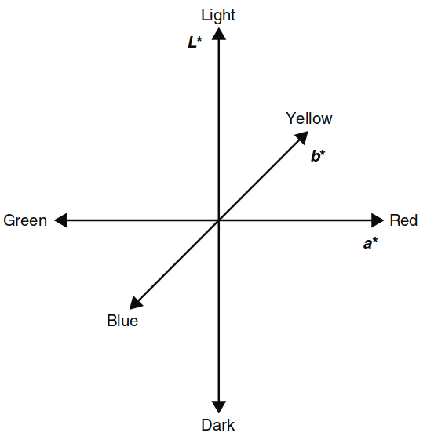
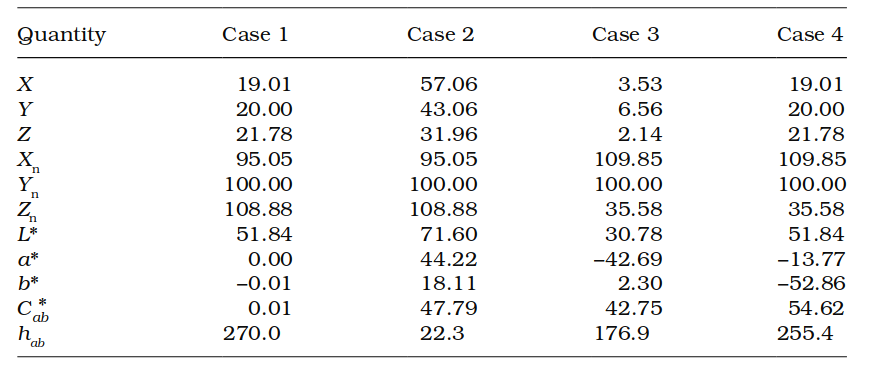
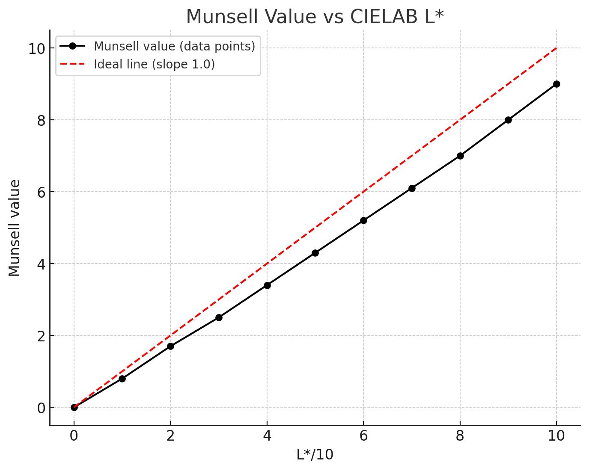
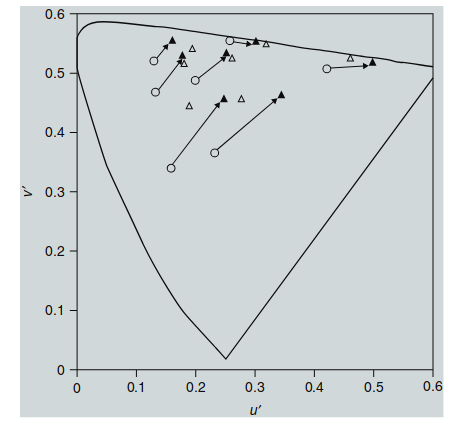

色彩适应变换（见第 9 章讨论）在三刺激色度学基础上向预测颜色外观的方向迈出了重要一步。然而，它们依然有局限性，只能预测不同观看条件下的匹配颜色（即对应颜色）。单靠色彩适应变换，无法描述刺激物的实际颜色外观。要做到这一点，必须使用第 4 章中定义的外观参数——包括**绝对颜色外观属性**（亮度、色彩度和色调）以及**相对颜色外观属性**（明度、色度、饱和度和色调）。这些术语用来描述刺激物的颜色外观，而色彩适应变换并不能提供这些感知属性的对应指标。这就是**色貌模型**的作用领域。

## 10.1 色貌模型定义

在色彩测量领域，充斥着各种颜色描述方法，比如三刺激值、色度坐标、UCS（均匀颜色空间）以及普通的颜色空间。有时候，区分这些名词和概念可能会让人感到困惑。那么，究竟是什么使得**色貌模型**与其他颜色描述方法不同呢？

CIE 技术委员会 1-34 负责评估各种色貌模型的性能，并推荐一个可以普遍使用的模型。因此，委员会首先定义了什么是色貌模型，以便能够参与测试（Fairchild 1995a）。TC1-34 达成的共识定义是：**色貌模型是能够预测至少明度、色度和色调等相对颜色外观属性的模型**。要做到这一点，模型必须至少包含某种形式的**色彩适应变换**。

如果一个模型还能够预测**亮度**、**色彩度**，或者其他亮度相关效应（如 Stevens 效应或 Hunt 效应），那它就必须更加复杂。

根据上述定义，一些相对简单的均匀颜色空间，如 CIE 1976 L\*a\*b\* 颜色空间（CIELAB）和 CIE 1976 L\*u\*v\* 颜色空间（CIELUV），也可以被视为色貌模型。这些颜色空间包含简单的色彩适应变换，并且能够预测明度、色度和色调。

在接下来的章节中，将讨论色貌模型的总体构建，并以 CIELAB 作为具体示例进行说明。

## 10.2 色貌模型构建

本节描述了适用于所有色貌模型构建的一些基本概念。所有实际应用中的色貌模型，首先都要通过 **CIE XYZ 三刺激值**（有些模型还需要一定的绝对亮度）来指定色彩刺激和观察条件。通常，处理这些数据的第一步是将 XYZ 三刺激值通过线性转换转化为**视锥细胞的响应**，以便更准确地模拟人类视觉系统中的生理过程。

使用 CIE 三刺激值作为模型的起点是因为它在实际应用中非常实用。大量色彩测量仪器能够快速且准确地用 CIE 三刺激值来测量刺激。CIE 系统也是一个国际公认的色彩规范和交流标准。无论模型是从 CIE 1931 (2°) 还是 CIE 1964 (10°) 三刺激值开始，实际上差别不大，因为预测色彩外观时的不确定性要比选择哪一个标准观察者的差异大得多。

某些基于视觉科学的颜色模型可能会使用与 CIE 颜色匹配函数非线性变换的视锥响应值（Guth 1995）。虽然这种方法在性能上有一定优势，但在实际应用中的不便远远大于它带来的好处。

除了刺激的三刺激值，还必须考虑其他关于观看环境的数据，才能预测颜色外观。正如第 6 章和第 7 章中描述的各种色貌现象所示，至少还需要适应刺激的三刺激值（通常是光源的三刺激值）。还可以用到的其他数据包括绝对亮度、邻近场的颜色数据、背景、周围环境，甚至其他空间或时间的信息。

在获得这些数据后，色貌模型的第一步通常是应用一种色彩适应变换（如第 9 章所述的变换）。适应后的信号会被进一步组合成更高层次的信号，通常基于**颜色对立理论**，并可能引入阈值或压缩的非线性效应。这些信号以各种方式组合起来，以预测不同的颜色外观属性。关于适应刺激、背景、周围环境等的信息会在色彩适应阶段和后续阶段被整合到模型中。

这种一般的构建过程可以在本书中描述的所有色貌模型中看到。然而，每个模型的构建方法有所不同，各个方面的侧重程度也不尽相同。一个遵循上述大多数构建步骤的简单色貌模型例子是 **CIELAB** 颜色空间。第 10.3 节将具体描述 CIELAB 作为一个色貌模型的解释。

## 10.3 CIE LAB

对于那些有传统色度学训练背景的人来说，当他们听到 **CIELAB** 被描述为一种色貌模型时，通常会产生负面反应。这是因为 **CIE（1986）** 曾非常谨慎地将其称为均匀色空间，而不是外观空间。**CIELAB** 的初衷是作为一种颜色空间，用来描述**颜色差异**。

在 1970 年代早期，当时大约有 20 种不同的公式用于计算颜色差异。为了统一实践，CIE 在 1976 年推荐了两个颜色空间：**CIELAB** 和 **CIELUV**（Robertson 1977, 1990）。在这些空间中，两个颜色点之间的**欧几里得距离**（即 ∆E\*ab 或 ∆E\*uv）被用作它们颜色差异的度量方式。

作为一个历史注脚，1994 年 CIE 推荐了一个基于 **CIELAB** 空间的更优颜色差异公式，称为 **∆E\*94**（Berns 1993a, CIE 1995b）。之后又推出了 **CIE DE2000** 颜色差异公式，仍然基于 **CIELAB**（CIE 2001）。

在制定颜色差异公式的过程中，CIE 构建了一个具备一些颜色外观属性预测能力的颜色空间。也许这并不令人意外，因为描述两个颜色的差异的最佳方式，往往是先描述它们的颜色外观。因此，在适当的情况下，**CIELAB** 也可以被视为一种简单的色貌模型。

### 计算 CIELAB 坐标

要计算CIELAB坐标，首先需要两组CIE XYZ三刺激值，分别是刺激的XYZ值，以及**参考白色**的三刺激值，记作Xn、Yn、Zn。这些数据通过对**Von Kries色彩适应变换**的简化形式进行处理，方法是将刺激的三刺激值归一化处理（即X/Xn、Y/Yn和Z/Zn）。需要注意的是，CIE三刺激值并没有首先转换为**视锥细胞**响应，这与Von Kries的真正适应模型有所不同。

归一化后的信号将通过CIELAB方程中的**立方根形式**进行非线性压缩。这种非线性旨在模拟物理能量测量与感知响应之间的压缩关系（见Stevens 1961）。接下来，这些信号会被组合成三维响应，分别对应于颜色视觉对立理论中的**明-暗**、**红-绿**和**黄-蓝**维度。最后，在这些方程中加入适当的**乘法常数**，以确保在三维空间内的感知均匀性和相应维度的正确关系。

完整的CIELAB方程如下（式10.1至10.4）：

  

    $$ 
    L^* = 116 f\left(\frac{Y}{Y_n}\right) - 16
    $$
  

  
(10.1)

  

    $$ 
    a^* = 500 \left[ f\left(\frac{X}{X_n}\right) - f\left(\frac{Y}{Y_n}\right)\right]
    $$
  

  
(10.2)

  

    $$ 
    b^* = 200 \left[ f\left(\frac{Y}{Y_n}\right) - f\left(\frac{Z}{Z_n}\right)\right]
    $$
  

  
(10.3)

  

    $$
    f(\omega) = 
    \begin{cases}
    \omega^{1/3} & \omega > 0.008856 \\
    7.787 \omega + \frac{16}{116} & \omega \leq 0.008856
    \end{cases}
    $$
  

  
(10.4)

Pauli（1976）引入了替代形式，以克服原始CIELAB方程在低值下的局限性。原始方程在X/Xn、Y/Yn和Z/Zn小于0.01时应用效果较差，虽然在颜色材料中不常见，但在无眩光的图像系统规范中有时会遇到。因此，遇到低值时，必须使用完整的方程（10.1至10.4）。

式（10.1）中的**L**是感知**明度**的度量，从0.0（表示黑色）到100.0（表示散射白色），对于某些刺激（例如图像中的高光），**L**有时可能会超过100.0。**a**和**b**维度分别对应于红-绿和黄-蓝色度的感知，它们可以取正负值。对于无色刺激（如白色、灰色、黑色），**a**和**b**的值均为0.0。其最大值则取决于材料的物理属性，而非方程本身的限制。

### 计算CIELAB色彩空间的三维表示

CIELAB中的**L***、**a***和**b***维度可以作为**笛卡尔坐标**组合成一个三维色彩空间，如图10.1所示。这个色彩空间也可以用**柱坐标**表示，如图10.2所示。在柱坐标系统中，色度（$C_{ab}$）和色相（$h_{ab}$，色相角以度为单位）可以通过以下公式来表达：

  

    $$ 
    C_{ab}^* = \sqrt{a^{*2} + b^{*2}}
    $$
  

  
(10.5)

  

    $$ 
    h_{ab} = \text{atan2}(b^*, a^*)
    $$
  

  
(10.6)

在上述公式中，*C*和*a***、**b***有相同的单位。对于无色刺激，*C*的值为0.0（即没有色度）。色相角 **$h_{ab}$** 以正度数表示，0°位于正a*轴，并以逆时针方向进行。

  

  图 10.1：CIELAB色彩空间的笛卡尔表示

  

  图 10.2：CIELAB色彩空间的柱坐标表示

  

  图 10.3：三维计算机图形渲染的CIELAB颜色空间的两种视图，展示了沿着明度、彩度和色调维度的取样结果。此图展示了CIELAB空间中颜色如何在三个维度上变化的特点。

图10.3展示了一个完整的、经过采样的CIELAB色彩空间，沿着明度、色度和色相角维度显示。虽然CIELAB没有官方定义饱和度，但一个合理的近似值可以通过将*C*ab除以**L***来计算。

CIELAB公式以刺激和参考白色的XYZ三刺激值作为输入，输出与明度（**L***）、色度（**$C_{*ab}$**）和色相（**$h_{ab}$**）相关的结果。因此，CIELAB是一个简单的色貌模型。

尽管CIELAB是一个简单的色貌模型，但它仍然存在一些已知的局限性。可以通过检查来自**孟塞尔色彩系统**的恒定色相和色度等值线来评估CIELAB空间的感知均匀性。图10.4展示了这样的一个图示。由于孟塞尔系统设计为在色相和色度上感知均匀，因此在实现这个目标的范围内，图10.4应该是一组同心圆，表示恒定的色度等值线，而从中心辐射出的直线表示恒定的色相。

  Table 10.1: Example CIELAB calculations

  

  

  图 10.4：来自孟塞尔色彩系统的恒定色相和色度等值线

然而，通过使用CRT系统（其能够实现比孟塞尔色彩系统中通常可用的色度更高的值）进一步检查恒定色相等值线时，发现观察结果与预测结果之间存在差异（Hung和Berns，1995年）。图10.5展示了来自Hung和Berns（1995年）的恒定感知色相线。很明显，这些线在CIELAB空间中是弯曲的，特别是对于红色和蓝色色相。

  

  图 10.5：Hung和Berns（1995）中恒定感知色相线的表示

类似地，可以通过绘制孟塞尔值与**L***的函数关系来检查CIELAB明度尺度，如图10.6所示。显然，**L***函数很好地预测了孟塞尔值定义的明度。事实上，**L***函数比用于定义孟塞尔值的五阶多项式更好地预测了原始的孟塞尔明度缩放数据（Fairchild，1995年）。这一结果并不令人惊讶，因为**L***尺度的历史推导本身就是为了接近孟塞尔值尺度（Robertson，1990年）。

  

  图 10.6：孟塞尔值与L*的函数关系图

> 译者注，10.6图可能存在问题，下面这个图是更新版本的

> 

  

  图 10.6：孟塞尔值与L*的函数关系图

另一个值得注意的点是感知的**独特色相**（红、绿、黄、蓝）并不完全与CIELAB的a*b*轴对齐。在日光照明下，独特色相大致位于色相角24°（红色）、90°（黄色）、162°（绿色）和246°（蓝色）处（Fairchild，1996年）。

CIELAB的其他局限性是由使用CIE XYZ三刺激值进行**Von Kries类型色彩适应变换**而不是视锥细胞响应引起的。这被称为错误的**Von Kries变换**（Terstiege，1972年），将在“错误的Von Kries变换”中详细描述。

### 错误的 von Kries 变换

Terstiege (1972) 指出，将 von Kries 类型的适应变换应用于**视锥响应**以外的值（有时称为基础三刺激值）被称为**错误 von Kries 变换**。因此，CIELAB 通过其对 CIE XYZ 三刺激值的归一化处理引入了错误的 von Kries 变换。需要认识到，对 XYZ 三刺激值进行归一化并不等同于先线性变换到视锥响应再进行归一化的过程。这种差异通过公式 10.7 到 10.11 得到说明，它们从正确的 von Kries 变换的矩阵形式出发，最终转化为对 CIE 三刺激值的操作。CIELAB 中的错误 von Kries 变换可以表示为对 CIE XYZ 三刺激值的对角矩阵变换，而“正确”的 von Kries 变换则是作用于 LMS 视锥响应的对角矩阵变换，如下所示：

  

    $$ 
    \begin{bmatrix}
    L_a \\
    M_a \\
    S_a 
    \end{bmatrix}
    =
    \begin{bmatrix} 
    k_L & 0 & 0 \\
    0 & k_M & 0 \\
    0 & 0 & k_S
    \end{bmatrix}
    \cdot
    \begin{bmatrix}
    L \\
    M \\
    S
    \end{bmatrix}
    $$
  

  
(10.7)

由于 LMS 视锥响应可以通过 CIE XYZ 三刺激值的线性变换表示出来，因此通过简单代入可以从公式 10.7 推导出公式 10.8，随后通过代数替换得出公式 10.9：

  

    $$ 
    \mathbf{M}
    \cdot
    \begin{bmatrix}
    X_a \\
    Y_a \\
    Z_a 
    \end{bmatrix}
    =
    \begin{bmatrix} 
    k_L & 0 & 0 \\
    0 & k_M & 0 \\
    0 & 0 & k_S
    \end{bmatrix}
    \cdot
    \mathbf{M}
    \cdot
    \begin{bmatrix}
    X \\
    Y \\
    Z
    \end{bmatrix}
    $$
  

  
(10.8)

  

    $$ 
    \begin{bmatrix}
    X_a \\
    Y_a \\
    Z_a 
    \end{bmatrix}
    =
    \mathbf{M}^{-1}
    \cdot
    \begin{bmatrix} 
    k_L & 0 & 0 \\
    0 & k_M & 0 \\
    0 & 0 & k_S
    \end{bmatrix}
    \cdot
    \mathbf{M}
    \cdot
    \begin{bmatrix}
    X \\
    Y \\
    Z
    \end{bmatrix}
    $$
  

  
(10.9)

矩阵**M**的性质非常关键，**M**永远不是对角矩阵。典型的 **M** 矩阵如下所示：

  

    $$ 
    \mathbf{M} =
    \begin{bmatrix}
    0.390 & 0.689 & -0.079 \\
    -0.230 & 1.183 & 0.046 \\
    0 & 0 & 1.000
    \end{bmatrix}
    $$
  

  
(10.10)

使用公式 10.9 中的 M 矩阵进行计算得出公式 10.11：

  

    $$ 
    \begin{bmatrix}
    X_a \\
    Y_a \\
    Z_a 
    \end{bmatrix}
    =
    \begin{bmatrix}
    0.74k_L + 0.26k_M & -1.32k_M & -0.15k_L + 0.20k_S \\
    0.14k_L - 0.14k_M & 0.26k_L + 0.74k_M & -0.03k_L + 0.03k_M \\
    0 & 0 & k_S
    \end{bmatrix}
    \cdot
    \begin{bmatrix}
    X \\
    Y \\
    Z
    \end{bmatrix}
    $$
  

  
(10.11)

从上述公式中可以看出，由于与三刺激值相关的矩阵变换不是对角矩阵，因此 CIELAB 中的错误 von Kries 变换不能等同于作用于视锥响应的正确 von Kries 变换。

Liu 等人（1995）的实验展示了 CIELAB 方程中的错误 von Kries 变换的局限性。他们研究了宝石坦桑石从日光到白炽灯照明时的色调变化。CIELAB 预测宝石的色调从蓝色向蓝绿色过渡，但实际感知是从蓝色到紫色。如果使用作用于视锥响应的正确 von Kries 变换，则可以正确预测这一色调变化（Liu 等人，1995）。

  

  图 10.7：使用 CIELAB 模型预测的一些对应颜色数据。空心三角形代表视觉数据，实心三角形代表模型预测值。

> 译者注：上面图也存在问题，凭空多了空心圆

## 10.4 WHY NOT USE JUST CIELAB?

虽然**CIELAB**是一个广泛使用的、实际上的国际标准颜色空间，并且已经应用了二十多年，能够对**色貌**进行预测，但为什么还需要其他的**色貌模型**呢？正如第15章所看到的，在某些应用中，CIELAB 确实作为色貌模型表现不错。那么，为什么不就此止步，只使用 CIELAB 呢？

之前讨论的**CIELAB 的局限性**，为这些问题提供了大部分答案。CIELAB 方程中所采用的**修正 von Kries 适应变换**显然不如那些更符合已知视觉生理学的变换准确。此外，CIELAB 在**色调预测**能力方面的局限性也促使人们继续研究新的色貌模型。

CIELAB 还**无法预测**许多与色貌相关的现象。首先，CIELAB 不包含**亮度水平依赖性**，因此它完全无法预测**亮度依赖效应**，比如 **Hunt 效应** 和 **Stevens 效应**。此外，CIELAB 也不包含对**背景或周围环境的依赖性**，因此无法预测**同时对比效应**或 **Bartleson–Breneman 结果**，这些结果显示图像对比度会随周围相对亮度的变化而改变。

CIELAB 也缺乏用来建模**认知效应**的机制，例如在跨媒体颜色再现应用中非常重要的**消光效应（discounting-the-illuminant）**。最后，CIELAB 没有提供**绝对外观属性**，如**亮度**和**颜色鲜艳度**的相关量。

值得注意的是，可以回顾 CIE 第 15.2 号出版物（CIE 1986: 32）中的**CIELAB 空间注释6**，其中指出：

_“这些空间适用于比较形状和大小相同的物体颜色差异，观察者在视角和色度接近平均日光的白色到中灰色环境中光学适应的情况下进行观察。”_

这一系列的限制表明，在开发**色貌模型**的过程中，应该可以大幅提升 CIELAB 的性能。接下来的章节将描述这些色貌模型。与此同时，可以将 CIELAB 空间作为一个简单的基准模型，用来衡量更复杂的模型是否确实有所改进。

## 10.5 CIELUV肿么样

既然 CIELAB 可以被视为一种色貌模型，那么另一个 CIE 在 1976 年推荐的颜色空间 **CIELUV** 又如何呢？CIELUV 具备许多与 CIELAB 相同的属性（如输入为刺激物和光源的色度值，输出为明度、彩度和色调的预测值），因此它也可能值得同样的关注。

**CIELUV** 采用了与 CIELAB 不同的色彩适应变换形式。CIELUV 使用的是**色度坐标的减法位移**（即 $u' - u'_n$ 和 $v' - v'_n$），而不是 CIELAB 中的**三刺激值的乘法归一化**（即 $X/X_n$, $Y/Y_n$, $Z/Z_n$）。CIELUV 的公式如下所示（公式 10.12 至 10.20）：

  

    $$ L^* = 116 \left( \frac{Y}{Y_n} \right)^{1/3} - 16 $$
  

  
(10.12)

  

    $$ u^* = 13L^*(u' - u'_n) $$
  

  
(10.13)

  

    $$ v^* = 13L^*(v' - v'_n) $$
  

  
(10.14)

  

    $$ f(Y) =
    \begin{cases}
    \left(\frac{Y}{Y_n}\right)^{1/3}, & \frac{Y}{Y_n} > 0.008856 \\
    7.787\left(\frac{Y}{Y_n}\right) + \frac{16}{116}, & \frac{Y}{Y_n} \leq 0.008856
    \end{cases}
    $$
  

  
(10.15)

  

    $$ u' = \frac{4X}{X + 15Y + 3Z} $$
  

  
(10.16)

  

    $$ v' = \frac{9Y}{X + 15Y + 3Z} $$
  

  
(10.17)

  

    $$ C_{uv}^* = \sqrt{(u^*)^2 + (v^*)^2} $$
  

  
(10.18)

  

    $$ h_{uv} = \tan^{-1} \left( \frac{v^*}{u^*} \right) $$
  

  
(10.19)

  

    $$ s_{uv} = \frac{C_{uv}^*}{L^*} $$
  

  
(10.20)

CIELUV 的结构与 CIELAB 大体类似，主要区别在于 CIELUV 使用了 **u'v' 坐标的减法适应变换**（公式 10.13 和 10.14），以及**饱和度的正式定义**（公式 10.20）。然而，CIELUV 中的减法适应变换相比 CIELAB 中的错误 von Kries 变换更加偏离生理现实。这种减法位移可能导致预测的对应颜色超出可实现的色域（即预测的三刺激值小于 0）。在这种情况下，CIELAB 的变换不会出现类似问题。需要注意的是，预测的对应颜色超出光谱范围并不一定是不正确的，因为有些感知在其他观测条件下无法被准确复制。然而，CIELUV 的预测往往大大超出合理的范围。

即使没有出现这样的极端情况，CIELUV 的变换仍可能将预测颜色移出任何给定设备可生产的色域。除了这个问题，CIELUV 的适应变换在预测视觉数据方面极其不准确。图 10.8 清晰地展示了 **CIELUV 对 Breneman（1987）对应颜色数据的预测**，其中一些颜色移出了可实现的色域（即 u'v' 色度图上的光谱位置之外），同时所有预测结果都表现出不准确性。

这些与 CIELUV 适应变换相关的问题，已经足够让我们将其排除在严肃的色貌模型考虑之外。此外，CIELUV 在预测色差方面的糟糕表现也提供了更多的证据。当前 CIE 推荐的色差规范 CIE94（CIE 1995b）基于 CIELAB 空间，更新的 **CIE DE2000**（CIE 2001）色差公式也是基于 CIELAB 空间的。尽管 DE2000 比 CIE94 更为复杂，但在大多数应用中这种复杂性可能是不必要的。Alman 等人（1989）的实验表明，CIELUV 在色差计算方面表现不佳。Robertson（1990）也对 CIELUV 和 CIELAB 进行了比较。

**CIELUV** 最显著的优点在于其提供了**饱和度的正式定义**（公式 10.20），这在 CIELAB 中并没有。然而，如果我们愿意在 CIELAB 中用 **$C_{ab}^*/L^*$** 作为近似饱和度的指标，那么我们可以在 CIELAB 中使用这种饱和度度量，同时享受 CIELAB 的其他所有优势。

  

  图 10.8：使用 CIELUV 模型预测的一些对应颜色数据。空心三角形代表视觉数据，实心三角形代表模型预测值。

> 译者注：上面图也存在问题，凭空多了空心圆
