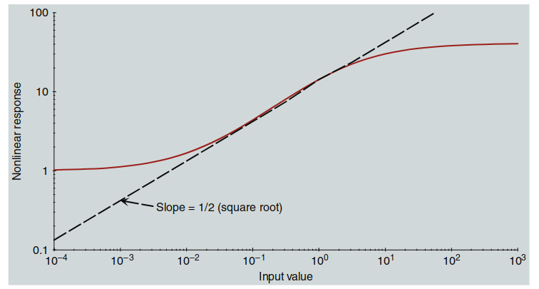
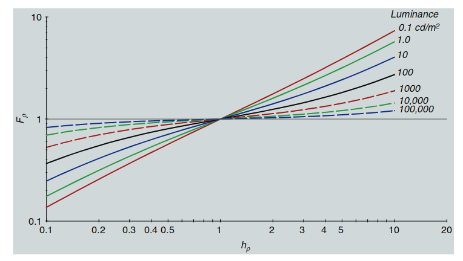

# Hunt 模型

这一章继续回顾一些广泛讨论和应用的色彩外观模型，重点介绍了由 Robert William Gainer Hunt 开发的模型。这个模型是迄今为止开发的最为广泛、完整和复杂的色彩外观模型。其理论根基可以追溯到 Hunt 在 1952 年的早期色度适应研究（Hunt 1952），并在 1980 年代和 1990 年代得到了严格的发展（Hunt 1982, 1987, 1991b, 1994, 1995, Hunt 和 Pointer 1985）。该模型对 CIECAM02 的发展和设计产生了深远影响。

Hunt 色彩外观模型并不简单，但它被设计用于预测一系列视觉现象。正如 Hunt 本人所言，人的视觉系统也并非简单。因此，尽管在某些应用中，后续章节中描述的简单模型已足够，但拥有一个完整的模型，能够适应更广泛的观察条件，对于更明确或不寻常的情况来说无疑具有很大的价值。Hunt 模型恰好满足了这一需求，并且本书中讨论的大多数其他色彩外观模型，都能追溯到 Hunt 模型中最初提出的许多理念。

---

## 12.1 目标与方法

Hunt 在柯达研究实验室度过了他职业生涯中的 36 年。因此，Hunt 模型是在色彩图像再现的需求背景下开发的。这与第 11 章中讨论的 Nayatani 等人模型的照明工程领域的视角有显著不同。通过检查 Hunt 模型的输入参数，可以轻易看出成像科学对该模型的影响。例如，环境相对亮度是一个在 Nayatani 等人模型中不存在的重要因素。其他例子可以在为“在暗室投影的透明片”、“在昏暗环境中的电视显示”或“正常场景”设定特定值的参数中找到。这些特性清晰地表明，Hunt 模型是为了应用于成像情境而设计的。

然而，这并不是该模型适用范围的极限。例如，它还被扩展到与传统视觉科学实验中使用的无关色彩。Hunt 模型旨在预测一系列视觉现象，包括在不同背景、环境、照明颜色和亮度级别（从低视网膜亮度到漂白水平）下相关和无关色彩的外观。在这个意义上，它是一个完整的色彩外观模型，适用于静态刺激。像本书中描述的大多数其他模型一样，Hunt 模型并不试图涵盖外观的复杂空间或时间特性。

为了在如此广泛的条件下做出合理的外观预测，Hunt 模型要求对观察场的定义更加严格。因此，Hunt（1991b）定义了观察场的组成部分，如第 7 章所述。这些组成部分包括刺激物、近端场、背景和环境。Hunt 模型是唯一一个单独处理这些观察场组成部分的模型。

尽管 Hunt 模型在过去的二十年里一直在不断发展（有关重要进展，请参见 Hunt 1982, 1985, 1987, 1991b 和 1994），该模型当前表述的全面回顾可以在 Hunt 的书籍《色彩再现》第五版的第 31 章中找到（Hunt 1995）。以下内容改编自该章节。有兴趣深入了解 Hunt 模型的读者，应该参考 Hunt 书中的第 31 章。

---

## 12.2 输入数据

Hunt 模型需要大量的输入数据。所有的色度坐标通常使用 CIE 1931 标准色度观察者（2°）来计算。需要提供照明源和适应场的色度坐标（x,y）。通常，适应场被视为场景的综合色度，假设其与照明源的色度相同。

接下来，需要提供背景、近端场、参考白和测试样本的色度坐标（x,y）和亮度因子（Y）。如果没有单独的数据用于近端场，通常假设它与背景相同。此外，参考白通常假设与照明源具有相同的色度，并且其亮度因子为 100（如果没有具体数据的话）。所有这些数据都是相对的色度值。

为了预测一些依赖亮度的外观现象，还需要绝对亮度水平。因此，需要提供参考白和适应场的绝对亮度水平（单位：cd/m²）。如果适应场的具体亮度数据不可得，则假设适应场的亮度为参考白亮度的 20%，假定场景的平均反射率为 0.2。

此外，还需要视网膜亮度数据，以便将视杆细胞反应纳入模型（这是 Hunt 模型的另一个独特特征）。因此，需要提供适应场的视网膜亮度（单位：视网膜 cd/m²）。由于视网膜亮度数据很少，通常可以通过照明源的视网膜亮度 LAS 来近似计算，公式如下：

  

    $$
    L_{AS} = L_A - 2.26 \left( \frac{4000}{T} \right)^{1/3}
    $$
  

测试刺激相对于参考白的视网膜亮度也需要提供。同样，由于这些数据也很少可用，通常会使用样本与参考白的视网膜亮度比值代替视网膜亮度数据。

最后，还有一些输入变量需要根据观察配置来确定。其中两个是色度（Nc）和亮度（Nb）环境诱导因子。Hunt（1995）建议为特定的观察情境优化这些值。由于通常无法做到这一点，建议使用表 12.1 中列出的名义值。

最后两个输入参数是色度（Ncb）和亮度（Nbb）背景诱导因子。同样，Hunt 推荐优化的值。如果没有这些值，可以根据参考白的亮度（YW）和背景的亮度（Yb）使用以下公式计算背景诱导因子：

  

    $$
    N_{cb} = 0.2 \left( \frac{Y_W}{Y_b} \right)^{0.725}
    $$
  

  

    $$
    N_{bb} = 0.2 \left( \frac{Y_W}{Y_b} \right)^{0.725}
    $$
  

**表 12.1 色度和亮度环境诱导因子值**

| 情境                            | Nc  | Nb  |
|---------------------------------|-----|-----|
| 均匀背景和环境中的小区域         | 1.0 | 300 |
| 正常场景                         | 1.0 | 75  |
| 昏暗环境中的电视和 CRT 显示器    | 1.0 | 25  |
| 光箱上的大透明片                  | 0.7 | 25  |
| 昏暗环境中的投影透明片            | 0.7 | 1   |

最后，还需要做出关于“忽略照明源”参数的决定。模型中的某些参数在发生忽略照明源的情境下需要赋予不同的值。得到以上所有数据后，便可以继续进行 Hunt 模型参数的计算。

---

## 12.3 适应模型

在本书所描述的所有模型中，第一步都是将 CIE 三刺激值转换为锥体响应。在 Hunt 模型中，锥体响应用 $\rho$、$\gamma$ 和 $\beta$ 来表示，而不是传统的 LMS。所使用的转换（称为 Hunt-Pointer-Estevez 转换）如方程 (12.4) 所示。

  

    $$
    \begin{bmatrix} \rho \\ \gamma \\ \beta \end{bmatrix} = 
    \begin{bmatrix}
    0.38971 & 0.68898 & -0.07868 \\
    -0.22981 & 1.18340 & 0.04641 \\
    0.0 & 0.0 & 1.0
    \end{bmatrix}
    \begin{bmatrix} X \\ Y \\ Z \end{bmatrix} \tag{12.4}
    $$
  

在 Hunt 模型中，这个转换经过归一化处理，使得均能光照下的 $\rho$、$\gamma$ 和 $\beta$ 值相等。在其他一些模型中，可能会使用不同的归一化方式。

转换从 XYZ 到 $\rho\gamma\beta$ 的值需要对参考白、背景、临近场和测试刺激分别进行计算。Hunt 颜色外观模型中的色彩适应模型是 von Kries 假说的显著改进形式。适应后的锥体信号 $\rho_a$、$\gamma_a$ 和 $\beta_a$，通过以下方程从刺激的锥体响应 $\rho$、$\gamma$ 和 $\beta$ 以及参考白的锥体响应 $\rho_W$、$\gamma_W$ 和 $\beta_W$ 计算。

  

    $$
    \rho_a = B_\rho \left[ f_n \left(\frac{F_L F_\rho \rho}{\rho_W}\right) + \rho_D \right] + 1 \tag{12.5}
    $$
  

  

    $$
    \gamma_a = B_\gamma \left[ f_n \left(\frac{F_L F_\gamma \gamma}{\gamma_W}\right) + \gamma_D \right] + 1 \tag{12.6}
    $$
  

  

    $$
    \beta_a = B_\beta \left[ f_n \left(\frac{F_L F_\beta \beta}{\beta_W}\right) + \beta_D \right] + 1 \tag{12.7}
    $$
  

von Kries 假说在这些方程中体现为核心比值 $\rho/\rho_W$、$\gamma/\gamma_W$ 和 $\beta/\beta_W$。显然，这些方程中还包含许多其他参数，需要进行定义和解释。

函数 $f_n(I)$ 是一个广义双曲函数，用于模拟视觉系统的非线性行为。其表达式如下：

  

    $$
    f_n(I) = 40 \left(\frac{I^{0.73}}{I^{0.73} + 2}\right) \tag{12.8}
    $$
  

该函数的特性如图 12-1 所示。在对数-对数坐标下，这个函数在中间操作范围内呈现线性，接近一个简单的幂函数（指数约为 1/2）。在低光照水平下，函数的斜率逐渐增加，模拟阈值行为；在高光照水平下，斜率逐渐下降至 0，模拟饱和行为。

  

  图 12.1：Hunt 颜色外观模型的非线性响应函数 $f_n(I)$。

### 亮度水平适应因子 $F_L$

亮度水平适应因子 $F_L$ 被引入到适应模型中，用于预测在不同亮度水平下光适应的整体行为。它还重新引入了非线性之前的绝对亮度水平，从而能够预测 Stevens 效应和 Hunt 效应等外观现象。$F_L$ 由以下方程计算：

  

    $$
    F_L = 0.2k^4 (5L_A) + 0.1(1 - k^4)^2 (5L_A)^{1/3} \tag{12.9}
    $$
  

其中，$k$ 的计算公式为：

  

    $$
    k = \frac{1}{5L_A + 1} \tag{12.10}
    $$
  

### 色彩适应因子 $F_\rho$、$F_\gamma$ 和 $F_\beta$

色彩适应因子 $F_\rho$、$F_\gamma$ 和 $F_\beta$ 用于模拟色彩适应的不完全性。这些因子的设计使得对于均能光照（通常称为光源 E），色彩适应始终是完全的，即 $F_\rho$、$F_\gamma$ 和 $F_\beta$ 均等于 1。随着适应场颜色纯度的增加或亮度水平的降低，色彩适应的完整性会减弱。色彩适应因子的公式如下：

  

    $$
    F_\rho = \frac{1 + L_A^{1/3} + h_\rho}{1 + L_A^{1/3} + 1/h_\rho} \tag{12.11}
    $$
  

  

    $$
    F_\gamma = \frac{1 + L_A^{1/3} + h_\gamma}{1 + L_A^{1/3} + 1/h_\gamma} \tag{12.12}
    $$
  

  

    $$
    F_\beta = \frac{1 + L_A^{1/3} + h_\beta}{1 + L_A^{1/3} + 1/h_\beta} \tag{12.13}
    $$
  

其中，$h_\rho$、$h_\gamma$ 和 $h_\beta$ 的计算公式如下：

  

    $$
    h_\rho = \frac{3 \rho_W}{\rho_W + \gamma_W + \beta_W} \tag{12.14}
    $$
  

  

    $$
    h_\gamma = \frac{3 \gamma_W}{\rho_W + \gamma_W + \beta_W} \tag{12.15}
    $$
  

  

    $$
    h_\beta = \frac{3 \beta_W}{\rho_W + \gamma_W + \beta_W} \tag{12.16}
    $$
  

  

  图 12.2：色彩适应因子 $F_\rho$ 随适应色彩纯度和亮度水平的变化。

### Helson-Judd 效应修正项

在 Hunt 模型中，为了预测 **Helson-Judd 效应**，引入了修正项 $\rho_D$、$\gamma_D$ 和 $\beta_D$。Helson-Judd 效应描述了背景亮度和参考白亮度之间的关系如何影响颜色感知。它通过对锥体信号进行加性修正来反映这种影响。方程 (12.17) 到 (12.19) 描述了这些修正项的计算方法。

  

    $$
    \rho_D = f_n \left[\left(\frac{Y_b}{Y_W}\right) F_L F_\gamma\right] - f_n \left[\left(\frac{Y_b}{Y_W}\right) F_L F_\rho\right] \tag{12.17}
    $$
  

  

    $$
    \gamma_D = 0.0 \tag{12.18}
    $$
  

  

    $$
    \beta_D = f_n \left[\left(\frac{Y_b}{Y_W}\right) F_L F_\gamma\right] - f_n \left[\left(\frac{Y_b}{Y_W}\right) F_L F_\beta\right] \tag{12.19}
    $$
  

这些修正项中：

- $Y_b$ 是背景的亮度。
- $Y_W$ 是参考白的亮度。
- $F_L$ 是亮度水平适应因子。
- $F_\rho$、$F_\gamma$ 和 $F_\beta$ 是色彩适应因子。
- $f_n$ 是 Hunt 模型中用于模拟视觉非线性响应的双曲函数。

在典型的观察条件下，Helson-Judd 效应并不显著（Helson 1938）。在这种情况下，修正项 $\rho_D$、$\gamma_D$ 和 $\beta_D$ 可以设置为 0.0。此外，当发生 **完全色彩适应**（discounting-the-illuminant）时，色彩适应因子 $F_\rho$、$F_\gamma$ 和 $F_\beta$ 会被设置为 1.0，Helson-Judd 效应也不会出现，修正项 $\rho_D$、$\gamma_D$ 和 $\beta_D$ 也会被强制为 0.0。

### 锥体漂白因子

当光照水平达到非常高的亮度时，视锥细胞会发生漂白（photopigment bleaching），导致视觉系统的输出降低。Hunt 模型引入了漂白因子 $B_\rho$、$B_\gamma$ 和 $B_\beta$ 来模拟这种现象。这些漂白因子随着适应亮度 $L_A$ 的增加而逐渐减小，如方程 (12.20) 到 (12.22) 所示。

  

    $$
    B_\rho = \frac{10^7}{10^7 + 5L_A \left(\frac{\rho_W}{100}\right)} \tag{12.20}
    $$
  

  

    $$
    B_\gamma = \frac{10^7}{10^7 + 5L_A \left(\frac{\gamma_W}{100}\right)} \tag{12.21}
    $$
  

  

    $$
    B_\beta = \frac{10^7}{10^7 + 5L_A \left(\frac{\beta_W}{100}\right)} \tag{12.22}
    $$
  

这些漂白因子在正常亮度条件下接近 1.0，因此对视觉响应的影响很小。但当亮度水平极高时，例如在阳光明媚的室外环境下，漂白因子会显著降低，导致视锥细胞的输出减少。这种现象解释了在强光下视觉系统感知范围的减小，因此人们常常需要佩戴墨镜来降低光线对视觉的影响。

### 调整参考白信号

在 Hunt 模型中，还引入了对参考白信号的调整，以考虑背景和临近场的影响。调整后的参考白信号 $\rho_W'$、$\gamma_W'$ 和 $\beta_W'$ 可以通过方程 (12.23) 到 (12.28) 计算。这个调整过程使得色彩适应不仅依赖于参考白，还受到背景和临近场颜色的影响。

  

    $$
    \rho_W' = \rho_W \left[\frac{(1 - p) p_\rho + (1 + p)/p_\rho}{(1 + p) p_\rho + (1 - p)/p_\rho}\right]^{1/2} \tag{12.23}
    $$
  

  

    $$
    \gamma_W' = \gamma_W \left[\frac{(1 - p) p_\gamma + (1 + p)/p_\gamma}{(1 + p) p_\gamma + (1 - p)/p_\gamma}\right]^{1/2} \tag{12.24}
    $$
  

  

    $$
    \beta_W' = \beta_W \left[\frac{(1 - p) p_\beta + (1 + p)/p_\beta}{(1 + p) p_\beta + (1 - p)/p_\beta}\right]^{1/2} \tag{12.25}
    $$
  

其中，$p_\rho$、$p_\gamma$ 和 $p_\beta$ 分别表示临近场和背景之间的比值：

  

    $$
    p_\rho = \frac{\rho_p}{\rho_b} \tag{12.26}
    $$
  

  

    $$
    p_\gamma = \frac{\gamma_p}{\gamma_b} \tag{12.27}
    $$
  

  

    $$
    p_\beta = \frac{\beta_p}{\beta_b} \tag{12.28}
    $$
  

这些调整使得 Hunt 模型可以更加精确地模拟在复杂视野条件下的色彩感知变化。

---

## 12.4 对立色维度

在获得适应后的锥体信号 $\rho_a$、$\gamma_a$ 和 $\beta_a$ 之后，可以通过简单的方式计算对立类型的视觉响应。方程 (12.29) 到 (12.32) 给出了这些计算方法。

### 亮度（无色）响应信号

适应后的无色响应信号 $A_a$ 是通过对锥体信号进行加权求和得到的，这些权重反映了视网膜中不同类型锥体的相对数量。同时，方程中减去 3.05 和加上 1.0 的操作，分别表示去除早期噪声成分并添加新的噪声成分。

  

    $$
    A_a = \left(\rho_a + \gamma_a + \beta_a\right) - 3.05 + 1.0 \tag{12.29}
    $$
  

### 色彩对立信号

色彩对立信号 $C_1$、$C_2$ 和 $C_3$ 分别表示所有可能的视网膜中产生的对立色信号。这些信号可能并不直接对应于具体的生理结构，但在模型中作为方便的数学表达式来使用，以便构建更传统的对立色响应。

  

    $$
    C_1 = \rho_a - \gamma_a \tag{12.30}
    $$
  

  

    $$
    C_2 = \gamma_a - \beta_a \tag{12.31}
    $$
  

  

    $$
    C_3 = \beta_a - \rho_a \tag{12.32}
    $$
  

### 解释

1. **$A_a$ 无色响应信号**：  
   该信号通过将适应后的锥体信号 $\rho_a$、$\gamma_a$ 和 $\beta_a$ 相加并进行修正得到，反映了整体亮度感知。

2. **$C_1$ 色彩对立信号**：  
   这个信号表示红-绿通道的对立关系，通过适应后的锥体信号 $\rho_a$ 和 $\gamma_a$ 的差值计算。

3. **$C_2$ 色彩对立信号**：  
   该信号表示绿-蓝通道的对立关系，通过适应后的锥体信号 $\gamma_a$ 和 $\beta_a$ 的差值计算。

4. **$C_3$ 色彩对立信号**：  
   这个信号表示蓝-红通道的对立关系，通过适应后的锥体信号 $\beta_a$ 和 $\rho_a$ 的差值计算。

这些色彩对立信号的组合提供了一种方便的数学形式，用于构建更复杂的对立色响应模型。这些模型在视觉科学中被广泛用于解释色彩感知现象。

---

## 12.5 色调

在 Hunt 颜色外观模型中，一旦确定了红-绿和黄-蓝的对立色维度，就可以计算色调角度。红-绿和黄-蓝对立色维度是色彩差异信号 $C_1$、$C_2$ 和 $C_3$ 的合适组合（如方程 12.30 到 12.32 所示）。色调角度 $h_s$ 的计算如方程 (12.33) 所示。

  

    $$
    h_s = \tan^{-1}\left[\frac{(C_2 - C_3) / 2}{C_1 - (C_2 + C_3) / 4.5}\right] \tag{12.33}
    $$
  

### 色调四分值 $H$

给定色调角度 $h_s$，可以通过在特定色调角度之间进行插值来计算色调四分值 $H$。在插值过程中，还需要考虑偏心因子 $e_s$。插值函数如方程 (12.34) 所示：

  

    $$
    H = H_1 + \left[\frac{100 (h_s - h_1)}{(h_2 - h_1) + (e_1 (h_2 - h_1) + e_2 (h_s - h_1))}\right] \tag{12.34}
    $$
  

在这个公式中：

- **$H_1$**：根据色调角度最接近且小于测试样本的唯一色调，取值为 0（红）、100（黄）、200（绿）或 300（蓝）。
- **$h_1$** 和 **$e_1$**：从表 12.2 中选取，代表具有最接近且小于 $h_s$ 的唯一色调的角度和偏心因子。
- **$h_2$** 和 **$e_2$**：从表 12.2 中选取，代表具有最接近且大于 $h_s$ 的唯一色调的角度和偏心因子。

### 色调组成 $HC$

色调组成 $HC$ 直接从色调四分值 $H$ 计算，和第 11 章中 Nayatani 等人的模型相似。色调组成以两个唯一色调的百分比表示，描述了测试样本色调的组成。

### 偏心因子 $e_s$

偏心因子 $e_s$ 是用于进一步计算外观相关值的参数。可以通过线性插值，根据测试样本的色调角度 $h_s$ 和表 12.2 中的数据来确定 $e_s$。

### 表 12.2：唯一色调的色调角度 $h_s$ 和偏心因子 $e_s$

| **唯一色调** | **$h_s$** | **$e_s$** |
|--------------|-----------|-----------|
| 红 (Red)    | 20.14     | 0.8       |
| 黄 (Yellow) | 90.00     | 0.7       |
| 绿 (Green)  | 164.25    | 1.0       |
| 蓝 (Blue)   | 237.53    | 1.2       |

### 计算步骤总结

1. **计算色调角度 $h_s$**：  
   使用方程 (12.33) 计算色调角度 $h_s$。

2. **确定插值参数**：  
   从表 12.2 中选取最接近 $h_s$ 的两个唯一色调角度 $h_1$ 和 $h_2$ 以及对应的偏心因子 $e_1$ 和 $e_2$。

3. **计算色调四分值 $H$**：  
   使用方程 (12.34) 进行插值，得到色调四分值 $H$。

4. **计算色调组成 $HC$**：  
   根据色调四分值 $H$，确定色调由两个唯一色调的组成百分比。

5. **计算偏心因子 $e_s$**：  
   使用线性插值方法，计算测试样本的偏心因子 $e_s$。

这些步骤确保了 Hunt 模型能够精确地描述和预测色调的感知及其组成。

---

## 12.6 饱和度

为了计算饱和度的相关值，首先需要根据色彩差异信号计算黄-蓝响应和红-绿响应。这些响应通过方程 (12.35) 和 (12.36) 进行计算。

### 黄-蓝响应 $M_{YB}$

黄-蓝响应 $M_{YB}$ 通过下式计算：

  

    $$
    M_{YB} = \left[\left(\frac{C_2 - C_3}{2}\right) \left(\frac{10}{100}\right) \left(\frac{4.5}{13}\right) F_t\right] \left(N_c N_{cb}\right) \tag{12.35}
    $$
  

### 红-绿响应 $M_{RG}$

红-绿响应 $M_{RG}$ 通过下式计算：

  

    $$
    M_{RG} = \left[\left(\frac{C_1}{2}\right) \left(\frac{10}{100}\right) \left(\frac{11}{13}\right)\right] \left(N_c N_{cb}\right) \tag{12.36}
    $$
  

在以上方程中：

- **$C_1$、$C_2$、$C_3$**：由方程 (12.30) 到 (12.32) 计算得到的色彩差异信号。  
- **$N_c$**：色彩环境诱导因子。  
- **$N_{cb}$**：背景色彩诱导因子。  
- **$F_t$**：低亮度三色盲因子，由方程 (12.37) 计算。

### 低亮度三色盲因子 $F_t$

低亮度三色盲（Low-luminance Tritanopia）现象是指在低亮度下，观察者会逐渐表现出蓝-黄辨别缺陷。这是因为短波长敏感锥体（S锥体）的亮度阈值高于其他两类锥体。

  

    $$
    F_t = \frac{L_A}{L_A + 0.1} \tag{12.37}
    $$
  

在方程 (12.37) 中，$L_A$ 是适应亮度。当 $L_A$ 处于典型亮度水平时，$F_t$ 接近 1.0；当 $L_A$ 接近 0 时，$F_t$ 接近 0，使得黄-蓝响应在低亮度下减小。

### 总体色彩响应 $M$

通过黄-蓝响应 $M_{YB}$ 和红-绿响应 $M_{RG}$，可以计算总体色彩响应 $M$。该计算是通过二者的平方和的平方根得到的，如方程 (12.38) 所示：

  

    $$
    M = \left(M_{YB}^2 + M_{RG}^2\right)^{1/2} \tag{12.38}
    $$
  

### 饱和度 $s$

饱和度 $s$ 是通过总体色彩响应 $M$ 和适应后的锥体信号之和计算得到的。方程 (12.39) 给出了饱和度的定义：

  

    $$
    s = \frac{50M}{\rho_a + \gamma_a + \beta_a} \tag{12.39}
    $$
  

在这个公式中：

- **$M$**：总体色彩响应，表示色彩的丰富程度。  
- **$\rho_a$、$\gamma_a$ 和 $\beta_a$**：适应后的锥体信号，表示刺激的亮度。

### 解释

1. **黄-蓝响应 $M_{YB}$**：  
   通过色彩差异信号 $C_2$ 和 $C_3$ 计算，反映了刺激中黄-蓝对立色的强度。

2. **红-绿响应 $M_{RG}$**：  
   通过色彩差异信号 $C_1$ 计算，反映了刺激中红-绿对立色的强度。

3. **低亮度三色盲因子 $F_t$**：  
   在低亮度水平下，模拟蓝-黄辨别能力的降低。

4. **总体色彩响应 $M$**：  
   将黄-蓝和红-绿响应组合在一起，表示刺激的整体色彩感知。

5. **饱和度 $s$**：  
   饱和度定义为刺激色彩丰富程度相对于其自身亮度的比值。总体色彩响应 $M$ 近似表示色彩丰富程度，而适应后锥体信号的和近似表示刺激的亮度。

这种计算方法使得 Hunt 模型能够在广泛的亮度水平和不同环境条件下，准确地预测色彩饱和度的感知。

---

## 12.7 亮度

为了推导亮度和明度的相关值，需要进一步发展无色响应信号。Hunt 颜色外观模型设计用于在整个亮度范围内工作，因此需要考虑在低亮度水平下起作用的 **视杆细胞**（rod photoreceptors）的响应。视杆响应会影响无色信号，从而间接影响色度和色彩丰富度的预测。

### 适应后的视杆信号 $A_S$

适应后的视杆响应信号 $A_S$ 如方程 (12.40) 所示：

  

    $$
    A_S = B_S f_n\left[\left(\frac{S}{S_W}\right) F_{LS}\right] + 3.05 - 0.3 \tag{12.40}
    $$
  

在方程 (12.40) 中：

- **$S$**：刺激的视杆响应。  
- **$S_W$**：参考白的视杆响应。  
- **$f_n$**：非线性光感受器响应函数（方程 12.8）。  
- **$F_{LS}$**：视杆亮度水平适应因子，由方程 (12.41) 和 (12.42) 给出。  
- **$B_S$**：视杆漂白因子，由方程 (12.43) 计算。  
- **3.05**：缩放因子。  
- **0.3**：视杆的噪声水平。

### 视杆亮度水平适应因子 $F_{LS}$

视杆亮度水平适应因子 $F_{LS}$ 如下所示：

  

    $$
    F_{LS} = 0.2 \left(55L_A^{1/6} + 3800L_A^{4}\right) / (1 + 2.26L_A^{2}) \tag{12.41}
    $$
  

其中，$j(L_A)$ 为：

  

    $$
    j(L_A) = \frac{L_A}{L_A + 0.00001} \tag{12.42}
    $$
  

### 视杆漂白因子 $B_S$

视杆漂白因子 $B_S$ 用于在亮度水平增加时减少视杆对整体颜色外观的贡献。其计算公式为：

  

    $$
    B_S = \left[0.5 + \left(\frac{0.3 S_W + 5L_A / 2.26}{0.5 + 5L_A / 2.26}\right)\right] \tag{12.43}
    $$
  

### 总体无色信号 $A$

有了无色锥体信号 $A_a$（方程 12.29）和适应后的视杆信号 $A_S$（方程 12.40），可以通过方程 (12.44) 计算总体无色信号 $A$：

  

    $$
    A = \left[(A_a - 1.0)^2 + (A_S - 0.3)^2\right]^{1/2} \tag{12.44}
    $$
  

### 亮度相关值 $Q$

亮度相关值 $Q$ 将总体无色信号 $A$ 与总体色彩响应 $M$ 结合起来，以便准确建模 **Helmholtz-Kohlrausch 效应**。计算公式如下：

  

    $$
    Q = \left(A + 0.6M\right) \left(N_1 - N_2\right) \tag{12.45}
    $$
  

在方程 (12.45) 中：

- **$N_1$** 和 **$N_2$**：围绕环境的亮度感知因子。

### 围绕环境亮度感知因子 $N_1$ 和 $N_2$

$N_1$ 和 $N_2$ 的计算公式如下：

  

    $$
    N_1 = 0.5 + 0.13 \left(\frac{A_W}{N_b}\right) \tag{12.46}
    $$
  

  

    $$
    N_2 = 0.362 \left(\frac{A_W}{200 N_b}\right) \tag{12.47}
    $$
  

在这些方程中：

- **$A_W$**：参考白的无色信号。  
- **$N_b$**：亮度环境诱导因子。

### 白度-黑度 $Q_{WB}$

Hunt 模型中还可以计算 **白度-黑度**（$Q_{WB}$），这是一种双极值，用于表示黑色物体在适应亮度增加时变得更暗，而白色物体变得更亮（这也是 **Stevens 效应** 的一种表现）。$Q_{WB}$ 的计算公式如下：

  

    $$
    Q_{WB} = Q - 0.7 Q_b^{0.7} \tag{12.48}
    $$
  

### 解释

1. **适应后的视杆信号 $A_S$**：  
   考虑了在低亮度水平下视杆细胞的响应。

2. **总体无色信号 $A$**：  
   将锥体和视杆信号组合，提供完整的无色响应。

3. **亮度相关值 $Q$**：  
   结合无色和色彩响应来预测亮度感知，包括 **Helmholtz-Kohlrausch 效应**。

4. **白度-黑度 $Q_{WB}$**：  
   表示适应亮度变化如何影响白色和黑色物体的感知。

这些计算步骤使得 Hunt 模型能够在不同亮度水平和视觉条件下精确预测亮度和明度感知。

---

## 12.8 明度

在 Hunt 颜色外观模型中，明度是测试刺激亮度相对于参考白亮度的度量。明度的相关值 $J$ 可以通过方程 (12.49) 进行计算：

  

    $$
    J = 100 \left(\frac{Q}{Q_W}\right)^z \tag{12.49}
    $$
  

### 解释

在方程 (12.49) 中：

- **$J$**：明度的相关值。  
- **$Q$**：测试刺激的亮度（由方程 12.45 计算）。  
- **$Q_W$**：参考白的亮度。  
- **$z$**：指数，用于模拟背景相对亮度对明度感知的影响。

这种明度的定义遵循 CIE 的标准，即明度是测试刺激亮度相对于白色亮度的比值。这个比值通过指数 $z$ 进行调整，以反映背景亮度对明度的影响。

### 指数 $z$

指数 $z$ 通过方程 (12.50) 计算，它描述了背景相对亮度对感知明度的影响：

  

    $$
    z = \left(\frac{1 + Y_b}{Y_W}\right)^{1/2} \tag{12.50}
    $$
  

在方程 (12.50) 中：

- **$Y_b$**：背景的相对亮度。  
- **$Y_W$**：参考白的相对亮度。

### 现象解释

1. **背景亮度的影响**：  
   当背景变亮时，指数 $z$ 增加。这意味着在亮背景上，暗的测试刺激会显得更暗，这种现象称为 **同时明度对比**（Simultaneous Lightness Contrast）。

2. **明度感知**：  
   明度 $J$ 的计算反映了测试刺激的亮度如何随着背景亮度变化而变化。这种计算方法使得 Hunt 模型能够准确预测在不同背景条件下的明度感知。

### 计算步骤总结

1. **计算测试刺激亮度 $Q$**：  
   使用方程 (12.45) 计算测试刺激的亮度。

2. **计算参考白亮度 $Q_W$**：  
   对参考白进行相同的模型计算，得到 $Q_W$。

3. **计算指数 $z$**：  
   根据背景相对亮度 $Y_b$ 和参考白相对亮度 $Y_W$，使用方程 (12.50) 计算指数 $z$。

4. **计算明度 $J$**：  
   使用方程 (12.49)，通过亮度比值的幂运算得到明度 $J$。

这种方法确保了 Hunt 模型能够在各种视觉环境下精确地预测明度感知，特别是在背景亮度变化引起的同时明度对比现象中。

---

## 12.9 色度

在 Hunt 颜色外观模型中，色度的相关值 $C_{94}$ 是通过饱和度 $s$ 和相对亮度（约等于明度）来确定的。这一定义遵循第 4 章中所述的一般定义，即色度可以表示为饱和度乘以明度。色度的精确计算公式如方程 (12.51) 所示：

  

    $$
    C_{94} = s \left(\frac{Q}{Q_W}\right) \left[\left(\frac{Y_b}{Y_W}\right)^{0.69} \left(\frac{Q}{Q_W}\right)^{2.44} - 1.64 \left(\frac{Y_b}{Y_W}\right)^{0.29}\right] \tag{12.51}
    $$
  

### 方程 (12.51) 参数说明

- **$C_{94}$**：色度的相关值。
- **$s$**：饱和度，由方程 (12.39) 计算。
- **$Q$**：测试刺激的亮度，由方程 (12.45) 计算。
- **$Q_W$**：参考白的亮度。
- **$Y_b$**：背景的相对亮度。
- **$Y_W$**：参考白的相对亮度。

### 公式解释

1. **色度与饱和度的关系**：  
   色度 $C_{94}$ 是饱和度 $s$ 与相对亮度 $Q/Q_W$ 的乘积。这表示色度不仅取决于色彩的纯度，还取决于刺激的亮度。

2. **背景亮度的影响**：  
   方程 (12.51) 中的 $\left(\frac{Y_b}{Y_W}\right)^{0.69}$ 和 $\left(\frac{Y_b}{Y_W}\right)^{0.29}$ 反映了背景亮度对色度的影响。当背景亮度增加时，色度的感知会发生变化。

3. **相对亮度的非线性效应**：  
   $\left(\frac{Q}{Q_W}\right)^{2.44}$ 和 $1.64 \left(\frac{Y_b}{Y_W}\right)^{0.29}$ 是经验确定的非线性项，用于更准确地建模亮度和背景亮度对色度的影响。

### 经验基础

方程 (12.51) 是基于一系列颜色外观缩放实验的结果导出的（Hunt, 1994；Hunt 和 Luo, 1994）。这些实验验证了色度不仅依赖于饱和度，还受到亮度和背景亮度的显著影响。

### 计算步骤总结

1. **计算饱和度 $s$**：  
   使用方程 (12.39) 计算测试刺激的饱和度。

2. **计算亮度 $Q$ 和 $Q_W$**：  
   使用方程 (12.45) 计算测试刺激和参考白的亮度。

3. **确定背景亮度 $Y_b$ 和 $Y_W$**：  
   确定背景的相对亮度和参考白的相对亮度。

4. **代入方程 (12.51)**：  
   将以上参数代入方程 (12.51)，得到色度 $C_{94}$。

---
## 12.10 彩度

在 Hunt 颜色外观模型中，色彩丰富度的相关值 $M_{94}$ 是通过色度 $C_{94}$ 和亮度水平（或者说光度水平）来确定的。色彩丰富度表示颜色的强度和视觉冲击力，受到亮度水平的影响。具体计算方法如方程 (12.52) 所示：

  

    $$
    M_{94} = C_{94} F_L^{0.15} \tag{12.52}
    $$
  

### 参数说明

- **$M_{94}$**：色彩丰富度的相关值。  
- **$C_{94}$**：色度的相关值，由方程 (12.51) 计算。  
- **$F_L$**：亮度水平适应因子，由方程 (12.9) 计算。

### 解释

1. **色度 $C_{94}$**：  
   色度反映了颜色的纯度和强度，已经考虑了饱和度和相对亮度。

2. **亮度适应因子 $F_L$**：  
   亮度适应因子 $F_L$ 描述了视觉系统对不同亮度水平的适应行为。将 $F_L$ 提到 0.15 次方，可以适当调整亮度对色彩丰富度的影响。

3. **色彩丰富度 $M_{94}$**：  
   色彩丰富度 $M_{94}$ 是色度 $C_{94}$ 和亮度适应因子 $F_L^{0.15}$ 的乘积，反映了在不同亮度水平下颜色的感知强度。随着亮度水平的增加，色彩丰富度会相应增加。

### 经验基础

方程 (12.52) 是通过对视觉缩放实验数据的分析得出的（Hunt, 1994）。实验结果表明，色彩丰富度不仅依赖于色度，还受到亮度水平的显著影响。

### 计算步骤总结

1. **计算色度 $C_{94}$**：  
   使用方程 (12.51) 计算色度的相关值。

2. **计算亮度适应因子 $F_L$**：  
   使用方程 (12.9) 计算亮度水平适应因子 $F_L$。

3. **代入方程 (12.52)**：  
   将 $C_{94}$ 和 $F_L^{0.15}$ 代入方程 (12.52)，得到色彩丰富度 $M_{94}$。

### 结论

色彩丰富度 $M_{94}$ 是一个综合指标，结合了色度和亮度水平，能够准确反映颜色的视觉冲击力。Hunt 模型通过这种方法有效地模拟了在不同亮度水平下颜色外观的变化，为颜色感知提供了全面的预测工具。

---

## 12.11 逆向模型

由于 Hunt 颜色外观模型的复杂性，它无法进行**解析反转**（analytical inversion）。在许多实际应用中，尤其是图像复制领域，需要颜色外观模型能够在正向和逆向两个方向上使用。因此，无法解析反转给 Hunt 模型的应用带来了困难，尤其是在只有明度、色度和色调的情况下，这种困难尤为明显。

### Hunt (1995) 提出的解决方法

Hunt (1995) 提出了一些应对这一难题的建议：

1. **简化模型**  
   - **忽略视杆响应**：  
     如果在模型中不考虑视杆响应，可以简化反转过程。视杆响应的引入是导致无法解析反转的原因之一。忽略视杆响应会略微改变模型的预测结果，但在许多应用中，这种差异可以忽略不计。  
     - **适用条件**：当参考白的亮度高于 10 cd/m² 时，可以使用这种方法。大多数对颜色复制进行精确判断的场景，其亮度水平都高于 10 cd/m²。

2. **逐次逼近法**  
   - 对于无法简化的情况，可以使用**逐次逼近法**（successive approximation）。  
   - 这种方法通过迭代计算，直到获得与初始外观相关值相匹配的三刺激值。  
   - 例如，可以使用 **Newton-Raphson 优化法** 进行迭代。

3. **构建查找表**  
   - 对于大数据集（如图像数据），逐次逼近法可能非常耗时。  
   - 可以通过**正向和逆向模型**来构建三维查找表（lookup tables）。  
   - 一旦生成了查找表，就可以使用插值技术快速转换图像数据。  
   - 缺点：如果需要更改观看条件，需要重新计算查找表，这可能会导致显著的延迟。

### 模型实现步骤

在实施 Hunt 颜色外观模型时，可以将其分解为以下步骤。这些步骤同样适用于模型的正向和逆向实现：

1. **获取物理数据**并确定其他参数。  
2. **计算锥体激发值** $\rho\gamma\beta$。  
3. **计算相对锥体激发值**。  
4. **计算亮度水平适应因子** $F_L$。  
5. **计算色彩适应因子** $F_\rho$、$F_\gamma$、$F_\beta$。  
6. **计算 Helson-Judd 效应参数** $r_D$、$g_D$、$b_D$。  
7. **计算适应后的锥体信号** $\rho_a$、$\gamma_a$、$\beta_a$。  
8. **计算无色信号** $A_a$ 和色彩差异信号 $C_1$、$C_2$、$C_3$。  
9. **计算色调角度** $h_s$。  
10. **计算色调四分值** $H$。  
11. **计算色调组成** $HC$。  
12. **计算偏心因子** $e_s$。  
13. **计算低亮度三色盲因子** $F_t$。  
14. **计算色彩响应** $M$ 和饱和度 $s$。  
15. **计算视杆亮度适应因子** $F_{LS}$。  
16. **计算视杆响应** $A_S$。  
17. **计算完整的无色响应** $A$。  
18. **计算亮度** $Q$。  
19. **计算明度** $J$。  
20. **计算色度** $C_{94}$。  
21. **计算色彩丰富度** $M_{94}$。  
22. **计算白度-黑度** $Q_{WB}$。

### 提高计算效率的技术

1. **预计算常数**：  
   - 在预计算步骤中，首先计算所有与特定观看条件相关的常数，例如适应因子和参考白的相关值。  
   - 这些预计算的数据可以在后续的计算中重复使用，而无需每次重新计算。

2. **减少冗余计算**：  
   - 在某些方程（如无色响应 $A$ 的方程 12.44）中，包含了对常数的操作。可以将这些常数的操作合并为一个单一数值。  
   - 例如，表达式 $-1 - 0.3 + (12 + 0.32)^{1/2}$ 可以简化为 **1.044**。

### 结论

Hunt 颜色外观模型是传统颜色外观模型中最复杂的一个。通过合理的简化和优化技术，例如忽略视杆响应、使用逐次逼近法或构建查找表，可以在一定程度上克服其反向计算的困难。这些技术有助于提高模型的计算效率，特别是在处理大量图像数据时。

---

## 12.12 预测的视觉现象

正如前述，**Hunt 颜色外观模型**是目前最全面、最完整的颜色外观模型。它具有以下特性：

1. **适用多种背景和环境**：  
   该模型能够预测在不同背景和环境下刺激的外观，其适用的亮度范围从人类视觉的**绝对阈值**到**视锥漂白**的高亮度水平。

2. **适用于相关和非相关刺激**：  
   Hunt 模型可用于**相关色刺激**和**非相关色刺激**。关于模型如何应用于非相关色的详细说明，见 Hunt (1991b)。

3. **预测多种颜色外观现象**：  
   Hunt 模型可以预测一系列颜色外观现象，包括：  
   - **Bezold–Brücke 色调偏移**  
   - **Abney 效应**  
   - **Helmholtz–Kohlrausch 效应**  
   - **Hunt 效应**  
   - **同时对比**  
   - **Helson–Judd 效应**  
   - **Stevens 效应**  
   - **Bartleson–Breneman 观察结果**  

4. **光和色彩适应的影响**：  
   该模型能够预测光适应和色彩适应引起的颜色外观变化，包括**认知消除照明影响**（discounting-the-illuminant）。

5. **视杆细胞的贡献**：  
   Hunt 模型独特地将**视杆细胞**的贡献纳入考虑，能够模拟在低亮度水平下的颜色感知。

### 复杂性与应用

尽管 Hunt 模型可以预测广泛的颜色外观现象，但这也带来了较高的复杂性。视觉系统本身非常复杂，因此对模型复杂性的接受无需道歉。然而，这种复杂性可能会使模型在某些应用中难以使用。

### 示例计算

表 12.3 给出了使用 Hunt 颜色外观模型对四个样本进行的示例计算。这些计算假设**临近场**和**背景**都是**无色的**（与光源色度相同），亮度因子为 20%，参考白也与光源色度相同，亮度因子为 100%。视杆输入使用本章描述的近似方程进行计算，Helson–Judd 参数均设为 0.0。

### 表 12.3：Hunt 颜色外观模型示例计算结果

| **量值**         | **Case 1** | **Case 2** | **Case 3** | **Case 4** |
|------------------|------------|------------|------------|------------|
| **X**           | 19.01      | 57.06      | 3.53       | 19.01      |
| **Y**           | 20.00      | 43.06      | 6.56       | 20.00      |
| **Z**           | 21.78      | 31.96      | 2.14       | 21.78      |
| **XW**          | 95.05      | 95.05      | 109.85     | 109.85     |
| **YW**          | 100.00     | 100.00     | 100.00     | 100.00     |
| **ZW**          | 108.88     | 108.88     | 35.58      | 35.58      |
| **LA**          | 318.31     | 31.83      | 318.31     | 31.83      |
| **Nc**          | 1.0        | 1.0        | 1.0        | 1.0        |
| **Nb**          | 75         | 75         | 75         | 75         |
| **Discounting** | Y          | Y          | Y          | Y          |
| **$h_s$**       | 269.3      | 18.6       | 178.3      | 262.8      |
| **H**           | 317.2      | 398.8      | 222.2      | 313.4      |
| **HC**          | 83B 17R    | 99R 1B     | 78G 22B    | 87B 13R    |
| **s**           | 0.03       | 153.36     | 245.40     | 209.29     |
| **Q**           | 31.92      | 31.22      | 18.90      | 22.15      |
| **J**           | 42.12      | 66.76      | 19.56      | 40.27      |
| **C94**         | 0.16       | 63.89      | 74.58      | 73.84      |
| **M94**         | 0.16       | 58.28      | 76.33      | 67.3       |

### 结论

- **广泛的预测能力**：Hunt 模型能够预测多种颜色外观现象，使其成为颜色科学和视觉研究的重要工具。  
- **复杂性权衡**：尽管模型复杂，但可以通过预计算和简化方法提高效率。  
- **适用场景**：在亮度水平高于 10 cd/m² 的大多数实际应用中，Hunt 模型可以提供准确的颜色外观预测。

这种全面性使得 Hunt 模型在图像复制、颜色校正和视觉感知研究中具有重要的应用价值。

---

## 12.13 为什么不要仅使用 Hunt 模型？

尽管 **Hunt 颜色外观模型** 看起来几乎可以满足任何颜色外观预测的需求，但它并没有被采纳为所有应用的唯一标准颜色外观模型。这主要是因为 Hunt 模型的**全面性带来了极高的复杂性**。

### Hunt 模型的优势

- **极高的灵活性**：  
  Hunt 模型可以适应多种视觉实验和观看条件，具有很强的灵活性。该模型能够对各种颜色外观现象做出准确预测（如第 15 章将进一步探讨）。

- **广泛的预测能力**：  
  Hunt 模型可以预测从**低亮度阈值到视锥漂白**等各种视觉现象。它能够处理相关和非相关色刺激，并考虑了视杆细胞的贡献。

### Hunt 模型的局限性

- **复杂性高**：  
  Hunt 模型的全面性带来了实现和应用上的极大困难。在实际应用中，模型的复杂性使其难以实施，甚至有时完全无法操作。

- **参数选择困难**：  
  Hunt 模型的灵活性需要根据具体的视觉数据来调整参数。在获得视觉数据之前，很难确定合适的参数值。  
  在某些情况下，需要对参数进行优化而不仅仅是选择。如果没有足够的资源来优化参数，模型性能可能非常差。

- **默认参数的局限**：  
  如果只能使用推荐的默认参数，Hunt 模型在某些应用中的表现可能不如简单模型。因为默认参数并非针对特定应用场景进行优化，预测结果可能出现偏差。

- **无法轻松反转**：  
  Hunt 模型不能被**解析反转**（analytical inversion），这使得它在需要正向和逆向转换的应用中难以使用。  
  尽管可以使用逐次逼近法（如 Newton-Raphson 优化法），但这种方法在处理大数据集时非常耗时。

- **计算量大**：  
  Hunt 模型的计算开销非常高，难以快速处理大量数据，例如图像处理中的每个像素点。  
  需要预计算和查找表等技术来提高效率，但这些方法仍然存在局限性。

- **需要专业知识**：  
  使用 Hunt 模型需要用户具备较高的专业知识，才能正确地设置参数和理解结果。  
  对于缺乏颜色科学背景的用户来说，模型的学习和使用难度较大。

- **负三刺激值问题**：  
  Hunt 模型中用于预测由于环境亮度变化引起的对比变化的加性偏移函数，可能会导致预测的对应颜色出现**负三刺激值**。这种情况在某些特定的环境变化下会出现，影响了模型的适用性。

### 结论

Hunt 颜色外观模型在灵活性和预测能力方面表现出色，但由于其复杂性、计算成本高和参数依赖性强，使得它在许多实际应用中不够实用。除非可以对模型参数进行优化，否则在某些应用中，**简单的颜色外观模型**可能比 Hunt 模型更有效。

因此，在选择颜色外观模型时，需要根据**具体应用场景**和**可用资源**来权衡复杂性与实用性。对于需要高精度预测且有足够资源的场景，Hunt 模型是一个强大的工具；而对于实时应用或大数据处理，简单模型可能是更好的选择。
