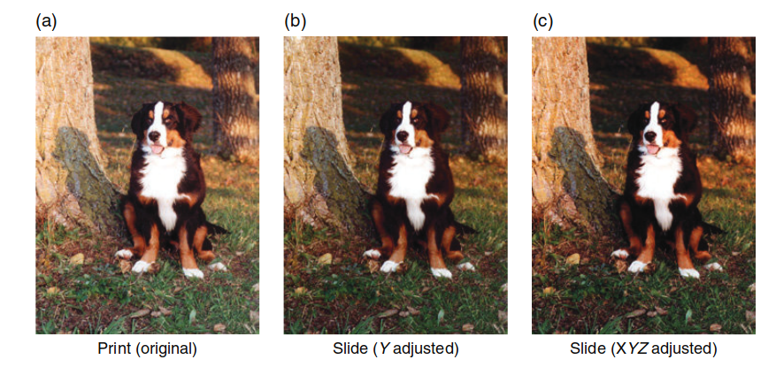
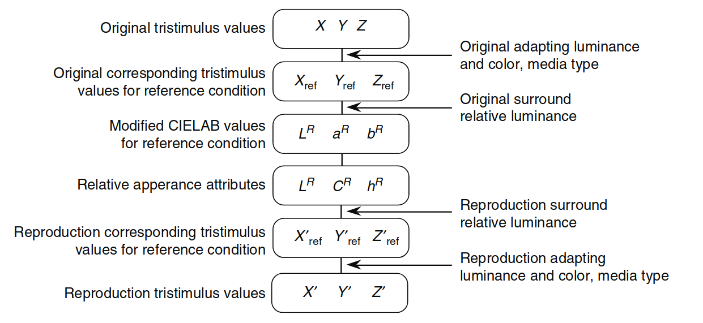

# RLAB 模型

本章完成了对一些最广泛使用的历史性（CIE模型之前）色彩外观模型的讨论，并介绍了RLAB模型。虽然前几章中讨论的Hunt模型和Nayatani等模型是为了预测广泛观看条件下色彩外观的所有感知属性，但RLAB模型则是基于其他考虑而设计的。RLAB模型的开发目的是创建一个简单的色彩外观模型，能够预测实际应用中最重要的外观现象。RLAB的目标应用是跨媒体图像再现，并且已在此类情境中得到了有效的应用。

---

## 13.1 目标与方法

RLAB色彩外观模型源自于色度适应研究（Fairchild 1990）、色度适应建模（Fairchild 1991a,b）、CIE基础色度学（CIE 1986），以及跨媒体图像再现的实际应用（Fairchild 1994b, Fairchild 和 Berns 1993）。RLAB的起点是CIELAB色彩空间。虽然CIELAB可以作为一个近似的色彩外观模型，但它有显著的局限性，包括不准确的色度适应变换、没有亮度级别依赖性、没有背景依赖性，以及没有区分何时发生“消光”现象。尽管CIELAB作为色彩外观模型还有其他限制，但这些局限性在许多实际应用中尤为重要。因此，RLAB旨在基于CIELAB的优点，通过增加新的功能来解决其限制。

值得注意的是，Richter（1980）采取了类似的方法，修改和改进了CIELAB和CIELUV色彩空间，以创建一个简单的外观模型。CIELAB为平均日光光源提供了较好的感知均匀性，这一点通过图13.1中的Munsell色相和色度的常数等高线展示。图13.1中绘制的等高线与使用任何其他色彩外观模型生成的结果一样好，甚至在某些情况下更好。然而，由于CIELAB的“错误von Kries”色度适应变换，当光源偏离平均日光时，CIELAB的感知均匀性迅速恶化。

RLAB的概念是利用CIELAB在日光下的良好间距和空间熟悉度，同时改善其对非日光光源的适用性。这是通过定义一组参考观看条件（光源D65，318 cd/m²，平均背景，消光）来实现的，在这些条件下使用CIELAB空间，并通过使用更准确的色度适应变换（Fairchild 1991b, 1994b, 1996）来确定测试观看条件和参考观看条件之间的对应颜色。测试三刺激值首先被转换为参考观看条件下的对应颜色，然后使用修改后的CIELAB空间来描述外观相关的属性。这个概念可以应用于任何所需的色度适应变换，如基于CIECAM02的CAT02变换。

此外，CIELAB空间的压缩非线性（立方根）被适应为一个周围相对亮度的函数。这使得可以预测随着背景变暗而导致的感知图像对比度的降低，这一点在Bartleson（1975）的研究中有所建议。改进的色度适应变换和背景依赖性增强了CIELAB在图像再现中最关键的两个领域。

RLAB被设计为仅包括相对色彩外观属性的预测因子。因此，它可以用来计算明度、色彩度、饱和度和色相的相关属性，但不能用于预测亮度或色彩感知度。这一限制的设定是为了使模型尽可能简洁，并且因为在大多数图像再现应用中，亮度和色彩感知度的预测并不重要。

由于RLAB基于CIELAB空间，除了熟悉度外，还具有额外的好处。由于RLAB间距本质上与CIELAB间距相同，因此可以使用色差公式，如CIELAB * ab E ∆（CIE 1986）、CMC（Clark等，1984）和CIE94（CIE 1995b），并获得与在平均日光光源下使用CIELAB单独计算时相似的结果。本章中详细描述了RLAB模型的内容，参见Fairchild（1996）。

---

**图13.1** 显示了在CIELAB/ RLAB色彩空间中绘制的Munsell色相和色度的常数等高线：  

- (a) 值为3时的常数色相和色度等高线
- (b) 值为5时的常数色相和色度等高线
- (c) 值为7时的常数色相和色度等高线

  

  图 13.1：在CIELAB/ RLAB色彩空间中绘制的Munsell色相和色度的常数等高线：  
  (a) 值为3时的常数色相和色度等高线，(b) 值为5时的常数色相和色度等高线，(c) 值为7时的常数色相和色度等高线。

---

## 13.2 输入数据

RLAB模型的输入数据包括测试刺激的相对三刺激值（XYZ）和白点（XnYnZn）的相对三刺激值、场景中白色物体的绝对亮度（以cd/m²为单位）、周围的相对亮度（暗、昏暗、平均），以及是否进行“消光”处理的决策。周围的相对亮度通常被认为对于反射印刷品为平均，对于自发光显示器或电视为昏暗，对于投影透明片为暗，假设这些媒介在其典型的环境下被观看。周围亮度并不直接与媒介绑定，因此确实有可能在暗背景下观看反射印刷品，在平均背景下观看投影透明片。

“消光”假定发生在物体颜色刺激（如印刷品）中，而不会发生在自发光显示器（如CRT）中。在某些情况下，如观看投影透明片时，可能会发生“消光”的中间级别。

---
## 13.3 适应模型

以下方程描述了RLAB中内置的色度适应模型。该模型基于Fairchild（1991b）描述的未完全色度适应模型，并在后期进行了修改（Fairchild 1994b, 1996）。这一转换过程也在第9章讨论。首先从CIE三刺激值（Y = 100表示白色）转换为基本三刺激值，如方程13.1和13.2所示。所有的CIE三刺激值通常是使用CIE 1931标准色度观察者（2°）计算的。适应刺激的三刺激值也必须进行类似的转换。

  

    $$
    L = X, \quad M = Y, \quad S = Z \tag{13.1}
    $$
  

  

    $$
    L = 0.3897X + 0.6890Y + 0.0787Z \\
    M = 0.2298X + 1.1834Y + 0.0464Z \\
    S = 0.0X + 0.0Y + 1.0000Z \tag{13.2}
    $$
  

接下来是计算A矩阵，A矩阵用于建模色度适应转换。

  

    $$
    A = 
    \begin{pmatrix}
      a & a & a \\
      a & a & a \\
      a & a & a \\
    \end{pmatrix} \tag{13.3}
    $$
  

A矩阵代表了von Kries适应系数，这些系数会应用到测试刺激的锥体响应（LMS）。von Kries类型的系数通过方程13.4到13.12来计算。

---

**公式描述：**

  

    $$
    L_{n} = (1.0 + p_D) \cdot a_L - p_D \cdot a_L \tag{13.4}
    $$
  

  

    $$
    M_{n} = (1.0 + p_D) \cdot a_M - p_D \cdot a_M \tag{13.5}
    $$
  

  

    $$
    S_{n} = (1.0 + p_D) \cdot a_S - p_D \cdot a_S \tag{13.6}
    $$
  

`p_D`项描述了完全von Kries适应的比例。通过以下公式进行计算，预测随着亮度级别增加，色度适应更加完整，随着适应刺激颜色与等能光源的偏离，适应程度会减少。

---

  

    $$
    p_L = \frac{(1.0 + Y^{1/3} + l_E)}{(1.0 + Y_n^{1/3} + 1.0 / l_E)} \tag{13.7}
    $$
  

  

    $$
    p_M = \frac{(1.0 + Y^{1/3} + m_E)}{(1.0 + Y_n^{1/3} + 1.0 / m_E)} \tag{13.8}
    $$
  

  

    $$
    p_S = \frac{(1.0 + Y^{1/3} + s_E)}{(1.0 + Y_n^{1/3} + 1.0 / s_E)} \tag{13.9}
    $$
  

接下来的公式描述了`l_E`、`m_E`、`s_E`的计算。

  

    $$
    l_E = 3.0L_n / (L_n + M_n + S_n) \tag{13.10}
    $$
  

  

    $$
    m_E = 3.0M_n / (L_n + M_n + S_n) \tag{13.11}
    $$
  

  

    $$
    s_E = 3.0S_n / (L_n + M_n + S_n) \tag{13.12}
    $$
  

**R矩阵**表示参考观看条件（M*A-1）矩阵的逆，并包括归一化处理，如下所述，它是恒定的，因此可以预先计算。方程13.13代表了修改后的von Kries色度适应变换，能够将测试刺激的三刺激值转换为在RLAB参考观看条件下的对应颜色。

  

    $$
    \begin{pmatrix}
      X_{ref} \\
      Y_{ref} \\
      Z_{ref}
    \end{pmatrix}
    = 
    \begin{pmatrix}
      1.9569 & -1.1882 & 0.2313 \\
      0.3612 & 0.6388 & 0.0 \\
      0.0 & 0.0 & 1.0000
    \end{pmatrix}
    \begin{pmatrix}
      X \\
      Y \\
      Z
    \end{pmatrix}
    \tag{13.13}
    $$
  

**R矩阵**的表示：

  

    $$
    R = 
    \begin{pmatrix}
      1.9569 & -1.1882 & 0.2313 \\
      0.3612 & 0.6388 & 0.0 \\
      0.0 & 0.0 & 1.0000
    \end{pmatrix} \tag{13.14}
    $$
  

这是R矩阵的表示，它代表了逆M和A矩阵的运算，用于参考观看条件的逆变换。该矩阵用于色度适应转换，可以将测试三刺激值转换为参考条件下的相应颜色。

---
## 13.4 对抗色维度

在RLAB中，对抗型响应通过方程13.15到13.17进行计算。

  

    $$
    \sigma_{RL} = \frac{(1.0 + Y_n^{1/3} + \ell_E)}{(1.0 + Y_n^{1/3} + 1.0 / \ell_E)} \tag{13.15}
    $$
  

  

    $$
    \sigma_{Ra} = 430 \left( \frac{(Y_{ref} - Y_n)}{\sigma_{ref}} \right) \tag{13.16}
    $$
  

  

    $$
    \sigma_{Rb} = 170 \left( \frac{(Y_{ref} - Y_n)}{\sigma_{ref}} \right) \tag{13.17}
    $$
  

LR 代表的是类比于 CIELAB 的 L* 的无色响应。红绿色的色度响应由 aR 给出（类比于 CIELAB 的 a*），而黄色和蓝色的色度响应由 bR 给出（类比于 CIELAB 的 b*）。需要记住，对于参考观看条件，RLAB 坐标几乎与 CIELAB 坐标完全相同。它们不完全相同，因为方程13.15到13.17已经从 CIELAB 方程中简化，以提高计算效率。CIELAB 的条件压缩非线性（即，低三刺激值的不同函数）已被简单的幂函数所取代。这导致了幂指数和缩放因子略有不同于 CIELAB 方程。Fairchild（1996）提供了关于这些差异的更多细节。

还需要注意的是，CIELAB 方程中包含的通过白点的三刺激值的除法在方程13.15到13.17中缺失。这是因为这些归一化在 RLAB 模型中是常数，并且已经内置在方程13.14中给出的 R 矩阵中。方程13.15到13.17中的幂指数会根据背景的相对亮度而有所不同。对于平均背景，s = 1/2.3；对于昏暗背景，s = 1/2.9；对于暗背景，s = 1/3.5。这些幂指数的比率完全符合 Bartleson（1975）和 Hunt（1995）关于图像再现的对比度变化的建议。关于幂指数的更多细节可以在 Fairchild（1995b）中找到。

作为名义上的定义，暗背景被认为几乎是零亮度，昏暗背景被认为是图像中白色亮度的不到 20%，而平均背景被认为是图像白色亮度的 20% 或更多。由于不同的图像观看条件所需的对比度变化的精确性质和幅度仍然是研究和讨论的主题，因此最好灵活使用这些参数。在某些应用中，可能希望使用中间值来模拟背景相对亮度变化较小的情况。这只需要在 RLAB 方程中进行代换，因为它们不包括 CIELAB 方程中存在的条件函数。

此外，可能希望对明度（LR）维度使用与对红绿（aR）和黄蓝（bR）色度维度不同的幂指数。这也可以轻松实现。方程已经被设计为简单的幂函数，以便鼓励使用不同的幂指数，这对于特定实际观看条件可能更为合适。

**图 13.2** 展示了改变幂指数的效果。左图（a）是典型的打印图像。其他两幅图像（b 和 c）展示了如果图像在暗背景下观看，需要调整的对比度。请注意，在暗背景下观看时，需要增加对比度。在中间图像（b）中，仅对明度对比度进行了调整。在右图（c）中，背景补偿同时应用于明度和色度。右图（c）类似于简单的摄影系统中产生的再现（因为所有三个胶片层的对比度必须一起变化），通常是更理想的。然而，现实胶片中的图像间效应可以用于补偿对比度变化带来的饱和度增加（数字系统中的矩阵操作也可以做到这一点）。图13.2中的图像应仅用于判断调整的相对影响，因为它们并未在适当的观看条件下查看。

  

  图 13.2：展示由于背景相对亮度变化引起的外观差异所需的对比度变化。 (a) 原始打印图像。 (b) 在暗背景下观看的图像，仅调整明度对比度。 (c) 在暗背景下观看的图像，调整了明度和色度对比度。

---

## 13.5 明度

RLAB模型中与明度相关的参数是LR，见方程13.15。无需进一步的计算。

  

    $$
    \sigma_{RL} = \frac{(1.0 + Y_n^{1/3} + \ell_E)}{(1.0 + Y_n^{1/3} + 1.0 / \ell_E)} \tag{13.15}
    $$
  

---

## 13.6 色相

在RLAB空间中，色相角（hR）的计算与CIELAB使用相同的程序。与CIELAB一样，hR以度为单位表示，范围从0到360，测量自正aR轴，按照方程13.18计算。

  

    $$
    h_R = \tan^{-1} \left( \frac{R_a}{R_b} \right) \tag{13.18}
    $$
  

色相组成可以通过类似于Hunt模型和Nayatani等模型的方法在RLAB中确定。这在通过幅度估计数据测试色彩外观模型时非常有用，且在需要再现某个指定色相时也很有用。色相组成（HR）可以通过线性插值表13.1中的值来计算。这些值是基于瑞典NCS的符号，并且在**图13.3**中进行了说明。**图13.3** 是一个有用的可视化工具，展示了独特色相的轨迹，因为它们并不与色彩空间的主轴对应。独特色相的位置与CIELAB空间下的参考条件下的位置相同。表13.1中的示例色相组成值以斜体列出。

---

**表13.1** 色相角与色相组成的转换数据

| hR  | R     | B    | G     | Y     | HR    |
| --- | ----- | ---- | ----- | ----- | ----- |
| 24  | 100   | 0    | 0     | 0     | R     |
| 90  | 0     | 0    | 0     | 100   | Y     |
| 162 | 0     | 0    | 100   | 0     | G     |
| 180 | 0     | 21.4 | 78.6  | 0     | B79G  |
| 246 | 0     | 100  | 0     | 0     | B     |
| 270 | 17.4  | 82.6 | 0     | 0     | R83B  |
| 0   | 82.6  | 17.4 | 0     | 0     | R17B  |
| 24  | 100   | 0    | 0     | 0     | R     |

---

请注意，表格13.1中的色相组成值为斜体字，表示这些值基于瑞典NCS符号进行插值。**图13.3** 提供了一个有用的可视化效果，展示了独特色相的轨迹，它们不对应于色彩空间的主轴。

---

## 13.7 色度

RLAB色度（CR）与CIELAB色度的计算方式相同，如方程13.19所示。

  

    $$
    C_R = \sqrt{a_R^2 + b_R^2} \tag{13.19}
    $$
  

---

## 13.8 饱和度

在某些应用中，例如色域映射所需的图像颜色操作，可能希望沿着恒定饱和度的线进行颜色变化，而不是沿着恒定色度的线进行变化。Wolski等人（1994）提出了这种技术，Montag和Fairchild（1996, 1997）也描述了这种情况。饱和度定义为相对于亮度的色彩饱和度，色度定义为相对于白色亮度的色彩饱和度，明度定义为相对于白色亮度的亮度。因此，饱和度可以定义为色度相对于明度。色度（CR）和明度（LR）在RLAB中已被定义，因此饱和度（sR）按方程13.20定义。

  

    $$
    s_R = \frac{C_R}{L_R} \tag{13.20}
    $$
  

值得注意的是，沿着恒定饱和度的线的变化是观察到的颜色序列，当物体在越来越深的阴影中被观察时。也许这就是为什么在色域映射应用中，有时沿着恒定饱和度的线而不是色度线进行转换是有用的原因。

---
## 13.9 逆模型

由于RLAB模型是为图像再现应用设计的，因此计算效率和简单的逆变换被认为非常重要。因此，RLAB模型非常容易进行逆变换，并且只需要最少的计算。以下是实现RLAB模型的逐步过程。

**步骤 1**：获取测试和适应刺激的色度数据以及适应刺激的绝对亮度。决定消光因子和幂指数（基于背景相对亮度）。

  

  图 13.4：RLAB模型应用于图像再现应用的流程图。

**步骤 2**：计算色度适应矩阵A。  
**步骤 3**：计算参考三刺激值。  
**步骤 4**：计算RLAB参数，LR、aR和bR。  
**步骤 5**：使用aR和bR计算CR和hR。  
**步骤 6**：使用hR确定HR。  
**步骤 7**：使用CR和LR计算sR。

在典型的颜色再现应用中，仅仅知道图像元素的外观是不够的；还需要在第二组观看条件下再现这些外观，如图13.4所示。为了实现这一点，必须能够从外观参数LR、aRbR和新的观看条件定义中计算出CIE三刺激值XYZ。这些三刺激值随后与成像设备的特性一起使用，以确定设备的颜色信号，如RGB或CMYK。

以下方程概述了如何从RLAB的LR、aR、bR计算CIE三刺激值。如果从LR、CR、hR开始，则必须先使用从圆柱坐标到矩形坐标的常规变换转换回LR、aR、bR。参考三刺激值通过使用方程13.21到13.23计算RLAB参数，并使用适当的幂指数s。

  

    $$
    Y_{ref} = \left( \frac{L_R}{100} \right)^{1/\sigma} \tag{13.21}
    $$
  

  

    $$
    X_{ref} = \left[ \left( \frac{a_R}{430} \right) + (Y_{ref})^\sigma \right]^{1/\sigma} \tag{13.22}
    $$
  

  

    $$
    Z_{ref} = \left[ (Y_{ref})^\sigma - \left( \frac{b_R}{170} \right)^\sigma \right]^{1/\sigma} \tag{13.23}
    $$
  

参考三刺激值随后通过使用方程13.24与为第二组观看条件计算的A矩阵进行变换，得到第二组观看条件下的三刺激值。

  

    $$
    \begin{pmatrix}
      X \\
      Y \\
      Z
    \end{pmatrix}
    = 
    \left( \text{RAM}^{-1} \right) 
    \begin{pmatrix}
      X_{ref} \\
      Y_{ref} \\
      Z_{ref}
    \end{pmatrix} \tag{13.24}
    $$
  

---
## 13.10 预测的现象

RLAB模型仅提供相对颜色外观属性的相关参数（明度、色度、饱和度和色相）。它不能用于预测亮度和色彩丰富度。对于图像再现应用而言，这一限制几乎没有实际意义，因为在大多数应用中，亮度和色彩丰富度并不需要。RLAB包括一个色度适应变换，具有消光因子参数，并预测对某些刺激的未完全色度适应（例如，RLAB正确预测了D50白点的CRT显示器会保留黄色外观）。它还包括可变指数s，这些指数调节图像对比度，作为背景相对亮度的函数。这些是跨媒体图像再现应用中最重要的颜色外观现象。

如果需要预测绝对的外观属性（即亮度和色彩丰富度）或更多不寻常的外观现象，那么应考虑使用更广泛的外观模型，如前面章节中描述的Nayatani等人和Hunt模型。

**表13.2** 中给出了RLAB颜色外观模型的示例计算。

---

## 13.10 预测的现象

RLAB模型仅提供相对颜色外观属性的相关参数（明度、色度、饱和度和色相）。它不能用于预测亮度和色彩丰富度。对于图像再现应用而言，这一限制几乎没有实际意义，因为在大多数应用中，亮度和色彩丰富度并不需要。RLAB包括一个色度适应变换，具有消光因子参数，并预测对某些刺激的未完全色度适应（例如，RLAB正确预测了D50白点的CRT显示器会保留黄色外观）。它还包括可变指数s，这些指数调节图像对比度，作为背景相对亮度的函数。这些是跨媒体图像再现应用中最重要的颜色外观现象。

如果需要预测绝对的外观属性（即亮度和色彩丰富度）或更多不寻常的外观现象，那么应考虑使用更广泛的外观模型，如前面章节中描述的Nayatani等人和Hunt模型。

**表13.2** 中给出了RLAB颜色外观模型的示例计算。

---

**表13.2** RLAB颜色外观模型计算示例

| Quantity             | Case 1 | Case 2 | Case 3 | Case 4 |
|----------------------|--------|--------|--------|--------|
| X                    | 19.01  | 57.06  | 3.53   | 19.01  |
| Y                    | 20.00  | 43.06  | 6.56   | 20.00  |
| Z                    | 21.78  | 31.96  | 2.14   | 21.78  |
| Xₙ                   | 95.05  | 95.05  | 109.85 | 109.85 |
| Yₙ                   | 100.00 | 100.00 | 100.00 | 100.00 |
| Zₙ                   | 108.88 | 108.88 | 35.58  | 35.58  |
| σ (cd/m²)            | 0.43   | 0.43   | 0.43   | 0.43   |
| D                    | 1.0    | 1.0    | 1.0    | 1.0    |
| LR                   | 49.67  | 69.33  | 30.78  | 49.83  |
| aR                   | 0.00   | 46.33  | -40.96 | 15.57  |
| bR                   | -0.01  | 46.33  | -40.96 | -52.61 |
| hR                   | 270.0  | 21.3   | 176.9  | 286.5  |
| HR                   | R83B   | R2B    | B74G   | R7B1B  |
| CR                   | 0.01   | 49.74  | 41.02  | 54.87  |
| sR                   | 0.00   | 0.72   | 1.33   | 1.10   |

---

此表格展示了不同情况（Case 1 到 Case 4）下，RLAB模型计算的不同颜色外观属性（如X、Y、Z、LR、aR、bR、hR、HR、CR和sR）的示例。每一列代表一个不同的场景或条件下的颜色外观参数。

