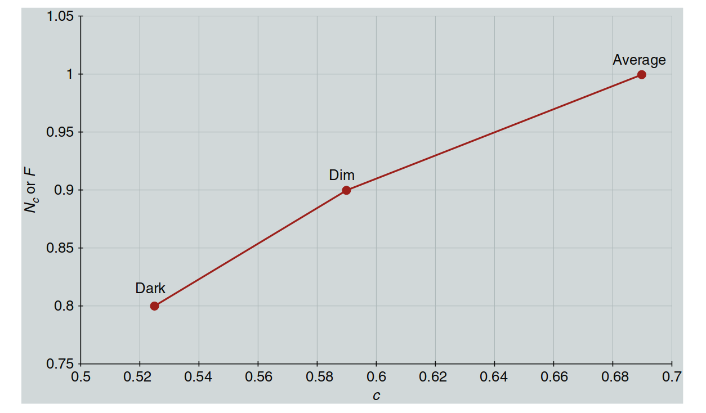
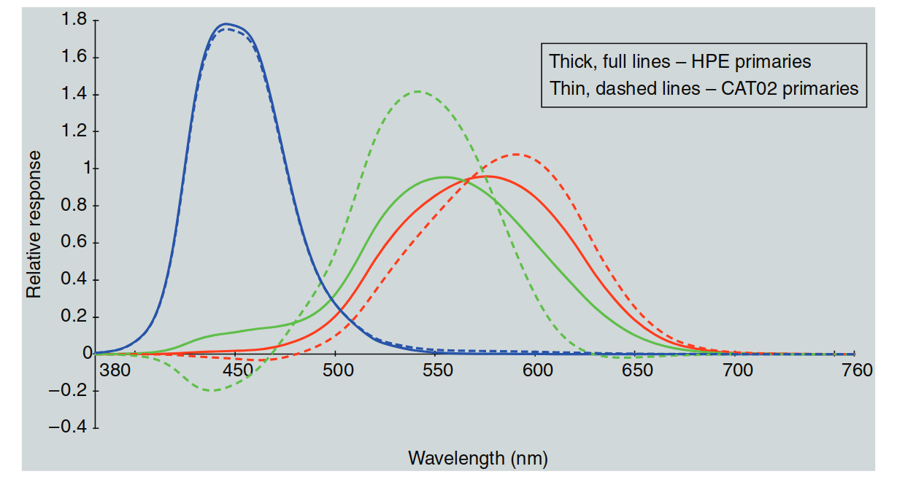

# 16 CIECAM02

CIECAM97s 是一个巨大的成功。如果是这样，为什么还需要 CIECAM02 模型呢？答案是，色貌模型的自然发展是通过发布 CIECAM97s 予以预期并鼓励的。这正是名称中包含“97”年份的原因。CIECAM97s 的成功在于，它使色貌领域的各种研究人员和从业人员能够将精力集中在一个单一模型上。这一集中关注很快导致了对 CIECAM97s 的改进建议，并最终促成了一个更简洁、更有效的模型——CIECAM02（CIE 2004a）的制定。本章讨论了 CIECAM02 的推导和公式化，这是当前的 CIE 色貌模型——一个可能在未来一段时间内继续作为 CIE 推荐的模型。Luo（2012）简要概述了 CIECAM97s、CIECAM02 以及最近提出的改进，这与本章的内容相呼应。此外，Hunt 和 Pointer（2011）在第15至17章中提供了对 CIECAM02 及其可能扩展的优秀概述。

---
## 16.1 目标与方法

CIECAM97s 发布后，受到的严格审查导致了对其改进的建议，并且在某些情况下，还对某些元素提出了简单的修正建议。随着 CIE 第八分会——影像技术分会的成立，成立了其第一个技术委员会，即 CIE TC8-01（色貌建模与色彩管理系统），该委员会由 Nathan Moroney 主席领导，负责提出对 CIECAM97s 的修订建议，甚至可能提出一个新的 CIE 模型。TC8-01 的工作最终形成并发布了修订版色貌模型——CIECAM02（CIE 2004a，Moroney 等 2002）。需要注意的是，CIECAM02 的名称末尾没有 "s" 字母。这是因为并没有意图创建一个全面版本（尤其是因为 CIECAM97c 从未创建），即使创建了，也可以在其名称末尾加上 "c"。

针对 CIECAM97s 提出的若干潜在改进建议被汇总为 TC8-01 名义下的单一出版物，由 Fairchild（2001）编写。考虑并最终以某种形式纳入 CIECAM02 的调整包括：

- 色度适应变换的线性化，以简化模型并促进解析逆转（Finlayson 和 Drew 1999，Finlayson 和 Süsstrunk 2000，Li 等 2000a,b）
- 异常的环境补偿的修正（Li 等 1999，2000a，Moroney 1998）
- 完美黑色刺激的明度刻度修正（Li 等 1999，2000a，Moroney 1998）
- 低色度颜色的色度刻度扩展修正（Newman 和 Pirrotta 2000，Wyble 和 Fairchild 2000）
- 连续可变的环境补偿的加入（Fairchild 1995b，1996）
- 改进的响应压缩函数，以促进改进的饱和度相关性（Hunt 等 2003）

在对所有建议的修订进行充分考虑后，TC8-01 汇集出一组新的方程式，并制定了修订版模型，命名为 CIECAM02（CIE 2004a，Moroney 等 2002）。名称中的年份保留，是为了表明色貌心理物理学和建模领域仍有很多需要学习的地方。简而言之，CIECAM02 在公式上更简洁，易于逆转，并且在所有可用数据集上与 CIECAM97s 的表现相当，甚至更好。CIECAM02 应该用于所有先前由 CIECAM97s 成功应用的领域，事实上，现在可以安全地说，CIECAM02 被广泛使用，而 CIECAM97s 很少再被提及。以下章节将描述 CIECAM02 的公式化和使用。

---
## 16.2 输入数据

CIECAM02 的输入数据包括测试刺激（XYZ）和白点（XwYwZw）的相对三刺激值，适应亮度（通常取场景中白色物体亮度的20%），$L_A$（单位为 cd/m²），周围环境的相对亮度（黑暗、昏暗、平均），以及是否考虑光源抑制（discounting-the-illuminant）。周围环境的相对亮度通常对于反射打印件取为平均值，对于 CRT 显示器或电视取为昏暗值，对于投影透明片则取为黑暗值，假设这些媒介是在其典型环境中观看的。周围环境并不直接与媒介相关。因此，完全有可能在黑暗环境中观看反射打印件，在平均环境中观看投影透明片。

  

  图 16.1：用于计算 CIECAM02 中间连续变量 surround 设置的 surround 参数之间的线性关系。

通常假设物体颜色刺激（如打印件）会考虑光源抑制，而发光显示器（如 CRT）则不考虑光源抑制。当光源抑制发生时，色度适应模型中的 D 因子设置为 1.0。否则，根据 16.3 节中的描述计算 D 因子。一旦确定了周围环境的相对亮度，就可以使用表 16.1 来设置 $c$、指数非线性、$N_c$（色度诱导因子）和 $F$（适应最大程度）的值。在 CIECAM02 中，这些参数允许使用中间值。如果需要中间值，正确的做法是选择 $c$ 的中间值，然后通过线性插值计算对应的 $N_c$ 和 $F$ 中间值，如图 16.1 中的关系所示。这些值已经稍微修正，并且条件数量已经减少为更有意义且更简单的一组。

---

**表 16.1 CIECAM02 模型的输入参数**

| 观察条件          | c    | Nc   | F    |
|-------------------|------|------|------|
| 平均环境          | 0.69 | 1.0  | 1.0  |
| 昏暗环境          | 0.59 | 0.9  | 0.9  |
| 黑暗环境          | 0.525| 0.8  | 0.8  |

---

## 16.3 适应模型

CIECAM02 的一个重要变化是使用了线性冯·克里斯（von Kries）类型的色度适应变换（详细描述见第9章）。这使得模型变得更简单，且性能相当（Calabria 和 Fairchild 2001），并且允许对 CIECAM02 进行简单的解析逆转（这是相较于 CIECAM97s 的另一个重大改进）。首先，需要将 CIE 三刺激值（大约在 0 到 100 之间缩放，而不是 0 到 1.0）转换为基于优化变换矩阵 $M_{CAT02}$ 的 RGB 响应，如公式 16.1 和 16.2 所示。所有 CIE 三刺激值通常是使用 CIE 1931 标准色度观察者（2°）计算的。此外，必须对适应刺激的三刺激值进行相同的转换。

  

    $$
    \begin{bmatrix}
    R \\
    G \\
    B
    \end{bmatrix} = M_{CAT02} \begin{bmatrix}
    X \\
    Y \\
    Z
    \end{bmatrix}
    \tag{16.1}
    $$
  

  

    $$
    M_{CAT02} = \begin{bmatrix}
    0.7328 & 0.4296 & -0.1624 \\
    -0.7036 & 1.6975 & 0.0061 \\
    0.0030 & 0.0136 & 0.9834
    \end{bmatrix}
    \tag{16.2}
    $$
  

色度适应的 D 因子是根据适应亮度 $L_A$ 和周围环境 $F$ 计算的，如公式 16.3 所示。如果假设光源抑制（discounting-the-illuminant），则 D 值设置为 1.0。理论上，D 的范围是从 1.0（完全适应）到 0.0（不适应）。作为实际限制，它很少低于 0.6。

  

    $$
    D = F \left[ 1 - \frac{1}{3.6} \right] e^{-(L_A + 42) / 92}
    \tag{16.3}
    $$
  

一旦确定了 D 值，测试刺激的三刺激值就可以转换为适应后的三刺激值 $R_c$、$G_c$ 和 $B_c$，这些表示参考条件下的相应颜色。公式 16.4 到 16.6 计算了这些转换。

  

    $$
    R_c = \left[ 100 \left( \frac{D}{R_w} \right) + (1 - D) \right] R
    \tag{16.4}
    $$
  

  

    $$
    G_c = \left[ 100 \left( \frac{D}{G_w} \right) + (1 - D) \right] G
    \tag{16.5}
    $$
  

  

    $$
    B_c = \left[ 100 \left( \frac{D}{B_w} \right) + (1 - D) \right] B
    \tag{16.6}
    $$
  

---

**关于 CIECAM02 色度适应变换的说明**

公式 16.4 至 16.6 表示了 CIECAM02 色度适应变换的最一般形式，即作为简单的冯·克里斯变换，将其转换为隐式等能量参考条件并考虑不完全适应。这个变换可以独立于 CIECAM02 模型的其余部分一致使用。无论初始三刺激值的缩放（如 CIECAM02 中常见的 0 到约 100，或有时使用的 0 到约 1.0）如何，它也可以应用于所有情况。为了最大化通用性并减少适应变换功能的混乱，建议在所有 CIECAM02 的应用中使用公式 16.4 到 16.6。然而，CIE（2004a）关于 CIECAM02 的技术报告提供了略有不同的默认公式，如公式 16.4a 到 16.6a 所示。

由于 $Y_W$，即白色的 Y 三刺激值，通常为 100，因此两组公式通常是不可区分的。然而，在某些情况下，使用不同于 100 的 $Y_W$ 值，比如当考虑纸张而非 PRD 作为打印应用中的白色时。尽管看起来公式 16.4a 到 16.6a 中的 $Y_W$ 因子似乎能够解释所采用白色的变化，但它实际上并不具备这种作用。这种归一化已经内嵌在公式中，其中包括 $R_W$、$G_W$ 和 $B_W$。$Y_W$ 项并没有实质性的作用，且它是早期模型公式中的遗留问题（类似于 CIECAM97s 中的公式），在 CIE 技术报告发布之前并没有得到纠正。

这些方程式的差异对最终计算的色貌相关性影响不大，因为在后续公式中（如 CIECAM02 中的明度 $J$ 计算），色貌与白点的相对缩放已经完成。然而，公式 16.4a 到 16.6a 中的变换不能在没有其余 CIECAM02 模型的情况下使用。这样做会产生不一致的结果（例如，一个观察条件下的白色可能无法在第二个观察条件下映射到白色）。如果需要将适应变换从 CIECAM02 模型中单独使用，则必须使用公式 16.4 至 16.6 中的形式来确保一致的预测。此外，应该注意的是，公式 16.4a 到 16.6a 中的 $Y_W$ 因子并没有规范化三刺激值的缩放（实际上它会产生相反的效果），因此应该使用从 0 到大约 100 进行缩放的值作为 CIECAM02 的输入。

---

  

    $$
    R_c = \left[ \frac{Y_w}{R_w} D + (1 - D) \right] R
    \tag{16.4a}
    $$
  

  

    $$
    G_c = \left[ \frac{Y_w}{G_w} D + (1 - D) \right] G
    \tag{16.5a}
    $$
  

  

    $$
    B_c = \left[ \frac{Y_w}{B_w} D + (1 - D) \right] B
    \tag{16.6a}
    $$
  

---
## CIECAM02 适应模型的其余部分 (Remainder of CIECAM02 Adaptation Model)

接下来，计算一些依赖于观察条件的组件，这些组件是进一步计算所需的中间值。这些组件包括亮度级别适应因子 $F_L$，诱导因子 $N_{bb}$ 和 $N_{cb}$，以及基础指数非线性 $z$，它们都依赖于背景相对亮度 $Y_b$。这些因子是通过公式 16.7 到 16.11 进行计算的。

  

    $$
    k = \frac{1}{5L_A + 1}
    \tag{16.7}
    $$
  

  

    $$
    F_L = 0.2k^4 (5L_A) + 0.1(1-k^4)^2 (5L_A)^{1/3}
    \tag{16.8}
    $$
  

  

    $$
    n = \frac{Y_b}{Y_w}
    \tag{16.9}
    $$
  

  

    $$
    N_{bb} = N_{cb} = 0.725 \left( \frac{1}{n} \right)^{0.2}
    \tag{16.10}
    $$
  

  

    $$
    z = 1.48 + \sqrt{n}
    \tag{16.11}
    $$
  

为了应用适应后的非线性压缩，适应后的 RGB 响应首先必须从 $M_{CAT02}$ 规范转换到 Hunt–Pointer–Estevez 基本响应，这些基本响应更接近锥体响应。此变换由公式 16.12 到 16.14 表示，可以视为从 CAT02 RGB 系统转换回 CIE 三刺激值，再到锥体响应。这些相对光谱响应性如图 16.2 所示。

  

  图 16.2：MCAT02 原色（细虚线）和 Hunt–Pointer–Estevez 锥体基本响应（粗实线）的相对光谱响应性。

  

    $$
    \begin{bmatrix}
    R' \\
    G' \\
    B'
    \end{bmatrix} = M_{HPE} M_{CAT02}^{-1} \begin{bmatrix}
    R_c \\
    G_c \\
    B_c
    \end{bmatrix}
    \tag{16.12}
    $$
  

  

    $$
    M_{HPE} = \begin{bmatrix}
    0.38971 & 0.68898 & -0.07868 \\
    -0.22981 & 1.18340 & 0.04641 \\
    0.00000 & 0.00000 & 1.00000
    \end{bmatrix}
    \tag{16.13}
    $$
  

  

    $$
    M_{CAT02}^{-1} = \begin{bmatrix}
    1.096124 & -0.278869 & 0.182745 \\
    0.454369 & 0.473533 & 0.072098 \\
    -0.009628 & -0.005698 & 1.015326
    \end{bmatrix}
    \tag{16.14}
    $$
  

这些适应后的非线性压缩与 CIECAM97s 中的类似，但略微修改过，以产生一个简单的幂函数响应，并且具有更大的动态范围。这有助于模型中后续简单定义饱和度。这些非线性压缩通过公式 16.15 到 16.17 给出。

  

    $$
    R'_a = \frac{400 (F_L R' / 100)^{0.42}}{27.13 + (F_L R' / 100)^{0.42}} + 0.1
    \tag{16.15}
    $$
  

  

    $$
    G'_a = \frac{400 (F_L G' / 100)^{0.42}}{27.13 + (F_L G' / 100)^{0.42}} + 0.1
    \tag{16.16}
    $$
  

  

    $$
    B'_a = \frac{400 (F_L B' / 100)^{0.42}}{27.13 + (F_L B' / 100)^{0.42}} + 0.1
    \tag{16.17}
    $$
  

这些值随后用于创建对立色响应并计算色貌相关性。

---
## 16.4 对立色维度 (Opponent Color Dimensions)

CIECAM02 中的初步对立类型响应是通过公式 16.18 和 16.19 计算的。

  

    $$
    a = \frac{R'_a - 12 G'_a}{11} + \frac{B'_a}{11}
    \tag{16.18}
    $$
  

  

    $$
    b = \frac{1}{9} \left( R'_a + G'_a - 2 B'_a \right)
    \tag{16.19}
    $$
  

## 16.5 色调 (Hue)

色调角度 $h$ 在 CIECAM02 空间中使用与 CIELAB 相同的程序计算，如公式 16.20 所示。与 CIELAB 一样，$h$ 表示为从 0 到 360 度，计算方式是从正 $a$ 轴开始测量。

  

    $$
    h = \tan^{-1} \left( \frac{b}{a} \right)
    \tag{16.20}
    $$
  

接下来，计算偏心因子 $e_t$，该因子与 CIECAM97s 中的相似，如公式 16.21 所示。

  

    $$
    e_t = \frac{1}{4} \cos \left[ \left( h \frac{\pi}{180} + 2 \right) + 3.8 \right]
    \tag{16.21}
    $$
  

色调四分法和色调组成可以通过线性插值法从表 16.2 中给定的数据来确定，如公式 16.22 所示。

  

    $$
    H = H_i + \frac{100 (h - h_i)}{e_i} \div \frac{(h - h_i)}{e_i} + \frac{(h_{i+1} - h)}{e_{i+1}}
    \tag{16.22}
    $$
  

## 16.6 明度 (Lightness)

初始的无色响应是通过加权求和的非线性适应锥体响应并修正亮度诱导因子计算的，如公式 16.23 所示。类似的数量也必须针对白色进行计算，以便进行明度和亮度的计算。

  

    $$
    A = \left[ 2 R'_a + G'_a + \left( \frac{1}{20} \right) B'_a - 0.305 \right] N_{bb}
    \tag{16.23}
    $$
  

明度 $J$ 简单地根据公式 16.24 从无色响应 $A$、白色的无色响应 $A_w$、周围因子 $c$ 和基准指数 $z$ 计算。

  

    $$
    J = 100 \left( \frac{A}{A_w} \right)^{c_z}
    \tag{16.24}
    $$
  

## 16.7 亮度 (Brightness)

CIECAM02 与亮度相关的量 $Q$ 是根据明度 $J$、白色的无色响应 $A_w$、周围因子 $c$ 和亮度级适应因子 $F_L$ 来计算的，如公式 16.25 所示。

  

    $$
    Q = \left( \frac{4}{c} \right) \sqrt{\frac{J}{100} (A_w + 4) F_L^{0.25}}
    \tag{16.25}
    $$
  

## 16.8 色度 (Chroma)

一个临时的量 $t$，它与饱和度相关，并且包含了周围和背景的色度诱导因子（$N_c$ 和 $N_{cb}$），以及偏心调整因子 $e_t$，它作为色度、色彩鲜艳度和饱和度相关量的基础进行计算。公式 16.26 给出了 $t$ 的计算公式。

  

    $$
    t = \frac{50000}{13} N_c N_{cb} e_t \sqrt{a^2 + b^2}
    \tag{16.26}
    $$
  

CIECAM02 色度 $C$ 随后通过将 $t$ 的稍微非线性形式与明度 $J$ 的平方根相乘来计算，同时对背景 $n$ 进行某些调整，如公式 16.27 所示。

  

    $$
    C = t^{0.9} \sqrt{\frac{J}{100} (1.64 - 0.29n)^{0.73}}
    \tag{16.27}
    $$
  

## 16.9 色彩鲜艳度 (Colorfulness)

CIECAM02 中的色彩鲜艳度相关量 $M$ 是通过对色度预测量 $C$ 进行亮度级适应因子 $F_L$ 的四次方进行缩放来计算的，如公式 16.28 所示。

  

    $$
    M = C F_L^{0.25}
    \tag{16.28}
    $$
  

---
## 16.10 饱和度 (Saturation)

最后，CIECAM02 中定义的饱和度预测因子 $s$ 被定义为色彩鲜艳度与亮度的平方根，如公式 16.29 所示。这与 CIE 对刺激相对于亮度的色彩鲜艳度定义是相似的。

  

    $$
    s = 100 \sqrt{\frac{M}{Q}}
    \tag{16.29}
    $$
  

## 16.11 笛卡尔坐标 (Cartesian Coordinates)

与色貌模型相关的颜色空间通常以圆柱坐标的形式表示明度、色度和色调（$JCh$）或亮度、色彩鲜艳度和色调（$QMh$）。然而，在某些应用中，使用等效的笛卡尔坐标是有用的。虽然这只是一个简单的坐标变换，但它在 CIECAM97s 中从未明确定义。因此，CIECAM02 中的色度、色彩鲜艳度和饱和度维度的笛卡尔坐标如公式 16.30 到 16.35 所示。

  

    $$
    a_c = C \cos(h)
    \tag{16.30}
    $$
  

  

    $$
    b_c = C \sin(h)
    \tag{16.31}
    $$
  

  

    $$
    a_M = M \cos(h)
    \tag{16.32}
    $$
  

  

    $$
    b_M = M \sin(h)
    \tag{16.33}
    $$
  

  

    $$
    a_s = s \cos(h)
    \tag{16.34}
    $$
  

  

    $$
    b_s = s \sin(h)
    \tag{16.35}
    $$
  

## 16.12 反向模型 (Inverse Model)

特别是对于颜色重现应用，反向色貌模型具有实际意义。CIECAM02 相较于 CIECAM97s 在反向计算的简便性上有了显著改进。这主要得益于采用了简单的线性色度适应变换。此外，CIECAM02 的技术报告包含了关于模型反转的详细解释和工作实例（CIE 2004a）。以下是实施 CIECAM02 反向计算的逐步过程（从 $JCh$ 开始）。

1. 从 $C$ 和 $J$ 计算 $t$。
2. 从 $h$ 计算 $e_t$。
3. 从 $A_w$ 和 $J$ 计算 $A$。
4. 从 $t$、$e_t$、$h$ 和 $A$ 计算 $a$ 和 $b$。
5. 从 $A$、$a$ 和 $b$ 计算 $a'_R$、$a'_G$ 和 $a'_B$。
6. 使用反向非线性计算 $R'$、$G'$ 和 $B'$。
7. 通过线性变换转换为 $R_c$、$G_c$ 和 $B_c$。
8. 反转色度适应变换，计算 $R$、$G$ 和 $B$，然后计算 $X$、$Y$ 和 $Z$。
## 16.13 实施指南 (Implementation Guidelines)

CIECAM02 技术报告（CIE 2004a）的另一个改进特性是提供了更详细的模型实施指南。报告中提供了多个工作实例以及参数设置的示例。这些信息对于那些希望实施模型正向和反向计算的人来说非常有价值，而不仅仅是理解其公式的概念。

表 16.3 显示了报告中包含的一些典型参数设置示例。周围因子被认为是“平均”的，当周围白色的亮度大于场景或图像白色的 20% 时；当周围亮度小于 20% 时，周围因子被认为是“昏暗”的；如果周围基本没有亮度，则使用“暗”设置。

| 示例                               | 环境照明 (lux) (cd/m²) | 场景或设备白色亮度 (Lₐ, cd/m²) | 采纳的白点                  | 周围因子 |
|------------------------------------|------------------------|---------------------------------|-----------------------------|----------|
| 光照展台中的表面颜色评估           | 1000 (318.3)           | 318.30                         | 63.66                       | 光照展台白点 | 平均     |
| 家中查看自发光显示                 | 38 (12)                | 80                              | 16                          | 显示与环境白点之间 | 昏暗     |
| 暗室中查看幻灯片                   | 0 (0)                  | 150                             | 30                          | 投影仪白点与E点之间 | 暗       |
| 办公室查看自发光显示               | 500 (159.2)            | 80                              | 16                          | 显示白点与办公室照明之间 | 平均     |

---

## 16.14 预测的现象

CIECAM02可以预测CIECAM97s所能预测的所有现象。它包括所有典型外观属性（相对的和绝对的）的相关性，并且可以应用于各种亮度水平和色度适应状态下。像CIECAM97s一样，CIECAM02不适用于存在显著杆状视觉贡献的情况，或者在极高亮度下可能发生视网膜色素漂白的情况。可以认为CIECAM02是一个比CIECAM97s更简洁和更好的版本。

CIECAM02的示例计算如表16.4所示。

| Quantity | Case 1 | Case 2 | Case 3 | Case 4 |
|----------|--------|--------|--------|--------|
| X        | 19.01  | 57.06  | 3.53   | 19.01  |
| Y        | 20.00  | 43.06  | 6.56   | 20.00  |
| Z        | 21.78  | 31.96  | 2.14   | 21.78  |
| Xw       | 95.05  | 95.05  | 109.85 | 109.85 |
| Yw       | 100.00 | 100.00 | 100.00 | 100.00 |
| Zw       | 108.88 | 108.88 | 35.58  | 35.58  |
| Lₐ       | 318.31 | 31.83  | 318.31 | 31.83  |
| F        | 1.0    | 1.0    | 1.0    | 1.0    |
| D        | 0.994  | 0.875  | 0.994  | 0.875  |
| Yb       | 20.00  | 20.00  | 20.00  | 20.00  |
| Nc       | 1.0    | 1.0    | 1.0    | 1.0    |
| FL       | 1.17   | 0.54   | 1.17   | 0.54   |
| Nbb, Ncb | 1.0    | 1.0    | 1.0    | 1.0    |
| H        | 219.0  | 19.6   | 177.1  | 248.9  |
| Hc       | 278.1  | 399.6  | 220.4  | 305.8  |
| J        | 41.73  | 65.96  | 21.79  | 42.53  |
| Q        | 195.37 | 152.67 | 141.17 | 122.83 |
| S        | 2.36   | 52.25  | 58.79  | 60.22  |
| C        | 0.10   | 48.57  | 46.94  | 51.92  |
| M        | 0.11   | 41.67  | 48.80  | 44.54  |
| ac       | -0.08  | 45.77  | -46.89 | -18.69 |
| bc       | -0.08  | 16.26  | -48.74 | -16.03 |
| aM       | -0.08  | 39.27  | -48.74 | -16.03 |
| bM       | -0.07  | 13.95  | 2.43   | -21.67 |
| as       | -1.83  | 49.23  | -58.72 | -21.67 |
| bs       | -1.49  | 17.49  | 2.93   | -56.18 |

---

## 16.15 计算问题

在某些应用和不寻常的观察条件或刺激下，CIECAM02模型存在一些计算难题。这些应用包括计算颜色管理系统的颜色轮廓，这通常需要计算跨越所有物理可实现颜色范围的颜色外观，甚至超出该范围包括物理不可能的刺激（即具有负的CIE三刺激值的刺激）。在其他情况下，计算问题可能仅出现在选择非常饱和的适应光源或物理上非常接近光谱位置的真实刺激时，这些情况在典型情况下不常见。

最近，Hunt（2009）和Luo（2012）对这些挑战进行了总结，尽管模型的各个方面存在各种复杂性，最终的焦点集中在使用两个矩阵，一个用于适应变换，另一个用于颜色空间构建，以及其响应非线性函数接近0时的形式。对于那些对不同色度适应变换和模型的其他方面产生问题感兴趣的读者，已有大量文献（Brill 2006，Brill和Mahy 2013，Brill和Süsstrunk 2008，Li和Luo 2005，Li等人 2009，2012a-d，2013）可供参考。

最大的问题出现在CAT02矩阵上，经过其增强响应后，可以产生负的RGB值，这些值在通过适应变换和模型的其余部分时会引发问题。当发生此类负值时，还可能出现模型反转、除以0和非线性压缩函数通过零时出现无限斜率等问题（这虽然是一个计算问题，但在真实刺激下不应发生）。

这个问题已经由CIE TC8-11委员会（由Li主持）进行了研究，委员会尚未发布最终解决方案，但它可能会建议对CIECAM02进行修改，提供一个计算上更稳健的模型，尽管其准确性可能略低。这种修改模型很可能会作为CIECAM02的替代方案提出，而不是作为其替代品。该委员会的目标是拟合一个矩阵，能够同时替代CAT02适应矩阵和Hunt–Pointer–Estevez颜色空间（适应后矩阵），并且涵盖光谱位置，从而消除大多数问题，同时最大限度地提高准确性。简单地使用Hunt–Pointer–Estevez矩阵来适应以及用于颜色空间则不如准确。计划中的优化将是准确性与数学简便性之间的折衷。虽然这将消除大多数关于非线性函数在0点附近的无限斜率的问题，但它并没有完全消除该问题，因为一些用户需要处理非真实的刺激值来填充三维查找表。剩下的问题可以，也很可能会，通过在0附近的函数加上线性段来解决。

还需要注意的是，通过修改增强传感器响应，而不是回退到锥形响应（Vazquez-Corral等人 2012），可以在色貌预测方面取得一些进展，比如色调命名和取消效应。

---

## 16.16 CAM02-UCS  

在将色貌模型的色貌尺度与CIE DE2000方程等公式所典型的均匀色差预测结合起来的过程中，取得了一个有趣的成果。这是一个困难的任务，因为通常认为色貌尺度（属性的大间隔变化）与感知阈值变化附近和略高于阈值的较小间隔变化之间没有线性关系。这类努力的一个结果就是CAM02-UCS (Luo et al. 2006)。本质上，这一概念是通过调整色空间的色貌维度（在这里是CIECAM02），使其包括通常在色差方程中需要的加权函数。公式16.36和16.37显示了CIECAM02色度和色彩感知度的修改形式。公式16.38和16.39是简单的坐标变换，目的是将空间转换为矩形坐标以便简化色差计算，如公式16.40所示。这就是CAM02-UCS的核心内容。

CIE TC1-75（由Luo主持）正在审议提出一个同时包含色貌和色差的CIE模型的可能性。由于该项工作的进展仍然较早，尚无法预测结果。CAM02-UCS无疑是一种有用的方法，并且已在一些应用场合中使用。然而，它在色彩鲜艳度上使用的是色度属性，而非色差实验中通常使用的色度属性（这也许是一个简单的修改），需要注意的是，调整色貌尺度以适应色差会导致色貌预测的准确性降低。因此，虽然CAM02-UCS方法将两者融合在一个模型中，但并没有使用统一的尺度。

---

**数学公式解析**:

  

    $$
    J' = \frac{1.7J}{1 + 0.007J} \tag{16.36}
    $$
  

此公式表示CIECAM02的亮度（J'）的修正形式，J为原始的亮度值，修正项是基于J的非线性函数。

---

  

    $$
    M' = \frac{1}{0.0228} \log_{10}(1 + 0.0228M) \tag{16.37}
    $$
  

此公式表示色度（M'）的修正公式，M为原始色度值，通过对数变换来进行非线性调整。

---

  

    $$
    a'_M = M' \cos(h) \tag{16.38}
    $$
  

此公式表示修正后的红绿分量（$a'_M$），它是修正色度（M'）与色调角度（h）余弦值的乘积。

---

  

    $$
    b'_M = M' \sin(h) \tag{16.39}
    $$
  

此公式表示修正后的黄蓝分量（$b'_M$），它是修正色度（M'）与色调角度（h）正弦值的乘积。

---

  

    $$
    \Delta E' = \sqrt{\left( \Delta J'^{2} + \Delta a'_{M}^{2} + \Delta b'_{M}^{2} \right)} \tag{16.40}
    $$
  

> 译者注：这里平台有点bug，公式渲染不出来，待后续fix，读者暂时可参考原文

这是色差公式，表示两个色彩之间的差异（$\Delta E'$），通过计算亮度、色度分量的变化量（$\Delta J'$, $\Delta a'_M$, $\Delta b'_M$）的平方和的平方根来获得。

---

## 16.17 为什么不只使用CIECAM02？

如果一个人正在寻找一个国际公认的色貌模型，并且这个模型具有相对简单的公式，同时在2004年之前的任何类似模型中表现得一样好或更好，那么CIECAM02就是答案。没有科学理由偏好CIECAM97s于CIECAM02，并且CIECAM02在实际应用中更易于实现和使用。

在某些情况下，可能无法获得充分的观看条件知识和控制，以便充分利用CIECAM02。在这种情况下，简单的模型可能就足够了。通常，色貌模型的逻辑进程是从简单地使用CIELAB开始。如果发现CIELAB对于应用不足，则下一步逻辑是将CIELAB与更好的色度适应模型（如CAT02线性色度适应变换）结合使用。如果需要更多灵活性，可以选择稍微复杂一些的模型，如RLAB，或者将适应变换替换为CAT02变换的RLAB模型。然后，如果需要更复杂的模型，CIECAM02将是最佳选择。最后，如果CIECAM02不适用于给定的情况（例如需要预测杆状细胞贡献），则Hunt模型将是最全面的选择。

---

## 16.18 展望

CIECAM02代表了色貌模型的重大进步，尤其是在它的发布和CIECAM97s初步制定之间的六年中。CIECAM97s发布后，立即就注意到了其局限性，提出了改进的建议，并且成立了一个新的CIE委员会来建议改进。目前，没有类似的情况出现以替代CIECAM02。

看起来，CIECAM02与下一个CIE色貌模型之间的时间间隔将比六年长得多。一个原因是，这类模型似乎能在实验误差范围内预测现有的视觉数据。因此，在更精确（更准确）的实验数据变得可用之前，或者直到产生更大量的数据来改善平均反应的预测时，似乎没有改进的空间。收集此类数据的成本和难度，以及固有的观察者间差异，使得在可预见的未来获取显著改进的数据变得不太可能。相反，可能只会有细微的修改，或者CIECAM02的替代模型，在不久的将来得到CIE的批准。

尽管如此，确实有人对CIECAM02的改进、增强、修改或替代模型产生了兴趣。一个例子是Luo等人（2006）和CIE TC1-75在CAM02-UCS中的工作，它旨在将色差和色貌预测结合为一个模型，并且经常被使用。Kunkel和Reinhard（2009）发布了一个有趣的替代模型，这个模型在生理学上更为合理，并且在数学上更简单，同时能够做出几乎完全相同的色貌预测。这无疑是一个在未来CIE模型开发中应该注意的方法。Fu等人（2012）发布了视觉数据，并扩展了CIECAM02，以促进不相关颜色的外观处理。最后一个例子是Park等人（2013）提出的扩展，用于处理移动显示器上看到的视觉眩光。

色貌模型的未来发展预测似乎是朝着两个版本（CIE TC8-11）加上一个通用模型（CIE TC1-75）的方向发展。与此同时，许多色貌学领域的研究人员正在转向更复杂的观看情况，并推导出具有新功能的模型。这些功能包括计算预测空间和时间效应。在本书的第一版出版时，这些类型的模型还仅仅是被考虑的内容，但随着第二版的发布，它们已经变得更加现实。此类模型的概念和一个示例在第20章中有描述，也许这种模型将是未来色貌建模的发展方向。与此同时，CIECAM02可能会看到显著的实际应用。它是否被视为一种实用的成功，将会很有意思。

---
