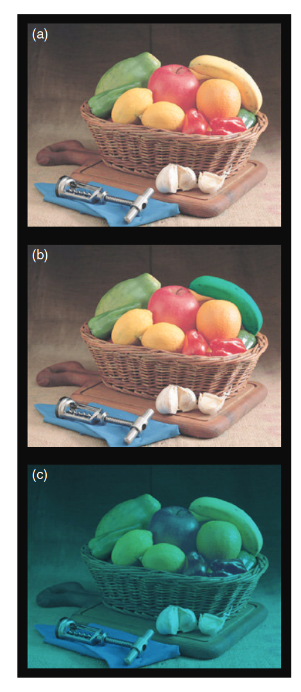
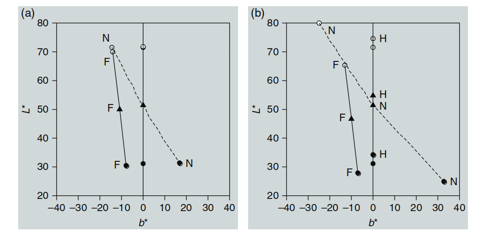
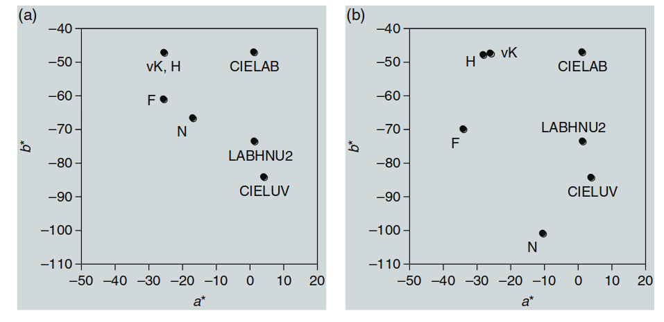
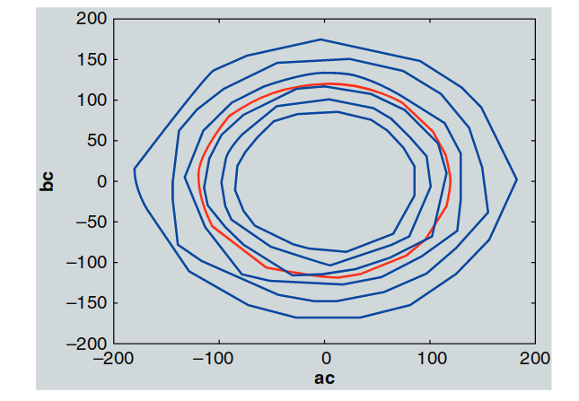
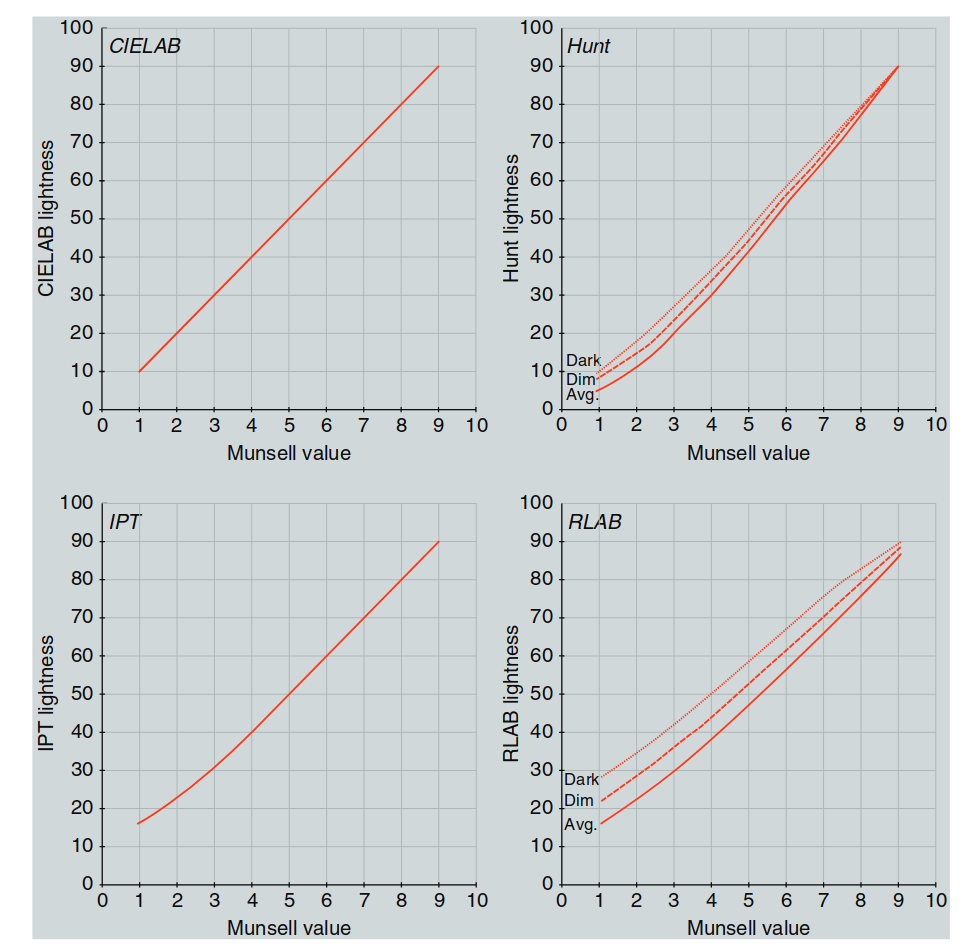
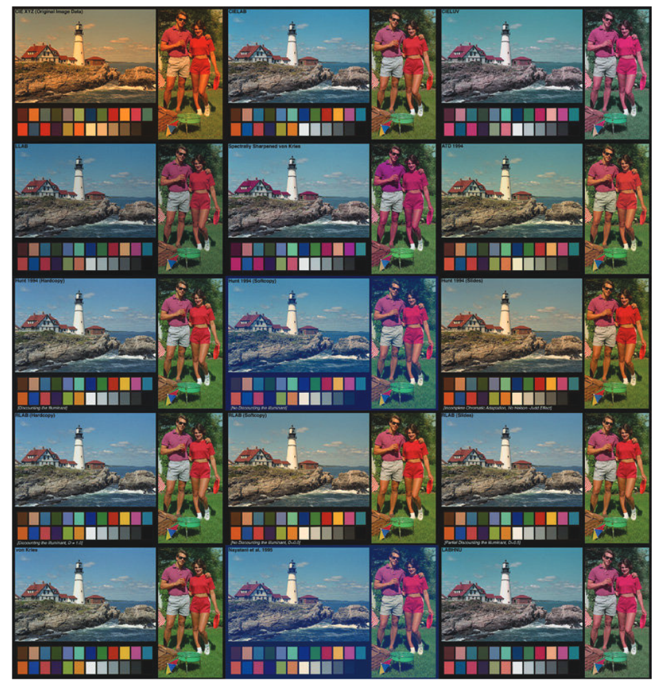
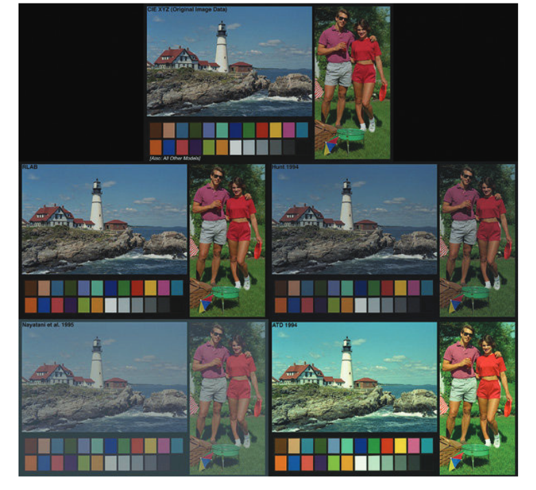
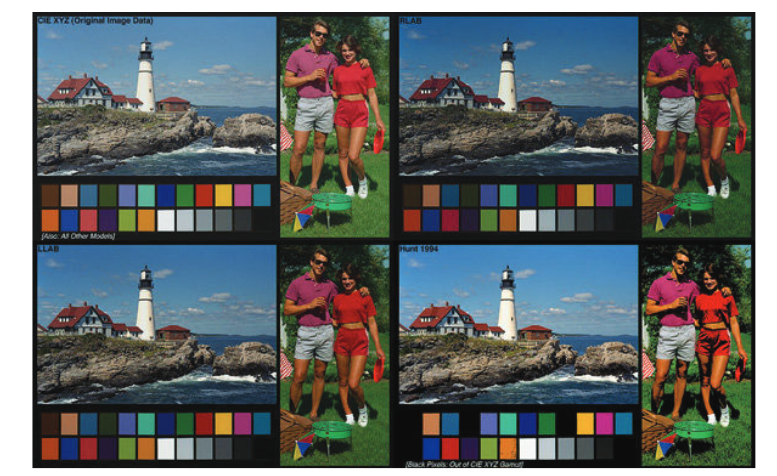

# 17 色彩外观模型的测试

第 10 章至第 16 章描述了几种色彩外观模型，但很少提及它们所要预测的视觉现象的相关数据。在考虑到这些色彩外观模型的多样性时，合理的疑问是它们到底有多好用。对这些模型的定量测试显然是必要的（正如任何科学理论一样，它们必须有数据支持）；不幸的是，关于这些模型的实际表现，已经发布的文献远远超过了其模型的制定过程。这其中有几个原因。第一个是缺乏可靠的测量观察者色彩外观感知的数据。第二个原因是这些模型本身的发展速度超过了研究人员评估其表现的能力。幸运的是，这两种情况正在逐步发生变化。本章回顾了一些测试色彩外观模型的实验工作，并收集了额外的色彩外观数据，以供未来的模型测试使用。这仍然是一个活跃的研究领域，可以预见，随着仍然有足够兴趣的人为研究提供资金，更多的测试（和模型修订）将会继续发布。

---
## 17.1 概述

人们可能会认为，第 10 章至第 16 章中所展示的色彩外观模型的推导需要大量的数据。这是对的；然而，用于推导这些模型的数据来自一系列长期的视觉实验，每个实验都专注于色彩外观的一个特定方面。这些实验包括第 6 章中描述的关于色彩外观现象的实验。随后，模型被制定出来，以同时预测这些现象中的多种情况。通过这种方式，尽管几乎没有数据能够同时检验这些多样的预测，但依然可以推导出相当复杂的模型。为了真正测试这些模型，需要对亮度、明度、色彩丰富度、饱和度、色度和色相的外观属性进行视觉数据标定。或者，也可以通过对现有模型的性能进行视觉评估来进行测试。

进行过多种色彩外观模型的测试。不幸的是，这些测试没有一个是完全令人满意的，因此关于哪个模型在所有情境下最好的问题，无法得出明确的答案。已经进行的各种测试可以分为以下四个主要类别，每一类都为模型的评估贡献了独特的视角：

- **定性测试各种现象**
- **预测对应色数据**
- **外观属性的大小估算**
- **不同模型预测的直接心理物理比较**

这些测试类型各自为模型评估做出了独特的贡献，但没有任何一个单独的测试能够完全指定最好的色彩外观模型。CIE 技术委员会内也有组织活动，旨在评估色彩外观模型。这些活动结合了上述四个组别的评估，最终目标是推荐用于色彩外观规范的模型和程序。

---

## 17.2 定性测试

有多种模型测试可以因某种原因被视为定性的。测试是定性的，如果结果显示了预测中的一般趋势，而不是提供各种模型的数值比较。这些测试包括：

- **显示某一特定外观现象可以被预测的计算**（例如，色彩丰富度随着亮度的增加而增加）
- **从历史数据中预测趋势**
- **与色彩顺序系统的比较**
- **简化的视觉实验，针对模型特征进行测试**

Nayatani 等人（1988）发布了他们的色彩外观模型的早期定性评估例子。他们查看了两组数据。第一组是使用 CIE A 光源下的 Munsell 样本的预测色彩外观，第二组是 Mori 和 Fuchida（1982）的色彩渲染实验结果评估。他们对 Munsell 样本的预测表明，他们的模型在 A 光源下预测了 Helson–Judd 效应，而 von Kries 变换则无法做到这一点。Nayatani 等人随后进行了一项简短的视觉实验，三名观察者（包括作者）观察了在白炽灯下样本的轻微 Helson–Judd 效应。他们还检查了一些色彩区分观察，结果与他们模型的预测更为一致，而不是使用 von Kries 变换的预测结果。他们还展示了 Nayatani 等人的色彩外观模型合理地预测了 Mori 和 Fuchida 的对应色数据。然而，他们并没有将这些结果与其他模型进行比较。

如上所述，Nayatani 等人（1988）的研究表明，色彩顺序系统常常被用来评估外观模型的表现。所使用的系统是那些基于色彩外观的系统（如 Munsell 和 NCS），在第 5 章中有描述。在很多情况下，当一个模型被制定时，其作者会绘制 Munsell 色相、明度和色度的轮廓，以评估模型的感知一致性。或者，也可以检查恒定 NCS 色相、白黑度和色彩度的轮廓。假设色彩顺序系统已经建立了准确的外观尺度。因此，例如，模型应该能够预测具有恒定 Munsell 色相的样本具有相同的预测色相，并对明度（亮度）和色度做出类似的预测。许多作者在制定模型时都会包括 Munsell 或 NCS 轮廓的绘图示例。例如，Nayatani 等人（1987，1990b）、Guth（1991）、Hunt（1995）和 Fairchild 和 Berns（1993）。实际上，Nayatani 等人（1995）模型的最新修订是为了修正 Munsell 色相和色度轮廓在不同明度水平上的不一致。

**表 17.1：由不同色彩外观模型预测的色彩现象**

以下表格列出了多种色彩外观模型对色彩现象的预测能力，勾选符号表示该模型能够直接做出预测。

  

  图 17.1：由不同色彩外观模型预测的色彩现象。勾选符号表示该模型能够直接做出预测。

| 色彩现象                     | ATD   | CIELAB | LLAB  | RLAB  | Nayatani | Hunt  | CIECAM |
|-----------------------------|--------|--------|-------|-------|----------|-------|--------|
| Lightness                   | √      | √      | √     | √     | √        | √     | √      |
| Brightness                  | √      | √      | √     | √     | √        | √     | √      |
| Chroma                      | √      | √      | ?     | √     | √        | √     | √      |
| Saturation                  | √      | √      | ?     | √     | √        | √     | √      |
| Colorfulness                | √      | √      | √     | √     | √        | √     | √      |
| Hue angle                   | √      | √      | √     | √     | √        | √     | √      |
| Hue                         | √      | √      | √     | √     | √        | √     | √      |
| Helson–Judd effect          | √      | √      | √     | √     | √        | √     | √      |
| Stevens effect              | √      | √      | √     | √     | √        | √     | √      |
| Hunt effect                 | √      | √      | √     | √     | √        | √     | √      |
| Helmholtz–Kohlrausch effect | √      | √      | √     | √     | √        | √     | √      |
| Bartleson–Breneman results  | √      | √      | √     | √     | √        | √     | √      |
| Discounting-the-illuminant  | √      | √      | √     | √     | √        | √     | √      |
| Incomplete adaptation       | √      | √      | √     | √     | √        | √     | √      |
| Color difference            | √      | √      | √     | √     | √        | √     | √      |
| Others                      | ?      | √      | √     | √     | √        | √     | √      |

---

## 17.3 对应颜色数据

对应颜色数据如在第8章关于色度适应的讨论中所描述的，除了简单的色度适应外，还能用于分析广泛的色彩外观现象。这些数据通过两组三刺激值定义，表示在两种不同的观看条件下，颜色外观匹配的刺激。

**关键概念：**

- **三刺激值（Tristimulus Values）**：在不同的观看条件下，匹配的颜色由两组三刺激值定义，这两组值对应的颜色在视觉上相同，但其数值可能不同。
- **观看条件的影响**：观看条件的变化会影响颜色的外观，这意味着对应的三刺激值会发生变化。
- **测试色彩外观模型**：通过将一种观看条件下的三刺激值转化为匹配另一观看条件下的三刺激值，可以对比预测的对应颜色与实际观察到的颜色，从而评估模型的表现。

**对应颜色数据的分析：**

- 通过比较预测的对应颜色与观察到的实际颜色，通常采用均方根（RMS）偏差来评估模型的表现，评估可以在均匀的色度空间（如 u′v′）或均匀的色彩空间（如 CIELAB）中进行。

---

**重要研究与实验：**

1. **CSAJ的广泛实验（Mori et al., 1991）**：

   - **色度适应实验**：该实验测量了不同光源下的颜色匹配（如D65到A），使用了87个样本和104个观察者。
   - **亨特效应**：研究不同光照强度对颜色匹配的影响。
   - **史蒂文斯效应**：探讨了光照强度对中性色样的影响。
   - **赫尔森-贾德效应**：分析了荧光灯对无色样本的影响。

   结果表明，**Nayatani模型**在这些实验中表现最佳，尽管**Hunt模型**表现相似，而**von Kries变换**在某些情况下表现更好。

2. **Breneman的研究（1987）**：
   - Breneman的实验数据用于评估各种色度适应转换和色彩外观模型。结果表明，**Hunt模型**和**RLAB模型**表现较好，而**CIELAB**和**CIELUV**模型的表现较差。

3. **Luo等人的评估（1991）**：
   - 他们的数据用来比较不同的色彩外观模型，其中**Bradford模型**表现最佳，**Hunt**、**Nayatani等模型**和**CIELAB模型**的表现几乎相当。

4. **Braun和Fairchild的实验（1997）**：
   - 实验中，观察者在不同白点下将CRT图像与打印图像进行匹配，结果表明**RLAB**、**LLAB**和**CIELAB**模型表现较好，而**Hunt**和**Nayatani等模型**的表现较差。

---

**模型性能总结：**

这些实验展示了对应颜色匹配的复杂性和模型表现的多样性。**Bradford模型**通常能提供较好的结果，然而不同的模型在不同的实验数据下会展现出不同的优劣势。

---

## 17.4 大小估计实验

大小估计实验要求观察者直接为他们的感知赋予数值，这种实验技术的实用性通过Stevens（1961）的经典研究得到了突出展示。大小估计实验允许对颜色外观属性（如明度、色彩度和色相）进行直接测量，这些测量适用于各种刺激和观看条件。然后，可以利用这些数据评估不同的色彩外观模型并推导出新的模型。

最为广泛的颜色外观大小估计实验系列是在拉夫堡大学技术计算机人机界面研究中心（LUTCHI）进行的，并通过Luo等人（1991a,b, 1993a,b, 1995）发表了一系列论文，结果已由Hunt和Luo（1994）进行总结。

---

**Luo et al. (1991a)**：  
六或七名观察者被要求对61到105个刺激在21种不同观看条件下进行明度、色彩度和色相的尺度测量。观看条件包括白点、介质、亮度水平和背景的变化。结果表明，颜色外观的最显著影响因素是背景和白点。其他效果在数据中未明显呈现。数据的不确定性通过变异系数（CV）来表示，可以理解为标准差的百分比。观察者内变异的总体CV值分别为明度13，色彩度18，色相9。第一部分未评估任何色彩外观模型。LUTCHI研究的一个问题是选择了较为不常见的外观属性进行尺度测量——明度、色彩度和色相。作者声称色彩度比色度更自然，但色度是与明度一起进行尺度测量时更合适的属性，它是观察者通常与物体相关联的属性，也不需要特意教授其定义。在单一亮度水平下，色度和色彩度可能通过简单的比例因子相关联，但没有理由相信在亮度变化下，色度和色彩度是线性相关的。

---

**Luo et al. (1991b)**：  
第一部分的数据被用来评估各种色彩外观和色度适应模型。通过计算观察结果与模型预测之间的变异系数（CV）值来分析模型。总体总结表明，Hunt模型在明度方面表现最佳，其次是CIELAB，最后是Nayatani。在色彩度方面，没有模型表现特别好，但Hunt模型（以及根据这些数据修改后的Hunt模型版本）稍微优于其他模型。在色相方面，Hunt模型显著优于Nayatani等模型。其他模型未对色相进行测试。这些数据还被用来制定后续版本的Hunt模型。

---

**Luo et al. (1993a)**：  
收集了额外的数据，以检查先前的结果，扩展条件范围并包括亮度的尺度测量，然后用来测试各种模型。四名观察者参与了对CIE D50模拟光源在六个不同亮度水平下的尺度测量。结果分析显示，Hunt模型总体表现最佳。对于明度尺度测量，CIELAB在忽略最低亮度水平时表现几乎相当。对于色彩度和色相的尺度测量，Hunt模型明显优于Nayatani等模型。

---

**Luo et al. (1993b)**：  
在这一部分中，他们将实验技术扩展到了透射介质的评估，包括投影透明片和在光盒上观看的透明片。五到八名观察者参与了这些实验，对16种不同的观看条件下的明度、色彩度和色相进行尺度测量。结果发现，Hunt模型的表现不如之前的实验，并提出了一些修改，已被纳入模型的最新版本。CIELAB在这些数据上表现非常好，实际上优于未修改的Hunt模型。Nayatani等模型的表现则比CIELAB和未修改的Hunt模型都差。基于实验数据修改后的Hunt模型表现最佳。

---

**Luo et al. (1995)**：  
特别考察了同时对比现象。五或六名观察者对在CRT显示器上系统变化的邻近区域的样本进行明度、色彩度和色相的尺度测量。结果显示，颜色外观的所有三个维度都受到诱导的影响（如预期）。对Hunt模型的评估（这是唯一一个能够直接考虑同时对比的模型）显示，它的表现不佳，且需要进一步修改。

---

**Hunt 和 Luo (1994)**：  
总结了LUTCHI实验的前四部分，以及如何利用这些结果改进Hunt色彩外观模型。总体上，他们展示了Hunt模型在色相方面的CV值在7到8之间，而观察者间的变异性CV为8。在明度方面，模型的CV值范围为10到14，观察者间的变异性为13。对于色彩度，模型的CV值约为18，观察者间的变异性为17。因此，他们得出结论，Hunt模型能够像观察者预测均值一样预测实验结果，这是一个令人印象深刻的结果，当然这也是一个良好的结果，但应当记住，这些数据并不是独立于模型的制定。LUTCHI实验的许多结果也贡献于CIE TC1-34的工作，为评估更现代的色彩外观模型和CIECAM97s的制定提供了数据。这些分析的结果在17.6节中进行了描述。不幸的是，这些数据由于研究资助方的要求，一度未公开，直到几年后才公开，并最终作为CIECAM02开发的其中一组数据集。

---

## 17.5 直接模型测试

克服大小估计实验的有限精度的一种方法是利用更精细的心理物理学技术来评估模型性能。一种这样的技术是配对比较实验，观察者每次查看两个刺激并简单地选择哪个更好。然后，使用比较判断法分析结果，以得出区间刻度和相关的不确定性。为了以这种方式评估色彩外观模型，首先必须从一个观看条件下的原始刺激（或图像）开始，然后使用每个待测试的模型计算第二组观看条件下的对应刺激（或图像）。观察者随后查看每一对刺激，并选择哪个是原始刺激在其观看条件下的更好再现。然后，使用区间刻度结果来衡量每个模型的相对表现。这种方法的一个显著缺点是，结果无法用于推导新模型，而仅限于实验时已有的模型。

在罗切斯特理工学院的曼塞尔色彩科学实验室进行了大量这样的实验，并由Fairchild（1996）进行了总结。以下是这些实验以及其他实验的描述。

---

**Fairchild 和 Berns（1993）**描述了这些实验的早期简化形式，目的是确认色彩外观模型在跨媒体图像再现应用中的实用性。他们研究了从打印物在模拟光源A或D50下观看到在具有D65白点和各种背景的CRT显示器上的变换，使用了一种简单的连续双眼查看技术。实验使用了六幅不同的图像，14名观察者参与了实验。比较了无模型（CIE XYZ再现）、CIELAB和RLAB。结果表明，观察者约70%的时间选择了RLAB再现，约30%的时间选择了CIELAB图像，几乎从未选择XYZ图像。这个结果表明，对于这些观看条件，确实需要进行色彩外观转换，并且RLAB模型优于CIELAB。

---

**Kim et al.（1993）**研究了八种色彩外观转换在不同观看条件下打印图像的表现。原始打印物在CIE A模拟光源下观看，而使用各种外观转换计算出的再现图像则在CIE D65模拟光源下以三种不同的亮度级别观看。进行了一项配对比较实验，并使用比较判断法得出了区间刻度。实验使用了30名观察者，采用了连续Ganzfeld单眼查看技术（Fairchild等，1994）。结果表明，Hunt、RLAB、CIELAB和von Kries模型的表现相似，显著优于其他模型。Nayatani等模型表现比上述任何一个模型都差。三种模型表现显著差，并未纳入后续实验。这些模型包括CIELUV、LABHNU2和一种专有模型。Nayatani等模型表现差是因为其对Helson–Judd效应的预测导致了再现图像中黄色高光和蓝色阴影。Helson–Judd效应在这些观看条件下的复杂刺激中无法观察到。CIELUV和其他模型表现差是由于其固有的色度适应转换的缺陷。

---

**Pirrotta 和 Fairchild（1995）**进行了一项类似的实验，使用灰色背景上的简单刺激而非图像。这项研究的第一阶段是对各种模型的计算比较，目的是找到刺激和观看条件中模型差异最大的部分，以便视觉实验可以集中在这些差异上。下图展示了几项这些结果。图17.2展示了在CIE A模拟光源下1000 lux的中性色样Munsell 3、5和7的CIELAB坐标，在CIE D65模拟光源下1000 lux或10000 lux的观看条件下的对应颜色。标记为F的点表示由Fairchild（1991b）模型预测的不完全适应，该模型在RLAB中使用。标记为N的点显示了Nayatani等模型中包含的Helson–Judd效应和Stevens效应的预测。标记为H的点展示了Hunt模型在亮度变化条件下的Stevens效应预测。图17.2展示了Nayatani等模型在模拟光源A下对Helson–Judd效应的极端预测。

  

  图 17.2：各种外观模型预测的差异展示，图中为CIELAB L*–b*平面。中性色在（a）1000 lux 和（b）10000 lux条件下的表现。

---

**图17.3** 各种外观模型预测的差异展示，图中为CIELAB a*–b*平面。5PB 5/12在（a）1000 lux 和（b）10000 lux条件下的表现。

  

  图 17.3：各种外观模型预测的差异展示，图中为CIELAB a*–b*平面。5PB 5/12在（a）1000 lux 和（b）10000 lux条件下的表现。

---

**Pirrotta et al.（1995）**的视觉实验使用了配对比较技术，共26名观察者，10种刺激颜色，在从76 cd/m²的模拟光源A到763 cd/m²的模拟光源D65的观看条件变化下进行。结果表明，Hunt模型表现最佳。Von Kries、CIELAB和Nayatani等模型的表现相似，但不如Hunt模型。CIELUV和Fairchild（1991b）模型的表现显著较差。这些结果促使了RLAB中适应模型的修订（Fairchild，1996）。

---

**Braun等（1996）**研究了观看技术和色彩外观模型在图像介质和观看条件变化下的表现。他们研究了打印图像在CIE D50和A模拟光源下的再现，并在CIE D65白点的CRT显示器上显示。实验中15名观察者使用五种不同的观看技术。结果表明，连续双眼查看技术结合60秒适应期提供了最可靠的结果。有趣的是，许多实际情况中常见的同时双眼查看技术却产生了完全不可靠的结果。实验使用了五种不同内容的图像。结果显示，每个模型的表现存在显著差异。表现最佳到最差的模型顺序为：RLAB、CIELAB、von Kries、Hunt和Nayatani等模型。

---

**Fairchild等（1996）**进行了类似的实验，研究了CRT显示图像作为投影35mm幻灯片的再现。CRT显示器设定为D65和D93白点，亮度为60 cd/m²，周围环境为暗。投影图像白点为3900 K，亮度为109 cd/m²，周围环境较暗。15名观察者参与了实验，使用了三种不同的图像。结果显示，RLAB模型表现最佳，其次是CIELAB和von Kries模型，表现相似，然后是Hunt模型。由于Nayatani等模型由于预测Helson–Judd效应并导致图像质量较差，因此没有纳入最终的视觉实验。

---

**Braun 和 Fairchild（1997）**将Braun等（1996）的实验扩展到各种观看条件。研究了10组不同的观看条件，共使用14到24名观察者。观看条件包括白点、亮度级别、背景和环境的变化。总体而言，RLAB模型表现最佳。在白点变化下，CIELAB和von Kries变换也表现良好。Hunt和Nayatani等模型表现不如前三者。在亮度变化下也得到了类似的结果。对于背景变化，Hunt模型表现较差，显然是因为其对复杂图像的影响预测过度。未考虑背景变化的模型表现较好。这个结果是可以预见的，因为图像的背景通常不与刺激的背景（即图像元素）相同。对于环境变化，RLAB表现最差，Hunt模型表现也较差。这是唯一两个考虑环境变化的模型，尽管它们预测了正确的趋势，但两者都在这些观看条件下过度预测了效果。

---

**Braun 和 Fairchild（1997）**通过在配对比较实验中包括图像匹配技术，扩展了第17.3节中的对应颜色实验。实验中，配对比较实验包括了模型预测以及观察者生成的匹配图像，并通过匹配数据推导出的白点统计线性变换。五名观察者参与了图像匹配实验，32人参与了配对比较实验。结果表明，RLAB模型生成的匹配图像与观察者生成的图像和统计模型图像一样好。CIELAB、von Kries和Hunt模型的表现不如RLAB。

---

**Lo等（1996）**和**Luo等（1996）**展示了打印图像在CRT显示器上再现的配对比较实验结果。他们评估了在恒定亮度下，五种不同白点变化的表现，使用了9到18名观察者。结果表明，CIELUV模型显著差于所有其他测试的模型。其他模型表现相似，LLAB模型在从光源A到光源D65的适应中略有优于其他模型。

---

这些正在进行的实验以及上述实验的结果已经被不同的CIE委员会用于制定、测试和修订色彩外观模型。到目前为止，这类研究已验证CIE模型在各种应用中始终表现优异，甚至是最佳的。

---

## 17.6 投影图像中的色彩度

基于色彩外观模型的理论与实现，通过改变投影图像中白点亮度与其他刺激之间的相对关系（在适应方面被感知为均匀场景），应该对色彩外观产生非常显著的影响。这个理论可以通过使用基于DLP的数字视频投影仪进行简单的测试，这些投影仪配备了四段（红色、绿色、蓝色和白色）滤轮。此类投影仪设计时加入了第四个白色通道，以在商务演示等应用中提供额外的亮度，因为这些环境下可能开启了房间照明。不幸的是，额外的白色亮度并不会增加RGB原色的亮度，这种相对亮度的变化根据色彩外观模型的理论，应该导致显示的色彩度降低，尽管亮度有所增加。

---

**Heckaman et al.（2005）**和**Heckaman 和 Fairchild（2006a,b）**通过心理物理学的尺度测量测试了这一理论，评估了显示色彩度以及其他外观属性，研究了显示白色亮度与显示色彩原色亮度之间的各种关系。结果确认了这一理论：相对于色彩刺激的亮度，适应白色亮度的增加会降低感知到的色彩度（因此，即使具有额外白色通道的显示屏更亮，其色彩度可能也会降低），并且**CIECAM02色彩外观模型**的预测与观察结果之间有很好的相关性。

---

Heckaman等人的研究还得出一个额外且有趣的预测：通过精心设计的显示器，可以产生等效于位于光谱范围外的刺激（Fairchild 2008b）。此类显示器需要具备一个扩散白色亮度显著低于RGB原色亮度总和的设计（与RGBW DLP投影仪相反）。由此产生的显示器不仅能够生成“看似”超出物理可实现颜色的光谱范围的刺激，而且它还可以是一个HDR显示器，因为其能够显示超出扩散白色亮度的白色亮度，可以用于显示光源、亮点等。这一预测已通过CIECAM02（图17.4）进行了计算验证，并在受控环境中进行了实验验证。作者还通过在20分钟的演示过程中操控幻灯片的亮度，在一个昏暗的房间内展示了这一效果。

---

**Li et al.（2011）**展示了关于显示原色亮度与色彩度之间权衡的相关结果。这是一种非常重要但未充分利用的技术，原因有几个。其中之一是，这些颜色顺序——

  

  图 17.4：展示了在CIECAM02中不同白点亮度水平与显示原色亮度水平之间的相对关系下，色度色域的边界。蓝色等高线显示了不同亮度条件下的色度色域边界。红色等高线表示在正常观看条件下光谱范围的感知色度。

---

这项研究表明，在色彩度和亮度之间的平衡上，显示原色亮度的选择对于最终的视觉效果有着重要的影响。

---

## 17.7 Munsell 在色彩外观空间中的应用

色彩外观模型、色标或色彩空间可以通过绘制来自色彩顺序系统（如Munsell或NCS）的选定色样进行定量评估或相互比较。这是一种非常重要但未充分利用的技术，原因有几个。其中之一是，这些色彩顺序系统提供的视觉数据通常是通过大量观察者精心收集的。这些数据还经过了标准化，因此任何研究者都可以以相同的形式使用它们。这些数据的采样方式能够系统地代表色彩外观的属性。尽管Munsell和NCS样本的定性图通常可以看到，但这些数据非常适合用来进行更多的定量测试和模型比较，应该以这种方式使用。即使Munsell数据不是明度、色彩度和色相的完美代表，它们也是一个良好表征的参考色集合，提供了数值和物理形式，能够用于模型之间的比较。

---

**Wyble 和 Fairchild（2000）**提供了基于Munsell进行的模型间比较的一个例子，使用了多种可视化技术和定量评估方法。图17.5展示了该研究中的一个小例子，仅包括四个色彩外观模型的明度预测。即使在这个小例子中，也可以很容易地看到两个模型预测了周围效应，而另外两个模型则没有，并且这些模型的明度刻度以微小但有意义的方式变化。这比与亮度的比较更具启发性，因为在这种情况下它们看起来都很相似（压缩功率函数）。从明度（值）开始考虑，能够考虑到主要的视觉效应——压缩非线性，并且使得比较模型间微妙差异变得更为容易。

  

  图 17.5：来自Wyble 和 Fairchild（2000）工作的一个小例子，展示了四个色彩外观模型的明度预测。

---

## 17.8 CIE 的行动

无疑，要消化以上所有结果并得出哪个色彩外观模型最好或在哪种应用中应使用哪个模型，都是非常困难的。除了模型的持续改进外，实验变量太多，单凭文献中的结论无法做出明确判断。这些是导致出现大量已发布的色彩外观模型并且没有就各种应用达成国际共识的原因之一。CIE通过其技术委员会和报告员的活动来处理这些问题，具体如下所述。

---

**TC1-34，色彩外观模型测试**  
CIE技术委员会1-34，色彩外观模型测试，成立的目的是评估各种模型在预测物体颜色色彩外观方面的表现。TC1-34发布了关于色彩外观模型测试协调研究的指南（Fairchild 1995a），其中概述了其工作计划，旨在激励研究人员进行更多的模型测试。此外，TC1-34收集了各种数据集和测试结果，并完成了额外的测试。然而，由于委员会内对于结果的解释存在分歧，相关测试结果并未在CIE技术报告中公布。TC1-34对CSAJ、LUTCHI和RIT实验的数据分析总结如下。

最终，CIE TC1-34承担了制定CIE色彩外观模型的任务。该任务通过CIECAM97s的创建和发布完成（见第15章和CIE 1998）。TC1-34对CSAJ数据的分析包括计算CIELAB空间中的RMS偏差，针对色度适应、史蒂文斯效应和亨特效应的数据。对于色度适应数据，Hunt、RLAB和CIELAB模型表现相似且优于其他模型，接下来依次是Nayatani等、LABHNU和CIELUV模型。对于史蒂文斯效应数据，Hunt模型表现最佳，其次是RLAB、CIELAB、LABHNU和CIELUV模型，它们的表现相同，因为它们预测没有效应。Nayatani等模型表现最差，因为它过度预测了效应。对于亨特效应数据，Hunt模型表现最佳，Nayatani等模型次之，接着是没有预测任何效应的模型（RLAB、CIELAB、LABHNU和CIELUV）。LUTCHI数据的进一步分析表明，Hunt模型表现最好，其次是RLAB、CIELAB，最后是Nayatani等模型。RIT直接模型测试的总结显示，对于图像和简单刺激的结果不同。对于图像，Hunt、CIELAB和RLAB模型表现相似且最好，其次是Nayatani等模型和LABHNU并列，最后是表现最差的CIELUV模型。对于简单刺激，Hunt模型表现最好，CIELUV模型最差，其它模型的表现则介于这两者之间。

总体来说，TC1-34的分析结果按照模型表现的顺序为：Hunt、RLAB、CIELAB、Nayatani等、LABHNU和CIELUV。对于所有数据的LLAB模型分析尚未完成，但它在LUTCHI数据中表现优于Hunt模型，且可能在其他数据上也表现良好。CIE TC1-34的结论是，无法推荐任何一个或两个已发布的色彩外观模型作为通用模型。原因有很多，其中一个重要原因是这些模型仍在不断发展，需要更多的测试才能得出强有力的结论。

---

**TC1-27，反射介质和自发光显示比较的色彩外观规范**  
CIE技术委员会1-27成立的目的是评估各种色彩外观模型在CRT到打印图像再现中的表现。TC1-27也发布了一套协调研究的指南（Alessi 1994）。第15.5节中描述的Braun等人和Lo等人的各种实验是TC1-27活动的一部分。TC1-27与CIE TC1-34合作，共同评估CIECAM97s。

---

**TC1-33，色彩呈现**  
如第18章所述，CIE用于计算光源色彩呈现指数的程序基于过时的色彩空间。CIE技术委员会1-33成立的目的是为光源的色彩呈现指数计算制定新程序。这个问题有两个方面：一是指定计算程序，二是选择计算的色彩空间。由于色彩呈现指数必须比较不同颜色光源的呈现效果，因此需要色彩外观模型。TC1-33开发了新程序并发布了最终报告（CIE 1999），但没有提出新的建议。

---

**TC1-52，色度适应变换**  
TC1-52成立的目的是制定可以独立于特定色彩外观模型使用的色度适应变换。该委员会收集并评估了各种数据集和变换，但未能得出单一的建议，因为多个模型表现相同。委员会无法就使用CIECAM02中的色度适应变换达成一致。TC1-52的最终报告已发布（CIE 2004b）。

---

**R1-24 色彩外观模型**  
在TC1-34解散后，CIE第一分部设立了一个色彩外观模型报告员，负责跟踪该领域的发展并在需要时向CIE建议是否应成立新委员会。该报告员的任务已结束，因为所有相关的色彩外观模型活动都在TC8-01进行，并且通过发布新模型CIECAM02达到了结论。

---

**TC8-01，色彩管理应用的色彩外观建模**  
TC8-01是一个非常高效的技术委员会，最终创建了最新的CIE色彩外观模型CIECAM02（见第16章和CIE 2004a）。该委员会还进行了多种模型测试，相关总结发表于Fairchild（2001）、Li等（2002）和Moroney（2002）的论文中。TC8-01已经完成其活动并成功解散。

---

**TC8-04，混合光照条件下的适应性**  
TC8-04的工作研究了在多种光照条件下估计色度适应状态的技术（例如，办公室环境中具有与显示白点不同颜色的自发光显示）。2010年发布的技术报告CIE 162:2010为此类情况下的外观预测提供了一些实际指导。

---

**TC8-08，空间色彩外观模型的测试**  
色彩外观模型的一个未来方向是更加系统和自动化地建模人类视觉的空间属性。2003年，TC8-08成立，旨在就如何为诸如HDR图像渲染等应用最佳地评估此类模型提供建议。委员会得出结论，进行此类测试为时尚早，因此解散了。

---

**R8-05，图像外观**  
与空间外观模型相关的是新的图像外观模型类别（见第20章）。2003年成立了一个报告员职位，负责监控这一新领域的进展，并在进展足够时建议是否应成立新的技术委员会。预计这些模型要达到CIE推荐的水平，还需要许多年。报告员职位最终终止，并未成立新的技术委员会。

---

**R8-06，CIECAM02的结果**  
随着TC8-01的成功解散，CIE建立了一个新的报告员职位，负责监控CIECAM02的应用和测试，并在需要进一步改进色彩外观建模的情况下，建议是否应成立新的技术委员会。目前没有迹象表明，CIECAM02将像CIECAM97s那样迅速进行修订。然而，CIECAM02在某些情况下的数学限制导致了TC8-11的成立。

---

**TC8-11，CIECAM02数学**  
该委员会成立的目的是“研究CIECAM02模型的改进，以避免数学不一致性。”目前，它正在优化CIECAM02的CAT矩阵和锥体非线性函数，以缓解负三刺激值的数学问题，并可能提出一个替代模型（见第16章）。

---

**TC1-75，色彩外观的综合模型**  
该委员会的任务是“推导色彩外观模型，预测在典型实验室条件下看到的不同颜色刺激的外观：这些刺激在不同光照下呈现为不相关的颜色，涵盖从视网膜感知到暗光条件下的各种刺激。”它的工作将集中在扩展CIECAM02方面。

---

**TC1-76，独特色调数据**  
该委员会将“研究和报告独特色调数据，包括这些数据的散布分析：这将包括实际观看条件。”其成立基于一些近期的研究，表明独特色调的精度（至少在观察者间变异性方面）可能比先前假定的更大（Kuehni等，2010；Shamey等，2010，2011）。

---

## 17.9 色彩外观模型的图示回顾

没有一组方程式或RMS偏差、CV列表能够真正传达不同色彩外观模型之间的差异。为了更好地理解这些差异，查看通过各种模型计算的图像是非常有用的。图17.6、图17.7和图17.8展示了不同历史模型的预测（Fairchild和Reniff 1996）。虽然这些模型现在已经有些过时，但这些图像仍然提供了有用的背景，便于比较各种模型的公式。这些图像不能普遍用于指示哪个模型最好，它们应该仅仅被视为这些类型的预测中各种模型的相对表现展示。在这种考虑下，这些图像的观看条件并不至关重要（尽管高亮度的D65模拟光源是理想的）。

---

**图17.6** 展示了在模拟光源D65下，作为CIE光源A下原始图像的匹配预测的图像，使用14种不同的色彩外观模型。模型包括CIE XYZ以展示原始图像、CIELAB、CIELUV、LABHNU2（Richter 1985）、von Kries、光谱增强von Kries（Drew和Finlayson 1994）、ATD、Nayatani等、Hunt（折扣化）、Hunt（无折扣）、Hunt（不完全适应，无Helson-Judd效应）、RLAB（折扣化）、RLAB（部分折扣化）和RLAB（无折扣化）。在这组图像中，有几个特点值得注意：
- XYZ图像展示了原始光源A图像数据的呈现，没有适应模型。
- RLAB和Hunt的硬拷贝版本与von Kries模型非常相似，在这种情况下，这些模型生成的结果被发现是迄今为止实验中最好的结果（在CIECAM02之前）。
- LLAB模型由于其“锥体响应”的特性，产生了更饱和的红色色调，并由于其对蓝色通道的非线性适应模型产生了蓝色色调的偏移。
- CIELAB产生了色相偏移（与von Kries等模型相比），尤其在天空和草地的颜色上，这是由于其“错误的von Kries”适应模型。
- 不完全适应可以通过RLAB软拷贝图像中的黄色以及RLAB幻灯片图像中适应水平的中间值来观察。
- Hunt软拷贝图像包括Helson-Judd效应（黄色高光和蓝色阴影），在Nayatani等图像中这一效果更加明显。
- Hunt幻灯片图像与RLAB软拷贝图像更加相似。
- ATD模型也预测了不完全的适应水平，这是由于其将刺激处理为更绝对而非相对的方式。
- 光谱增强的von Kries变换产生了高度饱和的红色色调。这是由于“保留色彩恒常性”的特性。
- CIELUV和LABHNU2模型由于其减色适应模型，产生了不寻常的色相偏移。实际上，如果进行D65到A的转换，而不是A到D65的转换，它们会产生物理上无法实现的颜色预测。

  

  图 17.6：不同色彩外观模型对于从光源A到光源D65的色度适应变化的预测比较。原始图像数据代表无适应调整的三刺激值的再现。

---

**图17.7** 展示了在恒定的D65白点下，从100 cd/m²到10 000 cd/m²的适应亮度变化的预测。这些预测展示了具有亮度依赖性的模型（ATD、LLAB、Nayatani等、Hunt和RLAB），以及表示所有其他模型的单一图像。原始图像经过“色域压缩”处理，以使所有模型预测保持在色域内。RLAB模型几乎没有亮度依赖性，因此产生的图像与原始图像非常相似。Hunt和Nayatani等模型产生了低对比度图像。这是可以预见的，因为根据Hunt和Stevens效应，这些低对比度图像在高亮度下观看时会显得对比度更高。Nayatani等模型预测了比Hunt模型更强的亮度依赖效应。ATD模型做出了相反的预测，由于它基于绝对信号而非相对信号，ATD模型预测在更高亮度水平下需要更亮、更高对比度的图像。这一预测是错误的。

  

  图 17.7：色彩外观模型对于从100 cd/m²到10 000 cd/m²的亮度变化的预测比较。原始图像数据代表无亮度调整的三刺激值的再现，因此是所有不考虑亮度级别变化的模型的预测。

---

**图17.8** 展示了在恒定的D65白点下，从平均背景到暗背景的周围亮度变化的预测。对于这些对背景变化敏感的模型（LLAB、Hunt和RLAB），展示了与所有其他模型的单一图像的比较。这三个模型都展示了在暗背景下观看图像时所需对比度的增加。LLAB和RLAB模型有相似的预测，RLAB模型预测的效果比LLAB模型稍强。Hunt模型使用加性偏移函数来预测背景相关的对比度变化。这些偏移强制一些暗色调的对应颜色具有负三刺激值。由于这是物理上不可能的，具有此类颜色的像素已被映射为黑色。这展示了使用Hunt模型在背景变化时的一个实际限制。

  

  图 17.8：色彩外观模型对于从平均背景到暗背景的周围亮度变化的预测比较。原始图像数据代表无背景调整的三刺激值的再现，因此是所有不考虑背景变化的模型的预测。

---

