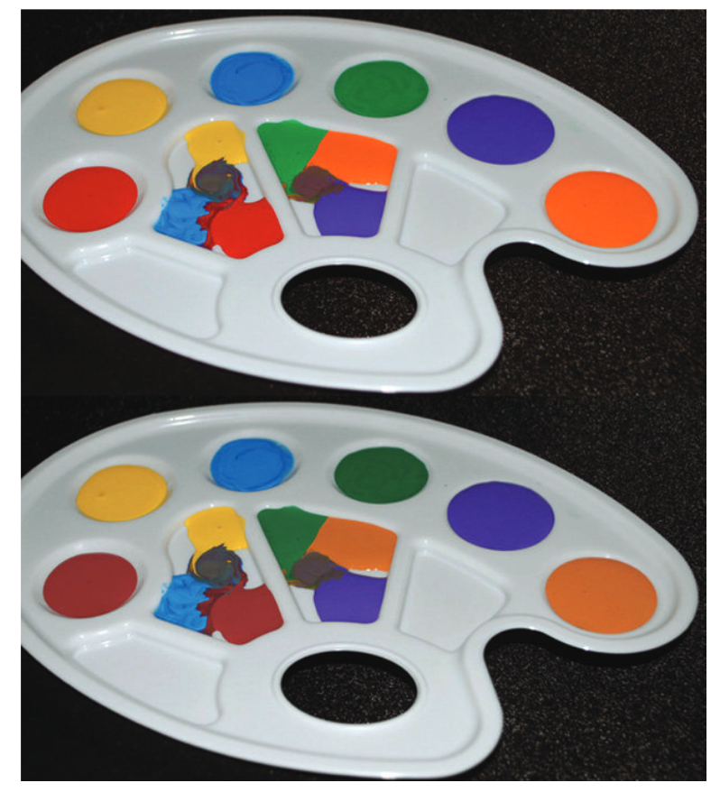
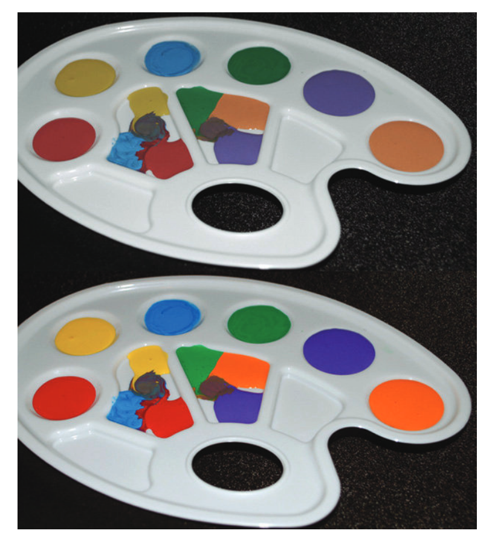
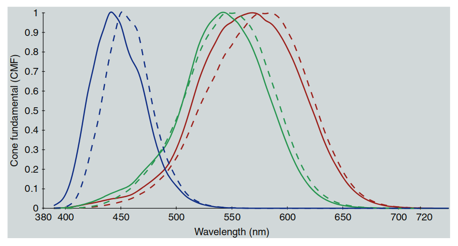
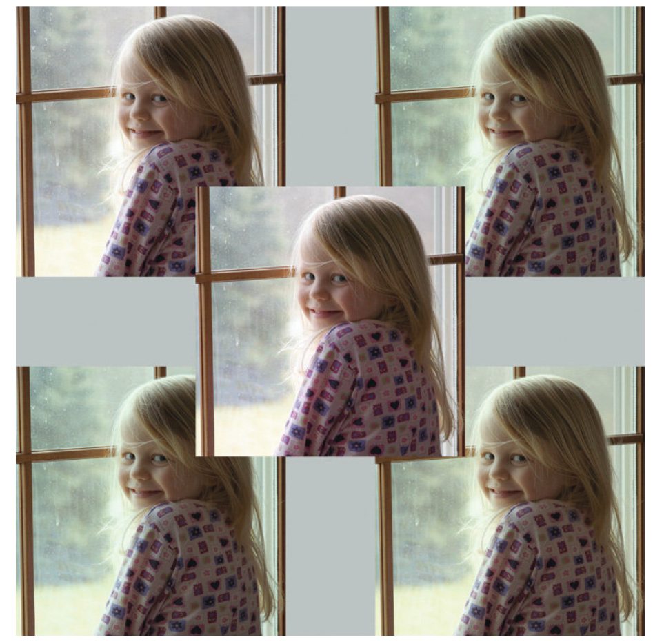

# 18 色貌模型的实际应用

**色貌模型的应用背景**

考虑到色貌模型在制定、评估和完善过程中的巨大努力，自然而然会有人怀疑，这些模型是否有实际应用，超越了历史上推动色貌现象研究的自然科学好奇心。近年来，技术的发展及其应用，实际上推动了色貌研究和模型发展的科学调查。可以将这些应用分为两个大类：

1. 图像再现，详见第19章。
2. 色彩测量与规范，这是本章的主题。

**色度学的演变**

色度学在过去一个世纪中稳步发展。对于许多应用，简单的三刺激（XYZ）色度学或CIELAB类型的色差规格已经足够。然而，在一些传统的色度学领域，仍然需要进一步的发展。本章将讨论其中的一些应用。

---

## 18.1 色彩渲染

色彩渲染是指不同光源如何影响或“呈现”物体的色彩外观。例如，两个光源可能具有相同的颜色，但其中一个是自然日光，而另一个则是由两种窄带磷光体组合而成的荧光源，它们的光谱恰好加起来形成相同的白光（如今更常见的是白光LED光源，它由蓝色LED和黄色磷光体组合而成，这种光谱依然与自然日光或白炽灯有显著不同）。虽然这两个光源的颜色相匹配，但由这两种光源照明的物体的外观会有很大差异。如图18.1所示，这一现象在人工照明的工程设计和选择各种光源时显得尤为重要。如果照明仅仅依靠其效率或效能来指定，那么我们环境中的物体外观将会十分不和谐。

  

  图 18.1：色彩渲染的两种白色光源的仿真图。上图代表自然日光下的典型色彩渲染，下图模拟了由蓝色和黄色混合而成的白光LED光源下的渲染效果。（注：通过红、绿、蓝LED组合而成的白光LED可以提供更好的色彩渲染效果。）

---

**色彩渲染指数**

为了帮助解决这一问题，CIE 定义了色彩渲染指数作为衡量光源呈现物体色彩质量的标准。

当前，CIE推荐的色彩渲染指数计算方法描述于 CIE 13.3 号出版物（CIE 1995a）中。光源的评估是相对于参考光源进行的，参考光源的定义为 CIE D 系列光源（用于色温大于或等于5000 K的情况）和普朗克辐射源（用于色温小于5000 K的情况）。参考光源的选择是基于其色温与待测光源相同。通过使用冯·克里斯变换（von Kries-type chromatic adaptation transform）来处理测试光源与参考光源之间的色差。CIE方法根据以下公式定义了一个特殊的色彩渲染指数：

  

    $$
    R_E = -\Delta E_i \times 100 \tag{18.1}
    $$
  

色差计算 $ \Delta E_i $ 基于测试光源和参考光源下样本的颜色差异，使用已不再使用的 CIE U*V*W* 色彩空间进行计算。通用色彩渲染指数 $R_a$ 定义为八个指定的 Munsell 样本的特殊色彩渲染指数的平均值。表18.1给出了不同光源的色彩渲染指数的典型例子。需要注意的是，表中给出的数值是典型的光源类型，但也存在显著的变化。例如，不同的磷光体和LED组合可以用于固态照明系统，从而生产具有不同色彩渲染指数的磷光LED光源。此外，色彩渲染指数仅告知我们特定物体色彩渲染的逼真度，而不考虑观察者对给定色彩渲染的偏好。

---

**表18.1：不同光源的色彩渲染指数示例**

| 光源类型              | Ra   |
|-----------------------|------|
| 钨丝卤素灯            | 100  |
| D65 光源              | 100  |
| 氙气灯                | 93   |
| 日光荧光灯            | 92   |
| 金属卤化物灯          | 90   |
| RGB LED               | 90   |
| 三带荧光灯            | 85   |
| 磷光LED               | 80   |
| 冷白色荧光灯          | 58   |
| 汞蒸汽灯              | 45   |
| 高压钠灯              | 25   |
| 低压钠灯              | -4   |

---

**色彩外观模型的应用**

在规定光源的色彩渲染特性时，根本的问题是如何在不同的光源下描述彩色物体的外观。在某些情况下，有必要比较在不同光源下物体的外观，也可能需要比较在不同亮度水平下光源的渲染特性。为了在光源颜色和亮度级别变化的情况下比较色彩外观，必须使用准确的色彩外观模型。因此，给定适当的标准参考资料，我们可以比较钨丝光源与日光光源的色彩渲染质量并获得有意义的结果。有趣的研究表明，某些物体在色彩渲染或色彩质量判断中具有更高的权重，而色彩外观模型则可以在实施基于物体的加权时提供帮助。例如，Rea 等人（1990）显示了在判断色彩渲染时，观察自身皮肤在光照下的效果非常重要，Fairchild（1992b）也报告了类似的关于色度适应稳定性的结果。

---

**未来方向**

尽管在基于准确色彩外观模型的色彩渲染衡量方法上仍然有改进空间，但目前色彩外观模型的现状使得色彩渲染指数的能力没有得到很大的变化。随着固态照明的快速应用，创造新的光谱时，色彩渲染指数与顾客偏好之间的关联性变得更加复杂。CIE 技术委员会 1-33（色彩渲染）提出了一些修改后的色彩渲染规格程序。第一步是定义一个新的计算程序，不依赖于使用的色彩空间。该程序采用 CIELAB 色彩空间并结合改进的色度适应变换（最初考虑了 Nayatani 等人提出的非线性变换，但 CAT02 变换是当前更好的解决方案），比现有的色彩渲染指数有了改进。由于照明行业在现有 CRI 标准下已经进行了优化，因此对于任何改进的接受程度非常低，导致改进进展缓慢。目前，CIE TC169 正在努力制定新的色彩渲染评估程序，该程序基于美国国家标准技术研究院（NIST）开发的色彩质量尺度（CQS）。虽然 CQS 在科学上比现有的 CRI 更为合理，但在照明行业中推动这一变化仍然面临困难。在当前的色彩渲染指数下，光源只与具有相同色温的标准光源进行比较，色彩外观模型未能在大范围的色度适应变化中得到有效使用。因此，任何色彩外观模型可能都不会比其他模型，甚至 CIELAB，更适用于此计算。只有当出现更复杂的技术来指定在光源、颜色和/或亮度级别大范围变化下的色彩渲染时，才需要更复杂的色彩外观模型。

Li 等人（2011, 2012a）展示了在计算色彩渲染指数时使用 CIECAM02 色彩外观模型的优势。Rea 等人（2008）描述了除色彩渲染指数外，使用“色域面积指数”（GAI）来指定照明质量的有效性。GAI 基本上指定了物体在给定光源下的色彩丰富度（如图18.2所示）。使用两个度量来评估照明效果提供了更多的信息，用户可以根据自己的情况决定选择哪个，或者哪些组合最合适。显然，为了全面解决这一问题，需要多种度量来应对所有方面。所有这些不同维度的信息都应提供给照明设计人员和最终用户，以便他们做出最合适的选择。鉴于这些度量最终会印在灯泡包装盒上，且只有最终用户知道将要照亮的具体物体，因此，精确度要求并不高，关键在于提供多种照明质量的描述，以便最终用户根据实际需求选择最合适的选项。

  

  图 18.2：展示“色域面积指数”概念的图像。下图展示了一个渲染色域面积较大的光源，而上图则展示了色域面积较小的光源。尽管这两种光源在颜色和亮度上相同，但下图的光源提供了更大的色域。

---

## 18.2 色差

色差的测量在各个行业中有广泛的应用。这些测量对于设定和维持所有有色材料的生产和销售色差公差是必要的。理想情况下，可以使用色差度量，例如 CIELAB 的 $ \Delta^*_{ab}E $，并将其视为感知色差的比率尺度。这将要求在所有色彩空间区域中，相同感知幅度的色差具有相同的 $ \Delta^*_{ab}E $ 值。另一个要求是，色差的感知应该与测量的 $ \Delta^*_{ab}E $ 线性地扩展。第三个理想特征是，$ \Delta^*_{ab}E $ 在一种光源下测量的值与在任何其他光源下测量的值在感知上是相等的，这样色差就可以直接在不同光源之间进行比较。已经充分证明，CIELAB 色彩空间在测量色差时不是均匀的，并且不能满足上述要求。事实上，这在任何欧几里得色彩空间中都不可能实现。

---

**当前技术与建议**

CIELAB 的 $ \Delta^*_{ab}E $ 公式的弱点已经在 CIE 活动内部和外部得到了修正。例如，CMC 色差公式旨在解决 CIELAB 空间中的一些不均匀性，以使在色彩空间某一区域中的色差测量与其他区域的测量等效。CIE 技术委员会 1-29 研究了 CMC 及其他公式，作为 CIELAB $ \Delta^*_{ab}E $ 公式的可能改进。他们得出结论，CMC 色差方程比可用的视觉数据所要求的更为复杂，因此创造了一个简化公式，称为 CIE $ \Delta^*94 E $（CIE 1995）。$ \Delta^*94 E $ 方程式在方程 18.2 到 18.5 中进行了说明。

  

    $$
    \Delta^*94 E = \sqrt{(L^* - L^*_{ref})^2 + (C^* - C^*_{ref})^2 + (H^* - H^*_{ref})^2}
    \tag{18.2}
    $$
  

---

**参考条件**

参考条件如图所示，说明了 CIELAB 空间在色彩外观规格中的局限性。这些正是色彩外观模型可以在色差规格中作出贡献的领域。最近（CIE 2001），CIE 推荐了一种基于 CIELAB 色彩空间的更复杂的经验色差公式，称为 DE2000。DE2000 公式可以合理地认为是复杂的，并且在现有的感知数据中隐含了不合理的精度。因此，$ \Delta^*94 E $ 方程通常是更为实用和合理的选择。

---

**色彩外观模型的应用**

在色差规格领域，色彩外观模型可以直接将一些参数效应纳入方程中。例如，一个准确的色彩外观模型可以结合背景和亮度水平对色差感知的影响。色彩外观模型还使得可以直接比较不同观察条件下测量的色差。这在同色异谱（Metamerism）指数的计算中有应用，正如下文所述。色彩外观模型还可以用来计算在不同条件下观察到的两个样本之间的色差。这对于警示标志或公司商标等关键色彩非常有用。

---

**未来方向**

目前，除了 CIELAB 之外，针对实际色差规格，尚缺乏将色彩外观模型纳入其中的活动。或许是因为在各个行业已经投入大量精力去微调 CIELAB。相反，当前的研究活动（虽然不多）主要集中在进一步改进 CIELAB 内的方程式，如 DE2000 和 $ \Delta^*94 E $，以及定义 gloss、纹理、样本分离、样本大小等参数效应的影响。此外，色彩外观模型的研究大部分集中在色度适应变换上，而对色彩外观空间中色差规格的关注较少。一个值得注意的历史例外是 LLAB 空间（Luo et al. 1996）的提出，在该空间中，色彩外观和色差同时被处理，最近 Luo 等人（2003）提出的类似方程式在 CIECAM02 中的应用，导致了 CAM02-UCS 的产生。另一个有趣的未来方向是将人类视觉表现的空间特性纳入色差度量中，从而适当地处理各种空间频率下的色差感知。例如，Maximus 等人（1994）、Zhang 和 Wandell（1996）以及 Johnson 和 Fairchild（2003）的工作中就可以找到这类度量的实例。第20章讨论了这些想法的未来方向。

---

## 18.4 一种通用的色度学系统？

考虑到本章中描述的传统色度学的一些问题，人们不禁会想，是否有可能创建一个通用的色度学系统，能够解决所有相关的问题。目前，色度学已经经历了一个非常渐进的发展过程，从 CIE XYZ 三刺激值到 CIELAB 色彩空间，再到对 CIELAB 的增强，用于测量色差和色彩外观。这一发展确保了与基于以前标准程序的工业实践的兼容性。然而，复杂度已经到了一个地步，可能会有多个色彩模型，每个模型更适合不同的应用。CIE 在 1976 年推荐使用 CIELAB 和 CIELUV，以限制国际上使用的色差公式数量为两个，而不是以前越来越多的公式。这一建议取得了相当大的成功，导致 CIELAB 几乎成为唯一使用的色彩空间（以及基于它的几个色差公式）。也许，目前在色彩外观模型领域正在发展出类似的局面，CIE 的最新建议将带来一些秩序。然而，实际上，色彩外观系统和色差系统仍然可能是分开的。LLAB 模型（Luo 等人，1996）代表了一个有趣的尝试，试图将色度学与一个通用模型结合起来。Luo 等人（2003，2006）开始在 CIECAM02 和 CAM02-UCS 上推进这项工作。也许应该追求这种方法，或者考虑第 20 章和第 21 章中讨论的不同方法。另一种方法是从零开始，利用过去一个世纪在视觉科学和色度学方面的进展，创建一个新的色度学系统，该系统在整个过程中优于现有的方法，并能在科学、技术和工业中找到广泛的应用。色彩外观模型朝着这个方向迈出了步伐，通过首先从 CIE 三刺激值转换为视锥反应，然后从这些反应中构建色彩外观相关的参数。CIE（例如 TC1-36，具有生理学意义的轴的基本色度图）也在进行开发，旨在建立一个基于更精确视锥反应的色度学系统，这些反应不一定与 CIE 标准色度观察者相关。人们认为，这样的系统将在色觉研究中得到广泛应用。Boynton（1996）回顾了此类工作的历史和现状。也许这两项活动之间需要某种程度的融合，以开发出一个更好的通用色度学系统，供所有人使用。不幸的是，这段话对 2004 年第二版书籍中的情况与 1997 年第一版书籍时一样是成立的！而且，遗憾的是，在 2013 年末完成第三版时，它仍然基本上是成立的。然而，第 18.5 节表明，在观察者异谱性领域确实有一些新的活动，这将与第 21 章中提出的更新的色彩模型相交。

---

## 18.5 观察者异谱性问题？

观察者异谱性在第 18.3 节的通用异谱性讨论中已有介绍。幸运的是，近年来技术和色觉理解的进步使得观察者异谱性问题，以及它们对色彩外观的影响，逐渐成为关注的焦点。或许现在我们有了一些希望，可以为实际应用实现一种更通用的色彩匹配函数变化模型，解决观察者之间的差异。CIE（2006）已发布了一种程序，用于精确计算 20 至 80 岁之间、视场范围从 1° 到 10° 的观察者的平均色匹配函数（即基础视锥反应）。该程序基本上允许计算不同观察者的色匹配函数。然而，需要注意的是，它只计算每个年龄和视场大小的平均函数，模型无法纳入在任何给定的视场大小和年龄下出现的个体差异。因此，这只是朝着量化个体在色彩匹配函数中的变化迈出的第一步。尽管如此，这仍然是一个非常重要且有用的步骤，因为不同年龄和视场大小可以作为各种个体的代理。图18.3展示了两位极端观察者的视锥基础函数（色彩匹配函数）：一个是20岁的观察者，视场大小为2°；另一个是80岁的观察者，视场大小为10°，以展示CIE（2006）模型的能力。

  

  图 18.3：根据 CIE（2006）模型计算的两位极端观察者的视锥基础函数（色彩匹配函数）。实线代表20岁、视场大小为2°的平均观察者，虚线代表80岁、视场大小为10°的平均观察者。

Fairchild 和 Wyble（2007）使用 CIE（2006）模型计算了不同观察者对特定应用中图像匹配的影响。他们的应用是一个假设的数字影院，在这个影院中，正常的宽带 RGB 主色提供了源材料，这些材料试图与窄带 RGB 主色（例如激光投影仪）进行匹配。图18.4展示了在这一特定情况下，不同观察者可能遇到的视觉问题的幅度。CIE（2006）模型正在作为创建更一般的观察者变异性模型的基础，这些模型可能有助于量化和修正图18.4中展示的色彩外观问题。

  

  图 18.4：当中心图像呈现在宽带显示器上时，其他四张图像为根据 CIE（2006）模型计算的窄带显示器色彩匹配结果，展示了不同观察者对色彩外观的影响。使用的观察者为（2°，32岁）左上，(10°，32岁) 右上，（10°，20岁）左下，（10°，80岁）右下。

Sarkar 等人（2010）提出了另一种基于相对较少的观察者类别的方法，可用于量化和“校准”观察者变异性。该方法显示了很大的潜力，可能成为通用色度学系统的重要组成部分。Webster（2011）、Webster 等人（2010）和 Webster 与 Kay（2012）的研究也展示了观察者变异性对色彩外观的影响，这些研究结合了视觉敏感度的变化与色度适应模型，试图呈现由于视觉敏感度变化导致的外观变化。
