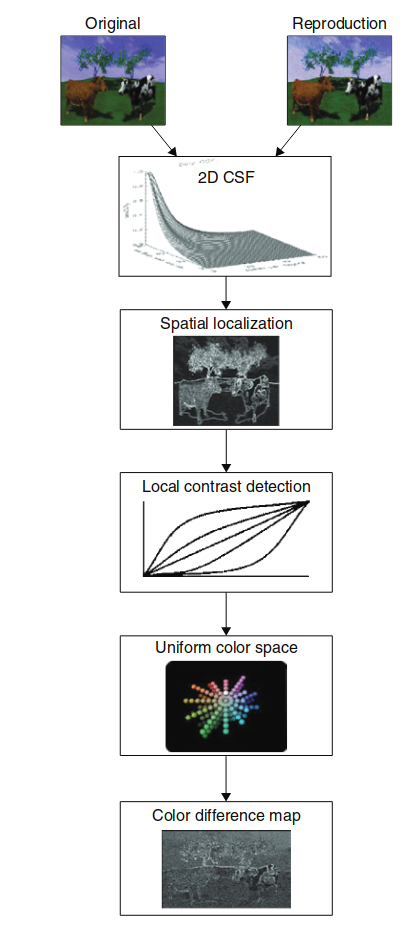

**图像外观建模的背景与发展**

自本书初版以来，色彩外观建模领域取得了显著进展。本书介绍的模型主要采取一种方法：尽可能将色彩与视觉表现的其他维度分离。然而，这些模型可能已经达到了其理论发展的极限，若想进一步取得突破，可能需要采用不同类型的模型。

Fairchild 和 Johnson（2002, 2003, 2004）提出了一种新的模型概念，被称为**图像外观模型**（Image Appearance Model）。这种模型将色彩外观模型扩展为包含空间和时间视觉特性的模型，能够预测复杂刺激中的外观表现，并用于测量图像差异（这是实现图像质量度量的第一步）。

本章将回顾图像外观建模的概念，并详细介绍其中一种模型，即 **iCAM**（图像颜色外观模型）。本章的大部分内容基于 Fairchild 和 Johnson (2004) 的综述文章。同时，章节的最后还会对色彩外观建模和图像外观建模领域的未来发展进行一些展望。

有关各类模型的最新进展以及在本书出版后出现的重要参考文献，请访问相关网站：  
[www.cis.rit.edu/fairchild/CAM.html](http://www.cis.rit.edu/fairchild/CAM.html)。  
关于 iCAM 模型的更新及相关源代码，请访问：[www.cis.rit.edu/mcsl/iCAM](http://www.cis.rit.edu/mcsl/iCAM)。

> 译者注：这个看起来令人费解，为何会出来一个图貌模型？这里是我的理解，通俗化来说就是：

> - 色貌模型关注单个颜色区域的感知，能够解释亮度、饱和度、色调之间的关系，但这些现象大多是在**简单的、均匀的**颜色区域中研究出来的。

> - 图貌模型扩展了色貌模型的能力，可以处理包含**多种颜色、细节和动态变化**的复杂场景，例如真实图像和视频。因此，图貌模型更适合用于视频播放、图像质量评价、HDR渲染等实际应用。
因此，图貌模型才是成像领域最应该关注的。

---
## 20.1 从色貌到图貌

图像测量的发展历史为图貌模型的提出与应用奠定了基础。图貌模型是一种自然演化，结合了色貌模型、空间视觉模型和时间视觉模型，将这些领域作为一个整体来看待，而非孤立的研究领域。

早期的成像系统要么未进行科学测量，要么采用专门测量成像系统变量的工具。例如，密度计最初用于测量摄影材料，以确定胶片中染料或银颗粒的含量。在印刷领域，类似的方法用于测量墨水以及半色调系统中的点覆盖面积。而在电子系统（如电视）中，系统信号电压则用于比色测量（Hunt 1995）。基于视觉的成像系统质量测量已有悠久历史，例如 Schade（1956）的开创性工作就是一个典型案例。然而，随着成像系统复杂性和开放性的提升，设备无关的图像测量需求变得愈加明显。

### Image Colorimetry

电子成像系统（尤其是彩色电视的发展）促进了设备无关图像色彩测量的首次应用。事实上，Wright（1981b）指出，若没有比色学的支撑，彩色电视根本无法发明。CIE系统在彩色电视系统（包括近代数字电视系统）的设计与标准化中取得了卓越成就。随着数字成像系统的普及，以及计算机生成和校对面向不同媒体的内容，CIE比色技术在成像系统中的应用愈加广泛。

CIE比色技术用于跨设备的图像色彩指定，有望解决开放式数字系统引发的新色彩再现问题。数字系统的灵活性使得对图像数据进行比色转换变得既可行又实际，从而在不同设备与媒体间实现色彩匹配。

关于成像设备校准与特性化的研究涵盖了从基础色彩测量技术到多种设备（包括CRT显示器、LCD显示器、投影设备、扫描仪、数字相机以及各种胶片记录与打印介质）的特性化。Berns（1997）总结了这一领域的一些核心概念与研究成果。这些能力是色貌与图貌研究与开发的基础。

设备特性化与校准的研究为解决设备无关色彩成像的核心问题提供了方法。例如，关于设备无关色彩成像设计与实现的概念研究（Fairchild 1994a）、色域映射算法（Braun 和 Fairchild 2000），该算法处理超出指定设备色域范围的目标色彩再现问题；以及用于计算机图形渲染的高质量光谱图像技术，这种技术显著提升了渲染场景中色彩准确性（Johnson 和 Fairchild 1999）。这类研究不仅建立在色貌模型的发展与测试基础上，还促进了跨媒体图像再现的研究进展。

### Color Difference Equations

**色差研究与 CIEDE2000 色差公式**

最近，色差研究的成果是**CIEDE2000 色差公式**的发布（Luo 等，2001）。在这些色差公式的核心部分，总是基于某种形式的**均匀色彩空间**（Uniform Color Space）。CIE 在 1976 年最初推荐了两种这样的色彩空间：**CIELAB** 和 **CIELUV**。这两个空间在最初都被描述为“临时色彩空间”，因为当时人们已经意识到它们还远未完善。

在一个真正均匀的色彩空间中，色差可以简单地通过两种颜色在该空间中的**距离**来衡量，例如通过 **CIE ∆E\*ab**（即 CIELAB 色差公式）。然而，由于 **CIELAB 色彩空间的非均匀性**，CIE 制定了更高级的色差公式，例如 **CIE DE94** 和 **CIEDE2000**，以更准确地预测感知到的色差。

这些更复杂的公式在预测**简单颜色块的感知色差**方面表现非常出色。然而，尽管存在这些限制，Stokes 等（1992）成功地证明了一点：一个简单的色差公式也能预测**整体颜色变化复杂的图像**中的色差阈值。他们的研究结果表明，对于复杂图像而言，**CIELAB 平均色差为 2.5 单位**是一个合理的感知阈值。

> 译者注：CIED2000色差公式罗明老师的代表作，也是华人在颜色科学领域里面最重要的贡献之一！

---

### Image Difference

CIE 色差公式是基于在受控观察条件下的简单色块开发的。因此，没有理由认为这些公式能够充分预测空间复杂的图像刺激的色差。**S-CIELAB 模型**（Zhang 和 Wandell，1996）被设计为标准 CIE 色差公式的**空间预处理器**，用以处理诸如半色调图案等复杂颜色刺激。空间预处理使用可分离卷积核来近似人类视觉系统的**空间对比敏感函数（CSF）**。CSF 的作用是去除视觉系统无法察觉的信息。例如，当在一定距离下观察半色调点时，这些点会模糊并融合成单一颜色。如果直接对连续图像与半色调图像进行逐像素的色差计算，将会产生非常大的误差，而实际感知到的差异可能非常小。空间预处理会对半色调图像进行模糊处理，使其更接近于连续色调图像。S-CIELAB 是基于 **CIELAB 色彩空间**与色差公式的第一个图像差异模型。

最近，该模型已被进一步优化，并扩展为一种用于图像色差计算的模块化框架（Johnson 和 Fairchild，2001a,b，2003a,b）。这一框架在**第 20.4 节**中进行了讨论，其改进了 S-CIELAB 模型中的 CSF 公式，并添加了**空间频率适应**、**空间定位**以及**局部与全局对比检测**模块。

### Color Appearance

遗憾的是，基本的 CIE 色度学并不能为图像规范提供完整的解决方案。由于数字系统生成或捕获的图像本质上会在截然不同的观察条件下被观看，例如：从最初捕获的场景，到昏暗房间中的计算机显示器，再到各种光源下的印刷媒介，甚至是在黑暗房间中的投影显示。因此，**色貌模型**被开发出来，以扩展 CIE 色度学，从而在不同媒体和观察条件下（而不仅仅是单一条件下）预测**色貌**（而不仅仅是颜色匹配）。

20 世纪 90 年代，应用于数字成像系统的**色貌建模研究**非常活跃，最终于 1997 年推荐了 **CIECAM97s 模型**（第 15 章），并在 2002 年推出其修订版本 **CIECAM02**（第 16 章）。这些模型的开发得益于为测试已发布的色貌模型在实际图像再现情况中的表现而进行的视觉实验（Braun 和 Fairchild，1997）。在成像应用中的色貌建模研究自然凸显了一些问题，这些问题在空间复杂图像的外观和图像质量问题上尚未得到充分解决。

### Image Appearance and Image Quality

颜色外观模型（CAMs）研究的是在不同观看条件下颜色的变化，主要包括光照的颜色（白点）、光照强度（亮度）以及周围环境的亮度对比。这些模型并不直接考虑人眼的视觉特性，比如空间和时间的变化，它们将每个图像像素（或者视频的每一帧）当作完全独立的刺激来处理。

视觉适应不仅在空间上发生变化，还在时间上有类似的过程。简单来说，视觉系统会根据周围环境的光线变化来调整感知，但这种调整不仅是针对空间的，时间上的变化也会影响感知效果。为了更准确地预测数字视频，特别是高动态范围（HDR）视频的外观，必须考虑到光线随时间变化的特性和色彩适应的过程。而在预测视频质量时，除了考虑图像的噪点或压缩伪影之外，还需要处理一些难以察觉的时间变化，比如视频中的“闪烁”现象，这种现象是因为画面在快速变化时，眼睛无法察觉到的细微波动。

**适应性的重要性**

适应性有明显的时间延迟特性。例如，当你突然打开黑暗房间里的灯时（比如早上醒来），你会发现亮度变化让你眼睛刺痛，因为光线太强，视觉系统一时无法适应这种过度的亮度。但过了一会儿，眼睛逐渐适应新的光照强度，视觉感知就恢复了正常。进入隧道也是类似的情况——从明亮的环境突然进入昏暗的隧道，眼睛会感觉不适，但也会逐渐适应。

Fairchild和Reniff（1995年）以及Rinner和Gegenfurtner（2000年）对色度适应过程的研究表明，时间适应也有类似的特性，眼球运动在空间适应中也起着重要作用，这些都可以应用到动态图像外观的预测模型中。

**视频质量与视频质量指标**

视频质量和视频质量度量的研究非常重要，尤其是在视频编码、压缩和解码算法（如MPEG2和MPEG4）的开发与优化方面。Daly（1993年）提出的静态图像质量预测模型（VDP）在预测JPEG图像压缩产生的伪影方面非常有效，可以用来估计图像中伪影的可见性。

与此不同，iCAM模型更多的是关注图像的质量尺度（例如清晰度、对比度、颗粒感等），它关注的是那些大于感知阈值的图像差异。这些差异是图像质量研究的一个重要部分，它们主要基于图像的外观。

在视频质量领域，也有类似的情况。虽然已有一些度量标准用于评估视频中的伪影是否可检测，但目前似乎还没有专门用于视频图像外观的模型，特别是用于渲染视频并预测视频中感知差异的模型。

**视频质量模型对比：Sarnoff JND模型与NASA DVQ模型**

**Sarnoff JND模型**

Sarnoff JND模型是JNDmetrix软件包的核心，基于Lubin（1993, 1995年）提出的多尺度空间视觉模型，并对色彩处理和时间变化进行了扩展。该模型旨在预测图像中伪影的可见性，换句话说，它关注的是那些能够被感知到的图像质量差异（通常称为“最小可察觉差异”）。然而，Sarnoff模型并没有考虑到色度和亮度的适应性，也没有处理时间特性的变化。

尽管如此，Sarnoff模型在检测视频中的快速时间变化（如闪烁）方面仍然有效，但它无法预测较慢的变化，因此不适用于视频的渲染。

**NASA DVQ模型**

NASA的数字视频质量（DVQ）模型与Sarnoff JND模型类似，但其实现方式有所不同。DVQ模型使用离散余弦变换（DCT）来分解图像，这使它非常适合硬件实现，并能够有效检测DCT视频压缩算法引入的伪影。与Sarnoff模型一样，DVQ模型关注的是伪影的可检测性，但它没有明确的外观处理机制，因此无法用于视频的渲染。

**图像外观模型的出现**

尽管颜色外观建模在设备无关的颜色成像方面取得了显著进展，并已经被广泛应用于现代的色彩管理系统，但在图像外观、空间视觉和图像质量方面，仍有许多可以改进的地方。为了弥补这些不足，近年来提出了图像外观模型（Fairchild 2002a,b, Fairchild 和 Johnson 2002），这些模型将颜色外观模型与空间视觉模型结合，以扩展颜色外观模型的能力。

传统的颜色外观模型（如CIECAM97s、CIECAM02）大多忽视了空间视觉特性，而图像质量中的空间视觉模型（如Daly 1993年、Lubin 1993年）则通常不考虑颜色因素。少数模型（如Retinex模型）则试图解决这些问题，并为图像外观建模奠定了基础。

图像外观模型的目标是将这些研究成果整合，创建一个通用的模型，既适用于图像外观的预测，也适用于图像的渲染与质量评估。例如，iCAM模型就是在这个框架下发展起来的，它结合了均匀色彩空间（Ebner和Fairchild 1998年）、图像周围环境的影响（Fairchild 1995b）、图像差异与质量测量算法（Fairchild 2002b，Johnson和Fairchild 2003a）的研究成果，并且考虑了观察者眼动的影响以及他们对自然场景的适应能力。

---

### Color and Image Appearance Models

能够预测复杂图像刺激之间的颜色差异的模型是一个非常有用的工具，但它也有一些局限性。就像颜色外观模型对于完全描述颜色刺激的外观是必要的，图像外观模型则是描述空间上复杂的颜色刺激所必需的。颜色外观模型能够描述诸如明度、亮度、色彩饱和度、色度和色相等属性。而图像外观模型在此基础上，进一步预测诸如清晰度、颗粒感、对比度和分辨率等属性。统一色彩空间也位于图像外观模型的核心部分。

模块化的图像差异框架在选择色彩空间时提供了极大的灵活性。常见的色彩空间包括CIELAB色彩空间，类似于S-CIELAB的色彩空间，CIECAM02颜色外观模型，以及IPT色彩空间（Ebner和Fairchild 1998年）。因此，模块化的图像差异框架可以在本章中描述的iCAM模型内实现，从而创建一个完整的图像外观和图像差异模型。如果需要，它也可以在其他色彩空间中实现。

图像外观模型可以用于制定多维度的图像质量模型。例如，可以将各种外观属性按权重求和，从而确定整体图像质量的度量，如Keelan（2002年）和Engledrum（2002年）所述。实际上，这些模型可以增强或替代人类观察，通过对图像属性进行加权，得出图像整体外观的质量。例如，一个质量模型可能包括色调平衡、对比度和清晰度的加权总和。以下部分将展示这类模型的初步步骤。

---
## 20.2 S-CIELAB

S-CIELAB模型是图像外观模型的一个优秀示例，就像CIELAB色彩空间提供了完整的颜色外观模型一样。S-CIELAB（Zhang和Wandell 1996年）为图像外观建模的概念提供了一个清晰的前身，并且仍然是图像差异计算中常用的技术。其实现已经被Johnson和Fairchild（2003b年）进一步澄清和扩展。

简单来说，S-CIELAB将CIELAB色彩空间和颜色差异方程结合，并通过空间滤波步骤有效地模糊掉无法感知的细节（例如半色调点），这些细节在颜色差异计算中应该被忽略。具体过程是：首先，将图像的XYZ三刺激值通过方程20.1和20.2中的变换转换为对立维度。然后，使用卷积核进行空间滤波，这些卷积核旨在表示亮度和色度的空间频率响应（CSF）。这些卷积核在方程20.3和20.4中有所定义。需要注意的是，这个滤波步骤依赖于图像的观看距离。接着，滤波后的图像被转换回XYZ，并进一步转换为CIELAB L*a*b*色彩空间，以便进行像素级的颜色差异计算。通过对这些图像差异图的统计汇总，可以尝试表示图像之间的差异。

  

    $$
    \begin{bmatrix} O_X \\ O_Y \\ O_Z \end{bmatrix} = M \begin{bmatrix} X \\ Y \\ Z \end{bmatrix}  \tag{20.1}
    $$
  

  

    $$
    M = \begin{bmatrix} 0.279 & 0.72 & 0.107 \\ 0.449 & 0.29 & 0.077 \\ 0.086 & 0.59 & 0.501 \end{bmatrix} \tag{20.2}
    $$
  

  

    $$
    E_i = \sum f_i k_i w_E  \tag{20.3}
    $$
  

  

    $$
    f(x, y) = \sum \exp\left( -\frac{(x - x_i)^2 + (y - y_i)^2}{2\sigma^2} \right)  \tag{20.4}
    $$
  

其中，缩放因子 \(k_i\) 选择使得 \(E_i\) 的总和为1.0，另一个缩放因子 \(k\) 选择使得每个色彩平面的 \(f\) 总和为1.0。

对于每个色度平面的参数 \( (w_i; s_i) \)，如下所示：  

- 亮度： \( (0.921, 0.105, -0.108; 0.0283, 0.133, 4.366) \)

- 红绿平面： \( (0.531, 0.330; 0.0392, 0.494) \)

- 蓝黄平面： \( (0.488, 0.371; 0.0536, 0.386) \)

---

## 20.3 iCAM Framework

**iCAM框架的基本概念与处理流程**

iCAM框架基于S-CIELAB概念，除了空间滤波之外，还引入了空间适应问题。图20.1展示了iCAM图像外观模型的整体框架流程图，该模型应用于静态图像。模型的输入需要图像（或场景）以及周围环境的色度数据，并且这些数据应以绝对亮度单位进行表征。图像数据通过相对的CIE XYZ三刺激值进行表征。适应性刺激是经过低通滤波后的CIE XYZ图像，并且附加了必要的绝对亮度信息，以预测色彩适应的程度。图像数据的绝对亮度（Y）也被用作第二个低通图像，以控制模型中各类依赖亮度的方面，这些方面用于预测亨特效应（亮度增加时感知色彩饱和度增加）和史蒂文斯效应（亮度增加时感知图像对比度增加）。最后，一个具有更大空间范围的低通亮度（Y）图像被用来控制图像对比度的预测，这一对比度已被证明是周围条件相对亮度的函数（巴特尔森-布雷内曼公式）。用于适应图像的特定低通滤波器取决于观察距离和应用场景。此外，在某些图像渲染情况下，可能需要使用不同的低通适应图像来分别处理亮度和色度信息，以避免由于局部色度适应导致图像的去饱和化。这是图像外观建模中一个应用依赖性的例子。局部色度适应可能适用于图像差异或图像质量测量，但在图像渲染场景下可能不适用。

  

  图 20.1：iCAM图像外观模型的流程图，模型输入为图像或场景的CIE三刺激值XYZ，以及用于适应的低通图像和绝对亮度信息。适应信号通过CIECAM02的线性色度适应变换计算得到，并通过IPT对手色空间进行处理。

**iCAM的第一处理阶段：色彩适应**

iCAM模型的第一阶段是处理色度适应。嵌入在CIECAM02中的色度适应变换被iCAM采纳，因为它在所有可用的视觉数据上表现出色。它也是一个相对简单的色度适应模型，适用于图像处理应用。色度适应模型，如公式20.5到20.10所示，是RGB图像信号的线性von Kries标准化，标准化信号来源于每个像素位置的低通适应图像（RWGWBW）。RGB信号通过CIE TC8-01从XYZ到RGB的线性变换来计算，CIECAM02中也给出了这一变换。von Kries标准化通过适应度因子D进一步调节，D的取值从0.0（没有适应）到1.0（完全色度适应）。公式20.7提供了CIECAM02中的D计算公式，并在iCAM中用于根据适应亮度\(L_A\)计算D，以适应不同的观察条件。或者，D因子可以手动确定。

**色度适应模型的使用**

色度适应模型用于计算对应CIE D65光源的颜色，然后这些颜色被用于iCAM模型的后续阶段。这是通过获取观看条件下的适应信号\(RCGCBC\)并反转公式20.5到20.10来完成的，适应白点为D65，且\(D=1.0\)。需要注意的是，虽然适应变换与CIECAM02中的相同，但iCAM模型已经有了显著不同，因为它使用空间调制的图像数据作为输入，而不是单一的颜色刺激和适应点。举例来说，使用CIECAM02中的FL函数（公式20.11）对绝对亮度图像和周围亮度图像进行调制。此函数随亮度缓慢变化，已被用于预测CIECAM02及早期模型中的各种亮度依赖的外观效应。由于该函数已被建立并理解，因此也被用于iCAM的早期阶段。然而，FL因子在CIECAM02和iCAM中的使用方式是非常不同的。

**从RGB信号到对手色信号的转换**

iCAM模型的下一个阶段是将RGB信号（大致相当于人类视觉系统中的锥体信号）转换为对手色信号（亮-暗、红-绿、黄-蓝；类似于人类视觉系统中更高层次的编码），这些信号对于构建统一的感知色彩空间和各种外观属性的相关性是必要的。在选择这种转换时，简便性、准确性和图像处理的适用性是主要考虑因素。选择的色彩空间是由Ebner和Fairchild（1998）提出的IPT空间。IPT空间专为图像处理应用而设计，具有相对简单的公式，特别是在色相角度分量上能很好地预测常量感知色相（这在色域映射应用中很重要）。近期对感知色相的研究验证了IPT空间的适用性。RGB到IPT对手色空间的转换比CIECAM02中使用的转换简单得多。该过程表达在以下公式中，涉及到线性转换到不同的锥体响应空间，应用幂函数的非线性，再通过最终的线性转换到IPT对手色空间（I，亮-暗；P，红-绿；T，黄-蓝）。

**公式：线性变换从XYZ到LMS**

  

    $$
    \begin{bmatrix}
      L \\
      M \\
      S
    \end{bmatrix}
    =
    \begin{bmatrix}
      0.4002 & 0.7075 & -0.0807 \\
      -0.2280 & 1.1500 & 0.0612 \\
      0.0000 & 0.0000 & 0.9184
    \end{bmatrix}
    \begin{bmatrix}
      X_{D65} \\
      Y_{D65} \\
      Z_{D65}
    \end{bmatrix}  \tag{20.12}
    $$
  

**公式：非线性压缩对LMS信号应用幂函数**

  

    $$
    L' = 
    \begin{cases} 
      L^{0.43}, & L \geq 0 \\
      -|L|^{0.43}, & L < 0 
    \end{cases}  \tag{20.13}
    $$
  

同理：

  

    $$
    M' = 
    \begin{cases} 
      M^{0.43}, & M \geq 0 \\
      -|M|^{0.43}, & M < 0 
    \end{cases}  \tag{20.14}
    $$
    $$
    S' = 
    \begin{cases} 
      S^{0.43}, & S \geq 0 \\
      -|S|^{0.43}, & S < 0 
    \end{cases}  \tag{20.15}
    $$
  

**公式：IPT对手色空间的线性转换**

  

    $$
    \begin{bmatrix}
      I \\
      P \\
      T
    \end{bmatrix}
    =
    \begin{bmatrix}
      0.4000 & 0.4000 & 0.2000 \\
      4.4550 & -4.8510 & 0.3960 \\
      0.8056 & 0.3572 & -1.1628
    \end{bmatrix}
    \begin{bmatrix}
      L' \\
      M' \\
      S'
    \end{bmatrix}  \tag{20.16}
    $$
  

**功率函数非线性**

IPT转换中的功率函数非线性是iCAM模型中的一个关键方面。首先，它们对于预测在大多数人类感知系统中普遍存在的响应压缩是必要的。这种响应压缩有助于将在线性物理度量（例如，亮度）中的信号转换为在感知维度（例如，明度）中的线性信号。CIECAM02模型使用双曲非线性来完成这一任务。该非线性的行为是，在实际的亮度范围内，它表现为一个幂函数。其次，也是iCAM模型的一个关键组成部分，指数值根据图像的亮度（低通滤波）和周围环境的亮度进行调节。这通过将IPT公式中的基准指数值与基于图像计算的FL因子相乘来实现，并进行适当的标准化。这些IPT指数的调制使得iCAM模型能够预测亨特效应、史蒂文斯效应和巴特尔森/布雷内曼效应。这些调制也使得iCAM能够以视觉上有意义的方式将HDR图像映射到低动态范围的显示系统中（见图20.7中的示例）。对于图像差异和图像质量预测，应用空间滤波也是必要的，以去除图像中高于人眼可感知频率的变化。

  

  图 20.7：HDR图像映射到低动态范围显示的示例，使用iCAM模型的调制效应进行处理。

**空间滤波在iCAM中的应用**

在iCAM的图像质量应用中，空间滤波被应用于图像数据，以去除任何高于感知能力的空间频率的图像变化。例如，在足够大的观看距离下，打印的半色调图像中的点将不可见。此计算依赖于观察距离，并且基于从人类对比敏感函数（CSF）推导出的滤波器。由于人类的对比敏感函数对亮度（带通，灵敏度较高的频率）和色度（低通）信息的响应不同，因此将这些滤波器应用于对手色空间是适当的。因此，在iCAM的图像质量应用中，空间滤波被应用于IPT空间中。由于空间滤波在一个线性信号空间中应用是合适的，因此它们首先应用于IPT的线性版本，之后再转换为非线性版本用于外观预测。Johnson 和 Fairchild（2001a,b, 2003a,b）以及Fairchild 和 Johnson（2005）讨论了这种类型滤波在图像差异应用中的一些重要考虑因素，并基于可用的视觉数据指定了使用的滤波器。由于空间滤波有效地模糊了图像数据，在图像渲染应用中不希望如此，因为观察者可能比指定的观察距离更近地观看图像。

**空间频率的示例CSF**

从实验数据拟合得到的CSF示例，用于定义图像差异计算的空间滤波器，如公式20.17中的亮度通道I，以及公式20.18中的色度通道P和T（Johnson 和 Fairchild，2001a）所示。

  

    $$
    \text{csf} = c \cdot e^{-b \cdot f} \cdot f^a \cdot e^{-c \cdot f}  \tag{20.17}
    $$
  

  

    $$
    \text{csf} = c_1 \cdot e^{-b_1 \cdot f} + c_2 \cdot e^{-b_2 \cdot f}  \tag{20.18}
    $$
  

公式20.13中的参数a、b、c被设置为75、0.2和0.8，分别应用于I通道的亮度CSF。在公式20.17和20.18中，空间频率f以视觉角度的每度循环数（cpd）定义。对于红-绿色度CSF，应用于P维度，公式20.14中的参数(a1, b1, c1, a2, b2, c2)被设置为(109.14, 0.00038, 3.424, 93.60, 0.00367, 2.168)。对于蓝-黄色度CSF，应用于T维度，参数被设置为(7.033, 0.000004, 4.258, 40.69, 0.10391, 1.6487)。

**空间滤波在图像质量中的应用**

只有在目标是计算感知的图像差异（并最终计算图像质量）时，才适用这些空间滤波。图像质量应用中的空间滤波通常分解为多个通道，针对不同的空间频率和方向。例如，Daly（1993），Lubin（1993），以及Pattanaik等（1998）描述了这样的模型。最近的研究表明，尽管这种多尺度和多方向的滤波可能对某些阈值度量至关重要，但对于从复杂图像中获得的数据和超阈值的感知图像差异预测来说，通常并不需要这些滤波（Johnson 和 Fairchild，2001a,b，2003a；Watson 和 Remirez，2000）。因此，为了保持iCAM模型的简便性和易用性，采用了带有各向异性滤波器的单尺度空间滤波。

**图像的外观相关性计算**

一旦计算出IPT坐标，就可以简单地通过坐标转换，从矩形坐标转换为圆柱坐标，从而得到图像的明度（J）、色度（C）和色相角（h）预测值，如公式20.19到20.21所示。明度、色度和色相的差异可以用来计算图像差异统计数据和用于导出图像质量度量的数据。IPT空间中的整体欧几里得差异被称为图像差异（\(\Delta Im\)，公式20.24），与传统的色差度量（\(\Delta E\)，不包括空间滤波）有所区分。

  

    $$
    J = I  \tag{20.19}
    $$
  

  

    $$
    C = \sqrt{P^2 + T^2}  \tag{20.20}
    $$
  

  

    $$
    h = \tan^{-1} \left( \frac{P}{T} \right)  \tag{20.21}
    $$
  

**明度与色度的尺度计算**

对于亮度（Q）和色彩饱和度（M）的绝对外观相关性，可以通过将相对属性（明度和色度）与图像亮度图的FL函数进行适当的缩放来获得，如公式20.22和20.23所示。

  

    $$
    Q = \sqrt{F_L} \cdot J  \tag{20.22}
    $$
  

  

    $$
    M = \sqrt{F_L} \cdot C  \tag{20.23}
    $$
  

**图像差异与图像质量的计算**

图像差异（\(\Delta Im\)）通过以下公式计算：

  

    $$
    \Delta Im = \sqrt{\Delta I^2 + \Delta P^2 + \Delta T^2}  \tag{20.24}
    $$
  

---

**关键点总结**

1. **功率函数非线性**：iCAM模型中的非线性使得从物理度量到感知维度的信号转换变得可行。
2. **空间滤波**：iCAM应用空间滤波以消除人眼无法感知的高频变化，尤其适用于图像质量度量。
3. **图像渲染应用**：在图像渲染应用中，计算出的外观相关性（JCh）用于在显示设备的观看条件下渲染原始图像。

---

## 20.4 A MODULAR IMAGE DIFFERENCE MODEL

**图像差异度量框架**

Johnson和Fairchild（2001b）描述了一个用于色彩图像差异度量的框架。该模块化图像差异度量被纳入iCAM外观模型中，以便在单一模型中同时处理图像外观和图像差异/质量。图像差异框架设计为模块化性质，以便提供灵活性和适应性。框架本身基于S-CIELAB空间扩展至CIELAB色彩空间。S-CIELAB结合了传统的色差公式与人类视觉系统的空间特性。这是通过空间滤波预处理实现的，先进行空间滤波，然后再逐像素进行色差计算。该模块化框架进一步扩展了这一思想，加入了多个处理步骤，除了空间滤波之外。这些处理步骤被包含在独立模块中，因此可以进行测试和优化。多个模块已经被定义（Johnson和Fairchild，2003a），包括空间滤波、适应、局部化处理，以及局部和全局对比度检测。图20.2展示了一个包含多个独立模块的通用流程图。以下简要描述了这些模块及其来源。

  

  图 20.2：模块化图像差异度量流程图，展示了多个独立模块的处理流程。

**空间滤波**

人类视觉系统对空间复杂刺激的反应行为已经得到了广泛研究，从Campbell和Robson（1968）到Mullen（1985）的开创性工作开始。关于空间视觉的当前知识和量化技术可以在几本书中找到（例如，Cooper等，2012；DeValois和DeValois，1988；Kelly，1994；Wandell，1995）。CSF描述了这种行为与空间频率的关系。本质上，CSF是在一个后视网膜的对手色空间中描述的，亮度通道是带通性质，色度通道是低通性质。S-CIELAB使用可分离卷积核来逼近CSF并调节图像中无法感知的细节。Johnson和Fairchild（2003a）详细讨论了包含调制和频率增强的更复杂的CSF模型。其他具有类似特征的模型包括之前提到的Lubin（1993），Daly（1993），MOM（Pattanaik等，1998），S-CIELAB（Zhang和Wandell，1996）和空间ATD（Granger，1993）模型。其他相关讨论和模型可以在Li等（1998），Taylor等（1997，1998）以及Brill（1997）对Lubin/Sarnoff模型的扩展中找到。

**空间频率适应**

在该框架中，CSF用于调节不可感知的空间频率，并增强最易感知的某些频率。通常，CSF是通过简单的光栅刺激来测量的，特别注意避免空间频率适应。空间频率适应本质上是根据视觉场中存在的信息来减少对某些频率的敏感性。Blakemore和Campbell（1969）早期对空间频率适应的经典描述已被提出。需要注意的是，预测空间频率适应并不要求多尺度或多通道空间视觉模型。相反，所需的只是允许CSF函数作为适应的函数改变形状（明显指示出多尺度机制的存在）。

**空间定位**

带通和低通对比敏感性用于调节高频信息，包括高频边缘。人类视觉系统普遍认为在检测边缘方面非常擅长。为适应这一行为，开发了一个空间定位模块。这个模块可以简单地是一个图像处理的边缘增强核，尽管该核必须根据观察距离进行调整。另一种方式是修改CSF，以增强某些高频信息。边缘检测算法在视觉应用中的公式和效用已被Marr（1982）很好地描述。

**局部对比度检测**

此模块用于检测图像间的局部和全局对比度变化。此类处理在真实视觉系统中的效用已由Tolhurst和Heeger（1997）描述。目前的实现基于Moroney（2000b）描述的非线性掩模型局部对比度增强。基本上，使用低通图像掩模来生成一系列色调重现曲线。这些曲线基于图像的全局对比度，以及单个像素与其局部邻域之间的关系。

**色差图**

模块化框架的输出是一个色差图，∆Im，表示每个像素位置的感知误差大小。这张图对于确定错误的具体原因或检测色彩成像系统中的系统性误差非常有用。通常，将错误图简化为更易管理的数据集是很有用的。通过图像统计数据可以实现这一点，但需要小心。此类统计数据可以是图像的均值、最大值、中位数或标准差。根据应用的不同，某些统计数据可能比其他数据更有价值，例如，均值误差可能更好地描述总体差异，而最大值可能更好地描述阈值差异。

## 20.5 IMAGE APPEARANCE AND RENDERING APPLICATIONS

**iCAM框架在HDR图像色调映射中的实现**

图20.3展示了实现iCAM框架所需的过程，以完成HDR图像色调映射的图像渲染过程。这个过程中的关键组件是：对于单一空间常量观察条件（显示器），进行IPT模型的反演；并且为用于局部亮度适应和IPT指数非线性调节的适应性刺激建立空间滤波器。虽然HDR图像渲染的最佳模型设置的推导仍在进行中，但使用图20.3中概述的设置已获得非常令人满意的结果。Johnson和Fairchild（2003c）发布了该算法的详细信息。iCAM模型已成功应用于多种色彩外观现象的预测，例如色度适应（对应颜色）、色彩外观尺度、恒定色相感知、同时对比、清晰化、扩散以及图像渲染（Fairchild和Johnson，2002）。由于iCAM使用与CIECAM02相同的色度适应变换，因此在只有色度适应状态变化（即仅白点变化）的情况下，其表现与CIECAM02完全相同。CIE TC801为得出这一适应变换付出了大量努力，且目前没有其他模型能够提供更好的表现（虽然有几个模型的表现相当）。因此，iCAM的色度适应性能在目前阶段已达到最佳水平。iCAM的外观尺度与参考观察条件下的IPT尺度完全相同。由于IPT空间具有最佳的恒定色相等高线表现，因此这一特性在iCAM中得以保留。这一特性使得在iCAM中准确实现色域映射算法比在其他外观空间中要容易得多。此外，iCAM在明度和色度的预测上非常准确，并且在典型观察条件下与最佳色彩外观模型相当。亮度和色彩饱和度尺度在典型条件下也将表现与其他任何模型相当。在更极端的观察条件下，iCAM和其他模型的表现将开始有所偏离。在这些条件下，iCAM的潜在优势将变得更加显著。需要收集更多的视觉数据来评估该模型在这些情形下的相对性能。

**色差性能与图像差异度量**

iCAM的色差性能将与CIELAB相似，因为在参考观察条件下，该空间与CIELAB非常相似。因此，色差计算将与目前常用的色差计算方法类似，并且该空间可以通过成功的CIE94公式格式轻松扩展，以得到更精确的色差方程。（不建议在iCAM中使用CIEDE2000方程，因为它们非常复杂，并且是为解决CIELAB空间中的特定差异（例如色相恒定度差）而拟合的。）同时对比（或诱导）会导致刺激物在对手维度上向背景色偏移。图20.4展示了一个在亮度上展示同时对比的刺激（灰色方块在三种背景上物理上完全相同）及其通过iCAM的亮度预测所表现的预测结果。此预测得益于iCAM的局部适应特性。

  

  图 20.4：同时对比的示例：原始刺激（a）与iCAM亮度预测（b），图示了亮度上的同时对比预测。

**清晰化现象**

清晰化是指，当两个刺激物在相似背景下观看时，它们之间的色差在人眼中显得更大。图20.5展示了一个在色度上展示清晰化的刺激及其通过iCAM色度预测所表现的预测结果。此预测同样得益于iCAM的局部适应特性。

  

  图 20.5：色度清晰化的示例：原始刺激（a）与iCAM色度预测（b），图示了色度清晰化的预测。

**扩散现象**

扩散是指空间复杂图像区域的感知色相似乎填充到各个空间一致区域的现象。图20.6提供了扩散的示例，其中圆环区域的红色色相从线条扩散到整个圆环。iCAM通过重现色相预测来展示扩散的预测。iCAM的扩散预测得益于对刺激图像的空间滤波。

  

  图 20.6：扩散的示例：原始刺激（a）与iCAM色相预测（b），图示了色相扩散的预测。

---

**关键点总结**

1. **HDR图像渲染**：iCAM框架通过对IPT模型的反演以及适应性刺激的空间滤波，成功实现了HDR图像的色调映射。
2. **色度适应性能**：iCAM的色度适应性能与CIECAM02相同，且其在其他色彩外观预测方面的表现也非常优秀。
3. **局部适应特性**：iCAM的局部适应特性使得其在预测清晰化、同时对比和扩散等现象时具有优势。

---

**iCAM在HDR图像渲染中的应用**

iCAM模型的一个最有趣且充满前景的应用是将HDR图像渲染到低动态范围显示系统中。HDR图像数据正变得越来越普遍。历史上，HDR图像是通过计算机图形仿真获得的，这些仿真使用全局光照算法（如光线追踪或辐射度算法），或通过多次曝光拍摄的图像进行标定和配准。真实场景，尤其是那些有可见光源的场景，通常具有高达六个数量级的亮度范围。最近，工业数字成像系统已商业化，更容易捕捉HDR图像数据。显然，消费级数字相机也很快就能捕捉到更大的动态范围。不幸的是，显示和使用这些数据仍然非常困难，并且将持续如此，因为即使是最高质量的显示器，其动态范围通常也限制在大约两个数量级。一个方法是交互式查看图像并选择在显示的动态范围内最佳显示的感兴趣区域。这仅适用于计算机显示器，并不适用于图像呈现或打印输出。另一个限制是需要能够处理大于24位（通常是浮动点）图像数据。理想情况下，需要将HDR图像渲染到可以直接观看的显示器上（无需交互操作），并且看起来应与观察者直接观看原始场景时的感知相似。对于打印图像，这不仅是理想的，而且是必要的。

  

  图 20.7：iCAM模型在HDR图像渲染中的应用，左列为原始HDR数据的线性渲染，中列为手动优化的幂函数变换，右列为使用iCAM模型进行自动化输出的结果。

**HDR图像渲染的挑战与解决方案**

Pattanaik等（1998）回顾了几种HDR渲染算法，值得注意的是，在SIGGRAPH 2002上展示了几篇关于该主题的论文（Durand和Dorsey，2002；Fattal等，2002；Reinhard等，2002），这表明这一领域仍然备受关注。Meylan等（2007）提出了一种类似的局部适应方法，通过极其局部化的适应显示了显著的渲染前景，尽管这种方法可能并未如此紧密地模拟视觉系统。由于iCAM包括空间局部适应和空间局部对比度控制，它可以应用于HDR图像渲染的问题。由于我们视觉系统的编码范围相对较低动态范围，这本质上是对人类观察者在图像外观处理中进行的处理的复制，而iCAM正是对这些处理的建模。

**图像渲染与iCAM的优势**

图20.7展示了iCAM模型在Debvec提供的HDR图像上的应用。图中左列展示了原始HDR数据的线性渲染，这些数据已标准化到最大值，目的是展示原始数据的范围如何超过典型的24位（每RGB通道8位）显示器。例如，顶部的纪念图像数据（第一行）具有大约六个数量级的动态范围，因为太阳在一扇彩色玻璃窗后面。中列展示了渲染数据的典型图像处理解决方案。可以考虑对数据进行对数变换，但这对第一个列的渲染几乎没有改变。相反，中列通过手动寻找最佳的幂函数变换（有时称为伽玛校正）来生成；注意，第一列中的线性图像已进行伽玛校正。对于这些图像，需要大约1/6的指数（而不是典型显示器的1/1.8至1/2.2）来使阴影区域中的图像数据变得可见。虽然这些幂函数变换确实使更多的图像数据变得可见，但它们需要用户交互，通常会以不符合场景视觉印象的方式使图像变得模糊，并在阴影区域引入潜在的严重量化伪影。右列显示了iCAM模型的输出，包含空间局部适应和对比度控制（如图20.3所示）。这些图像能够渲染场景的动态范围，使阴影区域可见，并保留场景的色彩饱和度。最终生成的iCAM图像在作为HDR场景的复现方面非常可接受（等同于传统摄影打印中的“避光”和“烧光”操作）。还值得注意的是，iCAM渲染的图像完全通过自动化算法计算得出（Johnson和Fairchild，2003c），模仿了人类感知，无需用户交互。

**图像差异与图像质量度量**

图20.8展示了iCAM模型在图像差异和图像质量度量中的应用。通过iCAM计算的图像差异图能够准确地捕捉不同图像间的视觉差异，并为评估图像质量提供有力的工具。

  

  图 20.8：iCAM模型在图像差异和图像质量度量中的应用，通过空间局部适应和对比度控制准确预测图像差异。

---

**关键点总结**

1. **HDR图像渲染**：iCAM通过空间局部适应和对比度控制，成功渲染了HDR图像，使得其能够在低动态范围显示系统中进行有效展示。
2. **图像差异度量**：iCAM能够高效处理图像差异度量，并在图像质量预测中表现优异。
3. **自动化图像处理**：iCAM模型通过自动化算法生成图像，无需用户交互，能够准确地模仿人类的视觉感知。

## 20.6 IMAGE DIFFERENCE AND QUALITY APPLICATIONS

**iCAM在图像差异与质量中的应用**

对于图像质量应用，iCAM需要进行稍微不同的实现，以生成表示两幅图像之间感知差异大小的图像图。这些应用中，首先会在线性IPT空间中应用依赖观察距离的空间滤波，然后在正常的非线性IPT空间中计算图像差异。这些差异的欧几里得总和可以作为整体图像差异图，并通过各种汇总统计来预测图像差异和质量的不同属性。该过程在图20.8中概述，并在Johnson和Fairchild（2003a）中进行了详细说明。图像质量度量可以从图像差异度量中导出，这些度量基于常规的色差公式，并应用于经过适当空间滤波的图像。这种方法已经成功用于预测各种类型的图像质量数据（Johnson和Fairchild，2001b）。

  

  图 20.8：iCAM在图像差异和质量度量中的应用，展示了通过空间滤波和图像差异计算来预测图像质量。

**感知锐度和对比度的预测**

图20.9展示了通过单一的汇总统计量（均值图像差异）预测感知锐度（Johnson和Fairchild，2000）和图像对比度（Calabria和Fairchild，2002）差异的结果。该性能相当于或优于使用其他为此任务优化的色彩空间所得到的结果（Johnson和Fairchild，2001b）。图20.9(a)中的对比度结果是通过要求观察者为一组经过各种变换的图像（具有不同内容）标定感知的图像对比度得到的（Fairchild和Johnson，2003）。所得到的区间尺度（平均数据）被绘制为感知对比度，并将原始图像的差异计算与其进行了比较。理想情况下，这些数据应呈V型分布，两条线段在原点两侧的绝对斜率相等。感知对比度数据得到了iCAM图像差异的良好预测。

  

  图 20.9(a)：iCAM图像差异与感知图像对比度的关系，展示了感知对比度与图像差异的良好预测。

感知锐度的结果（图20.9(b)）是通过类似的方式得到的，使用了显著更多的图像处理和内容（Johnson和Fairchild，2003a）。观察者被要求标定感知锐度，结果被转换为区间尺度，再次以原始图像作为任意零点。尽管这些数据的变异性更大，但可以在图20.9(b)中看到，结果依然被一个相当简单的均值图像差异度量很好地预测。

  

  图 20.9(b)：iCAM图像差异与感知图像锐度的关系，展示了感知锐度与图像差异的良好预测。

**iCAM模型的进一步发展与应用**

更多关于iCAM的详细信息、源代码及其改进可以访问以下网址：[http://www.cis.rit.edu/mcsl/iCAM](http://www.cis.rit.edu/mcsl/iCAM)。

---

**关键点总结**

1. **图像质量度量**：iCAM能够通过空间滤波和图像差异计算生成图像质量度量，并且在多个应用中表现出色。
2. **感知对比度与锐度**：iCAM成功预测了感知对比度和锐度，与其他优化模型相当或更优。
3. **进一步发展**：iCAM在图像差异和质量度量中的应用潜力巨大，且正在不断改进和发展。

---

## 20.7 iCAM06

**iCAM与HDR图像渲染的研究**

Kuang等（2007a,c）研究了iCAM及其他模型在HDR场景精确渲染中的应用，Kuang等（2007b, 2010）则评估了将HDR显示器作为HDR场景代理的可行性。这些工作促成了iCAM的修订版——iCAM06的开发，主要应用于HDR图像渲染（Kuang和Fairchild，2007；Kuang等，2007a）。为了更好地理解该模型的公式化和实现，建议读者查看原始文献或访问iCAM06网站。

  

  图 20.10：iCAM06实现的示意图，展示了HDR图像渲染的具体实现方式。

**iCAM06模型的改进与特点**

iCAM06与iCAM模型的最大不同在于，iCAM06采用了双边滤波器实现（Durand和Dorsey，2002），用于将“细节”层与“基础”层分离。然后，使用iCAM中的低通适应函数对基础层进行色调映射。iCAM06还包括了针对细节对比度、色彩饱和度和环境对比度效应的临时调整，这些在iCAM中并未作为独立的可调参数进行处理（除环境外）。一般来说，iCAM06生成的渲染效果不被认为比iCAM更精确，但由于它们比原始图像更富有色彩、对比度和锐度，因此通常更受欢迎。

**HDR场景渲染的示例**

图20.11展示了使用iCAM06渲染的两幅HDR场景，并对三种不同的环境相对亮度设置进行了比较。iCAM06不应被视为iCAM框架的替代品，更恰当地说，它是iCAM的一个特定实现。

  

  图 20.11：使用iCAM06渲染的两幅HDR场景，展示了三种不同环境相对亮度设置的影响。

**iCAM06的详细信息**

更多关于iCAM06的详细信息、源代码及其改进可以访问以下网址：[http://www.cis.rit.edu/mcsl/icam06/](http://www.cis.rit.edu/mcsl/icam06/).

---

**关键点总结**

1. **iCAM06的开发**：iCAM06是iCAM框架的修订版，主要应用于HDR图像渲染，具有一些特定的改进，如使用双边滤波器分离细节层和基础层。
2. **渲染效果**：iCAM06生成的图像通常比原始图像更具色彩、对比度和锐度，尽管在渲染精度上并不比iCAM更高。
3. **应用场景**：iCAM06是iCAM框架的一种特定实现，适用于HDR图像的色调映射。

---

## 20.8 ORTHOGONAL COLOR SPACE

**正交色度维度的重要性**

在图像外观和图像差异建模中，通常不讨论的一个属性是，三个色度维度（通常是对手色维度）应该在数学上是正交的，特别是当为三个通道应用不同的空间滤波时。如果这些通道不是正交的，那么在重建图像时，一个通道的空间滤波可能会在其他通道中引入色度（或亮度）伪影。Johnson等人（2010）完成了一系列实验并进行了统计建模，目的是推导出一个正交的色彩空间，能够用于图像差异建模和差分空间滤波。他们认识到，许多模型中的对手色维度并不是正交的，因此一个通道的空间滤波会影响其他通道的图像数据。当需要跨通道进行差分滤波时，这显然并不理想，尤其是在模拟人类视觉系统时。

**实验与分析**

他们的实验基于测量在不同色度维度（及色度空间中的位置）中噪声的可感知性，假设噪声在假设的亮度或明暗维度上最为可感知。随后，使用主成分分析来定义与CIE XYZ相关的亮度维度，并同时定义两个正交的色度维度。Johnson等人（2010）的结果略微（但统计上显著）依赖于背景相对亮度。因此，对于所有三种背景的正交维度，如公式20.25到20.28所示，已被定义。

**正交维度的数学表达**

公式20.25到20.28展示了在不同背景亮度下推导出的正交色度维度。

  

    $$
    \begin{bmatrix}
      V_1 \\
      V_2 \\
      V_3
    \end{bmatrix}
    =
    M_{Ortho} \cdot
    \begin{bmatrix}
      X \\
      Y \\
      Z
    \end{bmatrix}  \tag{20.25}
    $$
  

  

    $$
    M_{Ortho(0.1)} =
    \begin{bmatrix}
      -0.0249 & -0.048 & -0.9985 \\
      0.9936 & -0.1114 & -0.0194 \\
      -0.1103 & -0.9926 & 0.0505
    \end{bmatrix}  \tag{20.26}
    $$
  

  

    $$
    M_{Ortho(0.29)} =
    \begin{bmatrix}
      -0.0048 & 0.0196 & -0.9998 \\
      -0.9983 & 0.0578 & -0.0059 \\
      -0.0579 & -0.9981 & 0.0193
    \end{bmatrix}  \tag{20.27}
    $$
  

  

    $$
    M_{Ortho(0.65)} =
    \begin{bmatrix}
      -0.0279 & 0.0064 & -0.9996 \\
      -0.9996 & -0.0018 & -0.0279 \\
      0.0016 & -1.0000 & 0.0064
    \end{bmatrix}  \tag{20.28}
    $$
  

**结果与分析**

这些公式的结果分别适用于背景相对亮度为0.10、0.29和0.65的情况。在每个情况下，第三个维度（V3）代表噪声最易察觉的维度（亮度），并且可以看到它与CIE Y（亮度）维度高度相关。有趣的是，其他两个维度并不是对手色维度，而是与CIE X和Z三刺激值高度相关。根据数学定义，CIE X和Z不包含亮度信息，因此它们与亮度正交。这个结果非常有趣，部分由于实验设计和在三刺激空间中通过主成分分析进行的分析。尽管这些结果并不意味着对手色维度在色彩视觉建模中不重要，但这些结果应当引导用户在对色度通道进行差分空间滤波时要谨慎。

---

**关键点总结**

1. **正交色度维度**：通过实验和主成分分析，推导出正交的色度维度，避免了在差分滤波时引入通道间的伪影。
2. **实验设计与结果**：这些正交维度的推导结果有助于在色彩视觉建模中进行有效的空间滤波。
3. **亮度与色度的关系**：亮度维度（V3）与CIE Y（亮度）高度相关，而其他维度与CIE X和Z密切相关，具有显著的正交性。

---

## 20.9 FUTURE DIRECTIONS

**单一色彩外观模型的可能性**

色彩外观建模自本书第一版以来取得了显著进展。尽管色彩外观建模仍然是一个持续研究的领域，但未来发展中的模型可能会遵循本章所述的图像外观建模的基本概念。传统的色彩外观模型，如CIECAM02，已经相对成熟，要取得显著的进展，可能需要不同类型的模型。许多研究者在讨论未来色彩外观建模时，都在考虑是否会出现一个普遍接受并应用于所有领域的单一色彩外观模型。对此问题的答案是**不可能**！这个问题太复杂，无法通过一个模型来解决所有可能的应用。即便是色差的规范化，仍然使用两个色彩空间：CIELAB和CIELUV。尽管CIELAB显然更适合此类应用，但CIELAB空间内的单一色差方程仍未被广泛接受。因此，色彩外观模型的规范化也不太可能通过单一模型来实现。

**其他色彩外观模型的发展**

本书集中讨论了Hunt模型、Nayatani等模型、CIELAB、RLAB和CIE模型，这些模型是目前可用的关键色彩外观模型，涵盖了未来可考虑的应用范围。尽管未来发布其他类似的色彩外观模型的可能性较小，但这些模型的研究者将继续合作推动CIE模型的开发与比较测试。新的模型将是新的类型，比如iCAM，或者像第21章中描述的HDR类型模型或色度尺度模型。其他探索图像外观和建模的新方法也在不断发展（Reinhard等，2012）。

**测试与评估：模型的有效性**

随着对色彩外观模型及其在实际问题中的应用兴趣的增加，进行模型性能评估的研究也有所增长。这些研究正由工业和学术界的多位科学家通过各自的项目、产品开发以及各种CIE技术委员会的活动进行。未来几年中，将特别关注色彩外观模型在实际应用中的成功程度，例如通过ICC配置文件框架进行的设备独立色彩成像。这些“现实世界”的测试结果将为色彩外观建模设立实际标准。可以预见的是，如果对观察条件的控制和设备表征的准确性没有得到改进，那么可能非常简单的建模方法（如von Kries变换）就足够了。这些是应用色彩外观模型所必需的前提条件。

**未来色彩外观模型的演进**

本书第一版提到：未来可能追求的一个有趣方向是将空间和时间效应纳入色彩外观模型。许多需要解决的问题已由Wandell（1993）、Poirson和Wandell（1993, 1996）以及Bäuml和Wandell（1996）讨论过。显然，正如本章前述部分所描述，空间和时间模型已开始成为现实。沿着这一方向的研究将继续进行，模型将在可预见的未来进一步完善。

第一版还曾猜测神经网络的应用。另一种目前被研究的方法是使用神经网络模型来预测色彩外观现象。Courtney等（1995a,b）展示了这种方法的有趣实例。然而，神经网络方法似乎在色彩外观建模以及其他领域中逐渐失去了关注。

---

**关键点总结**

1. **单一色彩外观模型**：无法通过单一的色彩外观模型解决所有应用问题，未来将继续使用多种不同的模型。
2. **其他色彩外观模型**：iCAM等新的色彩外观模型将在未来得到进一步研究和应用，推动色彩建模的进步。
3. **模型评估**：色彩外观模型的“现实世界”测试将为其在实际应用中的标准化和简化提供重要依据。

