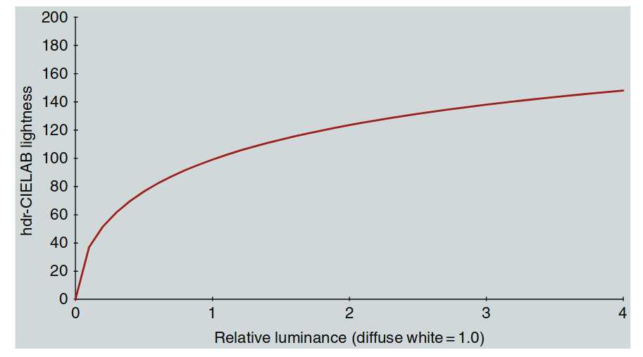
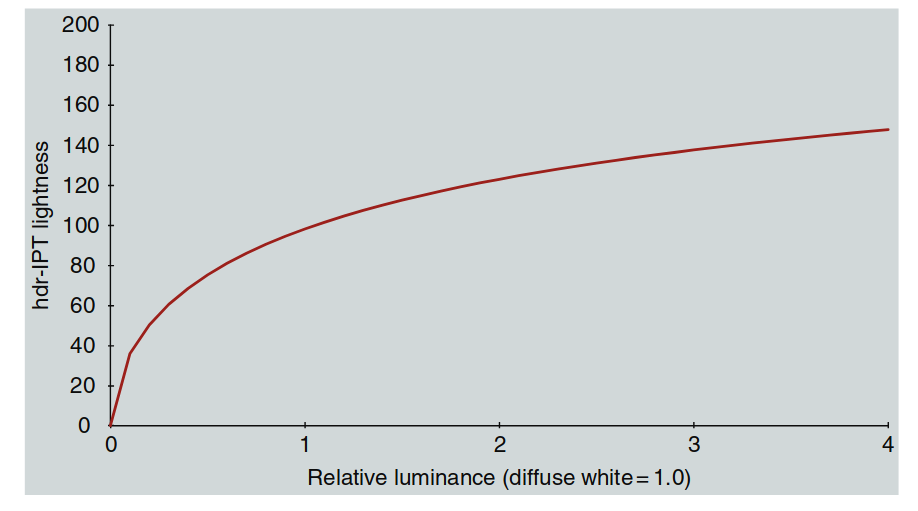
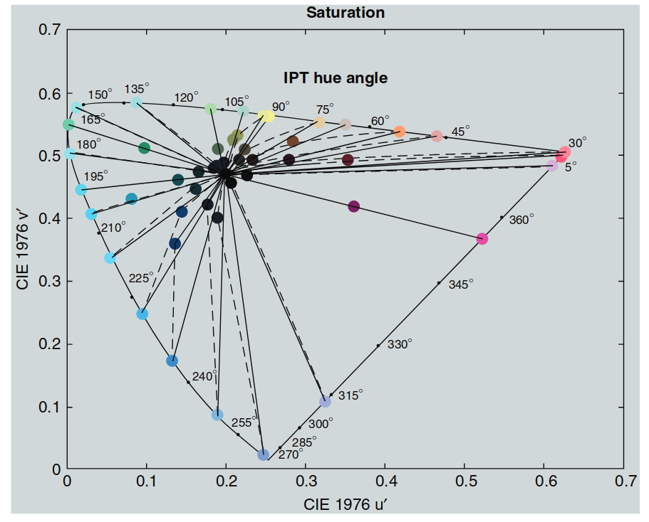
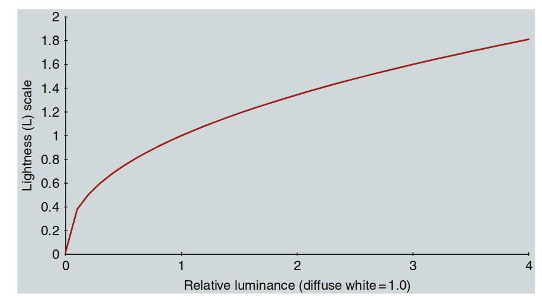
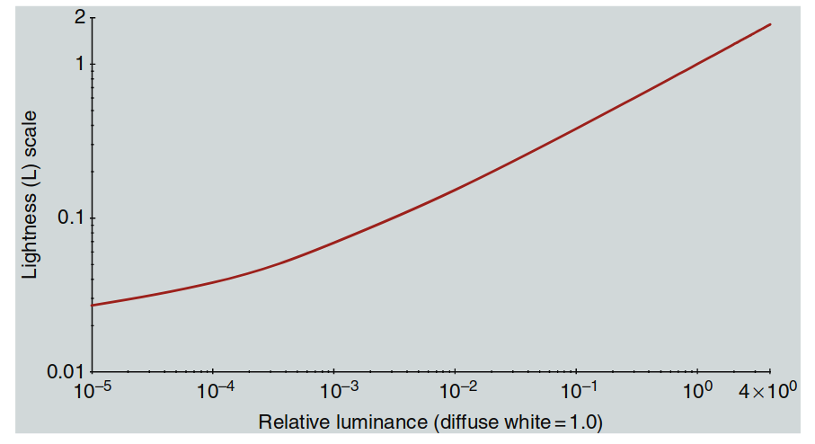
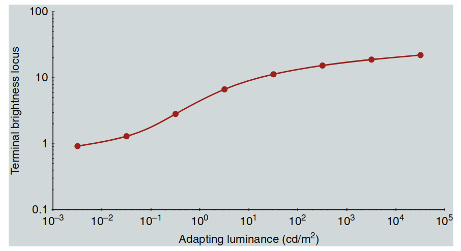

色彩科学主要研究材料的色貌模型，因此通常关注单一光照下材料反射的亮度范围。这种亮度动态范围一般在 20:1 到 90:1 之间。图像显示设备也有类似的限制。

这种有限的动态范围影响了色彩空间的设计，比如 CIELAB 就是典型的低动态范围色彩空间，所以不适合用在高动态范围（HDR）场景中。

动态范围指的是场景中最高亮度和最低亮度的比值。有时也用“位数”来表示，比如 8 位编码对应 255:1 的动态范围。但要注意，位数的意义取决于编码方式（线性或非线性）。另外，“挡位”（stops）也常用来描述动态范围，每增加一挡表示亮度加倍。

在成像中，普通场景通常有 256 级亮度（255:1 动态范围）。为了捕捉更多细节，这些级别通常采用非线性编码，相当于大约 12 位或 4000:1 的动态范围。因此，动态范围超过 4000:1 的场景或显示设备就被称为高动态范围（HDR）。

在自然界中，HDR 场景的亮度比往往远超 4000:1，因为存在高光、阴影和光源等因素。本章将探讨如何在 HDR 场景下进行色貌模型建模，以及其中遇到的挑战。

---

## 21.1 亮度动态范围

自然和人造环境中的亮度范围可以跨越 14 个数量级，从星光下的物体到直视太阳。例如，星光下的物体亮度约为 0.01 cd/m²，而直视阳光的亮度可达 100,000 cd/m²。由于安全和物理限制，我们不会直接观察最高亮度（如太阳），而最低亮度（如星光下的阴影）也不会与最高亮度同时出现，因为光散射会影响观察效果。

人类视觉系统通过**明适应**和**暗适应**机制，可以在这个宽广的亮度范围内正常工作，如下图所示：

  

  图 21.1：自然与人造场景中的亮度动态范围示意图，展示了视觉系统能够适应的不同亮度级别。

典型亮度级别示例如下：

- **星光**：0.01 cd/m²  
- **月光**：0.1 cd/m²  
- **夜间照明**：1 cd/m²  
- **黎明/黄昏**：10 cd/m²  
- **办公室照明**：100 cd/m²  
- **显示设备**：500 cd/m²  
- **阴天白天**：1000 cd/m²  
- **晴天白天**：10,000 cd/m²  
- **直射阳光**：100,000 cd/m²  

视觉系统的工作模式：

- **暗视觉（Scotopic）**：适用于星光和月光（由视杆细胞提供）。  

- **中间视觉（Mesopic）**：适用于夜间照明和黎明/黄昏（视杆细胞和视锥细胞共同作用）。  

- **明视觉（Photopic）**：适用于办公室照明及以上亮度（由视锥细胞提供）。  

---

**动态范围**是指在同一场景或显示器中同时存在的亮度级别范围。不同场景的动态范围差异较大，例如：

- **漫射光照下的哑光物体**：动态范围较低（约 20:1）。  
- **定向光照下的相同物体**：动态范围显著提高（约 100:1）。  
- **有深阴影和反射高光的场景**：动态范围可达数千比一。  
- **包含光源的场景**：动态范围可能高达百万比一，但由于光散射和间接照明，这种情况极为罕见。  

在高动态范围（HDR）场景中，某些元素的亮度可能超过漫反射白色（CIELAB 色彩空间中 L* = 100 的参考点），从而导致计算的 L* 值超过 100。这引发了关于 CIELAB 等色度模型在 HDR 条件下有效性的问题。

**相关研究**：

- **Kim 等人（2009）**：探讨了高亮度条件下的色貌模型建模。  

- **Reinhard 等人（2012）**：提出了 HDR 图像外观建模的一些新概念。  

这些研究为 HDR 场景下色貌模型建模提供了新的思路，但仍有许多挑战需要解决。

---

## 21.2 HDR 摄影调研

为了研究 HDR 场景和图像的测量、成像、外观和再现，需要一个可靠的数据集来测试各种算法和模型。**HDR 摄影调研**（Fairchild 2007, 2008）的目标就是创建这样一个数据集。该调研参考了早期美国西部的摄影调研，这些调研帮助建立了国家公园体系并保护了重要的自然环境。HDR 摄影调研生成了一套独特的图像、色度学场景数据、场景外观数据和校准数据。该数据集包含超过 100 张图像及相关数据，可通过以下网站免费获取：[HDR 摄影调研数据集](http://www.cis.rit.edu/fairchild/HDR.html)。

**数据收集过程**：

- **多重曝光**：大多数场景通过多次曝光采集，每次曝光相差一挡（stop），然后将这些曝光合成浮点 HDR 图像。  
- **色度学数据**：使用点测色计采集场景中的色度数据。  
- **外观数据**：通过视觉标度法收集场景的外观数据。  

  

  图 21.2：Apple Aperture 窗口，展示了实验室中构建的动态范围约为百万比一的测试场景的 18 次曝光，每次曝光相差一挡。

**图示说明**：

- **多重曝光**的目的是捕捉不同亮度水平下的细节。通过观察不同的曝光，可以看到场景中不同细节在不同曝光水平下的呈现。  
- **镜头眩光**是 HDR 成像的限制因素之一，在高动态范围场景中尤其明显。

#### HDR 图像示例

图 21.3 展示了一个 HDR 图像的例子，是日落 30 分钟后的**金门大桥**及背景中的旧金山。图中包括两种渲染方式：

1. **上图**：线性渲染，将最亮的光源映射到 8 位成像系统的最大亮度级别，其余亮度按比例降低。这种方式导致大部分图像非常暗。  
2. **下图**：使用**局部自适应模型**（如 iCAM 或 iCAM06）进行色调映射。该模型模拟人类视觉系统的响应，使暗部区域变亮，接近实际场景的视觉感受。

  

  图 21.3：HDR 图像的两种渲染方式。上图是线性渲染，下图通过局部自适应技术渲染，模拟了人类视觉系统的响应，接近真实观察体验。

#### 相关研究

- **Fairchild（2007）**：详细描述了 HDR 摄影调研的技术细节。  
- **Fairchild（2008）**：出版了一本短书，介绍了部分图像背后的故事和渲染技术。

HDR 摄影调研为 HDR 成像和色貌模型建模提供了重要的数据支持，广泛应用于计算机图形学、图像处理和视觉科学研究。

---

## 21.3 超越漫反射白的明度与亮度

在 HDR 研究中，除了获取场景数据，还需要探讨人类如何在适应白点（或漫反射白）之上的亮度水平下感知明度与亮度。**Chen 等人（2010）** 通过一系列实验，探索了两个关键问题：

1. **观察者如何感知漫反射白以上的明度差异？**  
2. **漫反射白以上明度的感知尺度如何？**  

他们进行了明度标度实验和差异匹配实验，设计了特殊的适应和刺激条件，以保持适应水平。实验结果如下：

**明度差异**  

   - 他们发现 **CIE DE2000 明度加权函数** 对漫反射白以上的明度差异表现良好。  
   - 若对该函数的系数进行微调，可以获得更优的结果。这表明，漫反射白以上的明度差异感知与 CIE DE2000 方程所建模的形式相似。

**明度尺度**  
  
   - 研究发现，感知明度的标度在相对亮度约为 **400（即漫反射白的 4 倍）** 之前，与 **CIELAB L\* 函数** 的拟合效果较好。  
   - 虽然根据具体数据拟合可能会产生表现更佳的函数，但由于数据存在不确定性，CIELAB L\* 函数仍可视为合理的拟合。

  

  图 21.4：CIELAB L\* 函数扩展到输入亮度范围为漫反射白的四倍。

#### 结论

- **明度差异感知**：漫反射白以上的明度差异可以用类似 CIE DE2000 的函数描述。  
- **明度尺度**：CIELAB L\* 函数在高达漫反射白 4 倍亮度范围内表现良好。

这为 HDR 场景下的明度感知建模提供了科学依据，同时也为扩展现有色貌模型模型到高动态范围提供了支持。

---

## 21.4 hdr-CIELAB

**背景概述：**
Fairchild 和 Chen 在 2011 年提出的 hdr-CIELAB 模型是 CIELAB 空间的延伸，专门用于适应高动态范围（HDR）的光照条件。他们通过用 Michaelis–Menton 函数代替 CIELAB 的三次根非线性函数，使得该模型在极低和极高亮度条件下表现更佳。

该模型的主要特点是增强了暗部阴影和高光部分的表现能力。其关键公式包括光亮度的非线性压缩函数以及 HDR 空间的参数计算方法。

---

**公式：**

  

    $$
    \epsilon = \frac{0.58}{sf \cdot lf} \tag{21.2}
    $$
  

其中：

- $sf = 1.25 - 0.25 \cdot \left(\frac{Y_s}{0.184}\right)$, 当 $0 < Y_s \leq 1.0$ (式 21.3)。
- $lf = \frac{\log(318)}{\log(Y_{ws})}$ (式 21.4)。

**解释：**

- **$\epsilon$** 表示在特定观看条件下的动态调整因子。
- **$sf$** 是围绕因子，表示环境对视觉效果的影响。
- **$lf$** 是亮度因子，考虑到了白点亮度 $Y_{ws}$ 的调整。

---

**hdr-CIELAB 参数计算：**

1. **明度 $L_{hdr}$:**
   

     

       $$
       L_{hdr} = f \left(\frac{Y}{Y_n}\right) \tag{21.5}
       $$
     

   

2. **对手颜色维度 $a_{hdr}$ 和 $b_{hdr}$:**
   

     

       $$
       a_{hdr} = 5 \cdot \left[f\left(\frac{X}{X_n}\right) - f\left(\frac{Y}{Y_n}\right)\right] \tag{21.6}
       $$
       $$
       b_{hdr} = 2 \cdot \left[f\left(\frac{Y}{Y_n}\right) - f\left(\frac{Z}{Z_n}\right)\right] \tag{21.7}
       $$
     

   

3. **饱和度 $c_{hdr}$ 和色调角 $h_{hdr}$:**
   

     

       $$
       c_{hdr} = \sqrt{a_{hdr}^2 + b_{hdr}^2} \tag{21.8}
       $$
       $$
       h_{hdr} = \arctan\left(\frac{b_{hdr}}{a_{hdr}}\right) \tag{21.9}
       $$
     

   

**应用场景：**
该模型被广泛应用于图像处理、HDR 显示技术等领域，特别是需要在高动态范围条件下保持色彩一致性和对比度的应用场景。

---

**图示说明：**

  

  图 21.5：hdr-CIELAB 空间的光亮度函数，输入范围为白点亮度的四倍。

---

## 21.5 hdr-IPT

**背景概述：**  
Fairchild 等人在 2011 年基于 Chen 等（2010）的研究，将传统的 IPT 色彩空间拓展到高动态范围（HDR）条件下。通过用 Michaelis-Menton 函数代替 IPT 色彩空间中的幂函数非线性函数，该模型在极低和极高亮度水平下表现更加优秀。

这种改进使得 hdr-IPT 色彩空间能够更好地处理阴影和高光部分，优化了色彩的表现能力。

---

**动态因子调整：**  

  

    $$
    \epsilon = 0.59 \cdot sf \cdot lf \tag{21.11}
    $$
  

其中：

- **$sf$** 表示围绕因子，用于模拟环境对视觉的影响：
  

    

      $$
      sf = 1.25 - 0.25 \cdot \left(\frac{Y_s}{0.184}\right) \quad (0 \leq Y_s \leq 1.0) \tag{21.12}
      $$
    

  

- **$lf$** 是亮度因子：
  

    

      $$
      lf = \frac{\log(318)}{\log(Y_{abs})} \tag{21.13}
      $$
    

  

---

**IPT 转换矩阵：**  

  

    $$
    \begin{bmatrix}
    L \\
    M \\
    S
    \end{bmatrix}
    =
    \begin{bmatrix}
    0.4002 & 0.7075 & -0.0807 \\
    -0.2280 & 1.1500 & 0.0612 \\
    0.0000 & 0.0000 & 0.9184
    \end{bmatrix}
    \cdot
    \begin{bmatrix}
    X_{D65} \\
    Y_{D65} \\
    Z_{D65}
    \end{bmatrix}
    \tag{21.14}
    $$
  

---

**非线性压缩：**  
根据输入的符号，分段计算：

  

    $$
    L' = f(L); \quad L \geq 0, \quad L' = -f(-L); \quad L < 0 \tag{21.15}
    $$
  

同理计算：

  

    $$
    M' = f(M); \quad M \geq 0, \quad M' = -f(-M); \quad M < 0 \tag{21.16}
    $$
    $$
    S' = f(S); \quad S \geq 0, \quad S' = -f(-S); \quad S < 0 \tag{21.17}
    $$
  

---

**hdr-IPT 参数计算：**  

  

    $$
    \begin{bmatrix}
    I_{hdr} \\
    P_{hdr} \\
    T_{hdr}
    \end{bmatrix}
    =
    \begin{bmatrix}
    0.4000 & 0.4000 & 0.2000 \\
    0.4550 & -4.8510 & 0.3960 \\
    0.8056 & 0.3572 & -1.1628
    \end{bmatrix}
    \cdot
    \begin{bmatrix}
    L' \\
    M' \\
    S'
    \end{bmatrix}
    \tag{21.18}
    $$
  

---

**饱和度与色调角：**  

- 饱和度：
  

    

      $$
      c_{hdr-IPT} = \sqrt{P_{hdr}^2 + T_{hdr}^2} \tag{21.19}
      $$
    

  

- 色调角：
  

    

      $$
      h_{hdr-IPT} = \arctan\left(\frac{T_{hdr}}{P_{hdr}}\right) \tag{21.20}
      $$
    

  

---

  

  图 21.6：hdr-IPT 空间的光亮度函数，输入范围为白点亮度的四倍。

---

**总结：**  
hdr-IPT 通过非线性压缩函数优化了传统 IPT 空间，使其在高动态范围条件下的色彩表现更为自然。适用于 HDR 图像处理与显示技术，特别是在极端亮度条件下需要精准控制色彩的场景。

---

## 21.6 Evans 的 G0 和光辉度

**背景概述：**  
Ralph Evans 是一位历史上具有影响力的柯达科学家，他在色貌模型和色彩再现方面进行了开创性研究。他的著作《The Perception of Color》（1974）引入了两个重要概念：**G0（零灰值）** 和 **Brilliance（光辉度）**。这些概念为色貌模型建模提供了新的思路。

Evans 的 G0 概念不仅仅是一个理论描述，它在解释亮度、饱和度以及明度/亮度之间的关系上具有重要意义。以下是对 G0 和光辉度的核心内容和示例进行解析。

---

**G0 的定义与示例：**  
G0（零灰值）是指一个刺激从“物体外观”（具有灰色成分）到“光源外观”（无灰色成分）的转变时的亮度值。这一转变的亮度值取决于刺激的色度和周围的适应条件。

- **示例：**
  - 假设背景为白色，并有一个橙色光点，其亮度可以调节，同时不影响背景或橙色光点的色度。
  - 当光点的亮度接近零时，它看起来是黑色。
  - 随着亮度增加，光点从深棕色（暗橙）转变为橙色。
  - 当亮度进一步增加时，光点开始看起来像一个发光的橙色光源，而非反射的物体。
  - 最后，随着亮度继续增加，光点会显得像更亮的橙色光源。

  **关键点：**  
  - 棕色到橙色的转变只是颜色名称的变化，暗橙通常被称为“棕色”。
  - 从“橙色物体”到“橙色光源”的转变发生在特定的亮度值，这一亮度值即为 **G0**。

---

**光辉度（Brilliance）：**  

Evans 定义了光辉度作为相对于 G0 的亮度位置。
- 在 G0 的亮度值下，所有颜色具有相同的光辉度。
- 光辉度较高的颜色表现为光源（亮度高于 G0），而光辉度较低的颜色表现为暗色物体（亮度远低于 G0）。

---

**G0 的特性与重要性：**  

1. **色度和亮度的关系：**  
   G0 的亮度值不仅取决于刺激的色度，还与环境条件相关。  
   例如：
   - 高饱和度的颜色，其 G0 亮度值可能远低于白色亮度。
   - 这意味着某些颜色在比白色亮度低得多的情况下也可能表现出“发光”的外观。

2. **均等色彩亮度的定义：**  
   在 G0 水平上，不同色度的刺激在感知上具有相等的亮度。这种均等亮度可以被视为一种“校正后的亮度”，自动调整了 Helmholtz–Kohlrausch 效应的影响。

3. **当前挑战：**  
   尽管 G0 是一个重要的概念，但目前尚无简单的数学模型来精确描述 G0。

---

**总结：**  

Evans 的 G0 和光辉度概念为亮度、饱和度与明度/亮度之间的关系提供了关键洞察。这可能是色貌模型模型中缺失的重要组成部分。未来的研究需要进一步探索 G0 的数学建模，并在色貌模型模型中整合这一概念。

---

## 21.7 Nayatani 理论色彩空间

**背景概述：**  
Nayatani 在其职业生涯晚期（2003 年、2004 年）发表了不同形式的色彩模型，被称为 Nayatani 理论色彩空间（NT 色彩空间）。虽然在某些方面，NT 空间可以被视为 Nayatani 等人（详见第 11 章）色貌模型模型的延伸，但它还融入了一些基于 NCS 系统和 Evans 的 G0/光辉度概念的新思路。

---

**NT 色彩空间的特点：**  

**色域扩展技术：**  
NT 色彩空间被用于一种色域映射技术，旨在扩展色彩以填充大色域（Heckaman 等，2008、2009、2011；Fairchild，2008a）。这一技术的核心思想是：

- **G0 边界内的颜色饱和度不应扩展。**
- **G0 边界外的颜色可以自由扩展以填充色域，形成更明亮的光源。**
- 对于深色部分，也扩展了类似的概念。

**中性灰的定义：**  
NT 色彩空间将中性灰定义为其核心成分。

- 对于中性色彩，定义了“白度-黑度”两个尺度，其中中性灰在这两个尺度上均为零。这在概念上类似于 NCS，但数值上有所不同。

**三角形结构：**  
对于每种特定的色调，NT 空间构建了一个类似于 NCS 色调平面的三角形：

- 三角形的三个顶点分别为“白色”、“黑色”和“最大色度”。
- 随着从三角形中心向更明亮的色度边界移动，灰度减少，颜色看起来更亮且更具色彩感，最终到达 **G0 边界**。

**深色的 G0 边界：**  
Nayatani 还定义了一个朝向更深、更暗色彩方向的灰度减少路径，并提出了一个暗部 G0 边界。尽管从 Evans 的理论来看，这一暗部边界可能更具争议，但 Nayatani 认为其在直观上是合理的。

---

**总结：**  
NT 色彩空间在保留 G0 和光辉度定义的同时，为色域扩展提供了指导。通过限制 G0 内部的饱和度扩展，并允许 G0 外部的色彩扩展以填充色域，它在色貌模型建模和色域映射领域展现了强大的适应性。同时，NT 色彩空间在灰度减少和 G0 边界的定义上提出了创新的思路，特别是在深色区域的扩展中进一步发展了 G0 理论。
---

## 21.8 一种新的色貌空间

**背景概述：**  
Fairchild 和 Heckaman 在 2012 年提出了一种新的色貌模型建模方法，这种方法不再试图创建一个三维欧几里得色彩空间。他们假设，构建三维欧几里得空间的需求可能会限制精确刻画色貌模型量表（或精确的色差指标）的能力。

实际上，色彩科学中有许多基于独立维度描述色彩感知的例子。例如：

- 曼塞尔系统（Munsell System），尽管常以三维色彩空间的形式呈现，但它本质上是基于独立的三个感知维度：色相（hue）、明度（value）和色度（chroma）建立的。
  
- Guth 的 ATD 视觉感知模型，也通常以独立维度的形式描述，尽管某些例子中会将这些维度合并在一起进行可视化。

- CIECAM02 色貌模型模型，通过预测六种感知维度（亮度、明度、色彩感、饱和度、色度和色相），为感知色彩提供了独立的刻画。然而，CIECAM02 的矩形坐标体系在某种程度上妥协了这种独立性。

---

**独立的一维感知空间假设：**  
Fairchild 和 Heckaman 提出，或许色彩本质上是一维的感知空间集合，而非三维空间。

- 六个独立维度是必要的：对于相关色彩，包括明度（lightness）、饱和度（saturation）和色相（hue）。绝对亮度的信息可以从这些维度中推导出色彩感（colorfulness）和亮度（brightness），这些属性也极为重要和实用。

- 色度（chroma）则可以从明度（lightness）和饱和度（saturation）推导，作为一种相对的色彩感度量。

- 总而言之，色彩可以通过六个一维的感知空间完全描述，其中四个是基本的，两个是从基本维度派生的。

---

**模型框架和实现：**  

- 首先，应用色适应模型（例如 CAT02）计算参考视条件下的对应色彩（例如 D65，315 cd/m²）。

- 接着，使用 IPT 模型计算色相角度（h），并基于 NCS 独特色相计算色相成分（H）。对于每种色相，通过经典的激发纯度公式，在 u′v′ 色度图中沿恒定 h 的线计算饱和度（S）。

- 以 Evans 的 G0 为参考定义零灰度亮度，用于计算明度（L）。这种计算基于一种偏移的幂函数模型。

- 饱和度优先于色度，因为它与物理刺激有更直接的关系，其他色度维度可以轻松从中派生。

- 从明度（L）和饱和度（S）以及绝对亮度信息，进一步推导出亮度（brightness, Q）和色彩感（colorfulness, M）。

---

**关键公式与图示：**

- 饱和度计算公式：
  

    

      $$
      S = \frac{\sqrt{(u' - u'_n)^2 + (v' - v'_n)^2}}{\sqrt{(u'_L - u'_n)^2 + (v'_L - v'_n)^2}} \tag{21.21}
      $$
    

  

  
  其中：
  - \( u', v' \) 是刺激的色度坐标。
  - \( u'_n, v'_n \) 是 D65 白点的色度坐标。
  - \( u'_L, v'_L \) 是在同一色相角下光谱位置的色度坐标。

- 明度计算公式：
  

    

      $$
      L = 0.98 \cdot \left( \frac{Y}{Y_{G0}} \right)^{1/2.3} + 0.02 \tag{21.22}
      $$
    

  

  
  其中 \( Y \) 是刺激的亮度，\( Y_{G0} \) 是 G0 时的亮度。

- 亮度计算公式：
  

    

      $$
      Q = Q_{tbl} \cdot L \tag{21.23}
      $$
    

  

  
  其中 \( Q_{tbl} \) 是基于 Stevens 和 Stevens 的终端亮度函数计算得出的：
  

    

      $$
      Q_{tbl} = 0.60 \cdot \log_{10}\left(1 + 0.06 \cdot Y_W^{0.65}\right) \tag{21.24}
      $$
    

  

  
  \( Y_W \) 是 D65 白点的亮度。

---

  

  图 21.7：在 u′v′ 色度图中基于 IPT 色相计算饱和度的示例。

  

  图 21.8：在线性比例下绘制的明度函数，范围为漫射白亮度的四倍。

  

  图 21.9：在对数比例下绘制的明度函数，范围为漫射白亮度的四倍。

  

  图 21.10：终端亮度轨迹图，展示适应亮度的函数拟合结果。

---

**总结：**  
这种基于一维感知量表的建模方法可以在各种适应条件下，以及低动态范围或高动态范围场景中，精确描述光源和物体的色貌模型。通过避免几何假设，单独计算每个维度的差异，可以更加精确地描述色差并适应多样化的应用场景。

---

## 21.9 未来方向

**当前现状：**  
探讨一个领域的未来方向，首先需要了解目前的现状。在色貌模型建模中，外观维度（如亮度、明度、色彩感、饱和度、色度和色相）的定义非常清晰且被广泛理解。然而，从物理测量中准确预测这些感知仍有许多问题需要解决，包括但不限于：

- 精确的颜色匹配函数与观察者间的差异性。
- 更加精确的色彩适应模型。
- 外观量表模型及其实现的更加严格定义。
- 对刺激的空间和时间属性及感知的理解。
- 综合所有领域和尺度的知识以提供更全面的模型。

尽管色貌模型建模已经取得了长足的进步，但仍有很长的路要走。

---

**新的建模思路：**  
多维色貌模型和色差表示往往存在明显的局限性。或许，我们需要将色貌模型的各个维度分开处理，将其视为独立的感知，而不是一个多维“色彩”感知的部分。这种方法不但不会带来负面影响，甚至可能带来新的突破。

即便在 CIECAM02 中，也可以采用独立的一维方法进行建模。这种方法显示出了很大的潜力。然而，要使这种方法更加准确和广泛应用，还需要更多的实验数据。这些数据需要通过以下研究来支持：

- 感知匹配研究。
- 适应过程的深入探索。
- 外观量表和阈值的扩展研究。

当前工业研究的稀缺使得这一任务落在了大学和学生身上。然而，研究资金的不足可能限制了这一领域的发展。

---

**实践建议：**  

**使用色貌模型模型的原则：**  
- 色貌模型模型仅在**绝对必要**的情况下使用。如果通过调整观察条件就可以避免对外观进行转换，这是最优的选择。

**推荐模型选择：**  
- 如果需要完整的色貌模型模型，Hunt 模型是最佳选择。
- 如果不需要复杂的预测，CIECAM02 是一个合适的选择。
- 在某些情况下，CIELAB 甚至可能足够胜任。

**模型选择建议（按复杂度递增排序）：**  

- 如果可能，调整观察条件，使得简单的三刺激匹配也能满足外观匹配的要求。

- 如果需要改变白点，可以首先尝试使用 CIELAB，它是一个合理的第一阶近似外观模型。

- 如果发现 CIELAB 不足，可以通过对视锥响应的 von Kries 色适应转换（或基于 CIECAM02 的 MCAT02 矩阵转换）进行改进。

- 如果需要更灵活的适应模型（例如，从硬拷贝到软拷贝的变化）或存在环境变化，可以使用 RLAB 模型，同时改进其适应转换。

- 如果需要对观察条件和刺激进行严格控制，或者需要预测亮度和色彩感，可以选择 CIECAM02 模型。

- 如果需要全面处理外观现象（包括非常高或低的亮度，视杆响应等），Hunt 模型是最佳选择。

- 对于探索者，可以尝试本章提出的独立外观量表方法，收集更多数据并发表研究结果以改进现状。

---

**未来方向：**  
未来的研究需要更多关于色彩感知和外观尺度的实验和数据，这将帮助改进和发展色貌模型建模。大学和研究机构需要承担起这项任务，同时也需要可靠的资金支持来推动这一领域的发展。

---

**总结：**  
Fairchild 和 Heckaman 提出的独立量表方法，结合色彩科学的最新发现，为色貌模型建模提供了新的视角。通过更加系统和精确地分离各个感知维度，可以更好地理解和预测色彩感知。这不仅是解决当前局限性的重要一步，也为未来的研究指明了方向。
