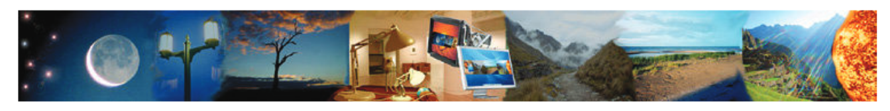
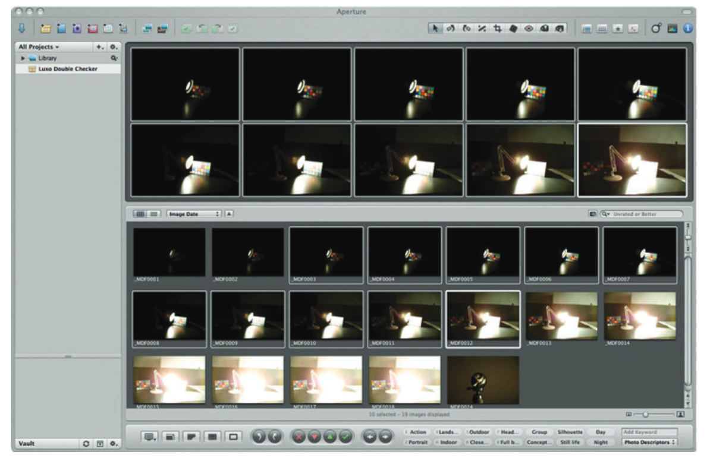
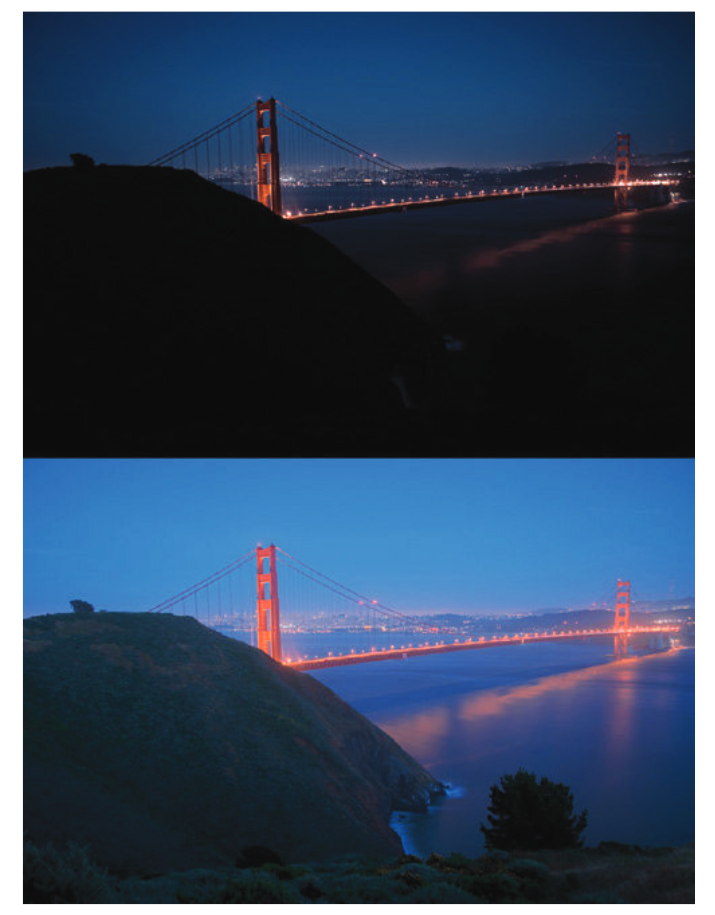
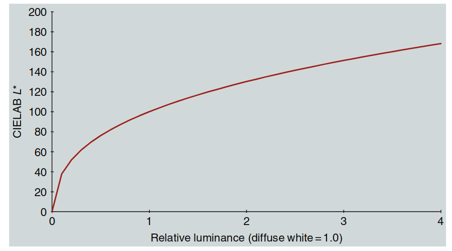

色彩科学主要研究材料的色彩外观，因此通常关注单一光照下材料反射的亮度范围。这种亮度动态范围一般在 20:1 到 90:1 之间。图像显示设备也有类似的限制。

这种有限的动态范围影响了色彩空间的设计，比如 CIELAB 就是典型的低动态范围色彩空间，所以不适合用在高动态范围（HDR）场景中。

动态范围指的是场景中最高亮度和最低亮度的比值。有时也用“位数”来表示，比如 8 位编码对应 255:1 的动态范围。但要注意，位数的意义取决于编码方式（线性或非线性）。另外，“挡位”（stops）也常用来描述动态范围，每增加一挡表示亮度加倍。

在成像中，普通场景通常有 256 级亮度（255:1 动态范围）。为了捕捉更多细节，这些级别通常采用非线性编码，相当于大约 12 位或 4000:1 的动态范围。因此，动态范围超过 4000:1 的场景或显示设备就被称为高动态范围（HDR）。

在自然界中，HDR 场景的亮度比往往远超 4000:1，因为存在高光、阴影和光源等因素。本章将探讨如何在 HDR 场景下进行色彩外观建模，以及其中遇到的挑战。

---

## 21.1 亮度动态范围

自然和人造环境中的亮度范围可以跨越 14 个数量级，从星光下的物体到直视太阳。例如，星光下的物体亮度约为 0.01 cd/m²，而直视阳光的亮度可达 100,000 cd/m²。由于安全和物理限制，我们不会直接观察最高亮度（如太阳），而最低亮度（如星光下的阴影）也不会与最高亮度同时出现，因为光散射会影响观察效果。

人类视觉系统通过**明适应**和**暗适应**机制，可以在这个宽广的亮度范围内正常工作，如下图所示：

  

  图 21.1：自然与人造场景中的亮度动态范围示意图，展示了视觉系统能够适应的不同亮度级别。

典型亮度级别示例如下：

- **星光**：0.01 cd/m²  
- **月光**：0.1 cd/m²  
- **夜间照明**：1 cd/m²  
- **黎明/黄昏**：10 cd/m²  
- **办公室照明**：100 cd/m²  
- **显示设备**：500 cd/m²  
- **阴天白天**：1000 cd/m²  
- **晴天白天**：10,000 cd/m²  
- **直射阳光**：100,000 cd/m²  

视觉系统的工作模式：

- **暗视觉（Scotopic）**：适用于星光和月光（由视杆细胞提供）。  

- **中间视觉（Mesopic）**：适用于夜间照明和黎明/黄昏（视杆细胞和视锥细胞共同作用）。  

- **明视觉（Photopic）**：适用于办公室照明及以上亮度（由视锥细胞提供）。  

---

**动态范围**是指在同一场景或显示器中同时存在的亮度级别范围。不同场景的动态范围差异较大，例如：

- **漫射光照下的哑光物体**：动态范围较低（约 20:1）。  
- **定向光照下的相同物体**：动态范围显著提高（约 100:1）。  
- **有深阴影和反射高光的场景**：动态范围可达数千比一。  
- **包含光源的场景**：动态范围可能高达百万比一，但由于光散射和间接照明，这种情况极为罕见。  

在高动态范围（HDR）场景中，某些元素的亮度可能超过漫反射白色（CIELAB 色彩空间中 L* = 100 的参考点），从而导致计算的 L* 值超过 100。这引发了关于 CIELAB 等色度模型在 HDR 条件下有效性的问题。

**相关研究**：

- **Kim 等人（2009）**：探讨了高亮度条件下的色彩外观建模。  

- **Reinhard 等人（2012）**：提出了 HDR 图像外观建模的一些新概念。  

这些研究为 HDR 场景下色彩外观建模提供了新的思路，但仍有许多挑战需要解决。

---

# 21.2 HDR 摄影调研

为了研究 HDR 场景和图像的测量、成像、外观和再现，需要一个可靠的数据集来测试各种算法和模型。**HDR 摄影调研**（Fairchild 2007, 2008）的目标就是创建这样一个数据集。该调研参考了早期美国西部的摄影调研，这些调研帮助建立了国家公园体系并保护了重要的自然环境。HDR 摄影调研生成了一套独特的图像、色度学场景数据、场景外观数据和校准数据。该数据集包含超过 100 张图像及相关数据，可通过以下网站免费获取：[HDR 摄影调研数据集](http://www.cis.rit.edu/fairchild/HDR.html)。

**数据收集过程**：

- **多重曝光**：大多数场景通过多次曝光采集，每次曝光相差一挡（stop），然后将这些曝光合成浮点 HDR 图像。  
- **色度学数据**：使用点测色计采集场景中的色度数据。  
- **外观数据**：通过视觉标度法收集场景的外观数据。  

  

  图 21.2：Apple Aperture 窗口，展示了实验室中构建的动态范围约为百万比一的测试场景的 18 次曝光，每次曝光相差一挡。

**图示说明**：

- **多重曝光**的目的是捕捉不同亮度水平下的细节。通过观察不同的曝光，可以看到场景中不同细节在不同曝光水平下的呈现。  
- **镜头眩光**是 HDR 成像的限制因素之一，在高动态范围场景中尤其明显。

### HDR 图像示例

图 21.3 展示了一个 HDR 图像的例子，是日落 30 分钟后的**金门大桥**及背景中的旧金山。图中包括两种渲染方式：

1. **上图**：线性渲染，将最亮的光源映射到 8 位成像系统的最大亮度级别，其余亮度按比例降低。这种方式导致大部分图像非常暗。  
2. **下图**：使用**局部自适应模型**（如 iCAM 或 iCAM06）进行色调映射。该模型模拟人类视觉系统的响应，使暗部区域变亮，接近实际场景的视觉感受。

  

  图 21.3：HDR 图像的两种渲染方式。上图是线性渲染，下图通过局部自适应技术渲染，模拟了人类视觉系统的响应，接近真实观察体验。

### 相关研究

- **Fairchild（2007）**：详细描述了 HDR 摄影调研的技术细节。  
- **Fairchild（2008）**：出版了一本短书，介绍了部分图像背后的故事和渲染技术。

HDR 摄影调研为 HDR 成像和色彩外观建模提供了重要的数据支持，广泛应用于计算机图形学、图像处理和视觉科学研究。

---

# 21.3 超越漫反射白的明度与亮度

在 HDR 研究中，除了获取场景数据，还需要探讨人类如何在适应白点（或漫反射白）之上的亮度水平下感知明度与亮度。**Chen 等人（2010）** 通过一系列实验，探索了两个关键问题：

1. **观察者如何感知漫反射白以上的明度差异？**  
2. **漫反射白以上明度的感知尺度如何？**  

他们进行了明度标度实验和差异匹配实验，设计了特殊的适应和刺激条件，以保持适应水平。实验结果如下：

**明度差异**  

   - 他们发现 **CIE DE2000 明度加权函数** 对漫反射白以上的明度差异表现良好。  
   - 若对该函数的系数进行微调，可以获得更优的结果。这表明，漫反射白以上的明度差异感知与 CIE DE2000 方程所建模的形式相似。

**明度尺度**  
  
   - 研究发现，感知明度的标度在相对亮度约为 **400（即漫反射白的 4 倍）** 之前，与 **CIELAB L\* 函数** 的拟合效果较好。  
   - 虽然根据具体数据拟合可能会产生表现更佳的函数，但由于数据存在不确定性，CIELAB L\* 函数仍可视为合理的拟合。

  

  图 21.4：CIELAB L\* 函数扩展到输入亮度范围为漫反射白的四倍。

### 结论

- **明度差异感知**：漫反射白以上的明度差异可以用类似 CIE DE2000 的函数描述。  
- **明度尺度**：CIELAB L\* 函数在高达漫反射白 4 倍亮度范围内表现良好。

这为 HDR 场景下的明度感知建模提供了科学依据，同时也为扩展现有色彩外观模型到高动态范围提供了支持。

---

