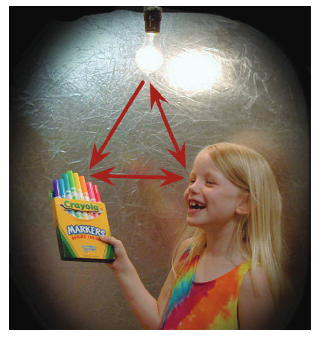
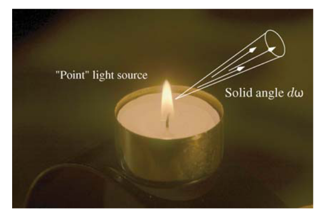
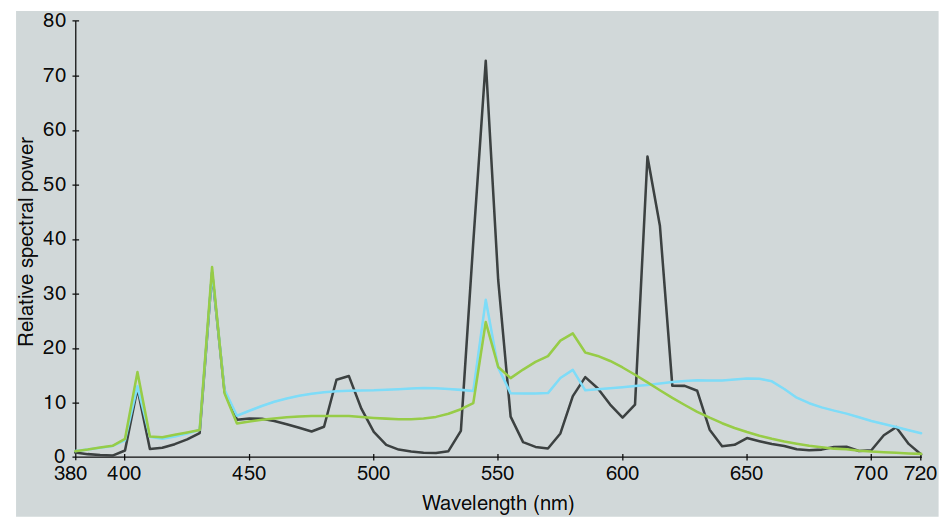
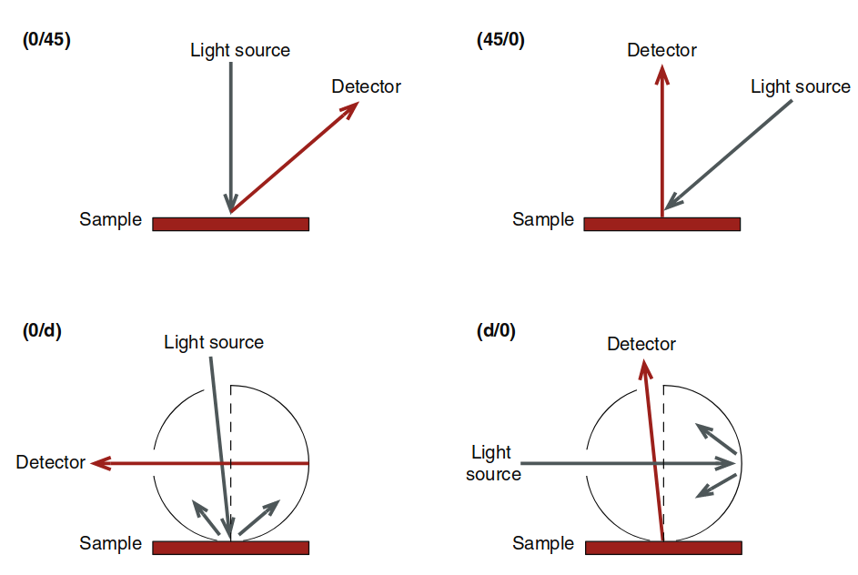
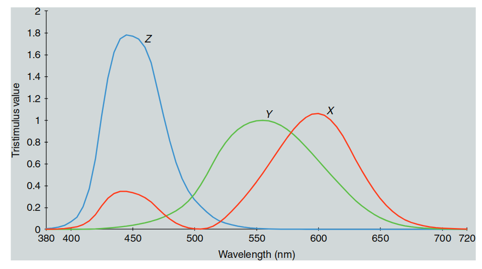

# 色度学（Colorimetry）

色度学是**色貌规范**的基础。本章回顾了根据**CIE（国际照明委员会）**系统建立的色度学实践，这一系统自1931年确立以来，已成为国际标准。CIE系统定义了平均观察者的颜色匹配方式，并在长达65年间经受住了技术发展的挑战，仍然被广泛应用（Fairchild, 1993b；Wright, 1981b）。

---

然而，CIE色度学只是一个起点。色貌模型的开发旨在超越简单的颜色匹配，预测刺激在不同观看条件下的实际外观表现。本章旨在为色貌模型的发展奠定基础，并对色度学的基本概念进行概述。

---

**色度学的基础与参考文献**  
尽管本章不打算涵盖色度学的全部内容，但已有许多优秀的参考文献可供进一步学习：

- **入门读物**：Hunt和Pointer（2011），Ohta和Robertson（2005），Berns（2000），Hunt（1991a），Berger-Schunn（1994），Kuehni（2005），Hunter和Harold（1987）。

- **权威定义**：CIE发布的主要参考文献《CIE Publication 15.2》（1986年）和《CIE Publication 15.3》（2004年）。

- **经典参考书**：Wyszecki和Stiles（1982年）的《Color Science》，尽管已有三十多年，但依然是该领域的关键文献，其中许多问题至今仍未解决。

- **数学与理论**：Cohen（2001年）对视觉颜色匹配的数学与理论进行了深入分析；Koenderink（2010年）则提供了独特的色度学数学处理。

- **物理属性的研究**：Tilley（2011年）探讨了与颜色和材料相关的物理特性。

---

通过这些参考文献，研究者可以深入了解色度学的数学理论、实践应用以及发展背景，从而更好地理解色彩科学的基础。本章的概述将为后续的颜色外观模型发展铺平道路，帮助读者理解如何将色度学扩展到预测各种观看条件下的颜色外观。

---

## 3.1 基础与高级色度学（Basic and Advanced Colorimetry）

色度学简单来说就是**颜色的测量**。Wyszecki（1973）区分了基础色度学与高级色度学，这一划分为本书的核心内容提供了理论基础，并至今仍然备受重视。在此，有必要引用Wyszecki的原话来阐述这一区分的意义。

---

**基础色度学**  
根据Wyszecki（1973: 21）的描述：  
> 色度学，严格来说，是一种用于预测在特定观察条件下，两种具有不同光谱功率分布的光（视觉刺激）是否在颜色上匹配的工具。预测的依据是确定这两种视觉刺激的三刺激值。如果两种刺激的三刺激值完全一致，则对具有正常色觉的平均观察者而言，它们在视觉上会被视为颜色匹配。

---

**高级色度学**  
Wyszecki（1973: 21）进一步描述了高级色度学的领域：  
> 广义上的色度学包括了评估复杂环境中呈现给观察者的颜色刺激外观的方法，这类环境常见于日常生活中。这被认为是色度学的终极目标，但由于其极高的复杂性，目前尚未完全实现。然而，针对某些更具体的色貌预测问题，研究已取得了部分进展。例如，颜色差异、白度和色彩适应的测量便是其中的典型应用。尽管这些问题仍未完全解决，但它们的发展具有重要的理论和实践价值。

---

本章重点介绍了**基础色度学的经典技术**，这些技术构成了**色貌模型**（color appearance modeling）的基础。此外，还将讨论一些广泛应用于颜色差异测量的方法，这也是高级色度学的核心目标之一。  

Wyszecki关于基础色度学与高级色度学的区分，突出了本书的研究重点：通过模型开发和研究，将基础色度学的应用扩展到高级色度学的目标，即预测复杂条件下的色貌表现。

---

## 3.2 为什么会有颜色？（Why is Color?）

在讨论颜色测量之前，必须先了解颜色的本质。图 3.1 形象地回答了这个问题——“为什么会有颜色？”比起“什么是颜色？”这样的提问，“为什么”更合适，因为颜色并不是一种简单的事物，无法轻易向从未体验过颜色的人解释。颜色是一种由环境和观察者大脑共同产生的过程，而不是独立于观察者存在的对象。

---

  

  图 3.1：颜色的三角关系——颜色来源于光源、物体与人类视觉系统的相互作用。

颜色的产生依赖于图 3.1 中用红色箭头标出的三角关系中的三个要素：**光源、物体、人类视觉系统**。颜色不仅仅是视觉感知的一种属性，它的出现取决于这些要素的交互：

1. **光源**：可见光的电磁能量是视觉感知的起点。  
2. **物体**：物体的物理和化学特性调制光能量，使其反射或透射。  
3. **人类视觉系统**：调制后的光通过眼睛成像，被光感受器捕捉，并经过视觉系统的神经处理，最终形成颜色感知。

---

**三角关系中的相互作用**  
在图 3.1 中，光源与视觉系统之间用箭头连接，表示光源通过**色彩适应**（chromatic adaptation）等机制对色貌产生影响。同时，观察者与物体之间的双向箭头表明，观察者对物体及其环境的认知也会影响其外观的感知。

---

**颜色测量的系统化**  
既然颜色的产生依赖于光源、物体和人类视觉系统的相互作用，那么要构建可靠的物理色度学系统，必须对这三方面进行量化：  

- **光源**：通过其**光谱功率分布**进行量化，并以标准光源的形式定义。  
- **物体**：通过其反射或透射能量的几何和光谱分布进行表征。  
- **视觉系统**：通过颜色匹配特性量化人眼的初级响应，即光色素的吸收特性。

---

因此，色度学结合了**物理学**、**化学**、**心理物理学**、**解剖学**、**生理学**和**心理学**等领域的技术与研究成果。这种跨学科的融合为我们提供了测量颜色及其感知的工具，帮助我们构建精确的色貌模型，用于预测不同条件下的颜色感知表现。

---

## 3.3 光源与标准照明体（Light Sources and Illuminants）

在颜色三角关系中，光源是第一个关键组成部分。光源为视觉反应提供了必要的电磁能量。在基础色度学中，光源的颜色属性通过**测量**和**标准化**两种方式进行描述。这两种方式的差异体现在光源与标准照明体的定义中。

---

**光源与标准照明体的区别**  

- **光源**：指实际存在的可见能量发射体，如白炽灯泡、天空或荧光灯管。

- **标准照明体**：是代表特定光源光谱功率分布的标准化数值表。例如：
  - **CIE标准照明体A**：代表典型的白炽光源。
  - **CIE标准照明体D65**：表示相关色温（CCT）约为6500K的平均日光。
  - **CIE标准照明体F2**：代表典型的荧光光源。

---

**光源与标准照明体的匹配**  
有些标准照明体有对应的物理光源。例如，CIE光源A是一种特定类型的白炽灯，其光谱功率分布与标准照明体A相匹配。然而，其他标准照明体则没有对应的物理光源。  

- **D65** 只是平均日光的统计表示，并没有任何实际光源能够完全再现其光谱功率分布。因此，不存在CIE光源D65。

---

**色貌规范中的应用**  
在色貌规范中，必须区分实际光源与标准照明体。由于实际光源的光谱功率分布与用于模拟的标准照明体可能存在显著差异，因此在色度计算中，必须使用实际光源的光谱功率分布来确保色貌预测的准确性。

> **译者注：**这俩概念其实挺拗口的，一个是实际存在的，一个是理论的——那么为何要这个理论的‘照明体’概念呢？是为了规范和标准化，毕竟你那里的日光和我这里的日光很可能不一
> 样，那么我们使用一个平均的日光来测试——这个平均的日光就是照明体

---

### 3.3.1 光谱辐射测量（Spectroradiometry）

光源的光谱功率分布由**光谱辐射测量**（spectroradiometry）进行测定。这是一种随波长变化的辐射量测量技术。在颜色测量中，感兴趣的波长范围通常覆盖从约400 nm（紫光）到700 nm（红光）之间的电磁能量。

---

**辐射度学（Radiometry）**  

> 译者注:本段全文都是我写的，原文讲解缺乏条理，我尝试一次性把这些概念讲清楚

A. 光是一种电磁波，具有能量，有辐射现象

就是所谓辐射能量**Radiant energy**，使用$Q_e$表示，单位是焦耳$J$

B. 辐射随时间变化

就是功率**Radiant power**, 使用$P_e$表示，单位是瓦特$W$

$$p_e=\frac{dQ_e}{dt}$$

C. 辐射在空间上的分布

一个光源在一个方向上或者一个平面上辐射的强度可能不同，就引出了辐射出射率**Radiant exitance**和辐照度**Irradiance**

- Radiant exitance，$M_e$

$$M_e=\frac{dP_e}{dA_e}$$

- Irradiance, $E_e$

$$E_e=\frac{dP_e}{dA_e}$$

如下图，更加清晰：

  

  图：radiance exitance

  

  图：irradiance

D. 辐射的方向性

因为光源本身是有方向性的，所以我们需要一种度量去表述辐射在不同方向上的强度，就引出了辐射强度**Radiant intensity**$I_e$

- Radiant Intensity, $I_e$,单位是瓦特每球面度，$W/sr$

$$I_e=\frac{dP_e}{d\omega}$$

  

  图：radiant intensity

E. 辐射在空间和方向上的分布

当我们想要精准模拟光线，那么就需要考虑辐射能量如何在单位面积和单位立体角上的具体情况是啥，就引出了辐射亮度**Radiance**的概念

- Radiance, $L_e$。表述了单位面积，单位立体角的辐射功率，即在某个方向上的能量分布。当光线以角度（就是表面物体和法线的角度）$\theta$入射时，仅其垂直于表面的分量对亮度有作用，所以，通过$dA*cons\theta$来**修正入射角对单位面积投影的影响**。

$$L_e=\frac{d{^2}P_e}{dAcos\theta d\omega}$$

下图中可视化很好的解释了这点：

---

  

  图：radiance示意图

> 这时候就不得不提到BRDF(双向反射分布函数)：**微小入射辐照度$dE$在出射方向$w_r$产生的反射辐射亮度$dL_r(\omega_r)$的比例**。更加通俗来说，和我们中学时期学的反射率不同，它是对同一入射光，不同反射方向（漫反射，镜面反射灯）能量分布的精确描述.
公式如下：$f_r(\omega_i, \omega_r)=\frac{dL_r(\omega_r)}{dE_i}$

> 而$dE_i$就是irradiance的微分，让我们来推导一下：

> 首先，irradiance定义就是$E=\frac{dP}{dA}$，对吧，而根据radiance定义，$d^2P$就等于：

> $$d^2P=L(\omega_i)*dA*cons\theta*d\omega$$

> 这个时候，**对P在所有可能的入射方向$H$上进行积分**，得到：

> $$dP=\int_H L(\omega_i)*cons\theta*dA*d\omega$$

> 此时，再把irradiance的公式代入，就是对上述公式同时除以$dA$,得到：

> $$\frac{dP}{dA}=\frac{1}{dA} * \int_H L(\omega_i)*cons\theta*dA*d\omega$$

> 因为$dA$是常数，可以消掉，得到：

> $$\frac{dP}{dA}=\int_H L(\omega_i)*cons\theta*d\omega=E$$

> 那么，再对E进行微分，得到：

> $$dE=L(\omega_i)*cons\theta*d\omega$$

> 所以，代入最初的$f_r$公式可得到最后的BRDF方程：

> $$f_r(\omega_i, \omega_r)=\frac{dL_r}{L_i(\omega_i)*cons\theta*\omega}$$

> 证明完毕！

---

**光度学(Photometry)**

上述辐射度学概念是物理概念——是‘第一性原理’，但是我们人类世界，关注的更多的是人眼感知到的光，但是人眼感知是千百万年进化来的，它有很多特殊的地方在里面。最特殊的就是人眼对不同波段的光的敏感程度是非线性的，量化起来，就是一个曲线，我们把它称之为**视觉灵敏度曲线**，记为$V(\lambda)$

- 定义:$V(\lambda)$描述了人类视觉系统对可见光谱中不同波长光的相对感知灵敏度，如下图所示

  

  图 2.7 视觉效应曲线，反应的是人类视觉对不同波段光的敏感程度

有了该曲线，光度学概念的定义就比较容易说清楚了：

- 光度学是研究光如何被人眼感知的学科，基于辐射度学的基础概念。

- 光度学量的定义通常通过将相应的辐射度学量与 $V(\lambda)$ 曲线加权积分得到。这样，光度学概念能够更好地反映人眼对不同光波的感知效果。

二者的核心概念，如下表格所示。

| Radiometric Quantity (辐射量)       | Definition / Formula                              | Photometric Quantity (光度量)       | Definition / Formula                               |
|------------------------------------|---------------------------------------------------|-------------------------------------|----------------------------------------------------|
| Radiant Energy, $Q_e$              | $Q_e$                                             | Luminous Energy, $Q_v$             | $Q_v = Q_e$                                        |
| Radiant Power, $P_e$               | $P_e = \frac{dQ_e}{dt}$                           | Luminous Power, $P_v$              | $P_v = \int P_e \cdot V(\lambda) \, d\lambda$      |
| Radiant Exitance, $M_e$            | $M_e = \frac{dP_e}{dA_e}$                         | Luminous Exitance, $M_v$           | $M_v = \frac{dP_v}{dA}$                                        |
| Irradiance, $E_e$                  | $E_e = \frac{dP_e}{dA_e}$                         | Illuminance, $E_v$                 | $E_v =\frac{dP_v}{dA}$                                        |
| Radiant Intensity, $I_e$           | $I_e = \frac{dP_e}{d\omega}$                      | Luminous Intensity, $I_v$          | $I_v =\frac{dP_v}{d\omega}$                                        |
| Radiance, $L_e$                    | $L_e = \frac{d^2 P_e}{dA \cos \theta d\omega}$    | Luminance, $L_v$                   | $L_v = \int L_e \cdot V(\lambda) \, d\lambda$      |

---

**计算光谱辐亮度**  

对于**朗伯体（Lambertian diffuser）**表面，即在所有方向上辐亮度均匀的表面，可以通过下式计算表面的光谱辐亮度：

  

    $$
    L(\lambda) = \frac{R(\lambda) \cdot E(\lambda)}{\pi}
    $$
  

其中：

- \( L(\lambda) \) 是光谱辐亮度，
- \( R(\lambda) \) 是光谱反射因数，
- \( E(\lambda) \) 是光谱辐照度。

> 该公式可以严谨的推导，但是直觉的理解似乎更容易：照度是单位面积的光总量，而辐射亮度则是这个表面向各个方向反射的‘亮度’，所以是$R\cdot E$，而因为该表面是朗博体，所以你不管站在哪个方向观察，看起来亮度都一样，所以要除以这个$\pi$

---

**光谱功率分布的归一化**  

**光谱功率分布（Spectral Power Distribution, SPD）** 是随波长变化的辐射量的图表（或表格）表示（见图 3.2）。由于不同光源的功率水平可能相差数个数量级，为了便于比较，光谱功率分布常采用归一化处理。

- **归一化方式**：通常将光谱功率分布在560 nm处（位于可见光谱的中央）设为100或1.0。这种处理后的分布称为**相对光谱功率分布（Relative SPD）**，其为无量纲的单位。

---

  

  图 3.2：典型的光谱功率分布示例。

---

**色温与黑体辐射体**

色温是另一个重要的辐射量，用于描述光源的颜色特性。黑体辐射体（或称普朗克辐射体）是一种特殊的理论光源，其能量完全由热激发而产生，并且是能量的完美发射体。随着黑体的温度升高，所发射的能量数量增加，同时向更短的波长偏移。这种辐射的光谱功率分布可以通过普朗克方程表示，并且是绝对温度（以开尔文为单位）的函数。因此，如果知道黑体的绝对温度，就可以确定其光谱功率分布。

黑体的温度通常被称为**色温**，因为它唯一地决定了光源的颜色（实际上是光谱功率分布）。然而，由于黑体辐射体通常只存在于特定实验室中，色温并不是一种普遍适用的量度。

**相关色温 (CCT)**

为了解决这一限制，引入了相关色温（CCT）的概念。与黑体辐射体不同，实际光源并不需要是真正的黑体才能被赋予相关色温。光源的CCT是与该光源颜色最接近的黑体辐射体的色温。例如，白炽灯的CCT约为2800K，典型的荧光灯约为4000K，平均日光为6500K，而计算机显示器的白点通常为9300K。随着光源的CCT增加，光源的颜色会偏向蓝色，而红色成分则减少。

**CIE 标准光源及其定义**

CIE（国际照明委员会）定义了多种标准光源的光谱功率分布，用于色度和色外观研究。以下是一些常用的 CIE 标准光源：

- **CIE 光源 A**：代表色温为 2856 K 的黑体辐射体，主要用于研究白炽光源的色度特性。

- **CIE 光源 C**：在光源 A 的基础上，通过特定液体滤光片调整而成，模拟色温为 6774 K 的日光，是一种标准日光模拟光源。

- **CIE 光源 D65 和 D50**：属于 D 系列光源，基于大量自然日光测量数据的统计平均结果。D65 表示平均日光，色温为 6504 K，常用于一般色度应用；D50 表示平均日光，色温为 5003 K，常用于图形艺术领域。D 系列还可以扩展出其他色温的日光光源。

- **CIE F 系列光源**：共有 12 种，代表典型的荧光灯光源的光谱功率分布。例如：
  - **F2**：冷白荧光灯，色温为 4230 K。
  - **F8**：模拟 D50 的荧光灯，色温为 5000 K。
  - **F11**：三波段荧光灯，色温为 4000 K。三波段荧光灯因其效率高、显色性好而广泛应用。

- **等能光源 E**：有时称为光源 E，它在所有波长上的相对光谱功率均为 100.0，主要用于数学计算。

**注**：这些光源的光谱功率分布可以在一些在线资源和色度学教材中找到。

**色度学数据示例**

以下表格展示了一些典型 CIE 光源的色度学数据（适用于 CIE 1931 标准观察者，视场为 2°）：

| 光源   | 色温 | X     | Y   | Z     | x      | y      |
|--------|------|-------|-----|-------|--------|--------|
| A      | 2856K| 109.85| 100 | 35.58 | 0.4476 | 0.4074 |
| C      | 6800K| 98.07 | 100 | 118.23| 0.3101 | 0.3162 |
| D65    | 6504K| 95.05 | 100 | 108.88| 0.3127 | 0.3290 |
| D50    | 5003K| 96.42 | 100 | 82.49 | 0.3457 | 0.3585 |
| F2     | 4230K| 99.20 | 100 | 67.40 | 0.3721 | 0.3751 |
| F8     | 5000K| 96.43 | 100 | 82.46 | 0.3458 | 0.3586 |
| F11    | 4000K| 100.96| 100 | 64.37 | 0.3805 | 0.3769 |

**LED 与三波段荧光灯**

尽管 CIE 尚未定义用于固态或 LED 照明系统的标准光源，但这种照明系统在色度学和色外观中越来越重要。下图展示了三波段荧光灯（类似于 CIE 光源 F11）和 LED 照明系统的光谱功率分布。现代白光 LED 照明系统通常由蓝色 LED 和黄色荧光粉组合或通过红、绿、蓝 LED 的组合来实现。

  

  图 3.3：CIE光源D50（黄色线）和D65（蓝色线）的相对光谱功率分布。

  

  图 3.4：CIE光源F2（绿色线）、F8（蓝色线）和F11（黑色线）的相对光谱功率分布。

---

## 3.4 有色材料

**光与材料的相互作用**

一旦指定了光源或照明体，材料对象的色度过程的下一步就是描述其与可见辐射能量的相互作用。这一过程遵循能量守恒定律。如图3.1中的三角形第二角所示，辐射能量在物体上只能发生三种情况：**吸收**、**反射**和**透射**。因此，在每个波长处，吸收、反射和透射的辐射功率之和必须等于入射辐射能量，如方程 (3.2) 所示，其中 $\Phi(\lambda)$ 表示入射辐射通量，$R(\lambda)$ 表示反射通量，$T(\lambda)$ 表示透射通量，$A(\lambda)$ 表示吸收通量：

  

    $$
    \Phi(\lambda) = R(\lambda) + T(\lambda) + A(\lambda)
    $$
  

**反射、透射和吸收的测量**

当光与物质相互作用时，会产生反射、透射和吸收的现象。**反射率**、**透射率**和**吸收率**是描述这些现象的测量值。由于这些值的总和始终等于入射通量，它们通常以相对量（入射通量的百分比）来表示，而不是绝对辐射量。因此，反射率定义为反射能量与入射能量的比值；透射率为透射能量与入射能量的比值；吸收率为吸收能量与入射能量的比值。所有这些量都是比率测量，是光谱光度测量学（spectrophotometry）的研究对象，定义为辐射量比率的测量。这些光谱光度量以百分比（0-100%）或因子（0-1.0）表示。

  

  图 3.6：红色半透明塑料材料的光谱吸收率、反射率和透射率。

**几何因素的影响**

不幸的是，对于色度学而言，辐射能量与物体的相互作用并非简单的光谱现象。物体的反射率或透射率不仅是波长的函数，还会受到照明和观察几何形状的影响。比如**光泽**现象可以说明这种差异。例如，哑光、半光泽和高光泽的相纸或油漆，其不同的光泽特性可以归因于物体表面镜面反射的几何分布。这只是几何外观效应的一种。其他例子包括随着光照和观察角度的变化，汽车漆的颜色产生变化（如金属色、珠光色及其他“效果”涂层）。

**标准几何条件的引入**

为了全面量化这些效应，必须获取每个可能的照明角度、观察角度和波长组合的双向反射（或透射）分布函数（BRDF）。然而，测量这些函数难度极大，成本高昂，且生成的数据量庞大，难以有效利用。为避免这种数据爆炸问题，色度学中引入了一些标准化的照明和观察几何条件。

### 3.4.1 CIE 照明和观察几何条件

**CIE 标准几何条件**

CIE 为光谱反射测量历史性地定义了四种标准的照明和观察几何条件。这些几何条件分为两对光学可逆的组合：

1. **漫射/法向 (d/0)** 和 **法向/漫射 (0/d)**
2. **45度/法向 (45/0)** 和 **法向/45度 (0/45)**

几何条件的表示方式是，斜杠 (/) 前表示照明的几何角度，斜杠后表示观察的几何角度。图 3.7 展示了这些几何条件。

### 3.4.2 漫射/法向与法向/漫射

在**漫射/法向 (d/0)** 几何条件下，样品通过积分球从所有角度被照明，观察角度接近平行于样品表面的法向。而在**法向/漫射 (0/d)** 几何条件下，样品从法向接近的角度被照明，反射能量通过积分球从各个角度收集。这两种几何条件互为光学反转，因此在其他仪器变量一致的情况下，测量结果应相同。这些测量属于总反射测量。

在许多仪器中，积分球的一个区域可以设置黑色陷阱，用于阻挡镜面反射光（在0/d几何条件下对应的反射角度或d/0几何条件下镜面反射被观察到的角度），从而只测量漫反射分量。这类测量称为“排除镜面分量”测量，相对于“包含镜面分量”测量（即完整球体测量）。

  

  图 3.7：CIE光谱光度测量中的照明和检测几何条件。

---

### 3.4.3 45/法向与法向/45

第二组几何条件是 **45/法向 (45/0)** 和 **法向/45 (0/45)** 测量配置。在**45/0** 几何条件下，样品被一个或多个光束以45°角照射，而测量沿着法向进行。在**0/45** 几何条件下，样品被垂直照明，而测量通过一个或多个45°角的光束进行。这两个几何条件互为光学反转，假设其他仪器变量相同，则测量结果一致。

**应用与光泽的排除**

45/0 和 0/45 几何配置的应用确保排除了光泽成分，因此，这些几何配置常用于比较具有不同光泽度的材料颜色的场合，如图形艺术和摄影等。

**反射率因子的测量**

报告材料的色度数据时，需要特别注意所使用的仪器几何配置。反射率定义为反射能量与入射能量的比值，这在总反射测量（d/0或0/d）中是合适的。然而，在双向反射测量（45/0和0/45）中，由于只检测到反射能量分布中一个很小的角度范围，该比值非常小。为了生成更具实用性的测量值，通常使用相对于**完美反射漫射体**（PRD）的反射率因子进行测量。PRD是一种理论上的材料，具有100%的反射率和完美的朗伯特特性（在各个方向上的辐射度相等）。

**定义与标准化**

对于积分球几何配置，总反射率因子的定义与反射率相同。而在双向几何配置下，相对于PRD的反射率因子测量结果为0至1的范围，与总反射测量类似。由于PRD并不存在，国家标准化实验室（如美国的国家标准技术研究所 (NIST)）和仪器制造商会提供相对于理论标准校准的参考标准。

  

  图 3.7：CIE光谱光度测量中的45/法向和法向/45几何条件。

---

### 3.4.4 荧光

**荧光在色度分析中的重要性**

在材料的色度分析中，**荧光**是一个重要的主题。荧光材料会在一个波长区域内吸收能量，然后在更长的波长区域内释放该能量。例如，荧光橙色材料可能会吸收蓝色能量并将其以橙色能量的形式发射。荧光材料遵循方程 (3.2) 中的能量守恒定律，但其行为有所不同，因为部分吸收的能量通常在更长的波长处被发射。

全面描述荧光材料的色彩测量相对复杂，超出了本书的范围。一般来说，荧光材料用**总辐亮因子**表征，它是每个波长处反射和发射的能量之和，相对于PRD所反射的能量的比值。这一定义允许总辐亮因子超过1.0，这是常见现象。

需要注意的是，总辐亮因子会依赖于测量仪器中光源的特性，因为发射的能量量与在激发波长内吸收的能量量成正比。而非荧光材料的反射率或透射率的光谱光度测量对仪器的光源特性不敏感，因为在比率计算中已标准化。这一重要差异突显了荧光材料测量中的主要难点。不幸的是，许多人工材料（如纸张和油墨）具有荧光性，因此其准确测量显得更为困难。

---

## 3.5 人类视觉响应

**视觉响应与基本色度法的定义**

光源和材料的测量或标准化提供了色度学所需的物理信息。然而，色度学还需要一种定量技术来预测人类视觉系统的响应，这构成了图3.1中三角形的第三个角。根据Wyszecki（1973）的基本色度定义，视觉响应的量化关注的是视觉的最初级阶段，即视锥细胞对能量的吸收，以及通过颜色匹配的心理物理学方法来实现。预测两个刺激在平均观察者下匹配的能力是色度学的基础，这在许多应用中极具实用价值。虽然这种系统无法直接指定色外观，但它提供了色外观指定的基础，并允许在各种应用中预测匹配的效果，还提供了设置匹配公差的工具，这对于工业生产至关重要。

**人类颜色匹配特性**

人类颜色匹配的特性由三种视锥细胞的光谱响应性定义。这是因为一旦能量被三种视锥细胞吸收，信号的光谱起源就不再保留。如果两个刺激的三种视锥细胞的信号相等，在相同的条件下它们的颜色必须匹配，因为在视觉系统中没有引入额外的信息来区分它们。

**颜色匹配的数学条件**

因此，如果已知三种视锥细胞的光谱响应性，则当两个刺激的光谱功率分布 $\Phi_1(\lambda)$ 和 $\Phi_2(\lambda)$ 与每种视锥细胞响应性 $L(\lambda)$、$M(\lambda)$ 和 $S(\lambda)$ 的乘积在整个波长范围内的积分相等时，这两个刺激的颜色就会匹配。如下公式 (3.3) 至 (3.5) 所示，当以下三个条件都满足时，两个刺激之间就可以实现视觉匹配：

  

    $$\int \Phi_1(\lambda) \cdot L(\lambda) \, d\lambda = \int \Phi_2(\lambda) \cdot L(\lambda) \, d\lambda$$
  

  
(3.3)

  

    $$\int \Phi_1(\lambda) \cdot M(\lambda) \, d\lambda = \int \Phi_2(\lambda) \cdot M(\lambda) \, d\lambda$$
  

  
(3.4)

  

    $$\int \Phi_1(\lambda) \cdot S(\lambda) \, d\lambda = \int \Phi_2(\lambda) \cdot S(\lambda) \, d\lambda$$
  

  
(3.5)

这些方程定义了**同色异谱现象**。因为对于颜色匹配来说，只需保证三个积分相等，因此两个刺激的光谱功率分布不需要在每个波长上都相等。三种视锥细胞的光谱响应性在今天已相当清楚，如第一章所述。基于此知识，基本色度系统的定义可以如方程 (3.3) 至 (3.5) 所示那样简单。然而，对视锥光谱响应性的准确了解是相对较晚的科学进展，而色度学的需求早在几十年前就已存在。因此，在建立1931年色度系统时，CIE需要采用一种不太直接的方法。

---

### 3.5.1 光度学系统

**CIE 色度系统的间接性**

为了说明 CIE 色度系统的间接性，首先可以探索1924年建立的光度学系统。光度学系统的目标是开发一种光谱加权函数，用于描述亮度匹配的感知效果（更准确地说，系统描述了闪烁光度实验的结果，而非异色亮度匹配，如第6章将详细描述）。Gibson和Tyndall（1923）对光度视觉实验的历史数据及观察者间的变异性进行了深入分析。1924年，CIE制定了用于明视觉的光谱光效函数 $V(\lambda)$，如图3.8所示。该函数表明视觉系统在光谱中间波长区域的敏感度更高，而在视觉光谱极端的波长处敏感度逐渐降低。$V(\lambda)$ 函数作为光谱加权函数，用于将辐射量通过光谱积分转换为光度量，如方程 (3.6) 所示：

  

    $$ \Phi_V = \int \Phi(\lambda) \cdot V(\lambda) \, d\lambda $$
  

  
(3.6)

**光度量的应用与转换**

方程 (3.6) 中的 $\Phi_V$ 表示由辐射量 $\Phi(\lambda)$ 计算得到的适当光度量。例如，辐射量中的辐照度、辐亮度和反射因子分别对应光度量中的照度（流明/平方米或勒克斯）、亮度（cd/平方米）或亮度因子（无量纲）。通过将辐照度或辐亮度转换为照度或亮度，需要一个标准化常数683流明/瓦，以确保单位的一致性。而亮度因子的计算需要使用第3.6节中描述的不同标准化方法。

**光效函数的本质与理论支持**

$V(\lambda)$ 函数并不是视锥细胞的响应性函数。根据颜色视觉的对手理论，这种结果并非意料之中。实际上，$V(\lambda)$ 函数对应于三种视锥细胞响应性函数的加权和。将视锥细胞的函数按其在视网膜中的相对数量进行加权并求和，得到的总体响应性与 CIE 1924 年的 $V(\lambda)$ 函数一致。因此，明视觉的光效响应代表了视锥细胞信号的组合。整个色度系统中都存在这种信号组合方式，而使用光谱加权函数来预测亮度匹配是色度系统的第一步。

**暗视觉光效函数与Purkinje效应**

用于暗视觉的光效函数，称为 $V'(\lambda)$ 函数，与 $V(\lambda)$ 函数一同绘制在图3.8中。由于只有一种类型的视杆细胞，$V'(\lambda)$ 函数完全对应于通过眼球介质后的视杆细胞的光谱响应性。图3.8 显示了在从明视觉向暗视觉过渡时峰值光谱敏感度向短波方向的偏移，这一偏移称为**Purkinje效应**，解释了为什么在非常低的亮度下蓝色物体比红色物体看起来更亮。$V'(\lambda)$ 函数的使用方式与 $V(\lambda)$ 函数相似。

**补充光度系统的引入**

在视觉研究中，长期以来人们认识到 $V(\lambda)$ 函数可能低估了短波光谱区域的观察响应性。为了解决这一问题，并满足视觉研究界的标准实践，CIE于1988年制定了补充的光谱光效函数 $V_M(\lambda)$（CIE 1990），以及其他类似函数，最终CIE于2011年推荐了补充光度系统（CIE, 2011a）。

  

  图 3.8：CIE光谱光效函数 $V(\lambda)$ 和暗视觉光效函数 $V'(\lambda)$ 的对比，显示了明视觉向暗视觉的光谱敏感度峰值偏移。

---

## 3.6 三刺激值与颜色匹配函数

**三刺激值系统的建立**

在CIE 1924年光效函数 $V(\lambda)$ 建立后，研究的重点转向开发一个色度系统，以便为平均观察者定义何时两个同色异谱刺激在颜色上匹配。由于当时还未了解视锥细胞的响应性，色度系统基于三色原理和Grassmann的颜色加法定律构建。该系统的核心概念是可以通过三种加性原色的数量来描述颜色匹配的过程。

**颜色匹配的表示**

该系统的基本原理如方程 (3.7) 所示，表示某一颜色 $C$ 可由 $R$ 单位的 R 原色、$G$ 单位的 G 原色和 $B$ 单位的 B 原色匹配：

  

    $$ C \equiv R \cdot \text{R} + G \cdot \text{G} + B \cdot \text{B} $$
  

  
(3.7)

**三刺激值的定义**

在方程 (3.7) 中，$R$、$G$ 和 $B$ 代表匹配颜色所需的原色数量，称为**三刺激值**。其中，带有下标的符号 $\text{R}$、$\text{G}$ 和 $\text{B}$ 定义了一组特定的原色集合。由于不同的原色组合会需要不同的数量才能实现匹配，三刺激值系统要求定义一组特定的原色集合，以便准确描述颜色。

**三刺激值的匹配原则**

由于任何颜色都可以通过一定数量的三种原色来匹配，因此只需三刺激值以及原色集合的定义就能指定一种颜色。如果两个刺激在相同条件下使用相同数量的原色（即它们的三刺激值相等）进行匹配，则它们在颜色上会彼此匹配。

  

  图 3.8：CIE暗视觉 V'(λ) 和 明视觉 V(λ) 光效函数，展示了光谱敏感度随视觉状态的变化。

---

### 3.6.1 任何刺激的三刺激值

**三刺激值的推广**

在色度学推导的下一步中，三刺激值被推广应用，以便可以用于任何具有光谱功率分布的刺激。要实现这一点，需要两步操作：

1. 首先，为光谱颜色的匹配获得三刺激值；
2. 然后，根据Grassmann的加法性和比例性定律，将每个波长的光谱成分的三刺激值相加，得到整个刺激的综合三刺激值。

**光谱三刺激值与颜色匹配函数**

概念上，光谱的三刺激值（即**光谱三刺激值**）通过在每个波长处用三种原色的加法混合来匹配单位功率获得。图3.9展示了在波长435.6 nm（蓝）、546.1 nm（绿）和700.0 nm（红）处选择单色原色的 CIE RGB 色度系统的光谱三刺激值。

这些光谱三刺激值也称为**颜色匹配函数**或**颜色混合函数**。值得注意的是，图3.9中某些光谱三刺激值为负值，这意味着需要从匹配中扣除一定量的某个原色。例如，匹配波长为500 nm的单色光需要负量的红原色，因为该波长的饱和度太高，超出了原色的色域范围。负值的三刺激值是通过将原色加入单色光中以降低其饱和度，使其落在原色的色域范围内来获得的。因此，500 nm的刺激与一定量的红原色混合后，可以通过适当数量的绿原色和蓝原色的加法混合进行匹配。

  

  图 3.9：CIE RGB系统中单色原色的光谱三刺激值，原色波长为435.8 nm、546.1 nm和700.0 nm。

**三刺激值的计算公式**

通过将任意光谱功率分布视为若干单色刺激量的加法混合，可以利用颜色匹配函数乘以刺激在每个波长的能量（符合Grassmann的比例性）并在整个光谱范围上积分（符合Grassmann的加法性），获得刺激的三刺激值。因此，对于具有光谱功率分布 $\Phi(\lambda)$ 的刺激，其三刺激值的通用计算公式如方程 (3.8) 至 (3.10) 所示，其中 $r(\lambda)$、$g(\lambda)$ 和 $b(\lambda)$ 为颜色匹配函数：

  

    $$ R = \int \Phi(\lambda) \cdot r(\lambda) \, d\lambda $$
  

  
(3.8)

  

    $$ G = \int \Phi(\lambda) \cdot g(\lambda) \, d\lambda $$
  

  
(3.9)

  

    $$ B = \int \Phi(\lambda) \cdot b(\lambda) \, d\lambda $$
  

  
(3.10)

**标准化颜色匹配函数的制定**

在明确了三刺激值和颜色匹配函数的用途后，接下来需要推导出一组能代表正常色觉观察者群体的颜色匹配函数。即使在正常色觉观察者之间，因晶状体透射率、黄斑透射率、视锥细胞密度、数量和光谱响应性不同，颜色匹配函数也可能存在显著差异。因此，为了建立标准化的色度系统，必须获得正常色觉观察者群体的平均颜色匹配函数的可靠估计。

---

### 3.6.2 平均颜色匹配函数的估计

**Wright 和 Guild 实验**

20世纪20年代末，为了估计平均颜色匹配函数进行了两项实验：Wright（1928–1929）的单色原色实验和Guild（1931）的宽带原色实验。由于两项实验中的原色可以通过三刺激值互相匹配，因此可以使用一个3×3的线性矩阵转换，将一种原色系统的三刺激值转换到另一种原色系统。此转换也适用于颜色匹配函数，因为它们本质上就是三刺激值。基于此，科学家们将Wright和Guild的实验数据统一转换到同一组原色上，结果显示这两项实验具有极高的一致性，验证了颜色匹配函数推导和使用中的理论假设。

**CIE RGB 与 XYZ 原色系统**

鉴于这一一致性，CIE决定根据Wright和Guild实验的平均结果建立标准的颜色匹配函数。这些平均函数被转换到波长700.0 nm、546.1 nm和435.8 nm的RGB原色上，如图3.9所示。此外，CIE决定进一步转换到另一组原色，即XYZ原色。进行此转换的主要目的是消除颜色匹配函数中的负值，并使其中一个颜色匹配函数等于CIE 1924年明视觉光效函数 $V(\lambda)$。

负值的去除是通过选择能够匹配所有物理可实现的颜色刺激的原色来实现的。这需要使用更饱和的“虚拟原色”，而非单色光源。这是一个简单的数学构造，尽管原色是虚拟的，但为这些原色推导出的颜色匹配函数基于真实的颜色匹配结果，并符合Grassmann定律。通过选择两个虚拟原色X和Z，使其不产生亮度响应，从而将所有亮度响应集中在第三个原色Y上。这种构造将光度系统（建立于1924年）集成到色度系统（建立于1931年）中。

  

  图 3.10：CIE 1931标准色度观察者在360–760 nm波长范围内的颜色匹配函数。

**XYZ三刺激值的计算**

XYZ三刺激值的计算与RGB三刺激值的计算类似。对于具有光谱功率分布 $\Phi(\lambda)$ 的刺激，其XYZ三刺激值的通用计算公式如方程 (3.11) 至 (3.13) 所示，其中 $x(\lambda)$、$y(\lambda)$ 和 $z(\lambda)$ 是颜色匹配函数，$k$ 是一个标准化常数：

  

    $$ X = k \int \Phi(\lambda) \cdot x(\lambda) \, d\lambda $$
  

  
(3.11)

  

    $$ Y = k \int \Phi(\lambda) \cdot y(\lambda) \, d\lambda $$
  

  
(3.12)

  

    $$ Z = k \int \Phi(\lambda) \cdot z(\lambda) \, d\lambda $$
  

  
(3.13)

**刺激类型的定义与归一化常数**

根据不同类型的刺激，光谱功率分布的定义有所不同：

- **自发光刺激**（如光源和CRT显示器）：$\Phi(\lambda)$ 为光谱辐亮度或相对光谱功率分布。
- **反射材料**：$\Phi(\lambda)$ 定义为材料的光谱反射因子 $R(\lambda)$ 与所用光源的相对光谱功率分布 $S(\lambda)$ 的乘积，即 $R(\lambda)S(\lambda)$。
- **透射材料**：$\Phi(\lambda)$ 定义为材料的光谱透射率 $T(\lambda)$ 与光源的相对光谱功率分布 $S(\lambda)$ 的乘积，即 $T(\lambda)S(\lambda)$。

在绝对色度中，常数 $k$ 被设定为683流明/瓦，以确保色度系统与光度系统的单位一致性。在相对色度中，$k$ 的定义如方程 (3.14) 所示：

  

    $$ k = \frac{100}{\int S(\lambda) \cdot y(\lambda) \, d\lambda} $$
  

  
(3.14)

**相对色度的应用与归一化色度法**

相对色度的归一化方式使得各种材料的三刺激值在0到约100的范围内缩放。如果用于计算光源的三刺激值，相对色度中的Y三刺激值总是等于100。某些图形艺术和颜色再现行业错误地将归一化色度法称为相对色度。这种做法是将三刺激值归一化到纸白，而非PRD，使纸的Y值为100而非典型的85。这种方法允许不同纸张类型间的转换，确保纸白在图像中作为最亮色，而无需记录纸张的颜色。这实际上属于**色域映射**问题，而非色度问题。使用“归一化色度法”作为术语更为恰当，以避免与传统的相对色度混淆。

**CIE XYZ 与视锥响应的关系**

CIE XYZ 三刺激值与视锥细胞响应（即“基本三刺激值”）之间的关系在色外观建模中至关重要。与 $V(\lambda)$ 函数相似，CIE XYZ 颜色匹配函数表示视锥响应的线性组合，这种关系可以通过一个3×3的线性矩阵变换表示。

---

### 3.6.3 两套颜色匹配函数

**CIE 1931 标准色度观察者（2°观察者）**

CIE 建立了两套颜色匹配函数，其中 **CIE 1931 标准色度观察者** 是基于视场角为2°的实验结果确定的。在这种视场下，匹配刺激完全成像在视网膜的中央凹内，因此这些颜色匹配函数几乎专用于色外观建模。通常，它们被称为 **2°颜色匹配函数** 或 **2°观察者**。需要注意的是，1931年的标准色度观察者的数据实际上是基于少于20位观察者的实验结果。

**1950年代的补充实验**

在1950年代，Stiles和Burch（1959）进行了更多精确仪器的实验，收集了更多观察者的2°颜色匹配函数数据。结果显示了一些系统性差异，但差异不大，未达到改变标准色度观察者的程度。

**CIE 1964 补充标准色度观察者（10°观察者）**

同时，出于某些颜色测量与视觉判定之间差异的需求，Stiles和Burch在大视场角下（10°视场）收集了颜色匹配函数数据。此视场排除了中央凹的影响，因此10°的颜色匹配函数不受黄斑吸收的影响。实验结果显示大视场的匹配函数与2°标准的差异足够显著，因此建立了 **CIE 1964 补充标准色度观察者**，也称为 **10°观察者**。

**2°和10°观察者的使用注意事项**

两种标准观察者之间的差异显著，因此在报告色度数据时应注意指定所使用的观察者。尽管这些差异在计算上很重要，但依然在2°或10°视场下观察者间颜色匹配函数的变异范围内。因此，可以将这两个标准观察者视为代表了两位个体的颜色匹配函数。CIE（2006年）提供了一个模型，能够根据观察者年龄和视场角计算颜色匹配函数，以预测观察者的变异性及其他颜色匹配函数集的结果。

---

## 3.7 色度图

**三刺激值与色度图**

一种颜色可以通过一组三刺激值来指定。为了方便地以二维方式表示颜色，**色度图**得以发展。这一思想源于19世纪詹姆斯·克拉克·麦克斯韦（James Clerk Maxwell）创建并扩展的**色三角**。麦克斯韦的色三角将三种原色（分别单独刺激一种视锥细胞的光）置于三角形的角落，如图3.11中的 R、G 和 B 所示。图中绘制的光谱轨迹展示了现代色度图与视锥光谱响应的重叠关系，并指出了B响应在570 nm以上趋近于零的现象。

**从三刺激值到色度坐标的转换**

三刺激值转换为色度坐标是通过**去除亮度信息的归一化**完成的。此转换是将三维三刺激值空间的数据点进行单点透视投影到单位平面（原点为投影中心），定义如下：

  

    $$ x = \frac{X}{X + Y + Z} $$
  

  
(3.15)

  

    $$ y = \frac{Y}{X + Y + Z} $$
  

  
(3.16)

  

    $$ z = \frac{Z}{X + Y + Z} $$
  

  
(3.17)

由于色度坐标中只有两个独立的信息维度，第三个色度坐标可以由其他两个计算得到，即三者之和为1，因此有：

  

    $$ z = 1.0 - x - y $$
  

  
(3.18)

  

  图 3.11：麦克斯韦色三角，一种早期的色度图形式。图中 R、G 和 B 代表分别刺激一种视锥细胞类型的原色，图中绘制了人类颜色视觉属性的光谱轨迹。

**使用色度坐标的注意事项**

仅通过色度坐标无法提供关于颜色外观的信息，因为色度坐标不包含亮度（因此也不包含明度）信息，并且不考虑色适应的影响。随着观察者适应状态的变化，给定一组色度坐标对应的颜色在外观上可能显著改变。例如，在从日光适应到白炽光适应的转换中，颜色可能从黄色变为蓝色。

为了更具感知一致性，CIE推荐使用 **1976年均匀色度标度（UCS）图**。该图通过以下方程定义：

  

    $$ u' = \frac{4X}{X + 15Y + 3Z} $$
  

  
(3.21)

  

    $$ v' = \frac{9Y}{X + 15Y + 3Z} $$
  

  
(3.22)

**色度图的局限性与使用建议**

通常情况下应尽量避免使用色度图，尤其是在需要考虑颜色的三维特性的情况下。例如，使用色度图表示和比较成像设备的色域会产生严重误导，最好在三维色空间（如 CIELAB 或 CIECAM02）中进行。然而，在确实需要使用色度图时（如简略表示加法显示色域），应优先使用 **u'v' 色度图**，而非传统的 xy 色度图。u'v' 色度图对定义恒定的感知饱和度非常有用，这等同于恒定的色度，也可以用于预测相对饱和度或饱和度感知的尺度。

---

## 3.8 CIE 色彩空间

**色度图的局限性与 CIE 色彩空间的诞生**

随着 CIE 色彩空间 CIELAB 和 CIELUV 的出现，色度图的普遍使用逐渐被取代。这些色彩空间将三刺激色度扩展到三维空间，使其维度大致与刺激的感知明度、色度和色相相关。这通过引入考虑色适应和非线性视觉响应的特征来实现。其主要目标是为颜色差异测量提供统一的方法，而在三刺激或色度空间中无法可靠地实现这一点。1976年，CIE推荐了这两个空间的使用，因为当时没有证据明确支持其中一个优于另一个。这一节简要总结了它们的方程，更多细节将在第10章讨论。

**CIELAB 色彩空间**

CIE 1976 (L* a* b*) 色彩空间，简称 **CIELAB**，其定义如方程 (3.23) 至 (3.27) 所示，适用于标准化为白点且大于 0.008856 的三刺激值：

  

    $$ L^* = 116 \left(\frac{Y}{Y_n}\right)^{1/3} - 16 $$
  

  
(3.23)

  

    $$ a^* = 500 \left[\left(\frac{X}{X_n}\right)^{1/3} - \left(\frac{Y}{Y_n}\right)^{1/3}\right] $$
  

  
(3.24)

  

    $$ b^* = 200 \left[\left(\frac{Y}{Y_n}\right)^{1/3} - \left(\frac{Z}{Z_n}\right)^{1/3}\right] $$
  

  
(3.25)

在这些方程中，$X$、$Y$ 和 $Z$ 是刺激的三刺激值，而 $X_n$、$Y_n$ 和 $Z_n$ 是参考白点的三刺激值。$L^*$ 表示明度，$a^*$ 表示大致的红绿度，$b^*$ 表示大致的黄蓝度，$C_{ab}^*$ 表示色度，$h_{ab}$ 表示色相。CIELAB 空间中的 $L^*$、$a^*$ 和 $b^*$ 坐标构成了一个笛卡尔色彩空间，而 $L^*$、$C_{ab}^*$ 和 $h_{ab}$ 则为同一空间的柱面表示。

  

    $$ C_{ab}^* = \sqrt{a^{*2} + b^{*2}} $$
  

  
(3.26)

  

    $$ h_{ab} = \tan^{-1}\left(\frac{b^*}{a^*}\right) $$
  

  
(3.27)

**CIELUV 色彩空间**

CIE 1976 (L* u* v*) 色彩空间，简称 **CIELUV**，定义如方程 (3.28) 至 (3.32) 所示，其中方程 (3.28) 仅适用于标准化为白点且大于 0.008856 的三刺激值：

  

    $$ L^* = 116 \left(\frac{Y}{Y_n}\right)^{1/3} - 16 $$
  

  
(3.28)

  

    $$ u^* = 13 L^* (u' - u'_n) $$
  

  
(3.29)

  

    $$ v^* = 13 L^* (v' - v'_n) $$
  

  
(3.30)

在这些方程中，$u'$ 和 $v'$ 是刺激的色度坐标，而 $u'_n$ 和 $v'_n$ 是参考白点的色度坐标。$L^*$ 表示明度，$u^*$ 表示红绿度，$v^*$ 表示黄蓝度，$C_{uv}^*$ 表示色度，$h_{uv}$ 表示色相。

  

    $$ C_{uv}^* = \sqrt{u^{*2} + v^{*2}} $$
  

  
(3.31)

  

    $$ h_{uv} = \tan^{-1}\left(\frac{v^*}{u^*}\right) $$
  

  
(3.32)

**CIELAB 与 CIELUV 的应用**

CIELAB 和 CIELUV 色彩空间在1976年作为反射样品颜色差异表征的临时解决方案推荐。自那时以来，CIELAB 几乎被广泛用于颜色规范，特别是在颜色差异测量上。目前没有理由认为 CIELUV 比 CIELAB 更优。

  

  图 3.12：CIELAB 色彩空间中 L*、a* 和 b* 坐标的三维表示。

---

## 3.9 颜色差异的表示

**CIELAB 颜色差异计算**

在 CIELAB 空间中，颜色差异通过两个刺激坐标之间的欧几里得距离来衡量，通常用 $\Delta E_{ab}^*$ 表示，可由下式计算：

  

    $$ \Delta E_{ab}^* = \sqrt{(\Delta L^*)^2 + (\Delta a^*)^2 + (\Delta b^*)^2} $$
  

  
(3.33)

也可以通过明度、色度和色相差异来表示，公式如方程 (3.34) 所示：

  

    $$ \Delta E_{ab}^* = \sqrt{(\Delta L^*)^2 + (\Delta C_{ab}^*)^2 + (\Delta H_{ab}^*)^2} $$
  

  
(3.34)

其中 $\Delta H_{ab}^*$ 可由方程 (3.35) 计算：

  

    $$ \Delta H_{ab}^* = \sqrt{(\Delta E_{ab}^*)^2 - (\Delta L^*)^2 - (\Delta C_{ab}^*)^2} $$
  

  
(3.35)

**CIE94 色差公式**

尽管 CIELAB 色彩空间设计目标是使颜色差异在整个空间中具有感知一致性，但这一目标并未完全实现。为了改进颜色差异测量的均匀性，CIE 在1995年推荐了 **CIE94 色差公式**，符号为 $\Delta E_{94}^*$，用于工业应用。CIE94 色差计算公式如下：

  

    $$ \Delta E_{94}^* = \sqrt{\left(\frac{\Delta L^*}{k_L S_L}\right)^2 + \left(\frac{\Delta C_{ab}^*}{k_C S_C}\right)^2 + \left(\frac{\Delta H_{ab}^*}{k_H S_H}\right)^2} $$
  

  
(3.36)

其中参数定义如下：

  

    $$ S_L = 1 $$
  

  
(3.37)

  

    $$ S_C = 1 + 0.045 C_{ab}^* $$
  

  
(3.38)

  

    $$ S_H = 1 + 0.015 C_{ab}^* $$
  

  
(3.39)

$k_L$、$k_C$ 和 $k_H$ 是参数因子，用于根据不同观察条件调整明度、色度和色相的相对权重。

**CIE94 色差的参考条件**

CIE94 色差方程的参考条件如下：

- **光源**：CIE 光源 D65
- **照度**：1000 勒克斯
- **观察者**：正常色觉
- **背景**：均匀无色调，$L^* = 50$
- **观察模式**：物体
- **样本尺寸**：大于4°视角
- **样本接触**：直接边缘接触
- **样本颜色差异范围**：0至5个CIELAB单位
- **样本结构**：无明显图案或不均匀性

**CIEDE2000 色差公式**

最近，CIE推出了 **CIEDE2000 色差公式**，符号为 $\Delta E_{00}^*$，它对 CIE94 公式进一步扩展。虽然 CIEDE2000 在某些数据集上的表现优于 CIE94，但其复杂性使其在多数应用中不一定是最优选择。然而，与简单的 CIELAB 色差公式相比，CIEDE2000 确实代表了显著的改进，尤其是在色外观应用中。

在大多数色外观应用中，最常见的色差计算有三种：CIELAB 色差、CIEDE2000 色差，或在色外观空间内计算差异。

---

## 3.10 下一步

本章回顾了基本色度学的基础（并初步涉及了高级色度学），如图3.1所示的概念三角形。虽然这些技术已被广泛应用数十年，但若要将基本色度学扩展到在各种观察条件下准确描述刺激的颜色外观，还需要向图3.1中的色彩三角形添加更多信息。

一些必须考虑的附加信息包括：

- **色适应**（chromatic adaptation）
- **光适应**（light adaptation）
- **亮度水平**（luminance level）
- **背景色**（background color）
- **周围色**（surround color）
- **观察者同色异谱现象**（observer metamerism）
- **颜色体验的维度性**（dimensionality of color experience）

这些问题将在本书后续章节中进一步探讨，以推进色外观模型的开发和应用。

---
