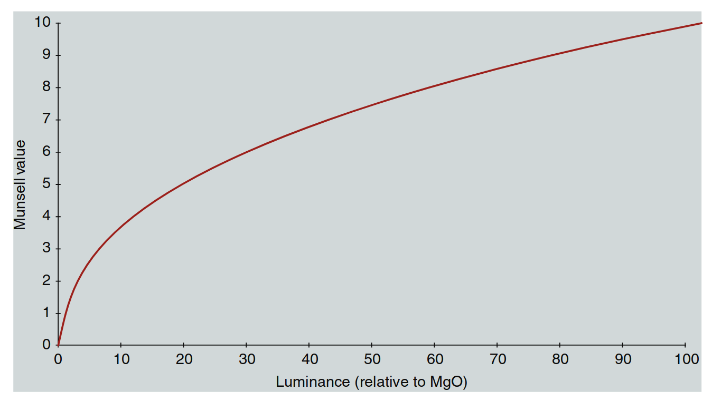
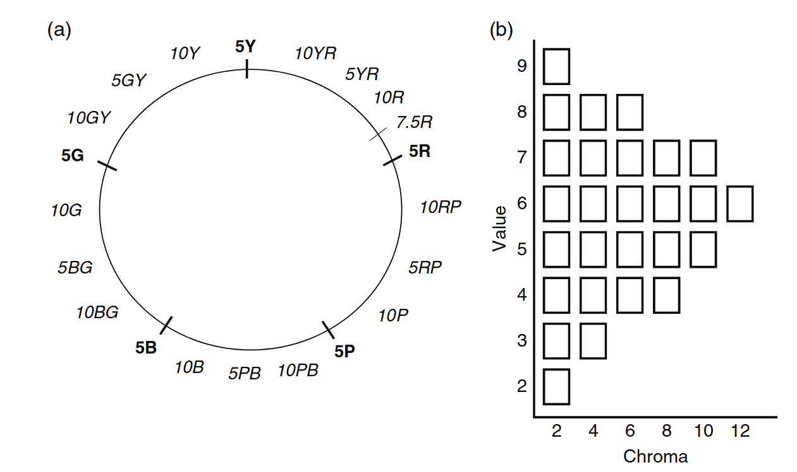
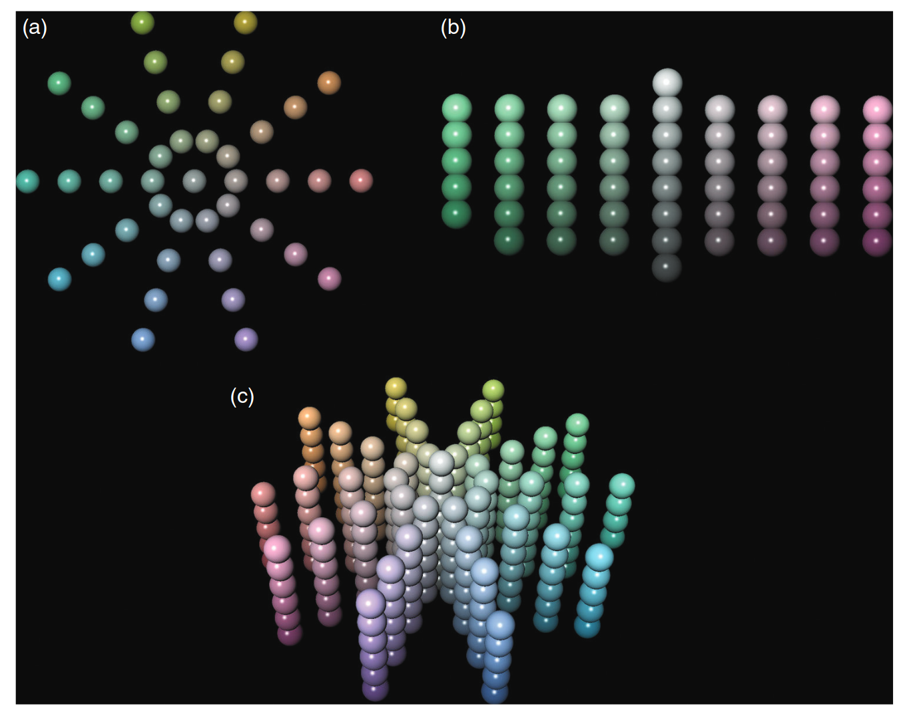
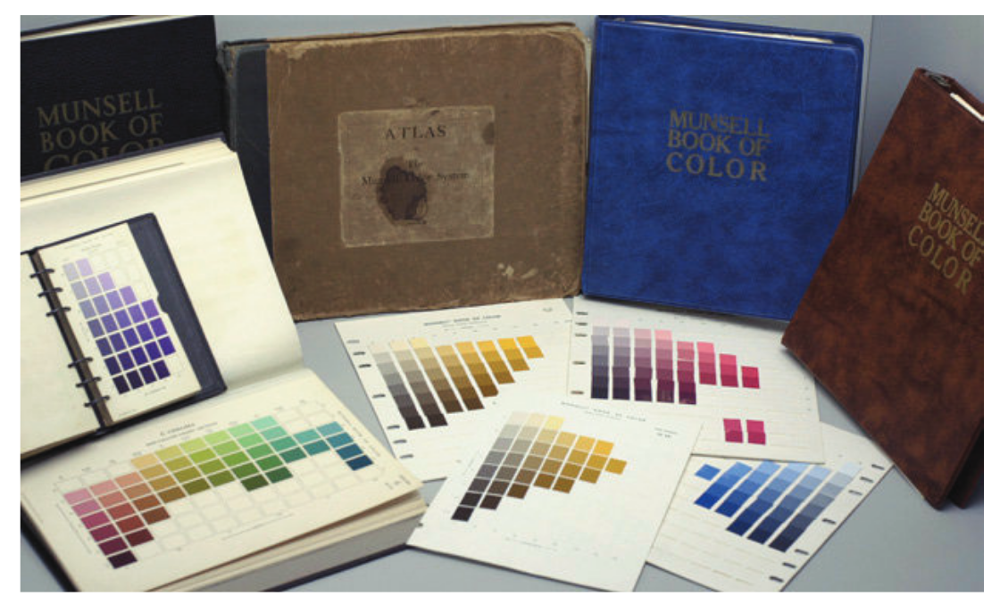
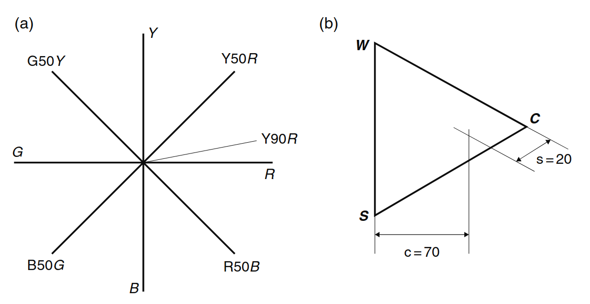
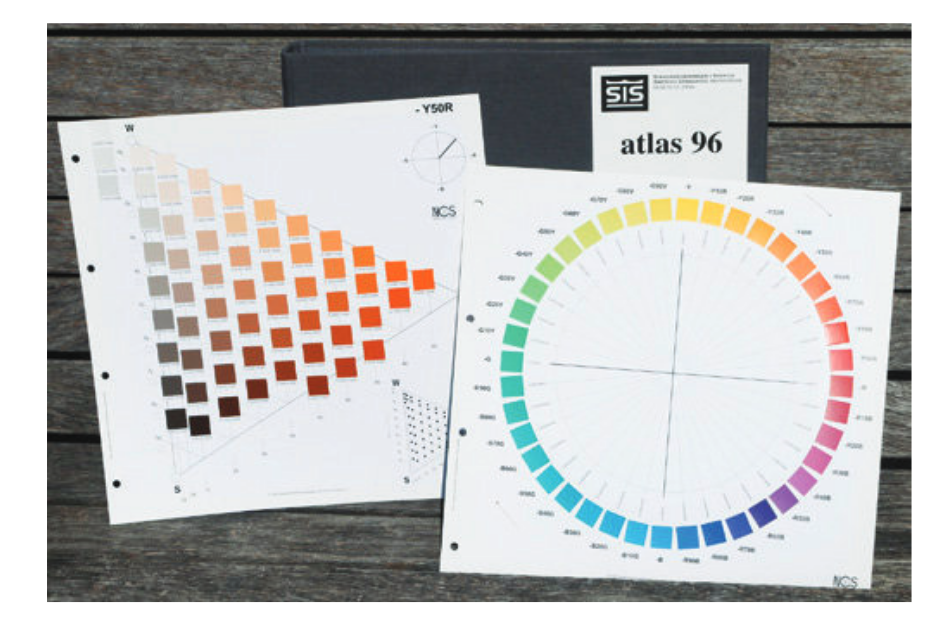
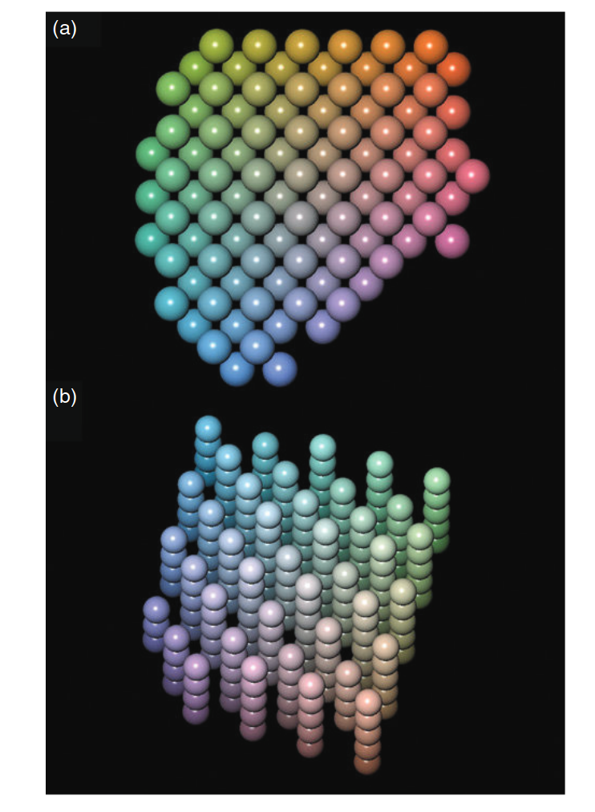

# 色彩顺序系统

由于色貌是一种基本的知觉，最直接的方法是通过心理物理学技术来测量它，这些技术旨在阐明第4章定义的各种色貌属性的知觉一致性尺度。当进行此类实验时，可以使用基本的色度学来指定体现知觉色貌属性的刺激。通过适当指定和标记的一组此类刺激，形成了色彩顺序系统。这样的色彩顺序系统确实能够 fairly 明确地指定色貌。然而，没有理由期望这些指定的外观会泛化到其他观看条件，或者以任何简单的方式与物理测量之间存在数学关系。因此，色彩顺序系统提供了指定色貌的数据和技术，但无法提供数学框架来扩展这些数据到新的观看条件。因此，色彩顺序系统在色貌模型的开发和测试中具有重要意义，但不能作为其替代品。

*当一位年轻旅行者被问及对著名森林的印象时，他回答说，由于树木太多，根本看不见森林。这有点像讨论色彩的困难。观点如此之多，目标如此多样，感知色彩的行为如此复杂，用来描述这种感觉的术语又如此松散，以至于我们不是触及本质，而是迷失在外部事物的纠缠中。
——Munsell（1907年：1）*

本章概述了在色貌建模和设备无关的色彩成像中尤为重要的一些色彩顺序系统。它们的重要性和应用将在本章和后续章节中自然而然地显现出来。有关色彩顺序系统的更多详细信息可以在Hunt的《色彩测量》一书（Hunt 1991a, 1998，Hunt和Pointer 2011）、Wyszecki和Stiles的《色彩科学参考书》（1982）、Wyszecki的色貌回顾章节（1986）、Derefeldt的色貌系统回顾（1991）、Kuehni的色彩空间详细历史回顾（2003）以及全面的百科全书《色彩排序：从古至今的色彩排序系统》（Kuehni和Schwarz 2008）中找到。

---
## 5.1 概述与要求

许多色彩顺序系统的定义已经提出，最有用的可能是它们的某种组合。Wyszecki（1986年）指出，色彩顺序系统大致可以分为三大类：
- 一种基于颜色刺激的加色混合原理。一个著名的例子是奥斯特瓦尔德系统。
- 一种由基于色料混合原理的系统组成。Lovibond Tintometer提供了一个基于色料加色混合的色彩规范系统示例。
- 一种由基于色彩感知或色貌原理的系统组成。事实上，Derefeldt（1991年）建议，色貌系统是唯一适合于一般用途的系统。她继续指出，色貌系统通过感知颜色坐标或尺度来定义，并根据这些尺度的均匀或相等的视觉间隔对颜色进行分类。

本章重点介绍了色貌系统，例如自然色彩系统（NCS）和孟塞尔系统。Hunt（1991年）对色彩顺序系统的定义增加了一个有用的约束，声明必须能够在系统中的样本之间以明确的方式进行插值。最后，色彩顺序系统的实际限制是它们必须通过稳定的样本体现，并且这些样本的生产要符合严格的公差要求。

总结来说，色彩顺序系统的限制是它们必须：
- 是一种有序的（且连续的）颜色排列
- 包括一个逻辑的标注系统
- 包括感知上有意义的维度
- 以稳定、准确和精确的样本体现

对于一个普遍有用的色彩顺序系统的进一步目标是，感知尺度应该均匀地代表感知的大小，或者尺度上的差异应具有相等的感知大小。上述定义排除了某些在实际应用中有用的色彩系统。例如，PANTONE色彩公式指南是一个有用的墨水色彩规范系统，但它不是一个色彩顺序系统，因为它不包括连续的尺度或适当的体现。它更适合被认为是一个色彩命名系统。用于指定油漆颜色的色板也属于这一类别。

色彩顺序系统在色貌研究中的应用多种多样。它们提供了关于各色外观属性（如明度、色调和色度）的感知标定数据，可以用来评估数学模型。它们的体现提供了可靠的样本刺激，可以在色貌的心理物理实验中明确使用。它们的命名法提供了一个有用的系统，用于指定和传达色貌。它们还为解释各种色貌属性和现象提供了一个有用的教学工具。在色貌建模中使用色彩顺序系统的内容将在第5.6节中进行更详细的讨论。

---

## 5.2 孟塞尔色彩书

最广泛使用的色彩顺序系统之一，尤其在美国，是孟塞尔系统，它体现于孟塞尔色彩书中。孟塞尔系统的历史由Nickerson（1940，1976年a,b,c）进行了回顾，通过回顾1940年代重新命名孟塞尔色彩的视觉实验，可以获得有趣的见解（Newhall 1940）。一本带有样本的系统简版教育书籍作为《新孟塞尔学生色彩套件》（Long 和 Luke，2001年）是学习该系统的一个很有帮助的资源。该系统由艺术家Albert H. Munsell于20世纪初开发。Munsell特别有兴趣开发一个有助于儿童教育的系统。该系统的基本前提是根据三个属性来指定色貌：

- 色调（H）
- 明度（V）
- 色度（C）

孟塞尔的三维定义与当前相应的色貌属性定义相匹配，其中孟塞尔值指的是明度。Munsell的目标是按照每个感知维度的均等视觉增量来指定颜色（无论是心理物理学的还是物理的）。

---
**孟塞尔明度**

孟塞尔明度尺度是该系统的基准。孟塞尔明度尺度有十个主要等级，白色标记为10，黑色标记为0，中间的灰色标记从0到10之间。孟塞尔明度尺度的设计使得一个明度为5的中间灰（标记为N5，表示中性样本值为5）在感知上处于理想白色（N10）和理想黑色（N0）之间的中点。此外，N3和N4样本之间的明度差异与N6和N7样本之间的明度差异相等，或者是任何其他在孟塞尔明度等级上变化一步的样本之间的明度差异。处于两个孟塞尔明度等级之间的感知明度差异用小数表示。例如，孟塞尔明度4.5在感知上位于孟塞尔明度4和5之间的中点。

需要注意的是，孟塞尔明度V与相对亮度Y之间的关系是非线性的。实际上，这个关系由方程5.1中的五次多项式指定，并在图5.1中绘制。

  

    $$
    Y = -1.2219 + 0.23111V - 0.23951V^2 + 0.021009V^3 - 0.0008404V^4 \tag{5.1}
    $$
  

如图5.1所示，一个被感知为中灰色（N5）的样本具有大约20%的相对亮度（或光反射因子）。任何颜色的孟塞尔明度（无论色调或色度如何）都由与相对亮度的同一单变量关系来定义。因此，如果已知样本的孟塞尔明度，其相对亮度CIE Y也可被确定，反之亦然。不幸的是，方程5.1中的五次多项式无法进行解析反转，因此在实际应用中不可行。由于CIE明度尺度L*是为了模拟孟塞尔系统而设计的，因此它提供了孟塞尔明度的非常好的计算近似。作为一个非常有用且准确的一般规则，可以通过将CIE L*（2°观察者）除以10来获得样本的孟塞尔明度。实际上，这个近似值比方程5.1中的多项式更准确地预测了一些原始孟塞尔明度缩放数据（Fairchild 1995b）。

  

  图5.1：孟塞尔明度与相对亮度的关系

---
**孟塞尔色调**

孟塞尔系统的下一个维度是色调。孟塞尔系统中的色调圆被划分为五个主要色调（紫色、蓝色、绿色、黄色和红色，分别标记为5P、5B、5G、5Y和5R），并且设计为将完整的色调圆分成相等的感知间隔。孟塞尔系统中还指定了五个中间色调，分别是5PB、5BG、5GY、5YR和5RP，共有10个色调名称。对于这十个色调，每个色调都有十个整数色调，标记方式如5PB和5P之间的范围，分别是6PB、7PB、8PB、9PB、10PB、1P、2P、3P、4P。这种类型的序列会沿着整个色调圆继续，最终形成100个整数色调的标识，旨在表示相等的感知色调间隔。色调之间的中间值用小数表示（例如，7.5PB）。

---

**孟塞尔色度**

孟塞尔系统的第三个维度是色度。色度尺度设计为从中性样本的色度为0开始，逐步增加色度以适应具有更强色调内容的样本。色度尺度没有设定最大值，色度的最高值取决于样本的色调、明度和使用的色料。例如，黄色色调的低明度样本或紫色色调的高明度样本没有高色度样本。由于人类视觉响应的特性，这样的刺激是无法物理产生的。

图5.2展示了孟塞尔系统的三维排列方式，分别以常明度平面（图5.2(a)）和常色调平面（图5.2(b)）来表示。

---

  

  图5.2：图示（a）孟塞尔色调圆和（b）定色调的明度/色度平面

图5.3展示了使用计算机图形模型生成的孟塞尔系统的类似平面和三维视角。

---

  

  图5.3：孟塞尔系统样本的颜色渲染图（a）定明度平面，（b）一对定色调平面，（c）三维透视图

图5.4展示了孟塞尔色彩书的不同历史版本和现代版本，这些版本展示了多个定色调页面。

---

  

  图5.4：孟塞尔色彩书的历史和现代版本的多种插图，展示了若干定色调页面

孟塞尔色彩书由大约1500个样本组成，分布在40页定色调页面上。每个色调页面按照亮度递增（从下到上）和色度递增（从书中心到书边）排列。样本由涂漆纸构成，并且提供光泽和哑光表面可供选择。孟塞尔的较大样本也可以购买，用于视觉实验或构建成像系统的测试目标。孟塞尔样本是按照孟塞尔重命名实验中指定的色度学目标点生产的（Newhall 1940年）。每个孟塞尔样本的色度坐标和亮度因子（包括许多无法轻易生产的样本）可以在Wyszecki和Stiles（1982年）中找到。色度学规范使用CIE光源C和CIE 1931标准色度学观察者（2°）。在查看孟塞尔系统的任何体现时，应考虑这些规范。系统的感知均匀性仅在光源C下有效，在均匀的中性灰色（N5）背景上，并且光照强度足够高（例如大于500 lux）。在其他观看条件下查看孟塞尔色彩书样本并不代表孟塞尔系统的体现。

值得注意的是，孟塞尔系统被标定为三个一维的色彩外观尺度，孟塞尔步骤大小与感知色差之间的关系在三个维度之间并非恒定。普遍接受的观点是（见Nickerson褪色指数的讨论，Berns（2000年）或孟塞尔系统的讨论，Hunt（1998年））孟塞尔色度的两个步骤增量在感知上等同于孟塞尔明度步骤的一个变化。孟塞尔色调的步骤大小依赖于相关样本的色度。最佳实践是，在计算差异或外观时，简单地保持三个维度相互独立。

---
## 5.3 瑞典NCS系统

最近，瑞典开发了NCS（自然色系统）（Hard和Sivik 1981），并在瑞典（SS 01 91 02和SS 01 91 03）及一些其他欧洲国家被采用为国家标准。NCS基于赫林的对比色理论。色调圆被划分为四个象限，每个象限由独特的色调红色、黄色、绿色和蓝色定义，如图5.5(a)所示。这四种独特色调在视觉上呈正交排列，每个色调之间的间隔感知上是相等的。因此，尽管NCS色调在每个色调之间的感知间隔是相等的，但在四个象限内的间隔大小不同。这是因为独特的红色和独特的蓝色之间的视觉差异大于独特的黄色和独特的绿色之间的差异。位于独特色调之间的感知色调被赋予表示两个相邻独特色调的相对感知组成的标记。例如，位于独特红色和独特黄色之间的橙色色调被标记为Y50R。

一旦确定了NCS色调标记，接下来的两个维度——相对色彩外观——通过三线性坐标轴来指定，如图5.5(b)所示。三角形的三个角表示最大黑度（S）、白度（W）和色度（C）。对于任何刺激，白度、黑度和色度的总和必须为100。因此，最大黑度样本标记为s = 100，w = 0，c = 0；最大白度样本标记为s = 0，w = 100，c = 0；最大色度样本标记为s = 0，w = 0，c = 100。由于这三个数值的总和必须为100，因此只需要两个数值来完全指定（加上色调标记）。通常，使用黑度和色度。例如，一个中间样本可能标记为s = 20，c = 70，意味着白度w = 10。每种色调的最大色度是通过心理锚点定义的，即可以感知的该色调的最大色度样本。

如图5.5所示，孟塞尔色度和NCS色度之间没有直接的关系。同样，孟塞尔明度和NCS黑度之间也没有简单的关系。还需要注意的是，不同色调的最大色度样本具有不同的相对亮度和明度。

---

  

  图5.5：(a) NCS系统的色调圆和(b) 常色调黑度/色度平面的图示

孟塞尔和NCS系统表示了两种不同的感知色彩外观指定方法。无法说哪种方法优于另一种，只能说它们是不同的。最近，CIE TC1-31报告（CIE 1996a）中重申了这一点，ISO要求该报告推荐一个国际标准的单一色彩顺序系统，并提出从一个系统转换到另一个系统的技术。这个国际专家委员会得出的结论是，这样的任务是不可能的。

在NCS系统中，色彩通过其黑度（s）、色度（c）和色调来标记。例如，在“孟塞尔明度”一节中，孟塞尔标记为7.5R 5/10的样本在NCS系统中的标记为2070-Y90R，其中黑度为20，色度为70，中间没有空格。初始的四位数字代表黑度，接着是色度。标记的最后部分，破折号后面的部分是色调。这表明样本接近独特的红色，只有10%的黄色成分。进一步说明的是，它是高色度（70%）的，且只有少量黑度（20%）。需要注意的是，尽管该样本具有中等孟塞尔明度，但在NCS系统中，其黑度（或白度）远低于孟塞尔系统中的相应值。这说明了孟塞尔明度尺度和NCS白度-黑度-色度尺度之间的根本差异。

---

  

  图5.6：孟塞尔色彩书的历史和现代版本的多种插图，展示了若干定色调页面

NCS色彩图册包含40种不同的色调，并且在黑度和色度尺度上每10步有一个样本。由于色料的限制，无法生产所有可能的样本，因此图册中大约包含1500个样本。NCS色彩图册应该在日光照明下以适当的亮度和背景查看。NCS样本也可用于不同的应用场景，且有不同的大小可供选择。作为瑞典的国家标准，NCS在瑞典的教育中被广泛使用，提供了极高的日常色彩交流精度。

---

## 5.4 Colorcurve系统

最近开发的一个色彩顺序系统是Colorcurve系统（Stanziola 1992），它被设计为一个结合了色彩外观系统和色彩混合系统的色彩通信系统。该系统的设计使得颜色不仅可以在系统内指定，而且每个样本的光谱反射数据可以用于在不同材料或介质中制定匹配样本。因此，系统中的每个样本不仅通过其色度学坐标来指定，还通过其光谱反射特性来定义。Colorcurve系统以CIELAB色彩空间为起点。系统中选择了18个不同的L*级别，以构建常明度平面。L*级别从30到95，步长为5个单位，在较高的明度级别（例如墙漆常用的浅色）上特别加入了一些额外的级别。在每个明度级别上，选择了9个起始点，包括一个灰色（a* = 0, b* = 0）和8种色彩，其中色度C*为60。选定的色调起始点为：红色（60, 0）、橙色（42.5, 42.5）、黄色（0, 60）、黄绿色（−42.5, 42.5）、绿色（−60, 0）、蓝绿色（−42.5, −42.5）、蓝色（0, −60）和紫色（42.5, −42.5）。因此，起始点是通过色彩外观空间的原理来定义的。

系统的其余部分则是通过加色混合构建的。CIELAB a*b*平面的每个象限都被加色混合的矩形样本填充，灰色和该象限内三个色彩起始点的加色混合样本。Colorcurve标记中的等步长代表四个起始点之间的等加色混合。这些原理用于定义Colorcurve系统的所有目标点。然后，使用真实颜料配制样本，以便系统可以与所需的光谱反射曲线规格一起体现出来。

Colorcurve系统体现于两本图册中，其中样本是涂有硝基纤维素漆的纸张。主图册包含约1200个样本，分布在18个不同的明度级别上。此外，还有一本灰色和粉色图册，由956个附加样本组成，更精细地采样接近灰色或粉色区域的色彩空间。由于Colorcurve系统是通过样本的光谱反射特性来定义的，因此只要光谱与Colorcurve样本匹配，观察照明的选择就不是关键。只要光谱匹配，所产生的样本将在所有光源下与Colorcurve样本匹配。这一点是其他色彩顺序系统无法做到的。

---

**Colorcurve系统的独特属性**

Colorcurve系统的一个独特属性尤其引人注目。与大多数系统中的方形样本不同，Colorcurve图册中的样本是圆形的。圆形样本避免了色彩图册中的两个难题。第一个是方形样本之间的角落出现暗点的对比错觉（赫尔曼网格错觉）。第二个是无法将圆形样本安装歪斜！不幸的是，独特且有趣的Colorcurve系统目前已不再商业化。

---

  

  图5.5：Colorcurve系统的图示，展示了色调圆和常色调黑度/色度平面的图示

---

## 5.5 其他色彩顺序系统

上面描述的孟塞尔系统和NCS系统是研究色貌模型中最重要的色彩顺序系统。Colorcurve系统提供了一个有趣的结合了色貌系统和色彩混合系统的方案，能够为色貌和再现研究提供有用的样本。然而，许多其他的色彩顺序系统也应运而生，服务于各种不同的目的。Derefeldt (1991)，Wyszecki和Stiles (1982)，以及Kuehni和Schwarz (2008)提供了更多的细节，但这里有几个系统值得提及。这些包括美国光学学会（OSA）统一色标，德国标准化学会（DIN）系统和奥斯特瓦尔德系统。

**OSA统一色标**

OSA于1947年成立了一个统一色标委员会。该委员会工作的最终成果由MacAdam（1974，1978）描述为OSA统一色标系统，或简称OSA UCS。OSA系统是一个色貌系统，但其性质与孟塞尔系统和NCS系统有显著不同。OSA系统的设计使得每个样本在三维色彩空间中与其邻近的样本具有相同的感知色差（而不仅仅是像孟塞尔系统中那样逐一维度的比较）。OSA空间采用三维欧几里得几何，L、j和g轴分别表示明度、黄色-蓝色和红色-绿色。为了使每个样本与其邻近样本的感知色差相等，需要对三维空间进行规则的菱形取样，其中每个样本都有12个最近邻样本，且它们之间的距离相等。如果将12个最近邻样本连接起来，它们将形成一个称为立方八面体的多面体。这样的取样方法使得可以从多个方向查看色彩空间的矩形样本平面。图5.7(a)展示了OSA系统中两个相邻常明度平面的计算机图形表现，图5.7(b)展示了OSA系统的三维表示。显然，追求各个方向上的色差相等导致了一个与众不同的色彩顺序系统。

---

  

  图5.7：OSA UCS系统的样本渲染，(a) 一对相邻的常明度平面，(b) OSA系统的三维投影

由于其复杂的几何结构（以及缺乏有效的体现方式），OSA系统并不十分流行。然而，它确实提供了另一套数据，可以用于评估色貌和色差模型。OSA空间也被指定为通过方程式将CIE坐标转换为OSA系统的L、j和g坐标。不幸的是，这些方程是不可逆的，限制了它们的实际应用。OSA系统的方程式和样本点规格可以在Wyszecki和Stiles（1982）中找到。

---

**DIN系统**

DIN系统在德国开发，基于色相、饱和度和黑度的感知变量。Richter和Witt（1986）对DIN系统进行了历史回顾。DIN系统中的颜色规范与色度图上的色度学规范密切相关。DIN系统中具有相同色相的颜色位于色度图上常见的主波长（或补色波长）直线（即从白点辐射的直线）上。恒定DIN饱和度的颜色表示恒定的色度。DIN系统中的色相和饱和度取样设计为感知上均匀。DIN黑度与样本的光反射率相关，相对于具有相同色度的理想样本（反射所有或不反射任何波长的入射能量），导致黑度刻度类似于NCS黑度，而不是孟塞尔值。

DIN系统通过DIN色卡体现，包括常色相页面，并进行黑度和饱和度的矩形取样。因此，DIN页面上的列表示恒定色度（DIN饱和度），并呈现为阴影系列（单一物体在相同照明条件下的不同照明级别）。DIN色卡还说明，随着黑度的增加，色度差异变得不那么明显。任何给定DIN页面的底部行看起来都是均匀的黑色。

---

**奥斯特瓦尔德系统**

奥斯特瓦尔德系统广泛用于艺术和设计，因此具有重要的历史意义（Derefeldt 1991）。与NCS系统类似，奥斯特瓦尔德系统基于Hering的对立色理论。然而，奥斯特瓦尔德系统与Colorcurve系统非常相似，代表了色彩外观系统和色彩混合系统的结合。奥斯特瓦尔德使用Hering的四种独特色相建立了色相圆，但他没有将感知上对立的色相相对放置，而是使用了色度学补色（通过色度图上的白点连接的色度），并将它们放在色相圆的对立位置上。

奥斯特瓦尔德系统还包括每个常色相平面上的白色成分、黑色成分和全色成分的三线性表示。在NCS系统中，这些平面是根据感知色度量表定义的。然而，在奥斯特瓦尔德系统中，这些平面是通过对三角形角落的三种最大色度进行加色混合来定义的。因此，奥斯特瓦尔德系统是以色彩外观为目标建立的，但样本是通过加色混合填充的。（这与基于CIELAB的Colorcurve系统的最新表述完全相似。）

---

## 5.6 色彩顺序系统的应用

色彩顺序系统在色貌研究及相关领域有多种应用。这些应用包括作为实验中的样本、色彩设计、交流、教育、模型测试、测试目标等，在这些应用中物理样本是非常有用的。

---

**色彩顺序系统在视觉实验中的应用**

在研究色貌的视觉实验中，常常需要在不同的观察条件下查看和/或匹配多种颜色刺激。色彩顺序系统为这些实验提供了有用的样本来源。例如，实验者可能选择一组孟塞尔、NCS或Colorcurve样本来进行色貌实验中的比例尺调整。这些样本具有已知的特性，并且在公布实验所用样本的标记时，研究者提供了一个有用的刺激定义，其他人可以使用这些定义来重复实验。需要注意的是，实际上使用色彩顺序系统中的样本，而不仅仅是它们在任意样本上的标记，具有更大的优势，因为这些样本的反射特性也已被定义。色彩顺序系统在外观实验中的另一个相关应用是通过教学让观察者学习该系统，然后要求他们根据不同条件下观察到的样本来分配标记（孟塞尔和NCS在这种实验中尤其有用）。这允许指定由观察条件变化引起的外观变化，并结合每个样本在每种观察条件下的色度学规范来制定和测试色貌模型。

---

**色彩顺序系统在艺术与设计中的应用**

色彩顺序系统在艺术与设计中也常被使用。它们作为颜色的有序排列，使设计师能够轻松选择具有各种色彩关系的样本。例如，使用孟塞尔系统可以轻松选择恒定的明度或色相范围，或选择以不同方式互补的色相。色彩混合系统不仅提供了这种实用功能，还为艺术家提供了一些见解，帮助他们在不同介质中实际产生这些颜色。色彩顺序系统不仅提供了设计工具，还在其标记中融入了通信工具，使所选颜色能够传达给那些制作材料的人，以便将其纳入设计中。

---

**色彩顺序系统在通信中的应用**

显然，色彩顺序系统的一个应用就是准确传达色貌。这是有效的，前提是通信链两端的人员都在适当控制的环境中观察这些系统。虽然色度学坐标有可能提供更加精确、准确和有用的颜色规格，但其感知意义对于各种用户并不那么容易理解。色彩顺序系统可以提供一个更易于访问的通信工具。它也可以用来向熟悉该系统的人描述色貌，而不必拥有完整的色卡。例如，ANSI规格中描述色彩图像的背景时，尽管反射因子本身已经足够且可能更加精确，但它们仍以孟塞尔值来规范。

---

**色彩顺序系统在教育中的应用**

色彩顺序系统在教育色貌（以及许多其他色彩方面）中极为有用。例如，检查孟塞尔系统可以直观地定义明度、色度和色相的色貌属性。将孟塞尔色卡从低亮度级别移至高亮度级别，能够很好地演示亮度和色彩度如何显著增加，而明度和色度几乎保持不变。DIN系统有助于说明色度与饱和度之间的差异，以及饱和度如何与阴影系列（单一物体在不同照度水平下的表现）相关。色彩顺序系统在其局限性上也能发挥教育作用。例如，在孟塞尔系统中，恒定值定义为恒定的相对亮度。然而，众所周知（在第6章讨论的Helmholtz–Kohlrausch效应中），在相对亮度恒定的情况下，随着样本色度的增加，它们看起来变得更亮。只需要查看一系列孟塞尔样本，维持恒定值并改变色度，就可以明显看到明度的系统性变化。最后，像NCS系统这样的系统可以大大帮助教育有关色觉对立理论的知识，特别是在其色相标记上，这些标记与色彩的生理编码紧密相连。

---

**色彩顺序系统评估数学色貌模型**

由于色彩顺序系统如孟塞尔和NCS系统是基于感知的色貌比例，它们提供了现成的可用于评估数学色貌模型的数据。例如，孟塞尔系统包括恒定明度和色相平面，以及恒定色度的圆柱面。孟塞尔系统的色度学规范可以转化为给定色貌模型的色貌预测器，以查看其如何预测恒定色相、明度和色度等轮廓。这种评估提供了一种有用的、被广泛理解的技术，用于比较各种色貌模型。孟塞尔和NCS轮廓预测的比较也允许进一步研究理解这两种系统之间的基本差异。

---

**色彩顺序系统与成像系统**

色彩顺序系统也可以用作成像系统或其他测量设备的测试目标来源。例如，Macbeth Color Checker Chart（McCamy等，1976）是一个常用的成像系统测试目标，部分基于孟塞尔系统中的样本。尽管该卡片常常被使用，但Macbeth Color Checker Chart只包含少量的颜色样本（24个），并且色彩空间的取样不完全。可以相对容易地构建更具实际应用价值的测试目标。来自不同色彩顺序系统的样本可以用于开发定制的测试目标，这些目标可以在其他地方可靠地指定和复制。

---

**色彩顺序系统的局限性**

尽管色彩顺序系统在色貌应用中有许多有用的应用，它们并不能替代色貌模型。一般来说，它们在这方面有两个显著的局限性。首先，它们没有在物理可测量值方面进行数学规范。尽管孟塞尔和NCS系统对系统中的每个样本有色度学规格，但并没有方程式将色度学坐标与色彩顺序系统的感知坐标联系起来。通过统计拟合和神经网络建模已经推导出近似方程式，但从CIE色度学到色彩顺序系统坐标的唯一可靠转换方法仍然是查找表（LUT）插值。显然，缺乏前向方向的数学定义使得所需的反向模型无法进行解析。

第二，这些色彩顺序系统已被建立为单一观察条件下的色貌感知尺度。它们没有提供关于观察条件变化引起的色貌变化的数据。

---

## 5.7 色彩命名系统

有多种色彩规格系统可供使用，这些系统虽然不符合作为真正的色彩顺序系统的要求，但在一些实际应用中非常有用。通常，这些系统，更准确地说是色彩命名系统，并未以感知上的有序方式排列（尽管有些是根据某些成像过程顺序排列的），且未为控制的观察条件提供或指定。此外，这些系统的物理表现也没有按精确的色度学要求进行控制，无法确保精确的色彩通信。这些系统的例子包括PANTONE、Toyo、Focoltone和Trumatch系统。

---

**PANTONE系统**

PANTONE系统的主要组成部分是PANTONE色彩公式指南。这本指南是一本包含1012种PANTONE专色油墨混合的色样册，分为涂布纸和无涂布纸两种类型。每个色样都有一个数字标识符，可用于将所需颜色传达给印刷商。印刷商然后根据规定的PANTONE配方混合专色油墨，最终打印出来的颜色应该是与色样册中的颜色相匹配的合理近似值。这个系统是美国最广泛使用的专色指定工具。PANTONE过程色彩成像指南包括942个色样，展示了通过四色（CMYK）印刷过程可以较好地模拟的PANTONE专色。这本色样册包括一个专色旁边的过程色彩模拟样本，以指示预期的色差。

---

**Trumatch系统**

Trumatch Colorfinder是一本色样册，包含2000多种过程颜色样本。这些样本的排列比PANTONE系统略微更多地考虑了感知性。这样的系统允许计算机用户根据印刷色样的外观选择CMYK色彩规格，而不是依赖CRT显示器上给定CMYK规格的近似色彩。用户可以在色样册中找到所需的颜色，将图像中相应区域的CMYK值设置为这些值，然后自信地忽略计算机显示器上可能不适合的外观，确信最终打印出来的颜色会非常接近色样册中选择的颜色。

---

**其他系统**

除了PANTONE和Trumatch过程色彩指南，这些指南可作为印刷色彩规格的快捷方式之外，还有Agfa公司出版的PostScript过程色彩指南，其中包含超过16,000个过程色彩示例，代表了从0%到100%的CMY组合的完整采样（按5%增量），并额外采样了四种不同级别的黑色油墨覆盖。样本在涂布纸和无涂布纸上均有展示。鉴于印刷油墨、纸张和工艺的可变性，这些系统只能作为近似指南。已知它们的稳定性较差，通常建议每六个月更换一次色样册。然而，它们的性能远优于没有指南和未经校准的成像系统。然而，在所有成像设备都经过精确校准和表征，且观察条件严格控制的系统中，将能够轻松地产生更高精度和更高色彩准确度的内部色域色彩。对于超出色域的颜色（如金属油墨，这些无法在二维计算机图形显示中模拟），色样册系统仍然可能证明是无价的。
