# 第六章：色貌现象

**为什么色度学有局限？**

CIE色度系统已经被广泛使用，并且非常有用。它的核心思想是用三刺激值（XYZ值）来描述颜色。这个方法很实用，比如说可以告诉我们两种颜色是否一样。但问题在于：

1. **只能告诉你“匹配不匹配”，却无法告诉你颜色“看起来”是什么样子**。
   这就像只知道一个人“身高相同”，但完全不了解他们的“外貌细节”。

2. **需要更多“工具”来描述颜色的细节**：

    - 要说清楚两种颜色的差异，我们需要像“标尺”一样的工具。

    - 要描述颜色外观，比如它有多亮、多鲜艳或是什么色调，我们甚至需要更复杂的数学工具。

**为什么三刺激值不够？**

简单来说，三刺激值是基于实验得来的：如果不同光线混合后看起来一样，我们就说它们“匹配”。但问题是，颜色的外观并不仅仅取决于光线，还受到很多其他因素的影响，比如：

- 光线的亮暗程度。
- 你看到的背景颜色。
- 周围的环境和光源。

当这些条件变化时，颜色的“外观”也会变，比如亮度会影响颜色的鲜艳度，背景会让颜色看起来更亮或更暗。三刺激值并没有考虑这些因素，所以它有时会“失效”。

**为什么我们需要色貌模型？**

要想真正描述颜色的“样子”，我们就需要色貌模型。色貌模型的目标是：

1. **把“人眼的感受”融入计算中**：

    - 不只是光线的物理数据，还要考虑人眼如何感知它。

2. **预测不同环境下颜色的变化**：

    - 比如你在明亮的阳光下看到的颜色，和在室内灯光下看到的颜色会不同。

举个例子，假如你在商店买了一罐油漆，觉得它是完美的蓝色，但刷到家里的墙上却发现颜色完全不一样。这是因为商店和你家里的光线、环境都不同，而三刺激值没法告诉你这种差异。色貌模型可以帮助预测和解决这样的问题。

**色貌模型和色度学的关系**

色度学是色貌模型的基础，就像“骨架”。色貌模型在此基础上加入了“肌肉和皮肤”，让我们不仅能看到颜色是否匹配，还能预测它看起来是什么样子。例如：

- 它可以描述图片在不同显示设备（比如电脑屏幕和打印机）上的颜色表现。
- 它能帮我们理解为什么同样的物体在不同光线下颜色会变化。

总之，色貌模型是“色度学的进阶版”，用来解决更复杂的颜色问题。

**总结**

三刺激值是色度学的基础，但它的局限性让我们无法准确描述颜色的外观。通过色貌模型，我们能够更全面地理解颜色的感知过程，尤其是当环境条件发生变化时。接下来的章节将详细介绍色貌模型的具体应用和技术原理。

---

## 6.1 什么是色貌现象？

**三刺激值与色貌现象的矛盾**

按照CIE的三刺激值理论，如果两个颜色刺激的XYZ值相同，那么它们在“平均观察者”看来应该是匹配的。**但是这种匹配有一个重要的前提**：必须满足一系列严格的约束条件。

**约束条件包括：**

1. **视网膜刺激的位置**：刺激在视网膜上作用的位置，例如是否在视野中心。
2. **角度与大小**：刺激的视觉大小与角度。
3. **亮度水平**：刺激的整体明暗程度。
4. **环境一致性**：

    - 刺激的周围背景颜色。
    - 刺激的形状与表面特性。
    - 光照的角度与强度。

如果这些条件中的任何一个被打破，即使刺激的XYZ值相等，人眼感知到的颜色也会发生变化。这种因环境或条件改变而导致颜色外观不同的现象，就是**色貌现象**。

---

**实例：同时对比现象**

同时对比现象是色貌现象中的一个经典例子，图6.1对此作了生动演示：

  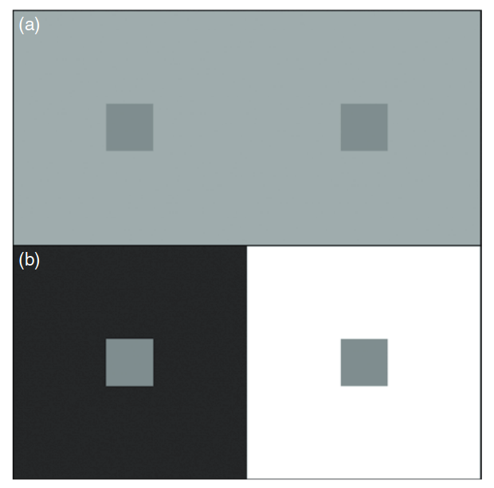

  图 6.1：同时对比现象示意图——（a）灰色块在相同灰色背景下；（b）灰色块分别位于白色和黑色背景下，展示背景亮度对颜色感知的影响。

1. **一致背景下的颜色匹配**：  
   在图6.1(a)中，两个灰色块放置在相同的灰色背景上。由于它们的三刺激值完全一致，同时它们处于相同的环境条件中，所以看起来颜色匹配。

2. **不同背景下的颜色失配**：  
   在图6.1(b)中，左侧灰色块被放置在白色背景上，右侧灰色块被放置在黑色背景上。尽管两块灰色块的XYZ值仍然完全相同，但它们的外观发生了显著变化：  

    - **黑色背景上的灰色块显得更亮**。  
    - **白色背景上的灰色块显得更暗**。

**原因**：  
这种现象源于背景亮度对颜色感知的影响。简单的三刺激值模型无法解释这种变化。

---

**为什么需要色貌模型？**

在许多实际应用中，三刺激值模型的约束条件很难完全满足，例如不同的光源、背景或观看角度都会改变颜色外观。在这些场景下，仅靠三刺激值描述颜色匹配已经不足，需要引入**色貌模型**来综合考虑以下因素：

1. **背景对颜色的影响**：  
   同时对比效应就是背景亮度影响颜色感知的典型案例。

2. **周围环境的变化**：  
   不同的光源、亮度水平或周围颜色都会对颜色外观产生显著影响。

3. **认知和心理的影响**：  
   大脑对颜色的解释、记忆偏好以及观看情境等因素也会改变颜色的感知。

---

**总结**

色貌现象打破了三刺激值系统的基础假设，表明需要更复杂的模型来描述颜色在复杂环境中的感知外观。色貌模型通过引入更多的环境和心理参数，能够更准确地预测颜色在实际场景中的表现，为颜色科学和实际应用提供了重要工具。

---

## 6.2 同时对比、增强效应和扩展效应

同时对比、清晰化效应和扩展效应是与刺激的**空间结构**密切相关的三种**色貌现象**。这些现象通过背景和空间结构的变化影响颜色的感知。

**同时对比现象**

图6.1已经展示了**同时对比现象**。当两个相同的灰色块分别置于不同背景上时，其外观发生了显著变化：

    - 黑色背景让灰色块看起来更亮。
	- 白色背景让灰色块看起来更暗。

**同时对比现象**是背景颜色改变导致刺激颜色外观偏移的结果。这些颜色偏移与**对立颜色理论**密切相关：

	- 明暗对立：浅色背景让颜色看起来更暗，深色背景让颜色看起来更亮。
	- 色调对立：
		- 红色诱发绿色感。
		- 黄色诱发蓝色感。
		- 蓝色诱发黄色感。

这种现象已被广泛研究和应用，例如Josef Albers在《颜色的相互作用》中教授艺术家和设计师如何规避误区并利用这一效应。更深入的研究可以在经典**色觉书籍**中找到，例如Hurvich（1981）、Boynton（1979）和Evans（1948）。

Cornelissen和Brenner（1991）基于局部色适应的概念，探讨了适应与**色感诱导**的关系。Blackwell和Buchsbaum（1988a）则研究了**空间**和**色彩因素**对诱导程度的影响。

  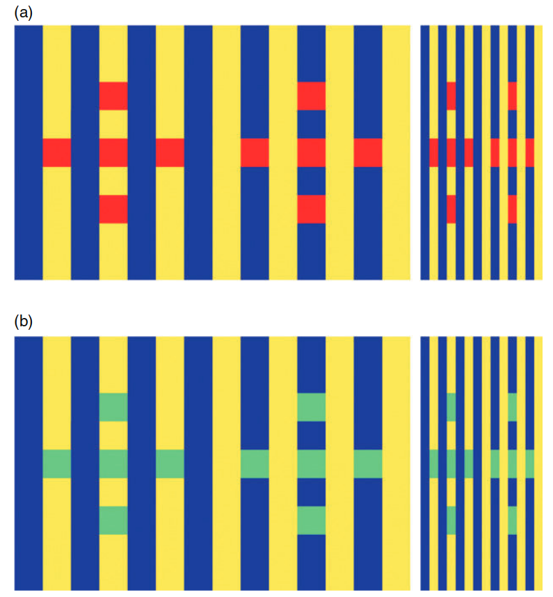

  图 6.2：复杂同时对比现象示意图——红色和青色方块分别被黄色和蓝色条纹包围。右侧压缩后的图像展示了随着空间频率增加（或块状减小），效应的增强。

**图 6.2 的说明**

图6.2展示了**同时对比现象**的复杂性。所有红色方块（图6.2(a)）和青色方块（图6.2(b)）的边缘色彩（两条黄色边和两条蓝色边）是完全一致的。然而，方块的外观取决于其位于黄色条纹还是蓝色条纹上：

	- 黄色条纹上的方块：受到黄色的诱导，看起来更深、更偏蓝。
	- 蓝色条纹上的方块：受到蓝色的诱导，看起来更浅、更偏黄。

这种对比效应并不仅仅由方块局部的边缘颜色决定，还受到更大范围的**空间结构**影响。右侧压缩后的面板说明了这种效应与**空间频率**的依赖关系：随着块状变小或频率变高，诱导效应增强。

这种现象有时被称为**色彩白效应（Chromatic White Effect）**。历史上，它的灰阶版本被称为**White错觉（White’s Illusion）**，但White（2010）指出更合适的命名可能是**Munker错觉**或**Munker-White错觉**。这一现象已经被多种**认知和计算理论**探讨，包括：

	- 格式塔心理学的“图-地”解释：这种解释强调背景和主体之间的整体关系。
	- 计算视觉模型：Blakeslee和McCourt（1999）提出的计算模型成功预测了该效应。

**小结**

同时对比现象是色貌现象的核心，展示了背景颜色和空间结构如何共同影响颜色感知。这些效应不仅影响设计与艺术，也为理解人类视觉系统提供了重要线索。

---

**Crispening（增强效应）**

增强效应（Crispening）是指当比较的颜色刺激与其背景颜色相似时，人眼对颜色差异的感知会被放大。换句话说，当刺激与背景的颜色接近时，刺激之间的颜色差异会显得更为明显。

**增强效应的示例**

图6.3展示了增强效应的一个典型例子：两个灰色样本在不同背景上的表现：

	- 当灰色样本位于灰色背景上时，它们的亮度差异显得更大。
	- 而当样本位于白色或黑色背景上时，亮度差异显得较小。

这种现象同样适用于颜色差异。例如，当彩色样本的背景颜色与样本颜色接近时，样本间的色彩差异也会显得更加明显。

  

  图 6.3：增强效应示意图——两个灰色样本在灰色背景上的亮度差异更为显著，而在白色或黑色背景上则显得较弱。

**理论基础与研究**

增强效应的理论基础可以追溯到Craik（1939）的一篇经典论文，他提出这种现象是**局部适应**的结果。此后，Semmelroth（1970）对增强效应进行了全面研究，并提出了一种预测模型。而Whittle（1992）在研究灰阶差异的感知时，提供了一个更现代化的模型。

**小结**

增强效应展示了背景与刺激颜色相似性对感知的显著影响。这一现象强调了背景颜色在颜色感知中的重要作用，为色貌模型的研究提供了重要线索。进一步研究和建模有助于更准确地预测颜色在不同背景条件下的感知差异。

---

**Spreading（扩散效应）**

扩散效应（Spreading）是指当刺激的**空间频率**增加（即刺激变得更小或间隔更紧密）时，同时对比效应逐渐减弱，取而代之的是颜色与背景的**混合现象**。这种混合并不是完全的颜色融合，而是刺激的颜色开始受到背景颜色的影响，显得更加接近背景的色调。

**扩散效应的特点**

1. **空间频率的影响**：  
   当刺激的空间频率进一步增加到足够高时，刺激和背景会发生“**空间融合**”，即它们不再被视为独立的元素，而是作为一个整体来看待（例如半色调图像中的小点在足够远的距离看起来是连续的色块）。

2. **扩散与融合的区别**：  
   扩散效应发生在刺激仍然被感知为独立个体的情况下，即在空间频率尚未达到完全融合之前。

**扩散效应的示例**

图6.4展示了扩散效应在颜色维度上的表现。红色条纹位于黄色和蓝色背景上，并随着空间频率的变化表现出不同程度的扩散现象：

	- 红色条纹在蓝色背景上显得更偏蓝。
	- 红色条纹在黄色背景上显得更偏黄。

随着空间频率增加（条纹变得更窄，或者观察者的观看距离增加），红色条纹的颜色更加受到背景颜色的影响，扩散效应变得更显著。图6.4的右侧通过压缩水平图案来增加条纹的空间频率，直观展示了这一现象。

  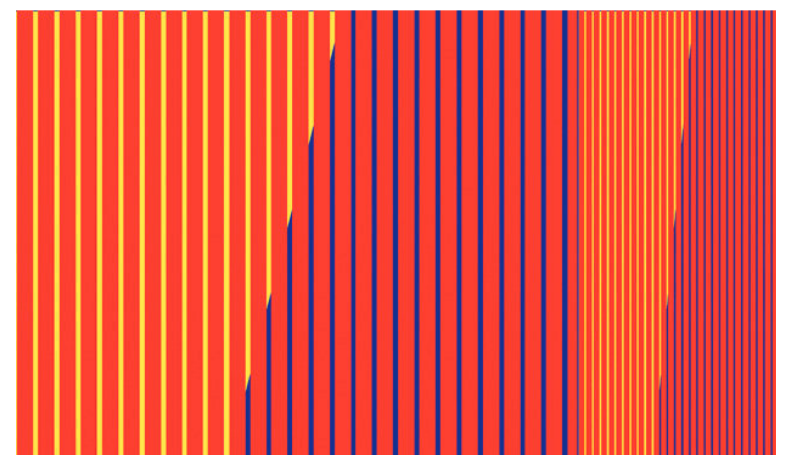

  图 6.4：扩散效应示意图——红色条纹在蓝色背景上显得偏蓝，在黄色背景上显得偏黄。右侧压缩图案增加了空间频率，使扩散效应更为显著。

**扩散效应的研究与应用**

1. **早期研究**：  
   Chevreul（1839）在研究挂毯设计时首次系统研究了扩散效应与对比效应。他发现为了在挂毯的复杂空间结构中保持设计元素的颜色外观，设计者常常需要根据背景和配置调整色彩。

2. **相关现象**：  
   扩散效应与**霓虹扩散效应（Neon Spreading）**有一定关联，后者是一种结合了扩散和透明感知的更复杂现象，Bressan（1993）对此作了详细研究。

**扩散效应的生理基础**

扩散效应及其相关现象表明，人类视觉系统的**侧向交互作用**和**适应效应**在颜色感知中起到了重要作用。这种机制不仅影响我们对局部颜色的感知，也决定了刺激在不同空间频率下的外观变化。

**小结**

扩散效应说明了背景与空间频率在颜色感知中的重要性。通过了解扩散效应，可以更好地设计色彩在复杂视觉场景中的表现，尤其是在需要控制背景与主体颜色交互的应用中（如图像处理、印刷设计等）。

---

## 6.3 贝佐尔德-布鲁克色相偏移（色相随亮度变化）

通常，人们认为色相可以通过单色光的波长来指定。然而，事实并非如此，正如贝佐尔德-布鲁克色相偏移现象所示。色相偏移发生在观察单色刺激时，随着其亮度变化，色相并不会保持不变。

**图 6.5：贝佐尔德-布鲁克色相偏移的实验数据示例。**  
图中显示了在亮度降低10倍的情况下，为保持色相恒定所需的波长变化。

  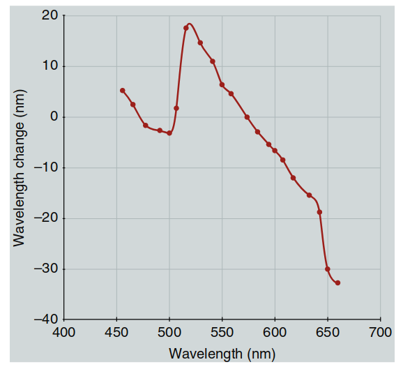

  图 6.5：贝佐尔德-布鲁克色相偏移的实验数据示例。

**贝佐尔德-布鲁克色相偏移的实验结果**  
Purdy（1931）报道了一些关于贝佐尔德-布鲁克色相偏移的典型实验结果。图 6.5 展示了Purdy（1931）研究中的部分结果。图中的数据表明，为了保持色相恒定，随着亮度降低10倍，所需的波长变化。例如，要匹配650 nm光的色相，在亮度减少到原来的十分之一时（即亮度减少10倍），所需的光波长为620 nm（波长偏移-30 nm）。需要注意的是，给定的单色光无论在何种亮度水平下，其相对三刺激值都是相同的（因为在三刺激色度学中通常不考虑绝对亮度水平）。因此，仅凭三刺激值可以预测单色光在所有亮度水平下的颜色应该保持不变。然而，Purdy的结果显然推翻了这一假设，表明要预测颜色外观，必须考虑绝对亮度水平。

**贝佐尔德-布鲁克色相偏移的含义**  
贝佐尔德-布鲁克色相偏移表明，在视网膜锥体吸收能量之后、色相判断之前，视觉系统中存在非线性过程。Savoie（1973）讨论了一些更现代的数据和对贝佐尔德-布鲁克色相偏移的建模。Hunt（1989）则指出，贝佐尔德-布鲁克色相偏移不会发生在相关颜色之间。

---

## 6.4 阿布尼效应（色相随色度纯度变化）

如果将白光与给定波长的单色光进行加法混合，混合物的色度纯度会发生变化，同时保持恒定的主波长。可能有理由认为，在色度图中，这些混合物的集合会沿着从白点到单色刺激的直线分布，并且其感知色相保持不变。然而，正如贝佐尔德-布鲁克色相偏移所示，单色刺激的波长并不能很好地描述感知色相。将单色光与白光混合同样不能保持色相不变。这种现象被称为阿布尼效应。

阿布尼效应可以通过绘制单色光与白光混合物的恒定感知色相的等高线来加以说明。这些结果来自于Robertson（1970）的一项研究，图 6.6 展示了这一结果。图 6.6 显示了几条恒定感知色相的曲线，这些曲线是基于三位观察者的心理物理实验结果绘制的。在色度图中，恒定感知色相的曲线呈现弯曲形状，这一现象也适用于其他类型的刺激。例如，通过研究Newhall（1940）发布的Munsell色相重新命名研究，我们可以看到恒定Munsell色相的曲线，这些曲线如图 6.7 所示。

  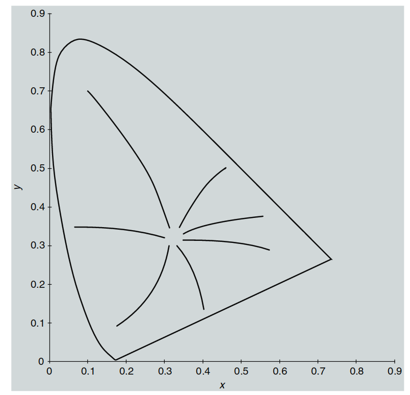

  图 6.6：CIE 1931色度图中恒定色相的等高线，展示了阿布尼效应。

  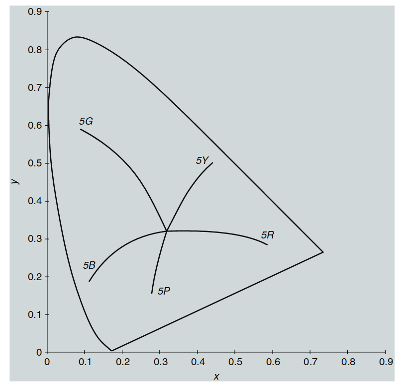

  图 6.7：CIE 1931色度图中恒定Munsell色相（色值为5）的等高线。

**阿布尼效应的含义**  
总而言之，阿布尼效应指出，在色度图中，从白点辐射出的直线并不是恒定色相的线。与贝佐尔德-布鲁克效应类似，阿布尼效应暗示了视觉系统中锥体激发与色相感知之间的非线性过程，Purdy（1931）对此进行了讨论。近期关于贝佐尔德-布鲁克色相偏移和阿布尼效应的实验数据已由Ayama等人（1987）和O’Neil等人（2012）发布。

---

## 6.5 赫尔姆霍兹-科尔劳施效应（明度依赖于亮度和色度）

在CIE色度系统中，Y三刺激值定义了刺激的亮度，或称亮度因子，通常用于表示刺激在光谱分布上的光强。然而，亮度仅反映物理光学特性，无法直接表示人眼对明度的感知，这种感知会受到色度纯度（饱和度）和色相的显著影响。赫尔姆霍兹-科尔劳施效应即描述了这种现象：当亮度（Y值）保持不变时，感知明度随色度纯度（饱和度）的增加而增强。这种效应在恒定亮度的情况下，表现为图 6.8 中等高线的弯曲。图中的等高线标注了在不同色度下，感知明度相对于白点明度的比值，数值越大，说明感知明度越高。

  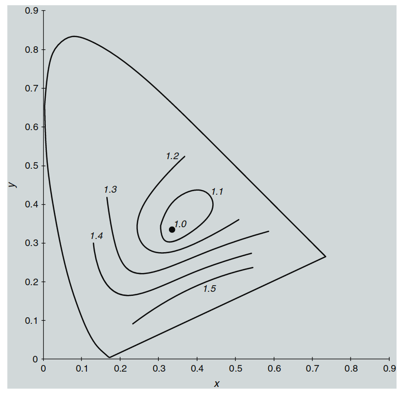

  图 6.8：赫尔姆霍兹-科尔劳施效应示意图——恒定亮度下的感知明度与亮度比的等高线。

> 译者注：这个图稍微有些抽象，我们尝试理解下。首先等高线标签‘1.0’，‘1.1’表示的是感知亮度（明度）相对于物理亮度的比值，离白点越远，色纯度越高，人眼对这些颜色的感知亮度（明度）显著增强，因此比值变大。这个点就是该效应的核心——即明度受色度影响，色度值越大（颜色越纯），人眼感觉越亮！

**赫尔姆霍兹-科尔劳施效应的建模**  
已经采取了多种方法来建模赫尔姆霍兹-科尔劳施效应。其中一种方法使用了Ware和Cowan方程（Hunt 1991a）。这些方程依赖于计算一个基于色度的修正因子，如公式(6.1)所示：

  

    $$
    F = 0.256 - 0.184y - 2.527xy + 4.656x^3y + 4.657xy^4 \tag{6.1}
    $$ 
  

公式(6.1)给出了色度相关的修正因子。对所有相关的刺激进行修正因子的计算后，如果满足公式(6.2)中的等式，则认为两个刺激在明度上是相同的。

  

    $$
    \log(L_1) + F_1 = \log(L_2) + F_2 \tag{6.2}
    $$ 
  

在公式(6.2)中，\( L \) 是亮度，\( F \) 是根据公式(6.1)计算出的修正因子。Ware和Cowan方程最初是为不相关颜色导出的。类似的实验结果表明，赫尔姆霍兹-科尔劳施效应也适用于相关颜色。

**赫尔姆霍兹-科尔劳施效应的应用**  
Fairchild和Pirrotta（1991）对这些研究进行了回顾，并推导出一个简单的预测方程。在这项工作中，推导出了CIELAB明度预测器 \( L^* \) 的修正公式，\( L^* \) 作为CIELAB色度 \( C^*_{ab} \) 和色相角 \( h_{ab} \) 的函数。色度明度预测器 \( L^{**} \) 的形式如公式(6.3)所示：

  

    $$
    L^{**} = L^* + f_2(L^*)f_1(h_{ab})C^*_{ab} \tag{6.3}
    $$ 
  

公式(6.3)通过调整基于亮度的 \( L^* \) 明度预测器，加入了一个与色度和色相相关的附加因子，从而描述了赫尔姆霍兹-科尔劳施效应。这一明度预测器的详细信息可以在Fairchild和Pirrotta（1991）中找到。

**赫尔姆霍兹-科尔劳施效应的示例**  
赫尔姆霍兹-科尔劳施效应的一个例子可以通过观察Munsell色卡样本来验证。恒定Munsell色值的样本定义为具有恒定亮度因子。因此，当检查给定色相和色值的Munsell色卡样本时，亮度因子保持不变，而色度在变化。检查这些色卡的样本可以看出，较高色度的色卡确实显得更亮，且效应的大小取决于所检查的具体色相和色值。

**赫尔姆霍兹-科尔劳施效应的结论**  
赫尔姆霍兹-科尔劳施效应表明，感知明度（以及亮度）不能严格地被视为刺激亮度（或相对亮度）的单一维度函数。当刺激的色度增加时，在恒定亮度下，它看起来更亮。通过闪烁光度法（如 \( V(l) \) 曲线）测量的光谱光效能与赫尔姆霍兹-科尔劳施效应所描述的异色明度匹配的差异，已被Kraft和Werner（1994）研究并讨论。

> 译者注：该效应对于tone mapping operator的算法影响很大，传统tmo认为，只要压缩亮度就可以了，但实际上，亮度的感知（明度）是和色纯度相关的，所以对于TMO的设计，只考虑亮度的压缩是远远不够的

---
## 6.6 亨特效应（彩度随亮度增加而增强）

通过仔细观察周围的视觉世界，可以发现物体的颜色外观会随着整体亮度水平的变化而显著改变。例如，在阳光明媚的夏日下午，物体显得鲜艳和对比度强，而在黄昏时，颜色则变得暗淡和低调。亨特效应和史蒂文斯效应（参见 6.7 节）描述了这些外观属性。图 6.9 通过一组模拟不同照明水平的照片展示了这些效应。

  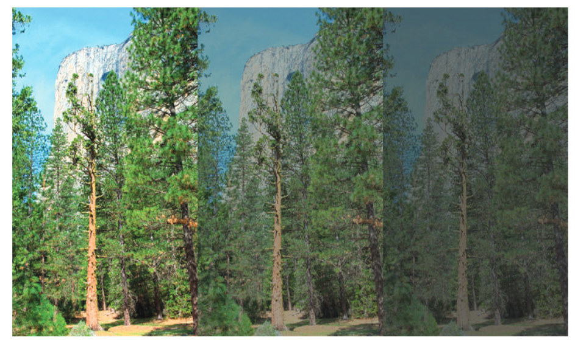

  图 6.9：模拟亨特效应和史蒂文斯效应的照片序列——左侧图像为高亮度场景（中午），显示高对比度和高彩度；向右逐渐降低亮度，直到最右端的黄昏光照水平，对比度和彩度都显著下降。

**亨特效应的研究背景**  
亨特效应得名于 Hunt（1952）的一项研究，该研究探讨了光明和黑暗适应对颜色感知的影响。在这项研究中，Hunt 使用一种双眼分视法（haploscopic matching），让每只眼睛适应不同的观察条件，并通过每只眼所呈现刺激之间的匹配来收集对应颜色的数据。图 6.10 展示了亨特研究结果的示意图，其中数据点表示不同适应水平下对应彩度感知的变化。

  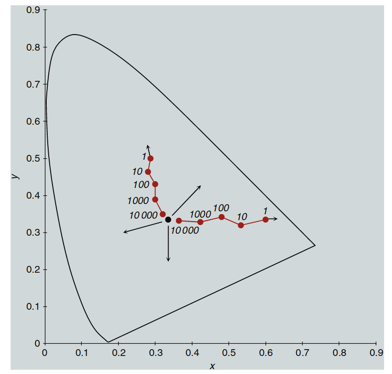

  图 6.10：亨特效应示意图——显示在亮度变化中的对应色度，数据点以亮度水平标记。

> 译者注：这张图很有可能绘制出错了，hunt描述的是随着亮度增大，彩度增大——就是越远离中心白点，靠近边缘——这个图绘制反了

亨特的研究表明，低色度纯度的刺激在亮度为 10,000 cd/m² 时，需要与亮度为 1 cd/m² 的高色度纯度刺激匹配。更简单地说，随着给定颜色刺激亮度的增加，其感知的彩度也会增加。

**亨特效应的观察实例**  
亨特效应可以通过多种方式观察到。例如，通过观察图 4.1 中渲染的立方体，并假设你身处该照明环境中，可以注意到被更多光线照射的立方体面显得更有彩度。同样，可以将一张彩色图像（如图 4.1）放置在低光照环境下，观察其颜色变得暗淡。然后，将其移动到显著更亮的环境（例如明亮的观察箱或阳光下），你会发现图像元素的彩度显著增强。图 6.9 模拟了这一现象。

**亨特效应的意义**  
亨特效应表明，给定刺激的彩度随着亮度水平的增加而增强。这一效应强调了在颜色外观模型中考虑绝对亮度水平的重要性，而传统的色度学并未考虑这一点。

> **译者注：亨特效应对ISP算法的启示**  

> **色调映射（Tone Mapping）**：在亮度被压缩的高亮区域，由于没有相应降低彩度，色彩会呈现不自然的过度饱和状态。
特别是在原本高亮的区域，色彩会显得特别鲜艳，与实际视觉体验不符。而且，不同亮度区域的色彩饱和度会出现不连续的现象。高光区域的色彩会显得特别突兀，而暗部区域的色彩则相对显得过于暗淡，
这就是目前很多企业遇到的问题。
---

## 6.7 史蒂文斯效应（对比度随亮度增加而增强）

史蒂文斯效应是亨特效应的近亲。亨特效应指的是**彩度对比度（Colorfulness Contrast）**随着亮度增加而增强，而史蒂文斯效应则指的是**明度对比度（Brightness/Lightness Contrast）**随亮度增加而增强。

在理解这些效应时，对比度应被看作是感知明度（或亮度）相对于物理亮度变化率的速率。例如，随着亮度增加，黑色会显得更深沉，白色会显得更明亮，从而增强了对比度。有关对比度的更完整讨论，请参阅 Fairchild (1995b)。

---

**史蒂文斯效应的研究背景**  
史蒂文斯效应得名于一项经典心理物理学研究（Stevens and Stevens, 1963）。在这项研究中，观察者被要求在不同适应条件下对刺激的明度进行大小估计。研究结果表明，感知明度与测量亮度之间的关系通常遵循一个幂函数。这种幂函数关系在心理物理学中有时被称为**史蒂文斯幂律**。

在以线性坐标绘制时，幂函数的关系会呈现曲线，但在对数坐标系下，幂函数的关系会成为一条直线，其斜率等于幂函数的指数。图 6.11 展示了 Stevens 和 Stevens (1963) 实验中典型的结果，其中在对数轴上绘制了不同适应亮度下的平均相对明度估计与相对亮度的关系。

  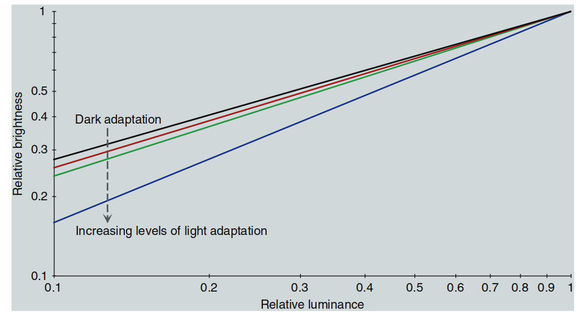

  图 6.11：史蒂文斯效应中明度对比度随着适应亮度变化的曲线。黑色曲线表示暗适应，红色、绿色和蓝色曲线分别表示增加的亮适应水平。

---

**史蒂文斯效应的意义**  
如图 6.11 所示，随着适应亮度增加，该关系的斜率（也即幂函数的指数）会增加。这表明，当亮度水平增加时：

- 黑色会显得更深沉。

- 白色会显得更明亮。

这种现象看似有些反直觉，但它确实是人眼的感知规律。你可以通过观察图像在高亮度和低亮度下的表现来验证史蒂文斯效应：
1. 在低亮度水平下，图像的对比度较低：白色区域看起来不够明亮，黑色区域也不够深。
2. 当图像放置到显著更高的照明环境中时，白色区域变得非常明亮，黑色区域变得更暗，对比度显著增强。

图 6.9 中对彩色图像的模拟同样展示了这一现象。

---

## 6.8 赫尔森-贾德效应（非选择性样本的色相变化）

**赫尔森-贾德效应**是一种难以捉摸的现象，在正常的观察条件下几乎无法察觉。实际上，它在实际应用中的重要性非常有限。然而，这一效应被纳入讨论，因为一些颜色外观模型（如 Hunt 模型和 Nayatani 等人模型）对这一效应有相当明确的预测。因此，在实现这些模型时，理解其定义并评估其重要性非常必要。

---

**实验背景与结果**
最早描述赫尔森-贾德效应的实验数据由 Helson (1938) 提出。在实验中，观察者被放置在一个光室中（类似于一个封闭的小房间），这个房间通过几乎单色的光线照明。经过一定的训练后，观察者需要对各种中性（非选择性）样本赋予 Munsell 标准值。

实验的典型结果如图 6.12 所示，背景为 Munsell 值为 5 的中性灰。实验表明，在强烈的单色光照下：

1. **样本比背景亮时**，样本呈现与光源相同的色相。

2. **样本比背景暗时**，样本呈现光源补色的色相。

  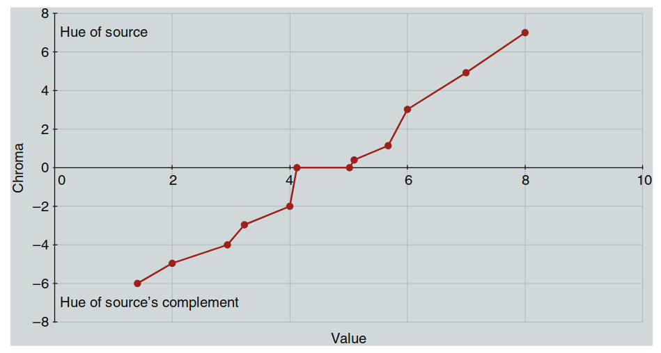

  图 6.12：赫尔森（1938）实验结果的示意图——中性样本在绿色光源下的 Munsell 色相和色度变化，背景为灰色。

---

**关键发现与局限性**

1. **单色光的必要性**  
   赫尔森指出，这种效应只有在几乎完全单色的光源下才能观察到。如果光线中加入了 5% 的白光，效应完全消失。这意味着该效应在实际应用中意义有限，因为颜色刺激几乎从未在纯单色光下进行评估。

2. **特殊实验条件**  
   最近的实验（Mori et al., 1991）通过双眼分视法（haploscopic viewing）再现了这一效应，这种方法为每只眼睛提供不同的适应条件，从而增加了观察到该效应的可能性。然而，这种效应在正常观察条件下无法观察或演示。

3. **认知机制与适应**  
   在正常的视觉条件下，认知机制会“抵消光源的影响”（discount the illuminant），从而使中性样本的外观保持中性色。然而，单色光环境和分视法实验可能阻碍了这些认知机制的正常发挥，从而导致该效应的产生。

4. **高色度的矛盾现象**  
   在赫尔森的实验中，观察者对 Munsell 值小于 2 的样本赋予了高达 6–8 的色度值。由于 Munsell 值为 2 的样本接近黑色，这种现象在实际物体模式中是不可能发生的。观察者报告称，在这些条件下，样本上似乎叠加了光源补色的“发光效应”，这与同时对比效应和不完全适应一致。

5. **实验复杂性的影响**  
   赫尔森-贾德效应只能在简单的实验条件下观察到。例如，单独的非选择性样本在均匀背景上呈现效应，而复杂的刺激（例如一系列不同反射率的非选择性样本）无法产生该效应。

---

**效应的意义与模型预测**

尽管赫尔森-贾德效应的实际重要性存疑，但它对某些颜色外观模型的预测有一定影响。这些模型在处理强光源下的色外观预测时，需要考虑这一效应的可能性。

---
## 6.9 巴特尔森-布雷内曼方程（图像对比度随环境变化）

通过匹配和比例测量实验，巴特尔森和布雷内曼发现：当图像的环境从暗变为弱光再到明亮时，**图像的感知对比度会增强**。

**机制分析**：

   - 暗环境会使图像的暗部区域看起来更亮，但对亮部区域影响较小（白色区域仍然显得是白色）。

   - 由于暗部区域的变化较大，整体感知对比度随之改变。

这些结果与摄影印刷和图像再现中的最佳色调再现要求一致。例如：

- **摄影打印**：在平均亮度环境中观看的照片，原始场景与打印图像的相对亮度呈一对一的线性关系。

- **投影胶片**：在暗环境下观看时，由于环境降低了感知对比度，胶片需要通过更高的物理对比度（伽马约为 1.5）进行补偿。

- **电视图像**：通常在弱光环境中观看，电视系统会采用伽马约为 1.25 的指数关系来调整图像。

  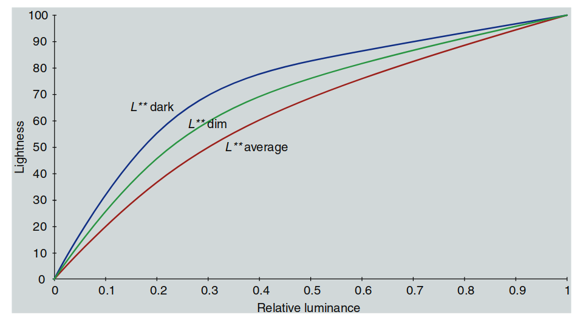

  图 6.13：巴特尔森-布雷内曼实验结果——环境相对亮度对感知明度对比度的影响（巴特尔森，1975）。

**环境效应的依赖性**  

巴特尔森和布雷内曼的研究进一步指出，**环境效应的大小**取决于以下因素：

1. **观察者个体差异**：不同的观察者对环境变化的敏感性不同。

2. **图像尺寸**：较大的图像可能减少环境对对比度的影响。

3. **任务要求**：如果观察者专注于图像中央部分，环境效应几乎可以完全消除（Fairchild 和 Johnson，1999；Liu 和 Fairchild，2007）。

**巴特尔森-布雷内曼方程**  
巴特尔森和布雷内曼发表了描述实验结果的方程，并在后续研究中（Bartleson, 1975）给出了简化形式，以方便实际应用。图 6.13 展示了环境对明度对比的影响，其结果在对数坐标下呈直线关系，转换为线性坐标时则为幂函数。

**日常应用中的反例**  

有趣的是，尽管巴特尔森-布雷内曼方程预测暗环境会降低感知对比度，但在日常使用中常会出现相反的现象。例如：

- 使用者在电脑工作站工作时常关闭房间灯光以提高显示器的对比度。

- 这种现象实际上是因为房间灯光会在显示器屏幕表面引入反射，降低图像的物理对比度。

- 如果可以在不增加反射的情况下照亮显示器周围环境（例如在显示器后方放置光源），显示器的感知对比度实际上会比完全黑暗环境下更高。

> 译者注：该效应和gamma很相似，但是不是一回事情，它关注的是图像整体的感知对比度，而gamma是关注的中性灰的精细变化。

---

