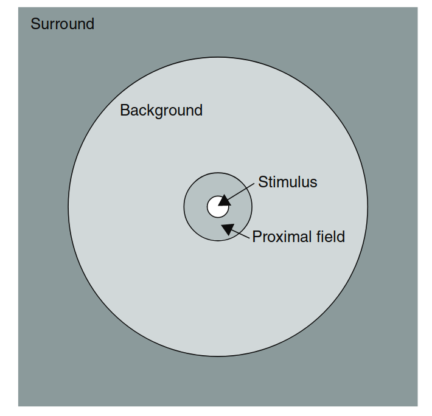
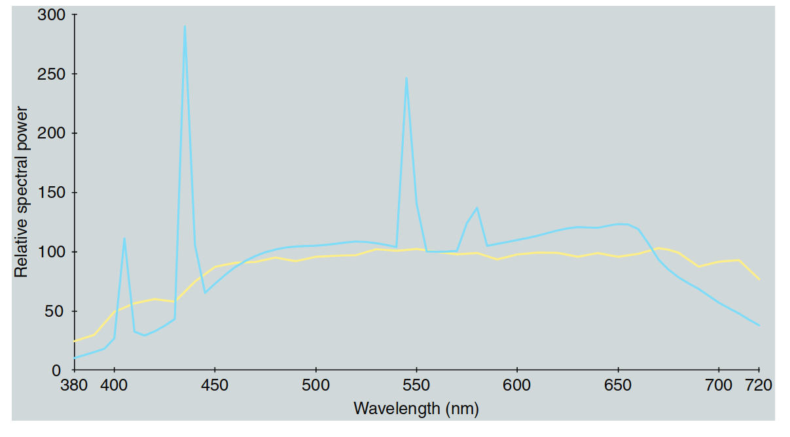
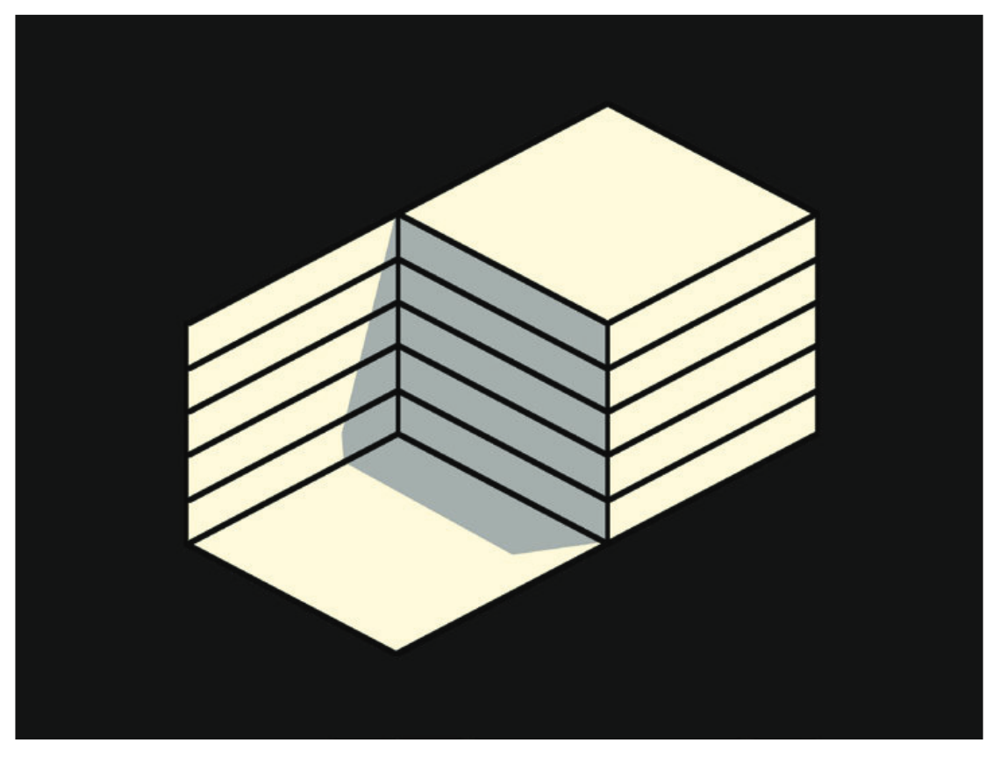
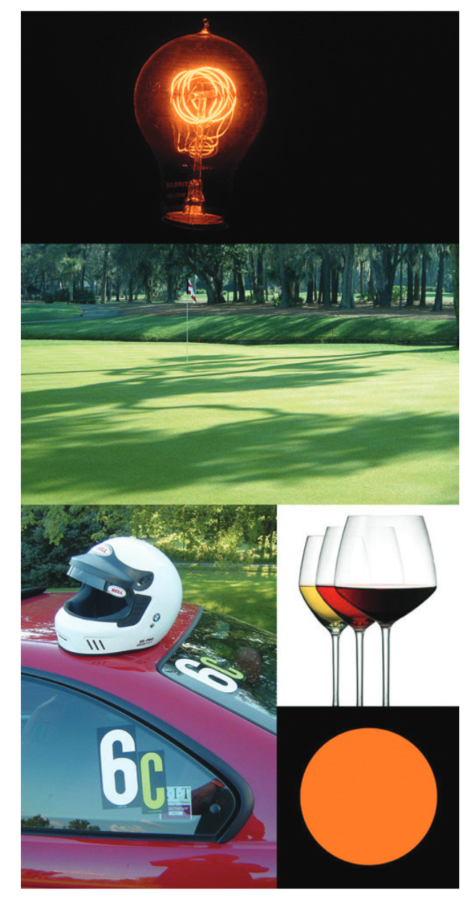
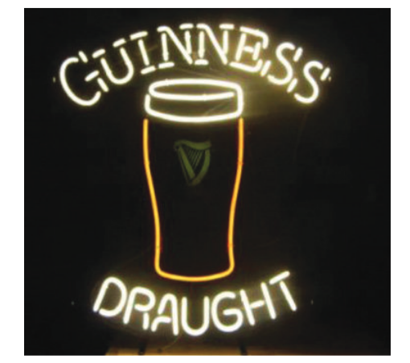

在第六章中，介绍了几种需要扩展基本色度学的色貌现象。显然，从这些现象可以看出，视觉场景的各个方面会影响刺激的色貌。在本章中，给出了观看场景各个组成部分的实用定义和描述，这些组成部分有助于合理色貌模型的开发，并提供了这些组成部分所需的色度测量。准确使用色貌模型需要准确地定义和测量观看场景的各个组成部分。观看场景的不同配置会导致对刺激的认知解释不同，从而产生不同的色彩感知。本章的最后部分包括对其中一些现象的解释以及可观察到的各种观看模式的定义。了解这些观看模式有助于解释为什么看似物理上相同的刺激在色彩上可以显著不同。

与色貌模型的观看场景定义相关的是，不同行业中使用的各种标准观看条件的定义。这些标准旨在通过定义适当的观看场景配置来最大限度地减少色貌问题。一个这样的标准示例是ANSI（1989）标准，该标准定义了印刷品和透明片的观看条件。

## 7.1 观看场景的配置

色貌刺激的外观依赖于刺激本身以及周围空间或时间中存在的其他刺激。时间效应虽重要，但通常在典型的色貌应用中并不涉及。它们通过确保观察者有足够时间适应观看环境并且呈现不随时间变化的刺激来处理。（当然，也有一些新的应用，如数字影院，正在推动色貌研究朝向时间变化的领域。）观看场景的空间配置始终是至关重要的。（由于眼睛不断运动，在实际情况下，空间效应和时间效应是不可能分离的。）

理想的空间视觉场景表示应该是对场景的完整描述。这样的图像必须具有比视网膜中央凹的视觉锐度更高的空间分辨率，每个像素都应由完整的光谱功率分布表示。拥有这样的视觉场景表示，几乎可以具备指定场景中任何元素的色貌所需的所有信息；然而，观察者的认知经验和时间信息仍然缺失。关于刺激与环境的空间配置影响的有趣最新数据由Abramov等人（1992）发布。然而，这样的观看场景规格并不实用，原因有几个。首先，所需的大量数据很难准确获得，即使在实验室环境中也很难实现。即使数据能够获得，其庞大的数量也会使得应用它变得非常困难。其次，假设这些技术问题被克服，还需要一个能够利用所有数据的色貌模型。而这样的模型并不存在，也不太可能在可预见的未来开发出来。考虑到色貌判断中观察者的变异性，这样一个详细的模型显然是过于复杂的。

基于以上所有的限制，情境简化为通过定义观看场景的一些重要组成部分。不同的色貌模型使用这些观看场景组成部分的不同子集。最全面的一组是由Hunt（1991b，1995）为其色貌模型使用而提出的。由于Hunt的观看场景定义包括了所有其他模型所需的组成部分，因此他的定义被列出如下。观看场景被分为四个组成部分：

1. 刺激
2. 近端场
3. 背景
4. 周围环境

  

  图 7.1：视觉场景的组成部分。当从20厘米的距离观看时，角度的角度是正确的（即2°的刺激区域实际上会呈现2°的视觉角度）。

---
**刺激**

刺激被定义为希望测量其色貌的颜色元素。通常，刺激被视为一个大约2°角度的均匀补丁。图7.1展示了从20厘米处观察时2°刺激的示意图。（为了便于参考，从手臂长度看，您的拇指宽度大约为1°的视觉角度，而满月的宽度约为0.5°。）一个大约2°角度的刺激假定对应于CIE 1931标准色度观察者使用的视觉场景。1931年观察者认为对于1°到4°角度的刺激是有效的（CIE 1986）。对于大大更小的刺激，三色视觉会失效，应该考虑使用CIE 1964补充标准色度观察者（适用于角度为10°或更大）。视网膜对颜色的非均匀性是对刺激定义的基本理论限制。然而，这是自1931年以来，基本色度学中一个实际的必要条件。特别是在图像处理应用中，一个更实际的限制是，图像元素的角度通常远小于2°，且很少达到10°。幸运的是，这种限制通常被消除，因为在颜色再现中，目标是再现一个几乎相同的空间颜色配置（即图像）。因此，任何不完全有效的假设对原始图像和再现图像都同样适用。然而，在对图像进行显著大小变化的再现或尝试将一个场景中的颜色在完全不同的视觉上下文中再现时（例如，色块颜色或从图像中采样颜色），需要谨慎对待。当观察真实场景时，观察者通常会认为整个物体是一个“均匀”刺激。例如，可能会问“那辆车是什么颜色？”尽管车的不同区域会产生广泛不同的色貌，绝大多数观察者会给出一个统一的答案。因此，刺激不是2°的领域，而是整个物体。这种现象在图像中有限度地发生，但观察者更容易将图像分解成较小的图像元素。

---

**近场**

近场定义为刺激的直接环境，从刺激的边缘向外延伸约2°，覆盖所有或大部分方向。定义近场对于建模局部对比效应（例如亮度或色度感应、锐化或扩散）是有用的。在当前的模型中，只有Hunt的模型（1991b）将近场与背景区分开。虽然对近场的了解对于详细的色貌建模是必要的，但在实际应用中，精确地指定它往往是不切实际的。例如，在图像中，对于任何给定元素，近场将由其周围的像素定义。虽然这些数据是可获得的（至少在数字图像应用中），但使用它们通常需要重新计算每个空间位置的色貌模型参数。通常，这种计算是不可承受的，且可能在实际应用中没有太大意义。如果近场未知，通常会假定它等于背景。

---

**背景**

背景定义为刺激的环境，从刺激的边缘（或如果已定义，则为近场）向外延伸约10°，覆盖所有或大部分方向。背景的定义对于建模同时对比是绝对必要的。如果近场不同，可以使用它来进行更复杂的建模。像近场一样，在图像应用中定义背景变得困难。当考虑给定图像元素时，背景通常由周围的图像区域组成，具体定义将根据图像内容和位置的不同而有所变化。因此，精确地定义图像中的背景需要对色貌模型参数进行逐点重新计算。由于在任何典型应用中这是不切实际的，因此通常假设背景是恒定的，且具有某种中等色度和亮度因子（例如，具有20%亮度因子的中性灰）。或者，可以将背景定义为图像立即相邻的区域。然而，这种定义往往赋予该区域比实际情况更多的重视。Braun和Fairchild（1995，1997）讨论了背景的这种定义及其对图像再现的影响。幸运的是，在大多数图像应用中，背景的精确定义的需求得到了最小化，因为原始图像和再现图像中都可以找到相同的颜色空间配置。然而，在色块颜色应用中，需要仔细考虑背景，在这种应用中希望再现相同的色貌。

---

**周围区域**

周围区域定义为背景之外的区域。在实际情况下，周围区域可以被视为整个房间或图像（或其他刺激）被观察的环境。例如，印刷图像通常在照明（平均）周围区域下观看，投影幻灯片在黑暗的周围区域下观看，视频显示则在昏暗的周围区域下观看。因此，即使在图像应用中，周围区域也很容易定义。它是图像显示外部的区域，填充了视觉场景的其余部分。周围区域的定义对于建模长距离感应、光晕（刺激和眼内）以及整体图像对比效果至关重要（Bartleson和Breneman 1967，Fairchild 1995b）。当遇到典型的情况时，尤其是涉及到大范围周围亮度和不均匀空间配置时，精确定义周围区域就会带来实际困难。

---

## 7.2 色度学规格的视场

各种色貌模型利用不同程度的色度信息来描述视觉场的每个组件。实际上，必须了解视场每个组件的绝对（亮度或照度单位）三刺激值。然而，一些模型需要或利用更多或更少的数据。除了上述视觉场组件之外，实现色貌模型通常还需要指定“适应刺激”。适应刺激有时被认为是背景，而在其他模型中，它被认为是光源本身的测量。因此，必须为给定照明下的照明或白色物体指定绝对的三刺激值。

在测量每个视觉场的绝对三刺激值时，必须考虑所使用的标准观察者（通常为CIE 1931（2°）标准色度观察者）和测量与观察的几何学。理想情况下，应该在图像观看时使用精确的几何学进行色度测量。通常这不可行，必须做出妥协。重要的是要记住，如果需要进行这种妥协，它可能会影响模型预测与视觉评估之间的相关性。

在处理自发光显示（如CRT和LCD显示器）时，可以通过使用色度计或光谱辐射计来直接测量显示器，从而轻松地确定绝对的三刺激值。然而，在处理反射或透射介质时，情况变得更为复杂。通常，这些材料通过其光谱反射率或透射率分布来表征，通常使用分光光度计测量。然后，使用标准色度观察者并且通常使用定义的照明（例如，CIE照明D65、D50、A、F2）来计算色度坐标（如CIE三刺激值）。这种测量和计算通常足以用于基本的色度学应用。然而，图像或其他彩色物体在实际的光源下查看时，实际光源通常与CIE标准光源相差甚远（Hunt 1992）。计算出的使用CIE照明光源与实际观察到的光源之间的色差可能相当显著。表7.1给出了遇到的差异的保守示例。

---

  
 
 图 7.2：CIE光源D50和F8的相对光谱功率分布（每10纳米增量归一化至100.0在560 nm处）。 

---
当考虑到实际的照明源与CIE标准光源之间的差异时，会发现色彩平衡存在较大的误差，尤其是在色彩平衡应用中，这些误差可能会显著影响重现的颜色。因此，在进行精确的色彩外观估算时，必须使用实际的照明源光谱功率分布，而非CIE标准光源。在这种情况下，当无法获取实际光谱功率分布时，使用与CIE标准光源相似的光源的观看室进行色度计算。

**表7.1：使用CIE光源D50和F8评估的摄影样本的CIELAB坐标和ΔE*ab值**

| Sample | D50        |            | F8         |            | ΔE*ab   |
|--------|------------|------------|------------|------------|---------|
|        | L*  | a*   | b*   | L*  | a*   | b*   |         |
| Gray   | 53.7 | -2.6 | -9.7 | 53.6 | -3.2 | -9.8 | 0.6     |
| Red    | 39.1 | 41.0 | 20.4 | 39.4 | -3.2 | 21.0 | 0.8     |
| Green  | 43.2 | -41.4 | 22.8 | 42.9 | -40.6 | -22.0 | 1.2    |
| Blue   | 26.5 | 11.2  | -28.8 | 26.4 | 9.2  | -28.5 | 2.0     |
| Cyan   | 64.2 | -38.7 | -29.4 | 63.7 | -40.8 | -30.6 | 2.5     |
| Magenta| 54.7 | 57.3  | -24.8 | 55.0 | 56.3  | -23.6 | 1.6     |
| Yellow | 85.3 | 0.5   | 63.2  | 85.5 | 2.2   | 63.0  | 1.7     |
| Average|        |       |       |       |       |       | 1.49    |

表7.1展示了七种不同颜色的数字摄影打印机样本在CIE光源D50和F8下的CIELAB坐标和色差ΔE*ab值。这些数据表明不同光源下的色差。尽管使用CIE标准光源计算的色度值与实际光源存在偏差，但表中列出的差异大多数可以忽略，特别是当应用于图像重现时。对于色彩平衡，正确使用光谱功率分布来计算色度值是至关重要的。

## 7.3 观察模式

尽管对于那些偏爱物理科学和工程的人来说这一点可能很难接受，但已经清楚地表明，外观模式，进而外观颜色，取决于刺激配置和认知解释。这一点通过示例得到了最清晰的说明，并且通过个人体验得到了最清楚的理解（并且被相信！）。例如，作者（和其他人）观察到的一个例子是，当观察到一栋涂有浅黄色的房子时，前门与房子的颜色相同，在某个黄昏时分，似乎房子的门变成了蓝色。一扇蓝色门在黄色房子中是一个引人注目的现象！然而，仔细观察后，确定门仍然是其正常的黄色。照明的方式是，房子直接被落日的阳光照亮（相当黄），而一堵小砖墙（最初未被注意到）恰好在门上投下阴影。因此，门只通过天光照亮（没有阳光直接照射），看起来比房子的其他部分要蓝得多。初看时，场景被解释为黄色的房子和蓝色的门，处于均匀照明下。然而，一旦了解到照明不是均匀的（门实际上被蓝色光照亮），门的颜色实际上从蓝色变成了黄色。这种门颜色变化完全基于对照明的认知信息，一旦知道照明情况，这种变化是无法逆转的。

图7.3展示了这种效果的模拟，这是一幅含糊的图形，可以从几何上解释为两种方式。在一种解释中，较暗的区域看起来像阴影，而整个物体似乎呈现一种黄色；而在另一种几何解释中，较暗的区域不能是阴影，而被解释为物体上“涂”的不同颜色。将图形倒过来有时可以增强这种效果或帮助从一种解释过渡到另一种。这种效果类似于在图6.15中观察到的透明度效应。

作者还提到了另一个例子：一位年轻的孩子正在观看黑白照片在暗房中被显影，光源是琥珀色的安全灯。当然，照片完全是无色的，而照明却是单一的高色彩光。然而，孩子坚称她能够认出照片上熟悉物体的颜色。直到家长把这张黑白照片带到一个明亮的房间里，孩子才相信照片上“已知”的物体颜色并不存在。这是另一个例子，表明对物体的知识会产生颜色感知。这一现象完全符合Davidoff（1991）提出的认知色彩识别模型。

图7.3：一个含糊的图形，展示了“忽略照明源”的概念。在一种空间解释中，灰色区域看起来像阴影，而在另一种解释中，它看起来像是物体上的油漆。 

  

  图 7.3：含糊的图形，展示了‘忽略照明源’的概念。

---

在图7.4中，提供了每种五种观看模式的示例。除了常规的颜色外观属性外，还可以考虑其他属性，如持续时间、大小、形状、位置、纹理、光泽、透明度、波动、坚持性和显著性（如OSA（1963）定义）。这些与色彩外观解释相关的观察模式，与计算机图形学领域中努力产生逼真渲染的“对象”类型非常相似（Foley等人，1990，第16章）。这种相似性表明了刺激的感知和解释与其合成之间的基本联系。

**观看模式的五种定义：**

Illuminant
Illumination
Surface
Volume
Film
根据这些模式，色度外观属性与模式的关联关系如表7.2所示。亮度、色彩度、饱和度和色度等属性在所有观看模式中都有明显的表现。亮度和色彩度在所有模式中都是可能的，但在表面模式和体积模式中较少被关注。
---

**表7.2：最常见的颜色外观属性与不同观看模式的关联**

| Attribute    | Illuminant (glow) | Illumination (fills space) | Surface (object) | Volume (object) | Film (aperture) |
|--------------|-------------------|----------------------------|------------------|-----------------|-----------------|
| Brightness   | ***               | ***                        | ***              | ***             | (***)           |
| Lightness    | ***               | ***                        | ***              | ***             | (***)           |
| Colorfulness | ***               | ***                        | ***              | ***             | ***             |
| Saturation   | ***               | ***                        | ***              | ***             | ***             |
| Chroma       |                   | ***                        | ***              | ***             | (***)           |
| Hue          | ***               | ***                        | ***              | ***             | ***             |

---

## 7.3 观察模式

**光源模式**

光源模式的外观定义为颜色被感知为属于光源的颜色。光源的颜色感知通常涉及到视场中最明亮的颜色。因此，物体比周围环境亮得多时，有时会导致光源模式的感知。图7.4展示了五种观察模式的示例。灯泡代表光源模式。果岭上的阴影代表照明模式，因为它们被正确地解读为由照明引起，而不是草地上的图案。汽车、头盔、植物和其他物体代表表面模式。酒瓶代表颜色归属于物质的三维延伸，体积模式。最后，没有结构或内容的橙色斑点代表电影（或孔径）模式感知。光源模式的感知是一种“物体模式”（即颜色属于一个物体），可以描述为“光辉”。

  

  图 7.4：展示了五种观测模式的示例。灯泡代表照明模式。推杆球场上的阴影代表光照模式，它们被正确地解读为由光照造成，而不是草地上的图案。汽车、头盔、树叶和其他物体代表表面模式。酒代表材料三维扩展所归属的颜色，代表体积模式。最后，橙色斑点没有结构或内容，代表薄膜（或孔径）模式。

**照明模式**

照明模式的外观定义为颜色归因于现有照明的属性，而不是物体的属性。前面描述的“蓝色门”示例是光源模式和表面模式之间模式变化的一个例子。OSA（1963）给出了一个感知不规则的、高度色度的黄色油漆斑点（表面模式）在铁路车厢的暗阴影面上的例子。当观察者走近、注意到落日的角度并看到笔状渐变时，他意识到这些黄色斑块是由于被障碍物遮挡的阳光（照明模式）。照明模式的感知是一种“非物体模式”，它是由反射光和投下阴影的物体的存在所调节的（有时也包括大气中的颗粒）。

**表面模式**

表面模式的外观定义为颜色被感知为属于一个表面。任何可识别的照明物体都提供了表面模式的一个例子。此模式要求存在一个物理表面并从表面反射光。它是一个“物体模式”。

**体积模式**

体积模式的外观定义为颜色被感知为属于一种或多种均匀的透明物质的体积。例如，当冰块中空气泡沫的数量增加时，冰块的亮度增加到接近白色，同时透明度减少到接近0。因此，体积颜色转变为表面颜色。体积模式的感知是一种“物体模式”，它需要透明度和三维结构。

**电影模式**

电影模式的外观（也称为孔径模式）定义为在没有与物体连接的孔径中感知的颜色。例如，无法对准表面可能会导致从表面模式到电影模式的转变。一个孔径屏幕实现了这一点，因为观察者通常会专注于孔径的平面。电影模式的感知是一种“非物体模式”。所有其他外观模式都可以还原为电影模式。

---
## 7.4 无关色与相关色再探讨

无关色与相关色在第4章中已有定义。然而，考虑到它们在色彩外观规格中的基础性重要性，以及它们在外观模式上的简化与统一性主题，此外它们在亮度-色度或亮度-色度外观匹配中的重要关系，值得我们重新审视。理解无关色与相关色之间的区别是理解观测模式概念的最重要部分。

**无关色**  
指颜色被感知为属于一个区域或物体，而这个物体是与其他颜色隔离看到的。

**相关色**  
指颜色被感知为属于一个区域或物体，并且这个物体是与其他颜色相关的。

无关色只表现出色调、亮度、色彩度和饱和度等感知属性。需要与同样照明下的白色物体进行比较的属性无法在无关色中感知到。另一方面，相关色则表现出色调、亮度、光度、色彩度、色度和饱和度等所有感知属性。

记住，灰色和棕色并不存在作为无关色。它们的感知依赖于低亮度（需要进行相对判断），而棕色还依赖于低色度（另一种相对判断）。因此，棕色和灰色仅作为相关色存在。这一点可以通过一个有趣的例子来说明——试图将吉尼斯（深棕色）啤酒做成霓虹灯标志（图7.5）。在第一次尝试中，代表深棕色啤酒的部分使用了黄色霓虹管。虽然这在色度学上相对于标志的白色区域是正确的，但在暗处照射时，只能感知到无关的黄色颜色（与吉尼斯的深色完全不同）。后来版本的标志尝试通过将黄色霓虹管涂成深棕色来纠正这一点。尽管在白天看起来更好，但在晚上，这些“棕色”灯看起来像发光的橙色（无关色）。实际上，制作深棕色的灯是不可能的！这也是为什么你无法购买灰色和棕色的灯（这些是相关色），而只能购买白色和橙色的灯（这些是具有相同三刺激值的无关色）。

回想一下，完全规格化相关色的外观需要五个感知维度：亮度、光度、色彩度、色度（或饱和度）和色调。然而，在大多数实际的色彩外观应用中，不必了解所有这五个属性。通常，对于相关色来说，只有三个相对外观属性是重要的。因此，通常只需要关注亮度、色度（或饱和度）和色调这三个相对外观属性。有关亮度-色度匹配与光度-色度匹配及其相对重要性的讨论，请参见第4章。

---

  

  图 7.5：尝试将吉尼斯啤酒的深棕色渲染为无关颜色的霓虹灯标志。

